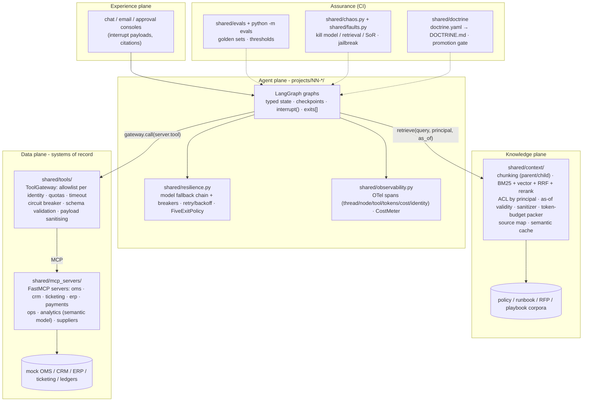

# Agentic AI Portfolio

Eighteen production-style business agents built with **LangGraph** and **LangChain**, put together
by Jagadish Meduri over a 12-week prep for Staff-level agentic AI engineering interviews.
Each project picks one real business workflow and one graph pattern (routing, human-in-the-loop,
map-reduce, supervisor, and so on). Each one comes with typed state, mock enterprise services,
tests, and a README covering design trade-offs and interview talking points.

Every project is also held to an **agentic-systems doctrine**: an agent only counts as more
than a demo when it names its plane dependencies, its systems of record, its retrieval corpus
and ACL, its tool contracts, its stop conditions, a five-exit failure playbook per node, an
eval set, an owner and a KPI. Each project carries a machine-checked `doctrine.yaml` and a
generated `DOCTRINE.md`; CI blocks promotion if any of it is missing or the evals regress.

> **Offline by default.** Every project runs offline against a deterministic mock chat model.
> This covers tests, CI, and demos. To use a real model, set Azure OpenAI or OpenAI env vars
> (see [`.env.example`](.env.example)) and the shared factory in [`shared/llm.py`](shared/llm.py)
> picks it up automatically. You don't need to change any code.

## Projects

| #  | Project | Business use case | Graph pattern | Status |
|----|---------|-------------------|---------------|--------|
| 01 | [policy-qa-rag](projects/01-policy-qa-rag) | Cited answers to HR/IT/expense policy questions | Corrective RAG: rewrite → retrieve → grade → retry → grounded answer | ✅ Built |
| 02 | [ticket-triage](projects/02-ticket-triage) | Classify and route support tickets | Router: structured output + confidence gate + repair retry + PII redaction | ✅ Built |
| 03 | [refund-agent](projects/03-refund-agent) | Customer refunds with policy checks and approvals | Deterministic workflow + HITL `interrupt()` + idempotency | ✅ Built |
| 04 | [sales-meeting-prep](projects/04-sales-meeting-prep) | Pre-call account brief for AEs | Parallel fan-out/fan-in with `Send` + reducers, partial-failure tolerance | ✅ Built |
| 05 | [invoice-po-matching](projects/05-invoice-po-matching) | AP 3-way match and exception handling | Extraction pipeline + validation retry edge + typed errors + `RetryPolicy` | ✅ Built |
| 06 | [incident-investigator](projects/06-incident-investigator) | On-call root-cause investigation | Autonomous ReAct (`create_agent`) + guardrail middleware + HITL-gated write tool | ✅ Built |
| 07 | [rfp-response](projects/07-rfp-response) | Draft RFP / security questionnaire answers | Planner + per-section worker subgraphs (`Send`) + critic loop + compliance gate | ✅ Built |
| 08 | [contract-review](projects/08-contract-review) | Playbook-based contract risk review | Evaluator-optimizer loop + guardrails + offline eval gate (precision/recall) | ✅ Built |
| 09 | [collections-agent](projects/09-collections-agent) | Overdue-invoice outreach and payment plans | Governance: least-privilege tool identities + HITL interrupt + hash-chained audit | ✅ Built |
| 10 | [supply-chain-multi-agent](projects/10-supply-chain-multi-agent) | Replenishment: forecast, stock, sourcing, approved PO | Supervisor multi-agent + parallel `Send` + critic loop + HITL | ✅ Built |
| 11 | [customer-care-e2e](projects/11-customer-care-e2e) | "My shipment is late, can I get a refund?" end to end | FastAPI BFF (auth, channel claim, rate limit, SSE) + planner/critic/HITL-with-SLA graph + outbox writes + Docker/ACA | ✅ Built |
| 12 | [agent-control-plane](projects/12-agent-control-plane) | Governed agent mesh: can we promise this B2B order? | Registry + promotion gate + per-tenant policy + kill switch; A2A (agent card, JSON-RPC tasks, traceparent) fan-out to CRM/SAP/demand agents | ✅ Built |
| 13 | [insurance-fnol-coverage](projects/13-insurance-fnol-coverage) | FNOL from a scanned packet to an adjuster-approved reserve | OCR confidence gate + edition/jurisdiction temporal RAG ∥ fraud ML tool → HITL within authority; claimant guard | ✅ Built |
| 14 | [healthcare-prior-auth](projects/14-healthcare-prior-auth) | Prior-auth packets for provider offices; member status | PHI redaction (context + logs) + plan ACL/plan-year RAG ∥ eligibility MCP → coverage-language subgraph (kill switch) → draft → clinician sign-off | ✅ Built |
| 15 | [banking-credit-memo](projects/15-banking-credit-memo) | Commercial credit memo and limit booking | Planner → mandatory KYC (temporal ownership graph RAG) → semantic-layer measures ∥ PD model tool ∥ policy RAG → cited memo + critic → dual control | ✅ Built |
| 16 | [telecom-outage-care](projects/16-telecom-outage-care) | Outage-aware care, bill explain, dispatch; NOC summaries | OSS truth + freshness ∥ account → topology blast radius → cited bill explain / dispatch context pack / offers (blocked in outage); read-only NOC branch | ✅ Built |
| 17 | [automotive-technician-copilot](projects/17-automotive-technician-copilot) | Service-bay TSB, wiring and parts copilot; warranty claims | VIN (MCP) → TSB as-of repair date ∥ caption-indexed diagrams → wrong-version safety check → parts ATP → warranty coverage → admin HITL → idempotent claim | ✅ Built |
| 18 | [logistics-exception-agent](projects/18-logistics-exception-agent) | Event-driven shipment exceptions: tracking, proactive notices, carrier claims | milestone stream consumer (checkpoints, dedupe) → TMS-grounded track (no interpolation) / [evidence ∥ A2A capacity what-if] → confidence-gated notice / OCR → claim window by rule edition | ✅ Built |

## Architecture: four planes and the shared platform

Each agent is a LangGraph graph in the **agent plane**. It reaches knowledge only through the
shared context builder and systems of record only through MCP servers behind a tool gateway.
Resilience, tracing, evals and the doctrine gate are shared packages, so every project gets
the same controls.



## Doctrine compliance

Generated from each project's `doctrine.yaml` and `evals/scores.json` by
`python -m shared.doctrine render`. CI fails if this table is stale. Every project has
plane dependencies, an owner (Jagadish Meduri), KPIs with targets, stop conditions, a
five-exit row for every graph node, chaos scenarios covering model, retrieval and system-of-
record outages plus a jailbreak, and a golden eval set. Maturity uses the doctrine's 1-5
ladder.

<!-- doctrine-matrix:start -->
| Project | Maturity | Systems of record (MCP servers) | Corpus + ACL | Stop conds | Five-exit nodes | Chaos | Golden | Task success | Grounded | Policy viol. | KPI (target) |
|---|---|---|---|---|---|---|---|---|---|---|---|
| [01-policy-qa-rag](projects/01-policy-qa-rag/DOCTRINE.md) | L4 | none (retrieval only) | hr-it-policies (ACL) | 4 | 8 | 3 | 13 | 1.00 | 1.00 | 0.00 | Deflection of policy questions (>= 40% of HR/IT policy tickets) |
| [02-ticket-triage](projects/02-ticket-triage/DOCTRINE.md) | L3 | ticketing | none (by design) | 4 | 11 | 3 | 12 | 1.00 | n/a | 0.00 | Auto-route accuracy (>= 90% on golden + weekly sample) |
| [03-refund-agent](projects/03-refund-agent/DOCTRINE.md) | L5 | crm, oms, payments | refund-policy (ACL) | 4 | 11 | 7 | 12 | 1.00 | 1.00 | 0.00 | Refund containment (>= 60% of refund intents closed without an agent) |
| [04-sales-meeting-prep](projects/04-sales-meeting-prep/DOCTRINE.md) | L3 | crm, ticketing | none (by design) | 3 | 4 | 4 | 12 | 1.00 | 1.00 | 0.00 | AE prep time (-50% vs baseline (self-reported + calendar gap)) |
| [05-invoice-po-matching](projects/05-invoice-po-matching/DOCTRINE.md) | L4 | erp | none (by design) | 4 | 6 | 3 | 12 | 1.00 | n/a | 0.00 | Touchless rate (>= 60% of PO-backed invoices) |
| [06-incident-investigator](projects/06-incident-investigator/DOCTRINE.md) | L4 | ops | sre-runbooks (ACL) | 4 | 3 | 5 | 13 | 1.00 | 1.00 | 0.00 | MTTR (-30% on deploy-correlated incidents) |
| [07-rfp-response](projects/07-rfp-response/DOCTRINE.md) | L3 | none (retrieval only) | rfp-answer-library (ACL) | 3 | 4 | 3 | 12 | 1.00 | 1.00 | 0.00 | First-draft coverage (>= 70% of questions answered from the library) |
| [08-contract-review](projects/08-contract-review/DOCTRINE.md) | L3 | none (retrieval only) | legal-playbook (ACL) | 3 | 6 | 3 | 12 | 0.75 | 1.00 | 0.00 | First-pass review time (-60% vs manual) |
| [09-collections-agent](projects/09-collections-agent/DOCTRINE.md) | L4 | crm, payments | none (by design) | 4 | 11 | 4 | 13 | 1.00 | n/a | 0.00 | Promise-to-pay / plan acceptance (+15% vs manual outreach (holdout)) |
| [10-supply-chain-multi-agent](projects/10-supply-chain-multi-agent/DOCTRINE.md) | L4 | analytics, erp, suppliers | none (by design) | 4 | 8 | 4 | 17 | 1.00 | n/a | 0.00 | Planner time per replenishment decision (-60% vs manual three-screen process) |
| [11-customer-care-e2e](projects/11-customer-care-e2e/DOCTRINE.md) | L5 | crm, oms, payments | care-policy (ACL), crm-case-history (per request) (ACL) | 5 | 10 | 5 | 21 | 1.00 | 1.00 | 0.00 | Late-delivery refund containment (>= 70% closed without a human) |
| [12-agent-control-plane](projects/12-agent-control-plane/DOCTRINE.md) | L4 | analytics, crm, erp | none (by design) | 5 | 8 | 4 | 14 | 1.00 | n/a | 0.00 | Unregistered or unauthorised A2A calls served (0) |
| [13-insurance-fnol-coverage](projects/13-insurance-fnol-coverage/DOCTRINE.md) | L3 | claims, docintel, fraud_ml, policy_admin | policy-forms (ACL) | 5 | 8 | 5 | 22 | 1.00 | 1.00 | 0.00 | FNOL cycle time to adjuster-ready proposal (< 15 minutes for clean packets) |
| [14-healthcare-prior-auth](projects/14-healthcare-prior-auth/DOCTRINE.md) | L3 | eligibility, pa_portal | medical-policies (ACL) | 5 | 9 | 5 | 20 | 1.00 | 1.00 | 0.00 | Packet preparation time (< 10 minutes from request to clinician-ready draft) |
| [15-banking-credit-memo](projects/15-banking-credit-memo/DOCTRINE.md) | L3 | kyc, loan_system, risk_model, semantic | credit-policy (ACL), beneficial-ownership-graph (ACL) | 5 | 9 | 5 | 18 | 1.00 | 1.00 | 0.00 | Memo preparation time (< 1 hour from request to approver-ready memo) |
| [16-telecom-outage-care](projects/16-telecom-outage-care/DOCTRINE.md) | L4 | billing, diagnostics, field, offers, oss | tariffs (ACL) | 5 | 9 | 4 | 19 | 1.00 | 1.00 | 0.00 | Avoidable truck rolls (0 dispatches while a confirmed or unverifiable outage covers the path) |
| [17-automotive-technician-copilot](projects/17-automotive-technician-copilot/DOCTRINE.md) | L3 | parts, vehicle, warranty | tsb (ACL), wiring-diagrams (ACL) | 5 | 8 | 5 | 17 | 1.00 | 1.00 | 0.00 | Wrong-version guidance (0 superseded torque specs or part numbers shown) |
| [18-logistics-exception-agent](projects/18-logistics-exception-agent/DOCTRINE.md) | L3 | claims, comms, tms | claim-rules (ACL), comms-policy (ACL) | 6 | 8 | 5 | 21 | 1.00 | 1.00 | 0.00 | Proactive notice coverage (>= 90% of confirmed slips notified before the customer asks) |
<!-- doctrine-matrix:end -->

Notes on the numbers:

- The golden sets are written against deterministic mocks, so most projects score 1.00. 08 is
  deliberately harder: three cases are known misses, and its gate is 0.70.
- "n/a" groundedness means the project produces decisions rather than cited text.
- Tool-error rates in some projects are high on purpose, because their golden sets inject
  system-of-record failures.

## Repo layout

```
shared/
  llm.py            # LLM factory (mock | Azure OpenAI | OpenAI)
  context/          # knowledge-plane runtime (hybrid retrieval, ACL, temporal, packer, cache)
  mcp_servers/      # FastMCP servers wrapping mock systems of record
  tools/            # MCP client connection, LangChain adapter, ToolGateway
  a2a/              # A2A-style agent cards, JSON-RPC server + client (projects 12, 18)
  resilience.py     # fallback chain, circuit breakers, retry, FiveExitPolicy
  observability.py  # OpenTelemetry spans + cost meter (console/in-memory; OTLP optional)
  faults.py, chaos.py
  evals/            # eval harness (metrics, thresholds)
  doctrine/         # doctrine card schema, validator (promotion gate), renderer
evals/              # `python -m evals` runner for all projects
projects/NN-name/   # README, package, tests, run.py, doctrine.yaml, DOCTRINE.md, evals/
.github/workflows/  # CI: ruff + pytest + eval gate + doctrine gate (offline)
```

### Folder READMEs

Every folder has its own README with a file-by-file table. Good starting points:

| Folder | What it covers |
|---|---|
| [`shared/`](shared/README.md) | The platform every project uses; links to [`context/`](shared/context/README.md), [`tools/`](shared/tools/README.md), [`mcp_servers/`](shared/mcp_servers/README.md), [`a2a/`](shared/a2a/README.md), [`evals/`](shared/evals/README.md), [`doctrine/`](shared/doctrine/README.md) and [`tests/`](shared/tests/README.md) |
| [`evals/`](evals/README.md) | The `python -m evals` runner and its flags |
| [`.github/workflows/`](.github/workflows/README.md) | What CI runs and how to reproduce it locally |
| `projects/NN-name/` | Each project README ends with a **Project structure** table linking its package, `tests/` and `evals/` READMEs, e.g. [`03-refund-agent`](projects/03-refund-agent/README.md#project-structure) |

## Setup

Requires Python 3.11+. The recommended path uses [uv](https://docs.astral.sh/uv/):

```bash
uv sync --all-extras --group dev   # creates .venv from uv.lock
source .venv/bin/activate
```

If you only have pip:

```bash
python -m venv .venv && source .venv/bin/activate
pip install -e ".[openai]" pytest ruff
```

## Run tests and lint

```bash
ruff check . && ruff format --check .
pytest                          # all projects, offline, mock LLM (incl. chaos tests)
python -m evals                 # golden sets for every project; non-zero exit on regression
python -m shared.doctrine validate   # promotion gate: cards complete, five-exit coverage, scores
```

Set `OTEL_EXPORTER_OTLP_ENDPOINT` (with the `otlp` extra installed) to ship traces to a
collector, or `OTEL_CONSOLE=1` to print spans; by default they stay in memory.

## Run a demo

```bash
python projects/03-refund-agent/run.py
python projects/10-supply-chain-multi-agent/run.py
python projects/09-collections-agent/run.py
python projects/08-contract-review/run.py
python projects/07-rfp-response/run.py
python projects/06-incident-investigator/run.py
python projects/05-invoice-po-matching/run.py
python projects/04-sales-meeting-prep/run.py
python projects/02-ticket-triage/run.py
python projects/01-policy-qa-rag/run.py
python projects/11-customer-care-e2e/run.py
python projects/12-agent-control-plane/run.py
python projects/13-insurance-fnol-coverage/run.py
python projects/14-healthcare-prior-auth/run.py
python projects/15-banking-credit-memo/run.py
python projects/16-telecom-outage-care/run.py
python projects/17-automotive-technician-copilot/run.py
python projects/18-logistics-exception-agent/run.py
```

## Using a real LLM (optional)

```bash
cp .env.example .env       # fill in Azure OpenAI or OpenAI values, then export them
export $(grep -v '^#' .env | xargs)
python projects/03-refund-agent/run.py
```

Provider resolution works like this: `LLM_PROVIDER` (mock|azure|openai) wins if set. Otherwise
Azure is used when `AZURE_OPENAI_ENDPOINT`, `AZURE_OPENAI_API_KEY`, and `AZURE_OPENAI_DEPLOYMENT`
are all present. Failing that, OpenAI is used when `OPENAI_API_KEY` is present. If none of these
apply, the mock model is used.

## License

[MIT](LICENSE) © 2026 Jagadish Meduri
