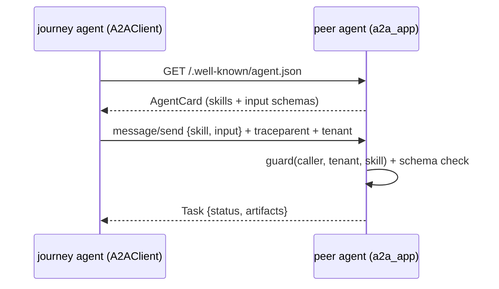

# Agent-to-agent contract (`shared/a2a/`)

Agent cards, a JSON-RPC task server and a client that carries tenant and trace context between agents (used by projects 12 and 18).

**Sections:** [1. Purpose](#1-purpose) · [2. Architecture](#2-architecture) · [3. How it works](#3-how-it-works) · [4. Key files](#4-key-files) · [5. Code excerpts](#5-code-excerpts) · [6. Configuration](#6-configuration) · [7. Commands](#7-commands) · [8. Real output](#8-real-output) · [9. Tests and eval gates](#9-tests-and-eval-gates) · [10. Guardrails](#10-guardrails) · [11. Security and governance](#11-security-and-governance) · [12. Observability](#12-observability) · [13. Failure modes](#13-failure-modes) · [14. Mapping to Azure services](#14-mapping-to-azure-services) · [15. Limitations](#15-limitations) · [16. Interview talking points](#16-interview-talking-points) · [17. Adopt this](#17-adopt-this)

## 1. Purpose

When one agent asks another for work, both sides need a published contract (the card), schema-checked inputs, a guard that decides who may call which skill, and trace context that joins the two runs.

## 2. Architecture



## 3. How it works

1. A peer publishes an `AgentCard` whose skills carry JSON schemas generated from Pydantic input models.
2. `a2a_app(card, skills, guard)` serves the card and JSON-RPC `message/send` and `tasks/get`.
3. The client sends the caller name, tenant and W3C `traceparent` with every task.
4. The server validates input against the skill schema and runs the optional guard (registry, tenant policy, kill switch).
5. Rejections come back as JSON-RPC errors (`-32602` schema, `-32010` policy) and become `A2AError` on the client; transport failures raise `A2AUnavailableError`.

## 4. Key files

| File | What it holds |
|---|---|
| `shared/a2a/models.py` | card, skill, task and message models |
| `shared/a2a/server.py` | `a2a_app`, `Skill`, `A2ARejection` |
| `shared/a2a/client.py` | `A2AClient`, typed errors |
| `shared/tests/test_a2a.py` | round trip, rejection, outage |

## 5. Code excerpts

<!-- code: shared/a2a/server.py::a2a_app -->
```python
def a2a_app(card: AgentCard, skills: dict[str, Skill], guard: Guard | None = None) -> FastAPI:
    """One agent = one app. ``guard`` runs before schema validation and the handler."""
    app = FastAPI(title=card.name)
    tasks: dict[str, Task] = {}
    for s in card.skills:
        if s.id in skills and not s.inputSchema:
            s.inputSchema = skills[s.id].input_model.model_json_schema()

    @app.get("/.well-known/agent.json")
    def agent_card() -> dict[str, Any]:
        return card.model_dump()

    @app.post("/")
    async def rpc(request: Request) -> dict[str, Any]:
        try:
            body = await request.json()
        except ValueError:
            return _err(None, INVALID_REQUEST, "body is not JSON")
        rid = body.get("id") if isinstance(body, dict) else None
        if not isinstance(body, dict) or body.get("jsonrpc") != "2.0" or "method" not in body:
            return _err(rid, INVALID_REQUEST, "not a JSON-RPC 2.0 request")
        params = body.get("params") or {}
        if body["method"] == "tasks/get":
            t = tasks.get(str(params.get("id")))
            return (
                {"jsonrpc": "2.0", "id": rid, "result": t.model_dump()}
                if t
                else _err(rid, TASK_NOT_FOUND, "task not found")
            )
        if body["method"] != "message/send":
            return _err(rid, METHOD_NOT_FOUND, f"unknown method {body['method']}")
        try:
            msg = Message.model_validate(params.get("message"))
        except ValidationError as exc:
            return _err(rid, INVALID_PARAMS, f"invalid message: {exc.errors()[0]['msg']}")
        ctx = CallContext(
            tenant=request.headers.get("x-tenant-id"),
            caller=request.headers.get("x-caller-agent"),
            traceparent=request.headers.get("traceparent"),
            skill=str(msg.metadata.get("skill", "")),
        )
        parent = TraceContextTextMapPropagator().extract(dict(request.headers))
        with telemetry().tracer.start_as_current_span(
            f"a2a.server {card.name}/{ctx.skill}",
            context=parent,
            attributes={
                "a2a.agent": card.name,
                "a2a.skill": ctx.skill,
                "tenant.id": ctx.tenant or "",
                "a2a.caller": ctx.caller or "",
            },
        ) as span:
            if faults.active(*faults.scopes("a2a", card.name)):
                return _err(rid, UNAVAILABLE, f"{card.name} unavailable (injected)")
            try:
                if guard:
                    guard(ctx, card)
                if ctx.skill not in skills:
                    raise A2ARejection(f"unknown skill '{ctx.skill}'", INVALID_PARAMS)
                skill = skills[ctx.skill]
                try:
                    inp = skill.input_model.model_validate(msg.data())
                except ValidationError as exc:
                    e = exc.errors()[0]
                    raise A2ARejection(
                        f"schema rejected: {'.'.join(map(str, e['loc']))}: {e['msg']}",
                        INVALID_PARAMS,
                    ) from exc
            except A2ARejection as rej:
                span.set_attribute("a2a.rejected", str(rej))
                return _err(rid, rej.code, str(rej))
            try:
                out = skill.handler(inp, ctx)
                status = TaskStatus(state="completed")
            except Exception as exc:  # agent failure -> failed task, never a 500
                out, status = (
                    {"error": f"{type(exc).__name__}: {exc}"},
                    TaskStatus(state="failed", message=str(exc)),
                )
            task = Task(
                contextId=msg.contextId or msg.messageId,
                status=status,
                artifacts=[Artifact(name=skill.artifact, parts=[DataPart(data=out)])],
                metadata={"tenant": ctx.tenant, "traceparent": ctx.traceparent},
            )
            tasks[task.id] = task
            span.set_attribute("a2a.task_state", status.state)
            return {"jsonrpc": "2.0", "id": rid, "result": task.model_dump()}

    return app
```
<!-- /code -->

## 6. Configuration

| Knob | Effect |
|---|---|
| `guard(caller, tenant, skill)` | allow or reject per call |
| skill input model | schema in the card and validation on the server |
| client `caller` | identity sent to the peer |

## 7. Commands

```bash
python scripts/component_demos.py a2a
pytest shared/tests/test_a2a.py
python projects/12-agent-control-plane/run.py   # registry, policy and kill switch over A2A
```

## 8. Real output

<!-- output: python scripts/component_demos.py a2a -->
```text
card: demand-agent ['forecast'] required: ['sku', 'qty']
task: completed {'sku': 'SKU-200', 'units': 150, 'tenant': 'northwind'}
bad input -> A2AError [-32602] schema rejected: qty: Field required
```
<!-- /output -->

## 9. Tests and eval gates

<!-- output: python -m pytest shared/tests/test_a2a.py -vv -p no:cacheprovider | grep -E 'PASSED|FAILED|SKIPPED' | sed -E 's/ +\[ *[0-9]+%\]//' -->
```text
shared/tests/test_a2a.py::test_card_and_round_trip_propagates_tenant_and_trace PASSED
shared/tests/test_a2a.py::test_schema_rejection_and_guard PASSED
shared/tests/test_a2a.py::test_unavailable_peer_raises_typed_error PASSED
```
<!-- /output -->

## 10. Guardrails

- Inputs are schema-checked before a skill runs.
- The guard can refuse unregistered callers, cross-tenant calls and killed agents.
- Peers return typed errors, never partial results.

## 11. Security and governance

- Caller and tenant travel with every task and land in the peer's audit log (project 12).
- Cards are the published contract that a registry can version and promote.

## 12. Observability

The `traceparent` header joins the caller's and the peer's spans into one trace, so a fan-out to three agents shows as one tree.

## 13. Failure modes

| Failure | Client sees |
|---|---|
| bad input | `A2AError` with code `-32602` |
| policy refusal | `A2AError` with code `-32010` |
| peer down | `A2AUnavailableError` (degrade or escalate) |

## 14. Mapping to Azure services

| Piece | Azure service |
|---|---|
| peer agents | Azure Container Apps or Foundry Agent Service agents |
| card registry | Azure API Center or a registry service |
| caller identity | Microsoft Entra Agent ID or managed identity tokens |
| traces | Application Insights distributed tracing |

## 15. Limitations

- A subset of the public A2A protocol shape (no streaming or push notifications).
- Tests run peers in process through FastAPI's test client.

## 16. Interview talking points

- MCP is agent-to-tool; A2A is agent-to-agent. Both need contracts and identity.
- Trace propagation is what makes a multi-agent incident debuggable.

## 17. Adopt this

1. Define a Pydantic input model per skill and publish an `AgentCard`.
2. Serve it with `a2a_app(card, skills, guard)` and write the guard from your registry.
3. Call peers with `A2AClient(name, http_client, caller=...)` and handle `A2AError` and `A2AUnavailableError` in your node.
