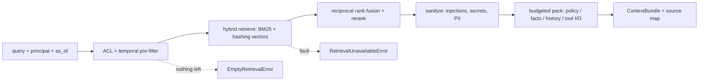

# Knowledge plane: context builder (`shared/context/`)

The one retrieval runtime every agent uses: ACL and as-of filtering, hybrid search, sanitising, budgeted packing and citations.

**Sections:** [1. Purpose](#1-purpose) · [2. Architecture](#2-architecture) · [3. How it works](#3-how-it-works) · [4. Key files](#4-key-files) · [5. Code excerpts](#5-code-excerpts) · [6. Configuration](#6-configuration) · [7. Commands](#7-commands) · [8. Real output](#8-real-output) · [9. Tests and eval gates](#9-tests-and-eval-gates) · [10. Guardrails](#10-guardrails) · [11. Security and governance](#11-security-and-governance) · [12. Observability](#12-observability) · [13. Failure modes](#13-failure-modes) · [14. Mapping to Azure services](#14-mapping-to-azure-services) · [15. Limitations](#15-limitations) · [16. Interview talking points](#16-interview-talking-points) · [17. Adopt this](#17-adopt-this)

## 1. Purpose

Agents must only see text the caller is allowed to see, from the edition in force on the relevant date, with injected instructions and secrets removed, and within a token budget. Doing that once in `ContextBuilder` keeps every project's retrieval consistent and testable.

## 2. Architecture



## 3. How it works

1. Documents are chunked by heading with parent-child ids (`D::1`, `D::1.1`) and carry `groups`, `tenant`, `valid_from` and `valid_to`.
2. `build(query, principal, as_of)` drops chunks the principal cannot see and chunks not valid on `as_of`, and counts both.
3. BM25 and an offline hashing embedder rank the rest; reciprocal rank fusion merges them and a lexical-coverage rerank orders the top hits.
4. The sanitizer neutralises instruction-like text and redacts secrets and PII before anything reaches the model.
5. The packer fills explicit budgets per slot and returns a source map so answers can cite chunk ids.
6. A semantic cache keyed by principal, as-of date and corpus version short-circuits repeats.

## 4. Key files

| File | What it holds |
|---|---|
| `shared/context/builder.py` | `ContextBuilder`, `ContextBundle`, typed retrieval errors |
| `shared/context/documents.py` | `Document`, heading-aware chunking, ACL and temporal metadata |
| `shared/context/retrieval.py` | BM25, `HashingEmbedder`, `rrf`, rerank |
| `shared/context/sanitize.py` | injection, secret and PII neutralisation |
| `shared/context/packer.py` | `Budget`, `pack`, source map |
| `shared/context/cache.py` | `SemanticCache` scoped by ACL and as-of |
| `shared/context/citations.py` | `citation_coverage` |

## 5. Code excerpts

<!-- code: shared/context/builder.py::ContextBuilder.build -->
```python
def build(
    self,
    query: str,
    principal: Principal,
    *,
    as_of: date | None = None,
    k: int = 5,
    kinds: Sequence[str] | None = None,
    facts: Sequence[tuple[str, str]] = (),
    history: Sequence[tuple[str, str]] = (),
    tool_io: Sequence[tuple[str, str]] = (),
    require_hits: bool = True,
) -> ContextBundle:
    t = telemetry()
    parent = t.current_parent()
    from opentelemetry import trace

    ctx = trace.set_span_in_context(parent) if parent else None
    with t.tracer.start_as_current_span(f"retrieve {self.corpus.name}", context=ctx) as sp:
        scope = f"{principal.scope_key()}|{as_of}|{k}|{kinds}"
        cached = None
        if self.cache is not None and not (facts or history or tool_io):
            cached = self.cache.get(query, scope, self.corpus.version)
        if cached is not None:
            sp.set_attribute("retrieval.cache_hit", True)
            return ContextBundle(**{**cached.__dict__, "cache_hit": True})
        try:
            hits, d_acl, d_time, expanded = self.retrieve(
                query, principal, as_of=as_of, k=k, kinds=kinds
            )
        except RetrievalError as exc:
            sp.record_exception(exc)
            raise
        sp.set_attribute("retrieval.hits", len(hits))
        sp.set_attribute("retrieval.dropped_acl", d_acl)
        sp.set_attribute("retrieval.dropped_temporal", d_time)
        if require_hits and not hits:
            raise EmptyRetrievalError(
                f"no evidence in '{self.corpus.name}' for principal {principal.id}"
                + (f" as of {as_of}" if as_of else "")
            )
        evidence, inj, sec, pii = [], 0, 0, 0
        for h in hits:
            s = sanitize(h.chunk.text, redact_pii=self.redact_pii)
            inj, sec, pii = inj + s.injections, sec + s.secrets, pii + s.pii
            evidence.append(Evidence(h.chunk_id, s.text, "policy", _meta(h.chunk)))
        for section, items in (("facts", facts), ("history", history), ("tool_io", tool_io)):
            for sid, text in items:
                s = sanitize(text, redact_pii=self.redact_pii)
                inj, sec, pii = inj + s.injections, sec + s.secrets, pii + s.pii
                evidence.append(Evidence(sid, s.text, section))
        packed = pack(evidence, self.budget)
        sp.set_attribute("retrieval.injections_neutralised", inj)
        sp.set_attribute("context.tokens", packed.total_tokens)
        bundle = ContextBundle(
            query,
            hits,
            packed,
            self.corpus.name,
            self.corpus.version,
            d_acl,
            d_time,
            inj,
            sec,
            pii,
            False,
            expanded,
        )
        if self.cache is not None and not (facts or history or tool_io):
            self.cache.put(query, scope, self.corpus.version, bundle)
        return bundle
```
<!-- /code -->

## 6. Configuration

| Knob | Where | Effect |
|---|---|---|
| `Budget(policy, facts, history, tool_io)` | per agent | token allocation per slot |
| `Document.groups` / `tenant` | corpus | ACL |
| `valid_from` / `valid_to` | corpus | edition in force on `as_of` |
| `Embedder` protocol | `retrieval.py` | swap the hashing embedder for an Azure OpenAI embedding deployment |
| fault `retrieval` / `retrieval:<corpus>` | `CHAOS_FAULTS` | simulate an outage |

## 7. Commands

```bash
python scripts/component_demos.py context
pytest shared/tests/test_context.py
```

## 8. Real output

<!-- output: python scripts/component_demos.py context -->
```text
query: 'refund window days' as refund-agent (group support), as of the current edition
  chunks kept: ['POL-REFUND::1', 'KB-POISON::1']
  dropped by ACL: 1, by temporal validity: 1
  sanitized: injections=1, pii=1, secrets=0
same query as of the old edition: ['POL-REFUND-OLD::1', 'KB-POISON::1']
```
<!-- /output -->

## 9. Tests and eval gates

<!-- output: python -m pytest shared/tests/test_context.py -vv -p no:cacheprovider | grep -E 'PASSED|FAILED|SKIPPED' | sed -E 's/ +\[ *[0-9]+%\]//' -->
```text
shared/tests/test_context.py::test_heading_chunks_have_parent_child_ids PASSED
shared/tests/test_context.py::test_rrf_fuses_rankings PASSED
shared/tests/test_context.py::test_hybrid_acl_and_temporal_filtering PASSED
shared/tests/test_context.py::test_sanitizer_neutralises_injection_secrets_and_pii PASSED
shared/tests/test_context.py::test_budget_packer_allocations_and_source_map PASSED
shared/tests/test_context.py::test_typed_errors_for_empty_and_unavailable PASSED
shared/tests/test_context.py::test_empty_retrieval_is_typed PASSED
shared/tests/test_context.py::test_semantic_cache_scoped_and_invalidated_on_version_change PASSED
shared/tests/test_context.py::test_citation_coverage PASSED
```
<!-- /output -->

Projects measure retrieval through their `groundedness` metric in the eval gate (citation coverage of answers).

## 10. Guardrails

- Filtering happens before ranking, so an unauthorised chunk can never be ranked into the prompt.
- Retrieved text is untrusted: injected instructions are neutralised and counted.
- No evidence raises `EmptyRetrievalError`; nodes then answer "insufficient evidence" or escalate rather than improvise.

## 11. Security and governance

- Tenant and group ACLs are enforced in code and asserted in tests.
- Secrets and PII are redacted from context, so they never reach prompts or logs.
- Cache keys include the principal's groups and the corpus version, so an ACL edit invalidates cached contexts.

## 12. Observability

The bundle reports `dropped_acl`, `dropped_temporal`, `injections`, `secrets` and `pii` counts; projects attach them to node spans and audit entries, which makes over-filtering or a poisoned corpus visible.

## 13. Failure modes

| Failure | Exit |
|---|---|
| retrieval backend down | `RetrievalUnavailableError` -> degrade (cached policy citations, auto-actions disabled) |
| nothing relevant or allowed | `EmptyRetrievalError` -> insufficient-evidence answer or escalate |
| poisoned document | sanitised, counted; text never reaches the model |
| budget too small | lowest-ranked evidence dropped and listed in `dropped` |

## 14. Mapping to Azure services

| Piece | Azure service |
|---|---|
| index + hybrid search | Azure AI Search (BM25 + vector, semantic ranker) |
| ACL | security-trimming filters on group and tenant fields |
| temporal validity | filterable `valid_from` / `valid_to` fields |
| embeddings | Azure OpenAI embedding deployment |
| sanitising | Azure AI Content Safety prompt shields, plus this sanitizer |
| labels | Microsoft Purview sensitivity labels on source documents |

## 15. Limitations

- The embedder is a hashing stand-in; ranking quality on real text is untested.
- Corpora are small and in memory.
- The sanitizer is pattern-based and will miss novel injections; Content Safety would sit in front of it in Azure.

## 16. Interview talking points

- ACL and as-of filtering before retrieval is the difference between a demo and something an auditor accepts.
- Typed retrieval errors let a graph choose an honest exit instead of a confident guess.
- Budgets per slot stop tool output from crowding out policy text.

## 17. Adopt this

1. Wrap your documents as `Document` objects with groups, tenant and validity dates.
2. Build one `ContextBuilder` per corpus and call `build(query, principal, as_of=...)` from your node.
3. Catch `EmptyRetrievalError` and `RetrievalUnavailableError` and map them to your degrade and escalate exits.
4. Swap `HashingEmbedder` for your embedding deployment by implementing the `Embedder` protocol; keep the ACL tests.
