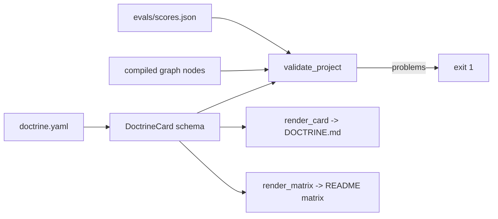

# Doctrine cards and the promotion gate (`shared/doctrine/`)

A strict schema for each project's `doctrine.yaml`, a validator that blocks promotion, and the renderer for `DOCTRINE.md` and the README matrix.

**Sections:** [1. Purpose](#1-purpose) · [2. Architecture](#2-architecture) · [3. How it works](#3-how-it-works) · [4. Key files](#4-key-files) · [5. Code excerpts](#5-code-excerpts) · [6. Configuration](#6-configuration) · [7. Commands](#7-commands) · [8. Real output](#8-real-output) · [9. Tests and eval gates](#9-tests-and-eval-gates) · [10. Guardrails](#10-guardrails) · [11. Security and governance](#11-security-and-governance) · [12. Observability](#12-observability) · [13. Failure modes](#13-failure-modes) · [14. Mapping to Azure services](#14-mapping-to-azure-services) · [15. Limitations](#15-limitations) · [16. Interview talking points](#16-interview-talking-points) · [17. Adopt this](#17-adopt-this)

## 1. Purpose

An agent only counts as more than a demo when it names its planes, systems of record, corpus and ACL, contracts, stop conditions, five exits per node, chaos scenarios, eval set, owner, KPIs, maturity and ROI. The card makes that list machine-checked.

## 2. Architecture



## 3. How it works

1. `load_card` parses the YAML into strict Pydantic models (unknown fields rejected).
2. `validate_project` compiles the graph and compares its nodes with the failure playbook rows, both ways.
3. It checks the golden set exists with enough cases, the eval suite imports, and scores pass the thresholds.
4. `validate` also checks `DOCTRINE.md` is up to date with the card.
5. `render` regenerates `DOCTRINE.md` and the compliance matrix in the root README.

## 4. Key files

| File | What it holds |
|---|---|
| `shared/doctrine/card.py` | schema, validator, renderers |
| `shared/doctrine/__main__.py` | `validate`, `render`, `matrix` |
| `projects/*/doctrine.yaml` | one card per project |
| `projects/*/DOCTRINE.md` | generated |

## 5. Code excerpts

<!-- code: shared/doctrine/card.py::validate_project -->
```python
def validate_project(project_dir: Path, check_scores: bool = True) -> list[str]:
    """Promotion gate. Returns a list of problems (empty == promotable)."""
    try:
        card = load_card(project_dir / "doctrine.yaml")
    except (ValidationError, ValueError, FileNotFoundError) as exc:
        return [f"doctrine.yaml invalid: {exc}"]
    problems = []
    if card.project != project_dir.name:
        problems.append(f"project field {card.project} != folder {project_dir.name}")
    nodes = graph_nodes(card, project_dir)
    covered = {r["node"] for r in card.failure_playbook}
    if missing := sorted(nodes - covered):
        problems.append(f"graph nodes without a five-exit row: {missing}")
    if extra := sorted(covered - nodes):
        problems.append(f"five-exit rows for nodes not in the graph: {extra}")
    golden = project_dir / card.eval.golden
    if not golden.exists():
        problems.append(f"golden set missing: {golden}")
    elif len(load_golden(golden)) < MIN_GOLDEN_CASES:
        problems.append(f"golden set has < {MIN_GOLDEN_CASES} cases")
    try:
        resolve(card.eval.suite)
    except (ImportError, AttributeError) as exc:
        problems.append(f"eval suite not importable: {exc}")
    if check_scores:
        sp = scores_path(project_dir)
        if not sp.exists():
            problems.append("no eval scores: run `python -m evals`")
        else:
            scores = json.loads(sp.read_text())
            problems += [
                f"eval gate: {v}" for v in check_thresholds(scores["metrics"], card.eval.thresholds)
            ]
    return problems
```
<!-- /code -->

## 6. Configuration

Everything is in each project's `doctrine.yaml`; the schema in `card.py` is the reference for fields and allowed values (`exit` is one of success, retry, compensate, degrade, escalate).

## 7. Commands

```bash
python -m shared.doctrine validate            # promotion gate
python -m shared.doctrine render              # regenerate DOCTRINE.md + matrix
python -m shared.doctrine matrix
```

## 8. Real output

<!-- output: python -m shared.doctrine validate -->
```text
[PASS] 01-policy-qa-rag
[PASS] 02-ticket-triage
[PASS] 03-refund-agent
[PASS] 04-sales-meeting-prep
[PASS] 05-invoice-po-matching
[PASS] 06-incident-investigator
[PASS] 07-rfp-response
[PASS] 08-contract-review
[PASS] 09-collections-agent
[PASS] 10-supply-chain-multi-agent
[PASS] 11-customer-care-e2e
[PASS] 12-agent-control-plane
[PASS] 13-insurance-fnol-coverage
[PASS] 14-healthcare-prior-auth
[PASS] 15-banking-credit-memo
[PASS] 16-telecom-outage-care
[PASS] 17-automotive-technician-copilot
[PASS] 18-logistics-exception-agent
[PASS] 19-finetune-vs-prompting
[PASS] 20-long-term-memory-agent
[PASS] 21-multi-agent-orchestration-patterns

promotion gate: 21/21 projects pass
```
<!-- /output -->

## 9. Tests and eval gates

<!-- output: python -m pytest shared/tests/test_doctrine_and_evals.py -vv -p no:cacheprovider | grep -E 'PASSED|FAILED|SKIPPED' | sed -E 's/ +\[ *[0-9]+%\]//' -->
```text
shared/tests/test_doctrine_and_evals.py::test_promotion_gate[01-policy-qa-rag] PASSED
shared/tests/test_doctrine_and_evals.py::test_promotion_gate[02-ticket-triage] PASSED
shared/tests/test_doctrine_and_evals.py::test_promotion_gate[03-refund-agent] PASSED
shared/tests/test_doctrine_and_evals.py::test_promotion_gate[04-sales-meeting-prep] PASSED
shared/tests/test_doctrine_and_evals.py::test_promotion_gate[05-invoice-po-matching] PASSED
shared/tests/test_doctrine_and_evals.py::test_promotion_gate[06-incident-investigator] PASSED
shared/tests/test_doctrine_and_evals.py::test_promotion_gate[07-rfp-response] PASSED
shared/tests/test_doctrine_and_evals.py::test_promotion_gate[08-contract-review] PASSED
shared/tests/test_doctrine_and_evals.py::test_promotion_gate[09-collections-agent] PASSED
shared/tests/test_doctrine_and_evals.py::test_promotion_gate[10-supply-chain-multi-agent] PASSED
shared/tests/test_doctrine_and_evals.py::test_promotion_gate[11-customer-care-e2e] PASSED
shared/tests/test_doctrine_and_evals.py::test_promotion_gate[12-agent-control-plane] PASSED
shared/tests/test_doctrine_and_evals.py::test_promotion_gate[13-insurance-fnol-coverage] PASSED
shared/tests/test_doctrine_and_evals.py::test_promotion_gate[14-healthcare-prior-auth] PASSED
shared/tests/test_doctrine_and_evals.py::test_promotion_gate[15-banking-credit-memo] PASSED
shared/tests/test_doctrine_and_evals.py::test_promotion_gate[16-telecom-outage-care] PASSED
shared/tests/test_doctrine_and_evals.py::test_promotion_gate[17-automotive-technician-copilot] PASSED
shared/tests/test_doctrine_and_evals.py::test_promotion_gate[18-logistics-exception-agent] PASSED
shared/tests/test_doctrine_and_evals.py::test_promotion_gate[19-finetune-vs-prompting] PASSED
shared/tests/test_doctrine_and_evals.py::test_promotion_gate[20-long-term-memory-agent] PASSED
shared/tests/test_doctrine_and_evals.py::test_promotion_gate[21-multi-agent-orchestration-patterns] PASSED
shared/tests/test_doctrine_and_evals.py::test_gate_rejects_incomplete_cards PASSED
shared/tests/test_doctrine_and_evals.py::test_thresholds_and_harness_metrics PASSED
shared/tests/test_doctrine_and_evals.py::test_every_project_carries_a_doctrine_card PASSED
shared/tests/test_doctrine_and_evals.py::test_readme_compliance_matrix_is_fresh PASSED
```
<!-- /output -->

CI runs the validator on every push.

## 10. Guardrails

- A node added to a graph without a five-exit row fails the gate.
- A chaos scenario naming a node that does not exist fails schema validation.
- Generated docs that drift from the card fail the gate.

## 11. Security and governance

- Owner, KPIs and maturity are required fields, so accountability is explicit.
- The card is the document an architecture review signs off.

## 12. Observability

The compliance matrix in the root README summarises every project's maturity, systems, corpora and scores.

## 13. Failure modes

| Problem | Message |
|---|---|
| missing playbook row | `graph nodes without a five-exit row` |
| stale row | `five-exit rows for nodes not in the graph` |
| regressed score | `eval gate: ...` |
| invalid YAML | `doctrine.yaml invalid: ...` |

## 14. Mapping to Azure services

| Piece | Azure service |
|---|---|
| catalog of cards | Azure API Center or a Foundry project catalog |
| gate | GitHub Actions environment protection before deploy |
| policy alignment | Azure Policy and Microsoft Purview for the controls the card names |

## 15. Limitations

- Maturity levels are self-rated.
- KPI targets are not measured from production data.

## 16. Interview talking points

- Turning an architecture checklist into a failing build is what makes it stick.
- Checking the playbook against the compiled graph keeps docs and code in step.

## 17. Adopt this

1. Copy `shared/doctrine/` and write a card per agent.
2. Run `python -m shared.doctrine validate` in CI.
3. Extend the schema with your own required fields (for example a data protection impact assessment reference).
