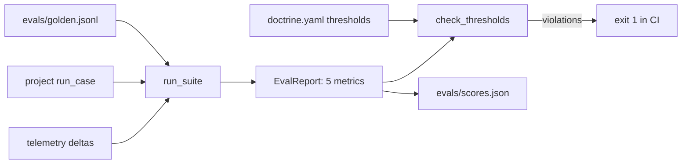

# Eval harness and gate (`shared/evals/`, `evals/`)

Golden JSONL in, metrics out, thresholds from each project's `doctrine.yaml`; `python -m evals` fails CI on any regression.

**Sections:** [1. Purpose](#1-purpose) · [2. Architecture](#2-architecture) · [3. How it works](#3-how-it-works) · [4. Key files](#4-key-files) · [5. Code excerpts](#5-code-excerpts) · [6. Configuration](#6-configuration) · [7. Commands](#7-commands) · [8. Real output](#8-real-output) · [9. Tests and eval gates](#9-tests-and-eval-gates) · [10. Guardrails](#10-guardrails) · [11. Security and governance](#11-security-and-governance) · [12. Observability](#12-observability) · [13. Failure modes](#13-failure-modes) · [14. Mapping to Azure services](#14-mapping-to-azure-services) · [15. Limitations](#15-limitations) · [16. Interview talking points](#16-interview-talking-points) · [17. Adopt this](#17-adopt-this)

## 1. Purpose

Quality is measured, not assumed. Each project ships a golden set and a `run_case` function; the harness runs them, measures cost and tool errors from telemetry, and compares five metrics with the thresholds in the doctrine card.

## 2. Architecture



## 3. How it works

1. `load_golden` reads one case per line (`id`, `input`, `expect`).
2. `run_suite` calls the project's `run_case` per case and records cost and tool calls from telemetry before and after.
3. Metrics: `task_success`, `groundedness`, `policy_violation_rate`, `tool_error_rate`, `cost_per_task`.
4. `check_thresholds` compares them with strings like `>=0.95`.
5. `python -m evals` runs every project (or `--project NN`), writes `scores.json` unless `--no-write`, and exits 1 on any violation.

## 4. Key files

| File | What it holds |
|---|---|
| `shared/evals/harness.py` | `CaseResult`, `EvalReport`, `run_suite`, `check_thresholds` |
| `evals/__main__.py` | the CLI runner |
| `projects/*/evals/golden.jsonl` | golden sets |
| `projects/*/evals/scores.json` | latest scores, rendered into `DOCTRINE.md` |

## 5. Code excerpts

<!-- code: shared/evals/harness.py::check_thresholds -->
```python
def check_thresholds(metrics: dict[str, float | None], thresholds: dict[str, str]) -> list[str]:
    out = []
    for name, rule in thresholds.items():
        m = re.fullmatch(r"\s*(>=|<=|==|>|<)\s*([0-9.eE+-]+)\s*", str(rule))
        if not m or name not in metrics:
            out.append(f"bad threshold {name}: {rule}")
            continue
        op, bound = m.group(1), float(m.group(2))
        if metrics[name] is None:
            out.append(f"{name} is n/a (no case produced a scorable value) but has a threshold")
            continue
        if not _OPS[op](metrics[name], bound):
            out.append(f"{name} = {metrics[name]:.4f} violates {op} {bound}")
    return out
```
<!-- /code -->

## 6. Configuration

| Where | What |
|---|---|
| `doctrine.yaml` `eval.thresholds` | per-project gate |
| `doctrine.yaml` `eval.suite` | the `run_case` function |
| `--live` | use the configured real model |
| `--no-write` | check only (CI) |

## 7. Commands

```bash
python -m evals                    # all projects, writes scores.json
python -m evals --no-write         # CI regression check
python -m evals --project 08 -v    # one project, per-case detail
```

## 8. Real output

<!-- output: python -m evals --no-write -->
```text
project                            n   task_success   groundedness policy_violati tool_error_rat  cost_per_task  gate
---------------------------------------------------------------------------------------------------------------------
01-policy-qa-rag                  13           1.00           1.00           0.00           0.00        0.00009  PASS
02-ticket-triage                  12           1.00            n/a           0.00           0.00        0.00007  PASS
03-refund-agent                   12           1.00           1.00           0.00           0.00        0.00004  PASS
04-sales-meeting-prep             12           1.00           1.00           0.00           0.38        0.00010  PASS
05-invoice-po-matching            12           1.00            n/a           0.00           0.14        0.00017  PASS
06-incident-investigator          13           1.00           1.00           0.00           0.10        0.00019  PASS
07-rfp-response                   12           1.00           1.00           0.00           0.00        0.00011  PASS
08-contract-review                12           0.75           1.00           0.00           0.00        0.00033  PASS
09-collections-agent              13           1.00            n/a           0.00           0.05        0.00004  PASS
10-supply-chain-multi-agent       17           1.00            n/a           0.00           0.05        0.00024  PASS
11-customer-care-e2e              21           1.00           1.00           0.00           0.02        0.00007  PASS
12-agent-control-plane            14           1.00            n/a           0.00           0.02        0.00004  PASS
13-insurance-fnol-coverage        22           1.00           1.00           0.00           0.03        0.00005  PASS
14-healthcare-prior-auth          20           1.00           1.00           0.00           0.04        0.00003  PASS
15-banking-credit-memo            18           1.00           1.00           0.00           0.03        0.00009  PASS
16-telecom-outage-care            19           1.00           1.00           0.00           0.04        0.00004  PASS
17-automotive-technician-copilot  17           1.00           1.00           0.00           0.07        0.00006  PASS
18-logistics-exception-agent      21           1.00           1.00           0.00           0.04        0.00001  PASS
19-finetune-vs-prompting          14           1.00            n/a           0.00           0.00        0.00000  PASS
20-long-term-memory-agent         18           1.00           1.00           0.00           0.00        0.00009  PASS
21-multi-agent-orchestration-patterns  24           1.00           1.00           0.00           0.00        0.00046  PASS

eval gate: 21/21 projects pass
```
<!-- /output -->

## 9. Tests and eval gates

<!-- output: python -m pytest shared/tests/test_doctrine_and_evals.py -vv -p no:cacheprovider | grep -E 'PASSED|FAILED|SKIPPED' | sed -E 's/ +\[ *[0-9]+%\]//' -->
```text
shared/tests/test_doctrine_and_evals.py::test_promotion_gate[01-policy-qa-rag] PASSED
shared/tests/test_doctrine_and_evals.py::test_promotion_gate[02-ticket-triage] PASSED
shared/tests/test_doctrine_and_evals.py::test_promotion_gate[03-refund-agent] PASSED
shared/tests/test_doctrine_and_evals.py::test_promotion_gate[04-sales-meeting-prep] PASSED
shared/tests/test_doctrine_and_evals.py::test_promotion_gate[05-invoice-po-matching] PASSED
shared/tests/test_doctrine_and_evals.py::test_promotion_gate[06-incident-investigator] PASSED
shared/tests/test_doctrine_and_evals.py::test_promotion_gate[07-rfp-response] PASSED
shared/tests/test_doctrine_and_evals.py::test_promotion_gate[08-contract-review] PASSED
shared/tests/test_doctrine_and_evals.py::test_promotion_gate[09-collections-agent] PASSED
shared/tests/test_doctrine_and_evals.py::test_promotion_gate[10-supply-chain-multi-agent] PASSED
shared/tests/test_doctrine_and_evals.py::test_promotion_gate[11-customer-care-e2e] PASSED
shared/tests/test_doctrine_and_evals.py::test_promotion_gate[12-agent-control-plane] PASSED
shared/tests/test_doctrine_and_evals.py::test_promotion_gate[13-insurance-fnol-coverage] PASSED
shared/tests/test_doctrine_and_evals.py::test_promotion_gate[14-healthcare-prior-auth] PASSED
shared/tests/test_doctrine_and_evals.py::test_promotion_gate[15-banking-credit-memo] PASSED
shared/tests/test_doctrine_and_evals.py::test_promotion_gate[16-telecom-outage-care] PASSED
shared/tests/test_doctrine_and_evals.py::test_promotion_gate[17-automotive-technician-copilot] PASSED
shared/tests/test_doctrine_and_evals.py::test_promotion_gate[18-logistics-exception-agent] PASSED
shared/tests/test_doctrine_and_evals.py::test_promotion_gate[19-finetune-vs-prompting] PASSED
shared/tests/test_doctrine_and_evals.py::test_promotion_gate[20-long-term-memory-agent] PASSED
shared/tests/test_doctrine_and_evals.py::test_promotion_gate[21-multi-agent-orchestration-patterns] PASSED
shared/tests/test_doctrine_and_evals.py::test_gate_rejects_incomplete_cards PASSED
shared/tests/test_doctrine_and_evals.py::test_thresholds_and_harness_metrics PASSED
shared/tests/test_doctrine_and_evals.py::test_every_project_carries_a_doctrine_card PASSED
shared/tests/test_doctrine_and_evals.py::test_readme_compliance_matrix_is_fresh PASSED
```
<!-- /output -->

CI runs `python -m evals --no-write` on every push, plus project 08's precision and recall gate.

## 10. Guardrails

- A missing or regressed metric fails the build.
- Policy violations have a zero threshold in money-moving projects.
- Golden sets need at least ten cases (promotion gate).

## 11. Security and governance

- Thresholds live in the reviewed doctrine card, not in CI YAML.
- Scores are committed, so a reviewer sees the effect of a change.

## 12. Observability

`scores.json` per project and the compliance matrix in the root README show the current state; `-v` prints failed cases with detail.

## 13. Failure modes

| Failure | Result |
|---|---|
| threshold missed | exit 1, violations printed |
| `run_case` raises | case counted as failed |
| golden set too small | promotion gate fails |

## 14. Mapping to Azure services

| Piece | Azure service |
|---|---|
| live-model evals | Microsoft Foundry evaluations (groundedness, relevance, safety) with the same thresholds |
| gate | GitHub Actions or Azure DevOps before a deployment |
| history | Foundry evaluation runs or Log Analytics |

## 15. Limitations

- Golden sets are written against deterministic mocks, so most score 1.00; project 08 is deliberately harder.
- Groundedness is citation coverage, not a judged score.

## 16. Interview talking points

- Thresholds as code in the card make quality a reviewable contract.
- Cost per task sits next to accuracy, so a cheaper model has to earn its place.

## 17. Adopt this

1. Write `run_case(case) -> CaseResult` for your agent.
2. Add `evals/golden.jsonl` with at least ten cases and thresholds in your card.
3. Run `python -m evals --no-write` in CI and keep `scores.json` committed so reviewers see score changes in the diff.
4. Extend with a metric of your own: return it from `run_case`, aggregate it in `EvalReport` and add a threshold to every card that should enforce it.
