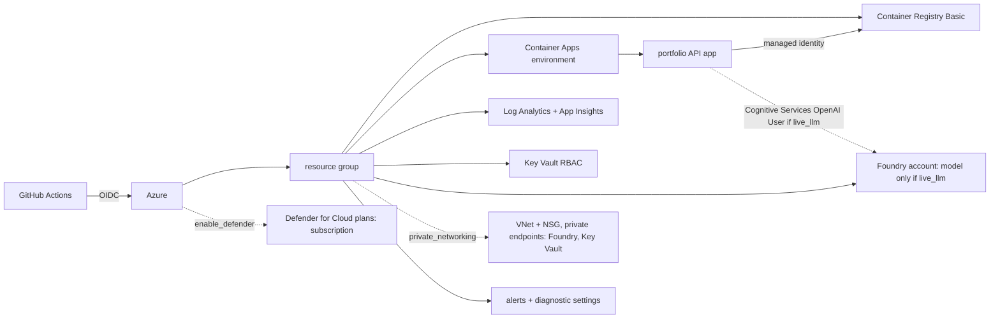

# Infrastructure and pipelines (`infra/`, `.github/workflows/`)

Terraform (primary) and Bicep for hosting the portfolio API on Azure Container Apps, and GitHub Actions for CI, infra checks, a gated deploy and teardown. Optional private networking for Foundry and Key Vault, Azure Monitor alert rules and diagnostic settings, and opt-in Defender for Cloud plans, in both tools. Nothing has been applied.

**Sections:** [1. Purpose](#1-purpose) · [2. Architecture](#2-architecture) · [3. How it works](#3-how-it-works) · [4. Key files](#4-key-files) · [5. Code excerpts](#5-code-excerpts) · [6. Configuration](#6-configuration) · [7. Commands](#7-commands) · [8. Real output](#8-real-output) · [9. Tests and eval gates](#9-tests-and-eval-gates) · [10. Guardrails](#10-guardrails) · [11. Security and governance](#11-security-and-governance) · [12. Observability](#12-observability) · [13. Failure modes](#13-failure-modes) · [14. Mapping to Azure services](#14-mapping-to-azure-services) · [15. Limitations](#15-limitations) · [16. Interview talking points](#16-interview-talking-points) · [17. Adopt this](#17-adopt-this)

## 1. Purpose

Show how the portfolio would run in Azure with the smallest sensible footprint and enterprise controls (OIDC, managed identity, approvals), and prove the templates are valid without a subscription.

## 2. Architecture



## 3. How it works

1. `infra` workflow: bicep build, terraform fmt, init without backend, validate, offline `terraform test` with mocked providers, tflint, checkov, docker build and container smoke test.
2. `deploy` workflow: stops at a gate unless `DEPLOY_ENABLED` is `true`; then builds the image, provisions dev, pushes to ACR, rolls the app and smoke-tests; prod reuses the same image after an environment approval.
3. `teardown` is manual and gated the same way.
4. Dev scales to zero and caps log ingestion; no model is deployed unless `live_llm = true`.
5. `private_networking` (Bicep `privateNetworking`, default `false`; `prod.tfvars` sets it) adds a VNet with one NSG on both subnets, private endpoints and DNS zones for Foundry and Key Vault, turns public network access off on both (Foundry was hard-coded public before) and VNet-integrates the Container Apps environment. The API ingress stays external, and ACR stays public because Basic SKU has no private endpoints.
6. `enable_alerts` (default `true`) adds an action group, 3 metric alert rules (Foundry server errors, Foundry 4xx/throttling, Key Vault availability), 3 KQL rules on App Insights (failed requests, exceptions, failing dependencies) and diagnostic settings from Foundry, Key Vault and ACR to Log Analytics. `enable_defender` (default `false`) turns on Defender for Cloud plans `AI`, `Arm` and `KeyVaults`, which are subscription-wide and billed per resource.

## 4. Key files

| Path | What it holds |
|---|---|
| `infra/terraform/` | root module, `modules/` (naming, identity, monitoring, keyvault, registry, foundry, containerapps-env, containerapp, network, private-endpoint, alerts, defender), `envs/`, `tests/` |
| `infra/bicep/main.bicep`, `infra/bicep/modules/` | the same stack in Bicep (alerts, defender, network and private-endpoint modules) |
| `shared/tests/test_infra.py` | Bicep / Terraform parity for private networking, alert rules, diagnostic targets and the Defender default |
| `.github/workflows/` | `ci.yml` (with gitleaks and SBOM jobs), `codeql.yml`, `infra.yml` (with the image scan, image SBOM and provenance steps), `deploy.yml`, `teardown.yml` |
| `.checkov.yaml` | justified skips |
| `Dockerfile` | API image (base pinned by digest; pip/uv removed from the runtime layer) |

## 5. Code excerpts

The API's environment, including the live-model switch:

<!-- code: infra/terraform/main.tf:114-141 -->
```hcl
module "api" {
  source              = "./modules/containerapp"
  resource_group_name = azurerm_resource_group.this.name
  tags                = local.tags
  name                = "ca-api-${module.naming.base}"
  service_name        = "portfolio-api"
  environment_id      = module.aca_env.id
  identity_id         = module.identity.ids["api"]
  registry_server     = module.registry.login_server
  image               = var.container_image
  external            = true
  min_replicas        = local.p.min_replicas
  max_replicas        = local.p.max_replicas
  health_path         = "/healthz"
  env = {
    LLM_PROVIDER                          = var.live_llm ? "azure" : "mock"
    PORTFOLIO_ALLOW_LIVE                  = var.live_llm ? "1" : "0"
    AZURE_CLIENT_ID                       = module.identity.client_ids["api"]
    AZURE_OPENAI_ENDPOINT                 = module.foundry.openai_endpoint
    AZURE_OPENAI_DEPLOYMENT               = module.foundry.chat_deployment_name
    AZURE_OPENAI_FALLBACK_DEPLOYMENT      = try(azurerm_cognitive_deployment.fallback[0].name, "")
    FOUNDRY_PROJECT_ENDPOINT              = module.foundry.project_endpoint
    AZURE_KEY_VAULT_URI                   = module.keyvault.uri
    APPLICATIONINSIGHTS_CONNECTION_STRING = module.monitoring.app_insights_connection_string
  }

  depends_on = [module.registry]
}
```
<!-- /code -->

## 6. Configuration

| Setting | Where | Effect |
|---|---|---|
| `DEPLOY_ENABLED` | repository variable | unset: deploy and teardown do nothing |
| `DEPLOY_TOOL` | repository variable | `terraform` (default) or `bicep` |
| `AZURE_CLIENT_ID`, `AZURE_TENANT_ID`, `AZURE_SUBSCRIPTION_ID` | environment variables | OIDC login per environment |
| `live_llm` | tfvars | deploys a model and the OpenAI role |
| `private_networking` / `privateNetworking` | tfvars / Bicep param | `false`: public endpoints (cheap demo); `true`: VNet + NSG, private endpoints for Foundry and Key Vault, public access off |
| `enable_alerts`, `alert_email` | tfvars | alert rules and diagnostic settings (default on); optional on-call email |
| `enable_defender`, `defender_plans` | tfvars | Defender for Cloud plans (default off: subscription-wide and billed) |
| `envs/dev.tfvars`, `prod.tfvars` | Terraform | sizes per environment |

## 7. Commands

```bash
terraform -chdir=infra/terraform init -backend=false && terraform -chdir=infra/terraform validate
terraform -chdir=infra/terraform test
az bicep build --file infra/bicep/main.bicep
docker build -t agentic-portfolio:local .
```

## 8. Real output

Resources and modules in the Terraform root module:

<!-- output: grep -hoE '^(resource|module) "[^"]+"( "[^"]+")?' infra/terraform/main.tf -->
```text
module "naming"
resource "azurerm_resource_group" "this"
module "identity"
module "monitoring"
module "keyvault"
module "registry"
module "foundry"
resource "azurerm_cognitive_deployment" "fallback"
resource "azurerm_role_assignment" "api_openai_user"
module "aca_env"
module "api"
module "network"
module "private_endpoint"
module "alerts"
module "defender"
```
<!-- /output -->

## 9. Tests and eval gates

`terraform test` runs offline plan assertions with mocked providers (`infra/terraform/tests/`), including `private_networking_and_defender` (2 private endpoints, the NSG, the three Defender plans) and the default alert and diagnostic counts; `shared/tests/test_infra.py` fails if Bicep and Terraform drift on private networking, alert rule names, diagnostic targets or the Defender default; checkov and tflint run in the `infra` workflow; the container smoke test hits `/healthz`, `/readyz` and `/projects`.

## 10. Guardrails

- Deploy gated off by `DEPLOY_ENABLED`; prod needs environment reviewers.
- The same image is promoted from dev to prod, never rebuilt.
- No model is deployed unless asked for.

## 11. Security and governance

- OIDC federated credentials; no client secret in GitHub.
- Every action pinned to a commit SHA with read-only default permissions; gitleaks, CodeQL and Dependabot (see `SECURITY.md`).
- A source SBOM on every CI run; both images are scanned by Trivy (fixable HIGH/CRITICAL fail), get an image SBOM, and on `main` get keyless build provenance for the image archive.
- User-assigned managed identity with AcrPull, plus the OpenAI role only with `live_llm`.
- Key Vault with RBAC; local auth disabled where supported; checkov skips are justified in `.checkov.yaml`.
- Optional private networking: Foundry and Key Vault behind private endpoints with public access off, one NSG on both subnets.
- Opt-in Defender for Cloud plans `AI`, `Arm` and `KeyVaults` (`enable_defender`).

## 12. Observability

Log Analytics and Application Insights are provisioned with the app; the connection string is injected as an environment variable for the OpenTelemetry exporter. Diagnostic settings send Foundry, Key Vault and ACR logs and metrics to the workspace, and 6 alert rules route to one action group. Thresholds are untuned starting points.

## 13. Failure modes

| Failure | What happens |
|---|---|
| credentials missing | deploy job reports and stops |
| smoke test fails | job fails before prod |
| prod approval not given | prod job waits |

## 14. Mapping to Azure services

This component is the Azure mapping: Container Apps, Container Registry, Log Analytics, Application Insights, Key Vault, Microsoft Foundry (Azure OpenAI), managed identities and RBAC.

## 15. Limitations

- Never applied; GitHub environments and reviewers do not exist yet.
- Private networking, alert rules, diagnostic settings and Defender plans are only built and plan-tested offline. The App Insights log alerts only see data once the app exports to App Insights, which it does not do yet.
- With private networking on, ACR (Basic) and the API ingress stay public.
- Project 11 has its own skeleton Bicep that this pipeline does not deploy.

## 16. Interview talking points

- Two IaC tools on purpose (ADR 0001): Terraform as primary, Bicep for teams that standardise on it.
- Offline `terraform test` with mocked providers gives real feedback without a subscription.
- Public by default for a cheap demo, one flag for private endpoints, and a test that keeps Bicep and Terraform in step.

## 17. Adopt this

1. Copy `infra/terraform` and set `envs/*.tfvars` for your naming and region.
2. Create the Entra app registration and federated credentials described in `docs/deployment.md`.
3. Set the environment variables, then set `DEPLOY_ENABLED=true` when you are ready.
