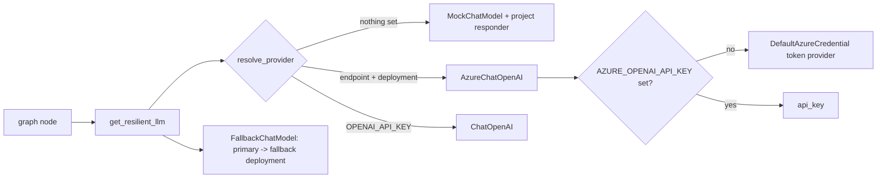

# Model factory and keyless Azure OpenAI auth (`shared/llm.py`)

One function decides which chat model every project gets: the deterministic mock by default, Azure OpenAI or OpenAI when configured. Azure access is keyless.

**Sections:** [1. Purpose](#1-purpose) · [2. Architecture](#2-architecture) · [3. How it works](#3-how-it-works) · [4. Key files](#4-key-files) · [5. Code excerpts](#5-code-excerpts) · [6. Configuration](#6-configuration) · [7. Commands](#7-commands) · [8. Real output](#8-real-output) · [9. Tests and eval gates](#9-tests-and-eval-gates) · [10. Guardrails](#10-guardrails) · [11. Security and governance](#11-security-and-governance) · [12. Observability](#12-observability) · [13. Failure modes](#13-failure-modes) · [14. Mapping to Azure services](#14-mapping-to-azure-services) · [15. Limitations](#15-limitations) · [16. Interview talking points](#16-interview-talking-points) · [17. Adopt this](#17-adopt-this)

## 1. Purpose

Projects should never construct a model client themselves. `get_llm()` and `get_resilient_llm()` give all 21 projects the same provider resolution, the same mock for offline runs, the same keyless Azure authentication and the same fallback chain, so changing provider is an environment change, not a code change.

## 2. Architecture



## 3. How it works

1. `resolve_provider()` reads `LLM_PROVIDER` first (`mock`, `azure`, `openai`).
2. Otherwise Azure is chosen when `AZURE_OPENAI_ENDPOINT` and `AZURE_OPENAI_DEPLOYMENT` are set, then OpenAI when `OPENAI_API_KEY` is set, else the mock.
3. For Azure, `azure_auth_kwargs()` returns a bearer-token provider over `DefaultAzureCredential` (managed identity in Azure, `az login` locally) for the `cognitiveservices` scope. The API key is used only when `AZURE_OPENAI_API_KEY` is set.
4. The mock (`MockChatModel`) calls a project-supplied responder, so offline runs follow the same code path as a real model, including tool calls.
5. `get_resilient_llm()` wraps the primary in `with_fallback()` with an optional second deployment (`AZURE_OPENAI_FALLBACK_DEPLOYMENT`) and circuit breakers.

## 4. Key files

| File | What it holds |
|---|---|
| `shared/llm.py` | `resolve_provider`, `azure_auth_kwargs`, `get_llm`, `get_resilient_llm`, `MockChatModel` |
| `shared/resilience.py` | `with_fallback`, `FallbackChatModel`, breakers |
| `shared/tests/test_llm.py` | provider resolution, keyless and key paths (with fakes), mock determinism, tool calling |
| .env.example | the variables, with keyless as the documented default |

## 5. Code excerpts

Keyless by default, key only when set:

<!-- code: shared/llm.py::azure_auth_kwargs -->
```python
def azure_auth_kwargs(env: dict[str, str] | None = None) -> dict[str, Any]:
    """Keyword arguments that authenticate ``AzureChatOpenAI``.

    Keyless by default: ``DefaultAzureCredential`` wrapped in a bearer-token provider, so the
    container's managed identity (or a developer's ``az login``) is used and no key is stored.
    The API key path is used only when ``AZURE_OPENAI_API_KEY`` is set.
    """
    env = dict(os.environ) if env is None else env
    if env.get("AZURE_OPENAI_API_KEY"):
        return {"api_key": env["AZURE_OPENAI_API_KEY"]}
    try:
        from azure.identity import DefaultAzureCredential, get_bearer_token_provider
    except ImportError as exc:  # pragma: no cover - depends on installed extras
        raise RuntimeError(
            "azure-identity is not installed. Run: uv sync --extra openai "
            "(or set AZURE_OPENAI_API_KEY)"
        ) from exc
    provider = get_bearer_token_provider(DefaultAzureCredential(), AZURE_SCOPE)
    return {"azure_ad_token_provider": provider}
```
<!-- /code -->

Provider resolution:

<!-- code: shared/llm.py::resolve_provider -->
```python
def resolve_provider(env: dict[str, str] | None = None) -> Provider:
    env = dict(os.environ) if env is None else env
    forced = env.get("LLM_PROVIDER", "").strip().lower()
    if forced in ("mock", "azure", "openai"):
        return forced  # type: ignore[return-value]
    if all(env.get(v) for v in AZURE_VARS):
        return "azure"
    if env.get("OPENAI_API_KEY"):
        return "openai"
    return "mock"
```
<!-- /code -->

## 6. Configuration

| Variable | Effect |
|---|---|
| `LLM_PROVIDER` | force `mock`, `azure` or `openai` |
| `AZURE_OPENAI_ENDPOINT`, `AZURE_OPENAI_DEPLOYMENT` | select Azure OpenAI |
| `AZURE_OPENAI_API_KEY` | optional; switches Azure auth from token to key |
| `AZURE_OPENAI_API_VERSION` | API version string passed to the client |
| `AZURE_OPENAI_FALLBACK_DEPLOYMENT`, `AZURE_OPENAI_FALLBACK_ENDPOINT` | second deployment for the fallback chain |
| `OPENAI_API_KEY`, `OPENAI_MODEL`, `OPENAI_FALLBACK_MODEL` | OpenAI path |
| `AZURE_CLIENT_ID` | which user-assigned managed identity `DefaultAzureCredential` uses (set by the Terraform and Bicep) |

## 7. Commands

```bash
python scripts/component_demos.py llm   # resolution table + a mock call
pytest shared/tests/test_llm.py
az login && export AZURE_OPENAI_ENDPOINT=... AZURE_OPENAI_DEPLOYMENT=...   # keyless, real model
python projects/03-refund-agent/run.py
```

## 8. Real output

<!-- output: python scripts/component_demos.py llm -->
```text
provider resolution (variables set -> provider, Azure auth):
  (nothing) -> mock, -
  AZURE_OPENAI_DEPLOYMENT, AZURE_OPENAI_ENDPOINT -> azure, keyless (DefaultAzureCredential)
  AZURE_OPENAI_API_KEY, AZURE_OPENAI_DEPLOYMENT, AZURE_OPENAI_ENDPOINT -> azure, api key
  AZURE_OPENAI_ENDPOINT, OPENAI_API_KEY -> openai, -
  LLM_PROVIDER, OPENAI_API_KEY -> mock, -
mock model is MockChatModel -> PTO carry-over is 5 days [HR-PTO-2].
```
<!-- /output -->

## 9. Tests and eval gates

<!-- output: python -m pytest shared/tests/test_llm.py -vv -p no:cacheprovider | grep -E 'PASSED|FAILED|SKIPPED' | sed -E 's/ +\[ *[0-9]+%\]//' -->
```text
shared/tests/test_llm.py::test_resolve_provider_defaults_to_mock PASSED
shared/tests/test_llm.py::test_resolve_provider_prefers_azure_when_complete PASSED
shared/tests/test_llm.py::test_resolve_provider_partial_azure_falls_back_to_openai PASSED
shared/tests/test_llm.py::test_forced_provider_wins PASSED
shared/tests/test_llm.py::test_mock_is_deterministic_and_uses_responder PASSED
shared/tests/test_llm.py::test_mock_supports_tool_calling_agents PASSED
shared/tests/test_llm.py::test_resolve_provider_azure_needs_no_key PASSED
shared/tests/test_llm.py::test_azure_auth_uses_key_only_when_set PASSED
shared/tests/test_llm.py::test_azure_auth_is_keyless_by_default PASSED
shared/tests/test_llm.py::test_get_llm_azure_keyless_passes_token_provider PASSED
shared/tests/test_llm.py::test_get_llm_azure_with_key_does_not_touch_identity PASSED
shared/tests/test_llm.py::test_mock_stays_default_without_env PASSED
```
<!-- /output -->

The keyless tests replace `azure.identity` and `AzureChatOpenAI` with fakes, so they prove the wiring (token provider passed, no key, key path never imports `azure.identity`) without a network call. Every project's eval gate runs on the mock this factory returns.

## 10. Guardrails

- The mock is the default: nothing reaches a paid model unless variables are set on purpose.
- The portfolio API also requires `PORTFOLIO_ALLOW_LIVE=1` before it uses a real model.
- When every deployment fails the chain raises `ModelUnavailableError` instead of inventing text, and nodes take their degrade exit.

## 11. Security and governance

- No key is needed in Azure: the container's managed identity gets the Cognitive Services OpenAI User role (Terraform `azurerm_role_assignment.api_openai_user`).
- `.env` is gitignored; `.env.example` ships with the key commented out.
- Temperature defaults to 0 for repeatable decisions.

## 12. Observability

Model calls are traced by `shared/observability.py` as `llm <model>` spans with input and output token counts, estimated cost and the deployment that served the call (`served_by`), so a fallback is visible in traces.

## 13. Failure modes

| Failure | What happens |
|---|---|
| `langchain-openai` or `azure-identity` missing | clear `RuntimeError` naming the extra to install |
| no Azure role / expired login | the token provider raises on first call; the fallback chain then raises `ModelUnavailableError` |
| primary deployment throttled or down | breaker opens, fallback deployment serves |
| both down | `ModelUnavailableError`, node degrades (keyword classifier, template reply) |

## 14. Mapping to Azure services

| Piece | Azure service |
|---|---|
| chat model | Azure OpenAI deployment in Microsoft Foundry |
| identity | user-assigned managed identity + Cognitive Services OpenAI User role |
| fallback | a second deployment, optionally in a paired region |
| secrets (only if a key is used) | Key Vault reference, never an app setting in clear |

## 15. Limitations

- The keyless path is unit-tested with fakes; it has not called a live endpoint.
- Token counts for the mock are estimates.
- The API version is a fixed default; pin it per deployment in production.

## 16. Interview talking points

- Offline-first is a design choice: CI, demos and evals never depend on a model endpoint.
- Keyless by default with `DefaultAzureCredential` means the same code works with managed identity in Azure and `az login` on a laptop, and no key needs rotating.
- Provider choice is configuration; graphs never import a vendor SDK.

## 17. Adopt this

1. Copy `shared/llm.py` and `shared/resilience.py` into your package (or depend on `shared`).
2. Call `get_resilient_llm(mock_responder=...)` in your graph; write a responder that makes your tests deterministic.
3. In Azure, give the workload's managed identity Cognitive Services OpenAI User and set `AZURE_CLIENT_ID`, `AZURE_OPENAI_ENDPOINT`, `AZURE_OPENAI_DEPLOYMENT`; do not set a key.
4. Extend with another provider by adding a branch to `get_llm` and a test like `test_get_llm_azure_keyless_passes_token_provider`.
