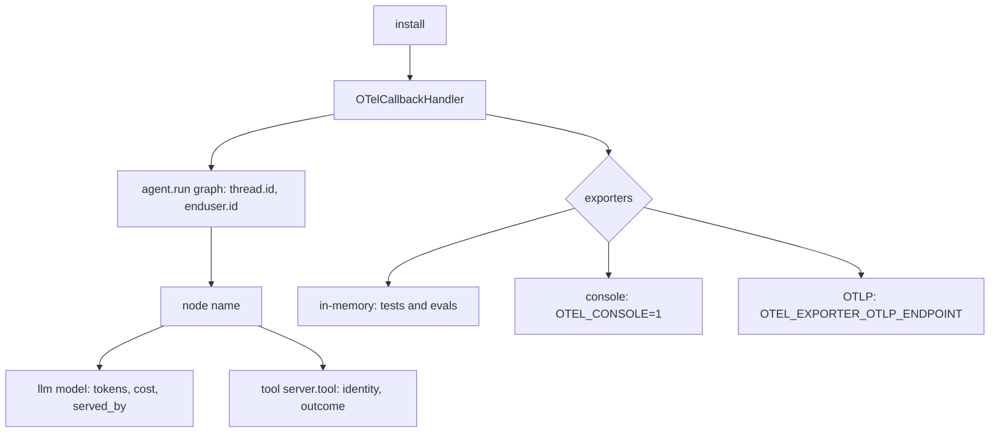

# Tracing and cost metering (`shared/observability.py`)

One LangChain callback handler, installed once, that traces every graph, node, model and tool call with OpenTelemetry and meters estimated cost.

**Sections:** [1. Purpose](#1-purpose) · [2. Architecture](#2-architecture) · [3. How it works](#3-how-it-works) · [4. Key files](#4-key-files) · [5. Code excerpts](#5-code-excerpts) · [6. Configuration](#6-configuration) · [7. Commands](#7-commands) · [8. Real output](#8-real-output) · [9. Tests and eval gates](#9-tests-and-eval-gates) · [10. Guardrails](#10-guardrails) · [11. Security and governance](#11-security-and-governance) · [12. Observability](#12-observability) · [13. Failure modes](#13-failure-modes) · [14. Mapping to Azure services](#14-mapping-to-azure-services) · [15. Limitations](#15-limitations) · [16. Interview talking points](#16-interview-talking-points) · [17. Adopt this](#17-adopt-this)

## 1. Purpose

Agents need the same telemetry as any service plus model-specific facts: which identity ran, which deployment served, how many tokens and how much it cost. Installing it once means no project code changes to get it.

## 2. Architecture



## 3. How it works

1. `install()` registers the handler process-wide through a LangChain configure hook and returns the `Telemetry` singleton.
2. `run_config(thread_id, identity)` gives the standard invoke config, so spans carry thread and identity.
3. Graph, node and model callbacks open nested spans; the tool gateway adds tool spans.
4. `CostMeter` estimates tokens and cost per call and keeps totals by agent and thread.
5. Spans go to a bounded in-memory exporter always, plus console or OTLP when configured.

## 4. Key files

| File | What it holds |
|---|---|
| `shared/observability.py` | `install`, `telemetry`, `run_config`, `OTelCallbackHandler`, `CostMeter`, `ToolStats` |
| `shared/tests/test_observability.py` | span tree and attribute tests |

## 5. Code excerpts

<!-- code: shared/observability.py::run_config -->
```python
def run_config(thread_id: str, identity: str = "", **configurable: Any) -> dict[str, Any]:
    """Standard invoke config: thread id + identity propagate into span attributes."""
    return {
        "configurable": {"thread_id": thread_id, **configurable},
        "metadata": {"identity": identity},
    }
```
<!-- /code -->

<!-- code: shared/observability.py::CostMeter -->
```python
@dataclass
class CostMeter:
    price_in: float = float(os.getenv("LLM_PRICE_IN_PER_1K", DEFAULT_PRICE[0]))
    price_out: float = float(os.getenv("LLM_PRICE_OUT_PER_1K", DEFAULT_PRICE[1]))
    tokens_in: int = 0
    tokens_out: int = 0
    usd: float = 0.0
    by_agent: dict[str, float] = field(default_factory=lambda: defaultdict(float))
    by_thread: dict[str, float] = field(default_factory=lambda: defaultdict(float))
    _lock: threading.Lock = field(default_factory=threading.Lock, repr=False)

    def record(self, tin: int, tout: int, agent: str = "", thread: str = "") -> float:
        cost = tin / 1000 * self.price_in + tout / 1000 * self.price_out
        with self._lock:
            self.tokens_in += tin
            self.tokens_out += tout
            self.usd += cost
            self.by_agent[agent] += cost
            self.by_thread[thread] += cost
        return cost

    def snapshot(self) -> dict[str, float]:
        return {"tokens_in": self.tokens_in, "tokens_out": self.tokens_out, "usd": self.usd}
```
<!-- /code -->

## 6. Configuration

| Variable | Effect |
|---|---|
| `OTEL_CONSOLE=1` | print spans |
| `OTEL_EXPORTER_OTLP_ENDPOINT` | ship spans (needs the `otlp` extra) |
| `LLM_PRICE_IN_PER_1K`, `LLM_PRICE_OUT_PER_1K` | prices used for the estimate |

## 7. Commands

```bash
python scripts/component_demos.py observability
OTEL_CONSOLE=1 python projects/03-refund-agent/run.py
pytest shared/tests/test_observability.py
```

## 8. Real output

<!-- output: python scripts/component_demos.py observability -->
```text
  llm FallbackChatModel    {'gen_ai.usage.input_tokens': 90, 'gen_ai.usage.output_tokens': 17}
  node answer              {'langgraph.node': 'answer'}
  agent.run demo-agent     {'thread.id': 'thread-demo', 'enduser.id': 'mi-demo'}
cost meter: 90 in / 17 out tokens, estimated $0.000024, thread-demo $0.000024
```
<!-- /output -->

## 9. Tests and eval gates

<!-- output: python -m pytest shared/tests/test_observability.py -vv -p no:cacheprovider | grep -E 'PASSED|FAILED|SKIPPED' | sed -E 's/ +\[ *[0-9]+%\]//' -->
```text
shared/tests/test_observability.py::test_graph_node_llm_spans_carry_thread_identity_tokens_cost PASSED
```
<!-- /output -->

The eval harness reads cost and tool counts from telemetry deltas to compute `cost_per_task` and `tool_error_rate`.

## 10. Guardrails

- Spans carry ids and numbers, not prompt text.
- The in-memory exporter is bounded, so long runs cannot exhaust memory.

## 11. Security and governance

- Identity on every root span answers "which agent did this".
- Cost by agent and thread supports showback.

## 12. Observability

This component is the observability layer; see the span tree in section 2 and the demo output in section 8.

## 13. Failure modes

| Failure | Behaviour |
|---|---|
| OTLP endpoint unreachable | exporter drops spans; agent runs are unaffected |
| `otlp` extra missing | OTLP exporter skipped |

## 14. Mapping to Azure services

| Piece | Azure service |
|---|---|
| exporter | Azure Monitor OpenTelemetry exporter |
| store and query | Application Insights + Log Analytics (KQL) |
| dashboards and alerts | Azure Monitor workbooks and alerts on cost and error rate |

## 15. Limitations

- Costs are estimates from a price table, not billing data.
- Mock token counts are word-based estimates.

## 16. Interview talking points

- One handler, installed once, beats tracing code sprinkled through graphs.
- Cost per task is a first-class eval metric, not an afterthought.

## 17. Adopt this

1. Call `install()` at process start and pass `run_config(thread_id, identity)` to every `invoke`.
2. Set `OTEL_EXPORTER_OTLP_ENDPOINT` to your collector or Azure Monitor.
3. Set the price variables to your negotiated rates.
