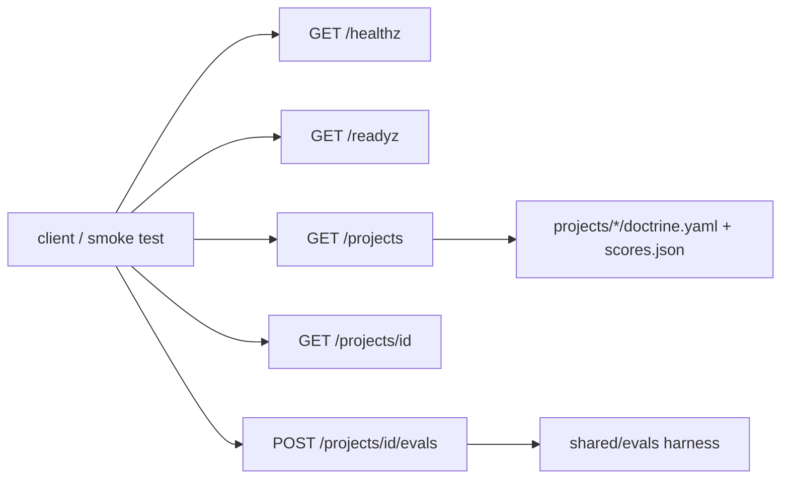

# Portfolio API (`shared/api/`)

A small FastAPI app that makes the portfolio runnable as one service: health, project catalog, cards and an eval run. It is what the container image and the Azure deployment run.

**Sections:** [1. Purpose](#1-purpose) · [2. Architecture](#2-architecture) · [3. How it works](#3-how-it-works) · [4. Key files](#4-key-files) · [5. Code excerpts](#5-code-excerpts) · [6. Configuration](#6-configuration) · [7. Commands](#7-commands) · [8. Real output](#8-real-output) · [9. Tests and eval gates](#9-tests-and-eval-gates) · [10. Guardrails](#10-guardrails) · [11. Security and governance](#11-security-and-governance) · [12. Observability](#12-observability) · [13. Failure modes](#13-failure-modes) · [14. Mapping to Azure services](#14-mapping-to-azure-services) · [15. Limitations](#15-limitations) · [16. Interview talking points](#16-interview-talking-points) · [17. Adopt this](#17-adopt-this)

## 1. Purpose

Give the infrastructure something real to host and smoke-test: list projects, read their doctrine cards and checked-in scores, and rerun a golden set on demand, always on the mock model unless live mode is explicitly allowed.

## 2. Architecture



## 3. How it works

1. `create_app()` builds the FastAPI app (run with `uvicorn --factory`).
2. `/healthz` touches nothing; `/readyz` loads every card and reports the provider.
3. `/projects` and `/projects/{id}` read `doctrine.yaml` and `evals/scores.json` (id is the folder name or its number).
4. `POST /projects/{id}/evals` runs that project's golden set through the eval harness and returns metrics.
5. Live models are used only when `PORTFOLIO_ALLOW_LIVE=1` and `LLM_PROVIDER` are set.

## 4. Key files

| File | What it holds |
|---|---|
| `shared/api/app.py` | the app and routes |
| `Dockerfile` | image (uv, non-root) |
| `shared/tests/test_api.py` | endpoint tests |

## 5. Code excerpts

<!-- code: shared/api/app.py::_live_allowed -->
```python
def _live_allowed() -> bool:
    return os.environ.get("PORTFOLIO_ALLOW_LIVE") == "1"
```
<!-- /code -->

<!-- code: shared/api/app.py::_summary -->
```python
def _summary(d: Path) -> dict[str, Any]:
    card = load_card(d / "doctrine.yaml")
    return {
        "project": card.project,
        "title": card.title,
        "industry": card.industry,
        "maturity": card.maturity.level,
    }
```
<!-- /code -->

## 6. Configuration

| Variable | Effect |
|---|---|
| `PORTFOLIO_ALLOW_LIVE` | `1` allows a real model; anything else forces the mock |
| `LLM_PROVIDER` | provider when live is allowed |
| `APPLICATIONINSIGHTS_CONNECTION_STRING` | set by the infrastructure |

## 7. Commands

```bash
uvicorn shared.api.app:create_app --factory --port 8000
curl -s localhost:8000/projects | head
python scripts/component_demos.py api
```

## 8. Real output

<!-- output: python scripts/component_demos.py api -->
```text
GET /healthz -> {'status': 'ok'}
GET /readyz  -> {'status': 'ready', 'projects': 21, 'llm_provider': 'mock'}
GET /projects -> 21 projects, first: 01-policy-qa-rag (L4)
POST /projects/03/evals -> {"project": "03-refund-agent", "passed": true} 1.0
```
<!-- /output -->

## 9. Tests and eval gates

<!-- output: python -m pytest shared/tests/test_api.py -vv -p no:cacheprovider | grep -E 'PASSED|FAILED|SKIPPED' | sed -E 's/ +\[ *[0-9]+%\]//' -->
```text
shared/tests/test_api.py::test_health_and_readiness PASSED
shared/tests/test_api.py::test_catalog_lists_every_project PASSED
shared/tests/test_api.py::test_project_lookup_by_name_or_number PASSED
shared/tests/test_api.py::test_eval_run_returns_metrics PASSED
shared/tests/test_api.py::test_eval_limit_is_validated PASSED
```
<!-- /output -->

The infra workflow builds the image and smoke-tests `/healthz`, `/readyz` and `/projects` in a container.

## 10. Guardrails

- Mock by default, so a deployed instance cannot spend model quota by accident.
- Read-only except the eval run, which uses mock services.

## 11. Security and governance

- Runs as a non-root user in the image.
- No secrets: identity comes from the Container App's managed identity.

## 12. Observability

Health and readiness endpoints for Container Apps probes; traces from eval runs go to Application Insights when the connection string is set.

## 13. Failure modes

| Failure | Response |
|---|---|
| unknown project | 404 |
| card fails to load | `/readyz` not ready |
| eval regression | `passed: false` with violations |

## 14. Mapping to Azure services

| Piece | Azure service |
|---|---|
| hosting | Azure Container Apps (scale to zero in dev) |
| image | Azure Container Registry (Basic) |
| logs and traces | Log Analytics + Application Insights |

## 15. Limitations

- No authentication on the API; it would sit behind Container Apps ingress auth or API Management.
- Eval runs are synchronous.

## 16. Interview talking points

- A tiny real service makes the deploy pipeline testable end to end.
- The live-model switch is a deliberate two-key design.

## 17. Adopt this

1. Copy `shared/api/app.py` and point `_find` at your agents folder.
2. Keep the mock default and the explicit live switch.
3. Add auth (Entra ID through Container Apps ingress authentication or API Management) before exposing it.
4. Extend it with routes for your own agents; keep `/healthz` dependency-free so platform probes never call a model.
