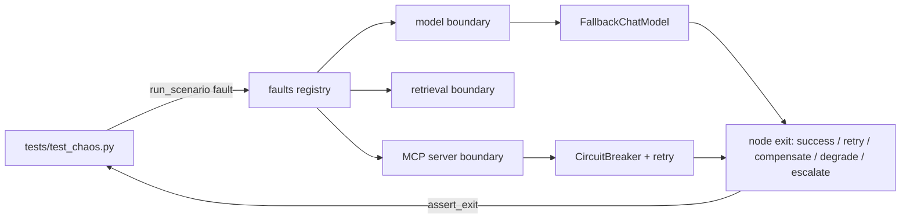

# Resilience and chaos testing (`shared/resilience.py`, `faults.py`, `chaos.py`)

Retry with backoff, circuit breakers, the model fallback chain, the five-exit policy and the fault registry that chaos tests use.

**Sections:** [1. Purpose](#1-purpose) · [2. Architecture](#2-architecture) · [3. How it works](#3-how-it-works) · [4. Key files](#4-key-files) · [5. Code excerpts](#5-code-excerpts) · [6. Configuration](#6-configuration) · [7. Commands](#7-commands) · [8. Real output](#8-real-output) · [9. Tests and eval gates](#9-tests-and-eval-gates) · [10. Guardrails](#10-guardrails) · [11. Security and governance](#11-security-and-governance) · [12. Observability](#12-observability) · [13. Failure modes](#13-failure-modes) · [14. Mapping to Azure services](#14-mapping-to-azure-services) · [15. Limitations](#15-limitations) · [16. Interview talking points](#16-interview-talking-points) · [17. Adopt this](#17-adopt-this)

## 1. Purpose

Every node has to say how it leaves on every outcome, and tests have to prove it. These modules give the primitives (retry, breaker, fallback) and the fault injection that lets a test kill a model, retrieval or a system of record without monkeypatching.

## 2. Architecture



## 3. How it works

1. `faults.inject(name, times)` marks a dependency as failing (hard or for n checks); `CHAOS_FAULTS` does the same from the shell.
2. Shared components check `faults.active(...)` at their failure boundary and raise the error a real outage would.
3. `retry_call` with `Backoff` retries retryable errors; `CircuitBreaker` opens after a threshold and half-opens after a reset time.
4. `FallbackChatModel` tries the primary then the fallback and raises `ModelUnavailableError` when both fail.
5. Each node records the exit it took; `chaos.assert_exit` checks it matches the doctrine card.

## 4. Key files

| File | What it holds |
|---|---|
| `shared/resilience.py` | `Backoff`, `retry_call`, `CircuitBreaker`, `FallbackChatModel`, `FiveExitPolicy`, `exit_record` |
| `shared/faults.py` | `inject`, `clear`, `active`, `fault` |
| `shared/chaos.py` | `run_scenario`, `assert_exit`, `exits_taken` |
| `projects/*/tests/test_chaos.py` | one test per chaos row in each `doctrine.yaml` |

## 5. Code excerpts

<!-- code: shared/resilience.py::CircuitBreaker -->
```python
@dataclass
class CircuitBreaker:
    name: str
    failure_threshold: int = 3
    reset_after_s: float = 30.0
    clock: Callable[[], float] = time.monotonic
    failures: int = 0
    opened_at: float | None = None
    _lock: threading.Lock = field(default_factory=threading.Lock, repr=False)

    @property
    def state(self) -> str:
        if self.opened_at is None:
            return "closed"
        return "half_open" if self.clock() - self.opened_at >= self.reset_after_s else "open"

    def allow(self) -> bool:
        return self.state != "open"

    def success(self) -> None:
        with self._lock:
            self.failures, self.opened_at = 0, None

    def failure(self) -> None:
        with self._lock:
            self.failures += 1
            if self.failures >= self.failure_threshold or self.opened_at is not None:
                self.opened_at = self.clock()

    def call(self, fn: Callable[[], T]) -> T:
        if not self.allow():
            raise CircuitOpenError(f"circuit '{self.name}' is open")
        try:
            out = fn()
        except Exception:
            self.failure()
            raise
        self.success()
        return out
```
<!-- /code -->

<!-- code: shared/chaos.py::run_scenario -->
```python
def run_scenario(fault: str, scenario: Callable[[str], Mapping[str, Any]]) -> Mapping[str, Any]:
    """Inject ``fault`` (e.g. 'model', 'retrieval', 'sor:erp', 'sor:oms*1', 'jailbreak') and
    run ``scenario(fault)``. ``*n`` makes the fault transient (fails n calls). The jailbreak
    fault injects nothing globally: the scenario plants ``JAILBREAK`` in its own input."""
    if fault == "jailbreak":
        return scenario(fault)
    name, _, times = fault.partition("*")
    faults.inject(name, int(times) if times else None)
    try:
        return scenario(fault)
    finally:
        faults.clear(name)
```
<!-- /code -->

## 6. Configuration

| Knob | Effect |
|---|---|
| `CHAOS_FAULTS="sor:payments,model"` | hard faults for a demo run |
| `name*n` | transient fault for n checks |
| `Backoff(attempts, base_s, ...)` | retry policy |
| `CircuitBreaker(failure_threshold, reset_after_s)` | breaker policy |

## 7. Commands

```bash
python scripts/component_demos.py resilience
pytest shared/tests/test_resilience.py projects/*/tests/test_chaos.py
CHAOS_FAULTS=sor:payments python projects/03-refund-agent/run.py
```

## 8. Real output

<!-- output: python scripts/component_demos.py resilience -->
```text
breaker after 2 failures: open
call while open -> CircuitOpenError (no request sent)
after 30 s: half_open -> probe call returns ok -> closed
model chain, healthy: primary
model chain, primary down: fallback
model chain, all down -> ModelUnavailableError: all model deployments failed: primary: InjectedFault: model:primary unavailable (injected); fallback: InjectedFault: model:fallback unavailable (injected)
```
<!-- /output -->

## 9. Tests and eval gates

<!-- output: python -m pytest shared/tests/test_resilience.py -vv -p no:cacheprovider | grep -E 'PASSED|FAILED|SKIPPED' | sed -E 's/ +\[ *[0-9]+%\]//' -->
```text
shared/tests/test_resilience.py::test_retry_with_backoff_recovers_then_exhausts PASSED
shared/tests/test_resilience.py::test_circuit_breaker_opens_and_half_opens PASSED
shared/tests/test_resilience.py::test_fallback_chain_primary_fallback_then_unavailable PASSED
shared/tests/test_resilience.py::test_breaker_skips_dead_primary_and_bind_tools_keeps_chain PASSED
shared/tests/test_resilience.py::test_five_exit_policy_validation_and_table PASSED
```
<!-- /output -->

Each project's chaos tests are generated from its `doctrine.yaml` chaos table, and the promotion gate checks every chaos node exists in the graph.

## 10. Guardrails

- The fallback chain never fabricates output; it raises.
- Retries only on retryable errors, so a policy refusal is never retried into success.
- Writes retried after a crash are deduplicated by idempotency keys downstream.

## 11. Security and governance

- Chaos coverage is part of the promotion gate, not an optional test suite.
- A jailbreak is modelled as a fault too (`jailbreak`), with an asserted escalate exit.

## 12. Observability

The serving deployment is recorded on `llm` spans (`served_by`), breaker state changes are visible as fast failures, and each node's exit is added to graph state for audit.

## 13. Failure modes

| Scenario | Expected exit |
|---|---|
| model primary down | retry via fallback |
| all models down | degrade (keyword classifier, template reply) |
| retrieval down | degrade with auto-actions disabled |
| system of record down | escalate or queue |
| prompt injection | escalate to a human |

## 14. Mapping to Azure services

| Piece | Azure service |
|---|---|
| fallback deployment | second Azure OpenAI deployment, optionally in a paired region |
| chaos in staging | Azure Chaos Studio for infrastructure faults |
| breaker metrics | Application Insights custom metrics |

## 15. Limitations

- Breaker state is per process.
- Faults are injected at shared boundaries, not at the network layer.

## 16. Interview talking points

- "Five exits per node" makes failure handling reviewable in a table.
- Fault injection at shared boundaries means one mechanism tests 21 projects.

## 17. Adopt this

1. Use `with_fallback` for model calls and `ToolGateway` (which uses the breaker) for tools.
2. Write a five-exit row per node and a chaos row per dependency.
3. Use `run_scenario` and `assert_exit` to test each row.
