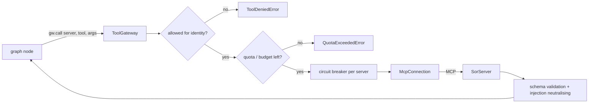

# Tool gateway (`shared/tools/`)

The single door between agents and systems of record: allow-lists per identity, quotas, timeouts, breakers, schema validation and a call log.

**Sections:** [1. Purpose](#1-purpose) · [2. Architecture](#2-architecture) · [3. How it works](#3-how-it-works) · [4. Key files](#4-key-files) · [5. Code excerpts](#5-code-excerpts) · [6. Configuration](#6-configuration) · [7. Commands](#7-commands) · [8. Real output](#8-real-output) · [9. Tests and eval gates](#9-tests-and-eval-gates) · [10. Guardrails](#10-guardrails) · [11. Security and governance](#11-security-and-governance) · [12. Observability](#12-observability) · [13. Failure modes](#13-failure-modes) · [14. Mapping to Azure services](#14-mapping-to-azure-services) · [15. Limitations](#15-limitations) · [16. Interview talking points](#16-interview-talking-points) · [17. Adopt this](#17-adopt-this)

## 1. Purpose

An agent should never hold a connection string or a broad credential. It holds a `ToolGateway` scoped to one identity and a list of allowed tools, and every call is checked, limited, validated and recorded.

## 2. Architecture



## 3. How it works

1. `ToolGateway(agent, identity, connections, allow=...)` is built per agent; `scoped()` derives a narrower one for a sub-agent.
2. `call(server, tool, **args)` checks the allow-list (`server.tool` or `server.*`), per-tool quotas and the total call budget.
3. The call goes through the server's circuit breaker, with a timeout and optional retry for retryable errors.
4. Returned payloads are untrusted: strings are sanitised and, when a schema is registered, validated into a Pydantic model.
5. Errors come back as typed exceptions (`ToolDeniedError`, `QuotaExceededError`, `SystemOfRecordUnavailableError`, `SchemaViolationError`, mapped domain errors).
6. Every call appends a `CallRecord` and emits a span with agent, identity, outcome, attempts and latency.

## 4. Key files

| File | What it holds |
|---|---|
| `shared/tools/gateway.py` | `ToolGateway`, `CallRecord`, typed errors |
| `shared/tools/connection.py` | `McpConnection`: sync MCP client over in-memory, stdio or HTTP transport |
| `shared/tools/harness.py` | `connect_backends()` and adapters wiring |
| `shared/tests/test_mcp_gateway.py`, `test_mcp_http.py` | gateway and transport tests |

## 5. Code excerpts

<!-- code: shared/tools/gateway.py::ToolGateway.call -->
```python
def call(self, server: str, tool: str, **args: Any) -> Any:
    qualified = f"{server}.{tool}"
    t = telemetry()
    parent = t.current_parent()
    ctx = trace.set_span_in_context(parent) if parent else None
    with t.tracer.start_as_current_span(
        f"tool {qualified}",
        context=ctx,
        attributes={
            "tool.name": qualified,
            "agent.name": self.agent,
            "enduser.id": self.identity,
            "tool.dry_run": bool(args.get("dry_run", False)),
        },
    ) as span:
        rec = CallRecord(time.time(), self.agent, self.identity, qualified, dict(args), "ok")
        start = time.perf_counter()
        try:
            return self._call(server, tool, qualified, args, rec)
        except Exception as exc:
            span.record_exception(exc)
            raise
        finally:
            rec.latency_ms = (time.perf_counter() - start) * 1000
            self._record(rec, span)
```
<!-- /code -->

<!-- code: shared/tools/gateway.py::ToolGateway.allowed -->
```python
def allowed(self, qualified: str) -> bool:
    server = qualified.split(".", 1)[0]
    return qualified in self.allow or f"{server}.*" in self.allow
```
<!-- /code -->

## 6. Configuration

| Field | Effect |
|---|---|
| `allow` | set of `server.tool` or `server.*` |
| `quotas` | max calls per tool per run |
| `max_calls` | total budget per run |
| `timeout_s` | per call |
| `retry` | `Backoff` for retryable errors |
| `breaker_threshold`, `breaker_reset_s` | circuit breaker per server |
| `schemas` | Pydantic model per tool for returned payloads |
| `error_types` | map remote error names to local exceptions |

## 7. Commands

```bash
python scripts/component_demos.py gateway
pytest shared/tests/test_mcp_gateway.py shared/tests/test_mcp_http.py
```

## 8. Real output

<!-- output: python scripts/component_demos.py gateway -->
```text
allowed  ticketing.list_tickets -> ['T-1']
refused  ticketing.list_tickets -> QuotaExceededError: quota exhausted for ticketing.list_tickets
refused  ticketing.create_ticket -> ToolDeniedError: triage-agent (mi-triage) may not call ticketing.create_ticket
  call log: triage-agent as mi-triage ticketing.list_tickets -> ok
  call log: triage-agent as mi-triage ticketing.list_tickets -> quota
  call log: triage-agent as mi-triage ticketing.create_ticket -> denied
```
<!-- /output -->

## 9. Tests and eval gates

<!-- output: python -m pytest shared/tests/test_mcp_gateway.py -vv -p no:cacheprovider | grep -E 'PASSED|FAILED|SKIPPED' | sed -E 's/ +\[ *[0-9]+%\]//' -->
```text
shared/tests/test_mcp_gateway.py::test_write_tools_must_be_idempotent_and_dry_run_by_default PASSED
shared/tests/test_mcp_gateway.py::test_read_write_dry_run_and_idempotent_replay PASSED
shared/tests/test_mcp_gateway.py::test_allowlist_quota_typed_errors_schema PASSED
shared/tests/test_mcp_gateway.py::test_untrusted_payload_is_sanitised PASSED
shared/tests/test_mcp_gateway.py::test_transient_sor_fault_retried_then_breaker_opens PASSED
shared/tests/test_mcp_gateway.py::test_langchain_tools_route_through_gateway_and_emit_spans PASSED
shared/tests/test_mcp_gateway.py::test_real_stdio_server_via_langchain_mcp_adapters PASSED
shared/tests/test_mcp_gateway.py::test_connection_rejects_ambiguous_config PASSED
```
<!-- /output -->

Project eval gates report `tool_error_rate` from the gateway's stats.

## 10. Guardrails

- Deny by default: a tool not in the allow-list raises before any request is sent.
- Quotas cap money-moving and write tools per run (for example one refund per order).
- Payloads are validated and sanitised, so a system of record cannot inject instructions.

## 11. Security and governance

- One identity per agent or role, matching a managed identity in Azure.
- The call log is the audit trail of what each identity did.
- Agents never see connection strings; the gateway holds the connections.

## 12. Observability

Each call is a `tool <server>.<tool>` span with `tool.outcome`, `tool.attempts`, `tool.latency_ms` and neutralised-injection counts; `stats()` summarises calls, errors and denials per run.

## 13. Failure modes

| Failure | Typed error | Typical exit |
|---|---|---|
| tool not allowed | `ToolDeniedError` | escalate |
| quota hit | `QuotaExceededError` | stop or escalate |
| server down / breaker open | `SystemOfRecordUnavailableError` | retry, then degrade or escalate |
| timeout | `ToolTimeoutError` | retry |
| bad payload | `SchemaViolationError` | escalate; nothing invented |

## 14. Mapping to Azure services

| Piece | Azure service |
|---|---|
| gateway policy | Azure API Management (MCP server support, rate limits, JWT validation) |
| identities | user-assigned managed identities with Azure RBAC |
| call log | Application Insights + Log Analytics |
| tool servers | Azure Container Apps or Azure Functions |

## 15. Limitations

- Quotas are per run and in memory, not distributed.
- Retries are synchronous.
- The allow-list is code, not a policy service.

## 16. Interview talking points

- The gateway is where least privilege becomes enforceable for agents.
- Treating tool output as untrusted closes the indirect prompt-injection path through systems of record.
- Typed errors turn outages into explicit graph exits.

## 17. Adopt this

1. Wrap each backend as an MCP server (see `docs/components/mcp-servers.md`) or connect over HTTP with `McpConnection`.
2. Create one gateway per agent with the smallest allow-list that works and quotas on writes.
3. Register response schemas for every tool whose payload you branch on.
4. Map your remote error names in `error_types` so nodes can catch domain errors.
