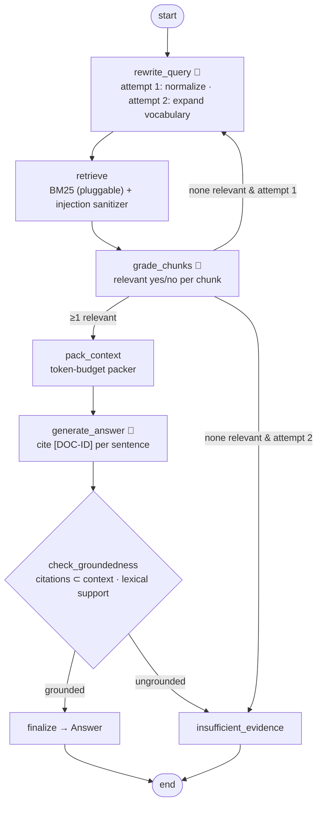

# 01 · Policy Q&A: corrective RAG with citations

> **Status:** ✅ Built. `pytest projects/01-policy-qa-rag` runs 11 offline tests, and `python run.py` runs the demo.

## Business problem

Employees ask HR, IT, and finance the same policy questions over and over: PTO carryover,
remote-work stipends, MFA rules, expense limits. A chatbot that *sounds* right but invents a
number is worse than no chatbot, because people act on it. The business needs answers that:

- come **only** from approved policy text, with a **citation to the exact section**
- say **"I don't know, ask HR"** when the policies don't cover the question
- can't be hijacked by text inside a document (indirect prompt injection)
- stay within a predictable **token and cost budget**

## Graph



The compiled graph exported by LangGraph is in [`graph.mmd`](graph.mmd).

| File | What it holds |
|------|---------------|
| `policy_qa/corpus.py` | 6 policy docs, 16 section-level chunks with stable IDs (`HR-PTO-2`). One chunk contains a planted injection |
| `policy_qa/retriever.py` | `Retriever` protocol: local **BM25**, plus an `EmbeddingRetriever` that accepts any `embed()` (offline hashing embedder included) |
| `policy_qa/guards.py` | Injection **sanitizer**, **token-budget packer**, **groundedness** check |
| `policy_qa/llm.py` | Prompts for rewrite, grade, and answer, plus a deterministic mock (extractive answers) |
| `policy_qa/graph.py` | StateGraph and the `Answer` output schema |

Output (`Answer`): `status` (answered | insufficient_evidence), `answer`, `citations[{id, doc, section}]`,
`attempts`, `queries`, `grounded`, `flagged_injections`, and `reason`.

## Design decisions

- **Corrective RAG instead of single-shot RAG.** A grader decides whether the retrieved chunks
  actually answer the question. If none do, the query is rewritten *once* with expanded policy
  vocabulary (for example "wfh wifi" becomes "remote work, home internet, stipend") and retrieval
  runs again. The retry budget is explicit (`MAX_ATTEMPTS = 2`), so latency and cost are bounded.
- **Refusing is a feature.** With no relevant evidence, the graph never calls the answer model.
  It returns a fixed "contact HR/IT" message. An ungrounded draft is also replaced by that
  fallback instead of being shown.
- **Groundedness check.** Every sentence must cite a chunk that was actually in the packed
  context, and must overlap that chunk lexically. It's cheap and deterministic, and it catches
  invented citations and made-up facts. In production I'd layer an NLI model or LLM judge on
  top and track the fallback rate.
- **Retrieved text is untrusted.** The sanitizer strips instruction-like spans ("ignore previous
  instructions…", `system:`, `<system>` tags) *before* any model sees them. Documents are also
  wrapped in `<document>` delimiters, and the prompt declares them to be data. Flagged spans are
  surfaced in the output for the content owners to fix.
- **Token-budget packer.** Chunks are packed greedily by score until the budget is reached (350
  tokens by default), and the last one is truncated if it's worth including. Cost per question
  is bounded no matter how many chunks match.
- **Pluggable retrieval.** BM25 needs no network and handles exact policy terms (like "MFA" or
  "Concur") very well. The `Retriever` protocol lets Azure AI Search (hybrid BM25 + vector +
  semantic ranker) or pgvector slot in unchanged.

## How to run

```bash
python projects/01-policy-qa-rag/run.py                          # 4 demo questions
python projects/01-policy-qa-rag/run.py "How long is parental leave?"
pytest projects/01-policy-qa-rag
```

The demo covers four cases:
- a direct answer
- a weak first retrieval that triggers the rewrite and retry
- a source chunk with an injection, which gets sanitized
- a question outside the corpus, which returns insufficient evidence

## Interview talking points

1. **RAG failure modes and the fix for each.** Bad query: rewrite. Irrelevant retrieval: the
   grader plus one bounded retry. Hallucination: citation and groundedness checks. Missing
   knowledge: an explicit refusal. Each one is a node or edge I can test in isolation.
2. **Indirect prompt injection.** Retrieved content is a bigger attack surface than user input.
   The defense has layers: sanitize, delimit, instruct, and verify the output against the
   sources. I'd also track sanitizer hits as a content-quality signal.
3. **Cost control.** Every question gets a fixed retry budget and a token-budget packer. Grading
   could move to a small model or a cross-encoder reranker. You can reason about cost per
   question before launch.
4. **Evaluation.** The tests are a golden set. In production I'd add retrieval metrics
   (recall@k, MRR), faithfulness, answer relevance, and citation accuracy (for example with
   RAGAS or Azure AI Evaluation), and gate deploys on them.
5. **Why BM25 first.** Policy questions are keyword-heavy (MFA, PTO, Concur), and lexical search
   is transparent and free. Embeddings go behind an interface and get added when the evals show
   a recall gap, typically as a hybrid with reranking.
