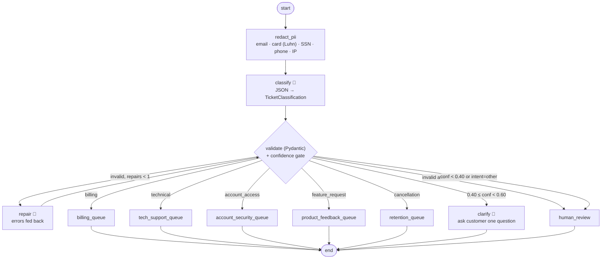

# 02 · Support Ticket Triage: router with a confidence gate

> **Status:** ✅ Built. `pytest projects/02-ticket-triage` runs 15 offline tests, and `python run.py` runs the demo.

## Business problem

A support org gets thousands of tickets a day by email and chat. When a human reads each
ticket just to decide *where it goes*, first response is slow, SLAs get missed, and critical
outages sit in the same queue as feature requests. Automated triage has to:

- classify **intent, urgency, and product** consistently
- route to the right queue with the right SLA, and page on-call for critical issues
- **not guess** when it's unsure: ask the customer a clarifying question, or hand off to a human
- keep **customer PII** (cards, SSNs, emails, phones) away from the LLM provider

## Graph



The compiled graph exported by LangGraph is in [`graph.mmd`](graph.mmd).

| File | What it holds |
|------|---------------|
| `ticket_triage/schema.py` | `TicketClassification` (Literal enums, bounded confidence), queues, SLAs, thresholds, `TriageResult` |
| `ticket_triage/pii.py` | Regex plus Luhn-checksum redaction into placeholders (`[CARD_1]`) |
| `ticket_triage/llm.py` | Classify, repair, and clarify prompts, plus a keyword-based deterministic mock |
| `ticket_triage/graph.py` | Router graph, queue-handler factory, repair loop |

## Design decisions

- **Router pattern.** One classification, then conditional edges to specialised handlers. It's
  cheaper and more predictable than an agent loop, because triage is a *decision*, not a task.
  Each queue handler owns its own SLA and acknowledgement text. Critical urgency pages on-call
  whatever the queue.
- **Structured output with a validation-repair loop.** The model must return JSON matching a
  strict Pydantic schema (enums, `0 ≤ confidence ≤ 1`, summary length). If validation fails,
  the *exact validation errors* go back to the model in a repair prompt, **once**. If it fails
  again, the ticket goes to a human. The loop is bounded, and the failure is visible in the
  `reason`. With `with_structured_output` / JSON mode, this becomes the fallback path.
- **The confidence gate has two thresholds.** At ≥ 0.60 the ticket is auto-routed. Between 0.40
  and 0.60 the customer gets one clarifying question, which is cheaper than a human touch.
  Below 0.40, or when the intent is `other`, a human decides. The thresholds are tuned from a
  labelled set (precision per queue versus auto-route rate). In production I'd calibrate
  self-reported confidence against logprobs or agreement between samples.
- **PII redaction before the LLM.** Deterministic regex plus a Luhn checksum, so order numbers
  aren't redacted as cards. Placeholders keep the text readable for classification. The
  placeholder-to-value vault is **never** put in graph state, checkpoints, prompts, or logs.
  In production you'd use Azure AI Language PII or Presidio for names and addresses.

## How to run

```bash
python projects/02-ticket-triage/run.py     # 5 tickets: billing, critical outage, account, clarify, human
pytest projects/02-ticket-triage
```

## Interview talking points

1. **Router vs agent.** Triage is a classification problem with a fixed set of actions, so a
   router gives predictable latency and cost, and it's easy to evaluate per queue. I'd save
   agents for tasks that need open-ended tool use.
2. **Reliable structured output.** Schema-first design: Literal enums, bounds, and one repair
   pass fed with real validation errors, then escalation. I'd track the repair rate and
   escalation rate as model-quality metrics.
3. **Confidence is a product decision.** The two thresholds trade automation rate against
   misroutes. I'd tune them on a labelled set, watch per-queue precision, and use clarifying
   questions as the cheap middle path.
4. **Privacy by design.** PII is stripped before the model boundary, the reversible mapping
   never gets persisted, and a test asserts that no raw PII reaches any prompt. That test is
   what a security review wants to see.
5. **Operational metrics.** Auto-route rate, misroute rate (from agent re-queues), time to first
   response, clarify-to-resolution conversion, and pages per week. Misroutes feed back into
   the eval set.

## Project structure

| Path | What it is |
|---|---|
| [`ticket_triage/`](ticket_triage/README.md) | The importable package (graph, prompts and mock model, domain logic, eval suite, demo CLI), with a file-by-file map. |
| [`tests/`](tests/README.md) | Pytest suite (15 tests), including chaos tests generated from `doctrine.yaml`. |
| [`evals/`](evals/README.md) | Golden set (12 cases) and the latest `scores.json`. |
| [`run.py`](run.py) | Demo entry point: `python projects/02-ticket-triage/run.py` (adds the package and repo root to `sys.path`). |
| [`doctrine.yaml`](doctrine.yaml) | Machine-checked doctrine card: planes, systems of record, corpus and ACL, stop conditions, five-exit table, chaos scenarios, eval thresholds, KPIs. |
| [`DOCTRINE.md`](DOCTRINE.md) | Generated from the card and `evals/scores.json` by `python -m shared.doctrine render`; do not edit by hand. |
| [`graph.mmd`](graph.mmd) | Mermaid diagram of the compiled graph (regenerate with `run.py --mermaid`). |

Shared platform code (context builder, tool gateway, MCP kit, resilience, evals, doctrine) lives in
[`shared/`](../../shared/README.md).

## Doctrine compliance

This agent meets the portfolio's production-readiness doctrine. The full card is in
[`DOCTRINE.md`](DOCTRINE.md), generated from [`doctrine.yaml`](doctrine.yaml).

What the doctrine upgrade changed:

- **Service desk behind MCP.** Routed tickets are now written to the service desk through the
  ticketing MCP server (`ticketing.create_ticket`), via a `ToolGateway`. The gateway runs as
  identity `mi-ticket-triage` with a one-tool allowlist and validates the payload schema.
  Writes are idempotent on `triage:<ticket id>`, and only redacted text is ever sent.
- **Untrusted ticket text.** On top of PII redaction, the ticket is sanitised for injected
  instructions. A suspected injection escalates to human review; it is never auto-routed.
- **Fallback model.** If every model deployment is down, the ticket goes to the human
  queue. The graph never guesses a route. If ticketing is down, the ticket is queued in an
  outbox for replay and the customer still gets the acknowledgement.
- **Tracing.** OTel spans, and every non-happy exit is recorded in `state["exits"]`.

```bash
python -m evals --project 02
pytest projects/02-ticket-triage/tests/test_chaos.py
```
