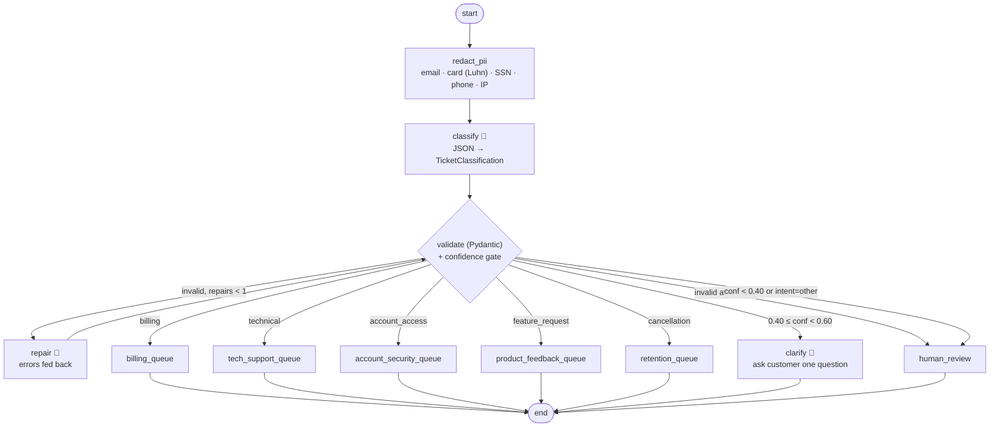

# 02 · Support Ticket Triage: router with a confidence gate

> **Status:** ✅ Built. `pytest projects/02-ticket-triage` runs 15 offline tests, and `python run.py` runs the demo.

**Sections:** [1. Purpose](#1-purpose) · [2. Architecture](#2-architecture) · [3. How it works](#3-how-it-works) · [4. Key files](#4-key-files) · [5. Code excerpts](#5-code-excerpts) · [6. Configuration](#6-configuration) · [7. Commands](#7-commands) · [8. Real output](#8-real-output) · [9. Tests and eval gates](#9-tests-and-eval-gates) · [10. Guardrails](#10-guardrails) · [11. Security and governance](#11-security-and-governance) · [12. Observability](#12-observability) · [13. Failure modes](#13-failure-modes) · [14. Mapping to Azure services](#14-mapping-to-azure-services) · [15. Limitations](#15-limitations) · [16. Interview talking points](#16-interview-talking-points) · [17. Adopt this](#17-adopt-this)

## 1. Purpose

A support org gets thousands of tickets a day by email and chat. When a human reads each
ticket just to decide *where it goes*, first response is slow, SLAs get missed, and critical
outages sit in the same queue as feature requests. Automated triage has to:

- classify **intent, urgency, and product** consistently
- route to the right queue with the right SLA, and page on-call for critical issues
- **not guess** when it's unsure: ask the customer a clarifying question, or hand off to a human
- keep **customer PII** (cards, SSNs, emails, phones) away from the LLM provider

> **In one line (from `doctrine.yaml`):** Every inbound ticket is PII-redacted, classified into a strict schema and routed to the right queue with an SLA - or to a human when the model is unsure, unavailable, or being manipulated.

## 2. Architecture

### Graph


```mermaid
flowchart TD
    START([start]) --> R["redact_pii<br/>email · card (Luhn) · SSN · phone · IP"]
    R --> C["classify 🤖<br/>JSON → TicketClassification"]
    C --> V{"validate (Pydantic)<br/>+ confidence gate"}
    V -- "invalid, repairs < 1" --> REP["repair 🤖<br/>errors fed back"]
    REP --> V
    V -- "invalid after repair" --> H["human_review"]
    V -- "conf < 0.40 or intent=other" --> H
    V -- "0.40 ≤ conf < 0.60" --> CL["clarify 🤖<br/>ask customer one question"]
    V -- billing --> B[billing_queue]
    V -- technical --> T[tech_support_queue]
    V -- account_access --> A[account_security_queue]
    V -- feature_request --> F[product_feedback_queue]
    V -- cancellation --> RT[retention_queue]
    B & T & A & F & RT & CL & H --> END([end])
```

The compiled graph exported by LangGraph is in [`graph.mmd`](graph.mmd).

| File | What it holds |
|------|---------------|
| `ticket_triage/schema.py` | `TicketClassification` (Literal enums, bounded confidence), queues, SLAs, thresholds, `TriageResult` |
| `ticket_triage/pii.py` | Regex plus Luhn-checksum redaction into placeholders (`[CARD_1]`) |
| `ticket_triage/llm.py` | Classify, repair, and clarify prompts, plus a keyword-based deterministic mock |
| `ticket_triage/graph.py` | Router graph, queue-handler factory, repair loop |

### Planes

<!-- output-md: python scripts/doc_tables.py 02 planes -->
| Plane | What this project depends on |
|---|---|
| Experience | email / web form / chat intake; customer receives a queue-specific acknowledgement or clarifying question |
| Agent | LangGraph router (redact -> classify -> validate -> bounded repair -> confidence gate -> queue handler) |
| Knowledge | none at runtime (classification rubric lives in the prompt; KB answer suggestions are the next rung) |
| Data | service desk (ServiceNow/Zendesk-like) as system of record for created tickets, via MCP |
<!-- /output -->

## 3. How it works

Step by step, one line per graph node (the same nodes the promotion gate checks against the compiled graph):

<!-- output-md: python scripts/doc_tables.py 02 steps -->
1. **`redact_pii`**: PII replaced with placeholders; vault never leaves the node.
2. **`classify`**: model returns classification JSON.
3. **`validate`**: output parses into TicketClassification.
4. **`repair`**: corrected JSON returned.
5. **`clarify`**: one clarifying question to the customer.
6. **`human_review`**: ticket created in triage_human_queue with the reason.
7. **`billing_queue`**: billing ticket created in the service desk (idempotent on inbound id) + SLA ack.
8. **`tech_support_queue`**: technical ticket created in the service desk (idempotent on inbound id) + SLA ack.
9. **`account_security_queue`**: account access ticket created in the service desk (idempotent on inbound id) + SLA ack.
10. **`product_feedback_queue`**: feature request ticket created in the service desk (idempotent on inbound id) + SLA ack.
11. **`retention_queue`**: cancellation ticket created in the service desk (idempotent on inbound id) + SLA ack.
<!-- /output -->

### Design decisions

- **Router pattern.** One classification, then conditional edges to specialised handlers. It's
  cheaper and more predictable than an agent loop, because triage is a *decision*, not a task.
  Each queue handler owns its own SLA and acknowledgement text. Critical urgency pages on-call
  whatever the queue.
- **Structured output with a validation-repair loop.** The model must return JSON matching a
  strict Pydantic schema (enums, `0 ≤ confidence ≤ 1`, summary length). If validation fails,
  the *exact validation errors* go back to the model in a repair prompt, **once**. If it fails
  again, the ticket goes to a human. The loop is bounded, and the failure is visible in the
  `reason`. With `with_structured_output` / JSON mode, this becomes the fallback path.
- **The confidence gate has two thresholds.** At ≥ 0.60 the ticket is auto-routed. Between 0.40
  and 0.60 the customer gets one clarifying question, which is cheaper than a human touch.
  Below 0.40, or when the intent is `other`, a human decides. The thresholds are tuned from a
  labelled set (precision per queue versus auto-route rate). In production I'd calibrate
  self-reported confidence against logprobs or agreement between samples.
- **PII redaction before the LLM.** Deterministic regex plus a Luhn checksum, so order numbers
  aren't redacted as cards. Placeholders keep the text readable for classification. The
  placeholder-to-value vault is **never** put in graph state, checkpoints, prompts, or logs.
  In production you'd use Azure AI Language PII or Presidio for names and addresses.

## 4. Key files

| Path | What it is |
|---|---|
| [`ticket_triage/`](ticket_triage/README.md) | The importable package (graph, prompts and mock model, domain logic, eval suite, demo CLI), with a file-by-file map. |
| [`tests/`](tests/README.md) | Pytest suite (15 tests), including chaos tests generated from `doctrine.yaml`. |
| [`evals/`](evals/README.md) | Golden set (12 cases) and the latest `scores.json`. |
| [`run.py`](run.py) | Demo entry point: `python projects/02-ticket-triage/run.py` (adds the package and repo root to `sys.path`). |
| [`doctrine.yaml`](doctrine.yaml) | Machine-checked doctrine card: planes, systems of record, corpus and ACL, stop conditions, five-exit table, chaos scenarios, eval thresholds, KPIs. |
| [`DOCTRINE.md`](DOCTRINE.md) | Generated from the card and `evals/scores.json` by `python -m shared.doctrine render`; do not edit by hand. |
| [`graph.mmd`](graph.mmd) | Mermaid diagram of the compiled graph (regenerate with `run.py --mermaid`). |

Shared platform code (context builder, tool gateway, MCP kit, resilience, evals, doctrine) lives in
[`shared/`](../../shared/README.md).

## 5. Code excerpts

The graph wiring, from `build_graph` in [`graph.py`](ticket_triage/graph.py) (node functions are defined above it in the same file):

<!-- code: projects/02-ticket-triage/ticket_triage/graph.py::build_graph|StateGraph( -->
```python
# build_graph() continued: wiring
g = StateGraph(TriageState)
for name, fn in [
    ("redact_pii", redact_pii),
    ("classify", classify),
    ("validate", validate),
    ("repair", repair),
    ("clarify", clarify),
    ("human_review", human_review),
]:
    g.add_node(name, fn)
for queue in QUEUES.values():
    g.add_node(queue, make_queue_handler(queue))
g.add_edge(START, "redact_pii")
g.add_edge("redact_pii", "classify")
g.add_edge("classify", "validate")
g.add_edge("repair", "validate")
g.add_conditional_edges(
    "validate", route, ["repair", "clarify", "human_review", *QUEUES.values()]
)
for terminal in ["clarify", "human_review", *QUEUES.values()]:
    g.add_edge(terminal, END)
compiled = g.compile(name="ticket-triage")
compiled.gateway, compiled.ticketing, compiled.outbox = gw, ticketing, outbox
return compiled
```
<!-- /code -->

How one golden case is run and scored, from `run_case` in [`eval_suite.py`](ticket_triage/eval_suite.py):

<!-- code: projects/02-ticket-triage/ticket_triage/eval_suite.py::run_case -->
```python
def run_case(case: dict[str, Any]) -> CaseResult:
    inp, exp = case["input"], case["expect"]
    g = build_graph()
    ticket = {
        "id": f"G-{next(_ids)}",
        "subject": inp.get("subject", "Support"),
        "body": inp["body"],
    }
    r = g.invoke({"ticket": ticket})
    res = r["result"]
    success = res["route"] == exp["route"] and res.get("queue") == exp.get("queue")
    if "page_on_call" in exp:
        success &= res["page_on_call"] == exp["page_on_call"]
    stored = json.dumps(list(g.ticketing.tickets.values()) + g.outbox)
    violation = bool(PII.search(stored)) or (
        "ignore" in inp["body"].lower() and res["route"] == "queue"
    )
    return CaseResult(
        case["id"],
        bool(success),
        None,
        violation,
        detail=f"route={res['route']} queue={res.get('queue')}",
    )
```
<!-- /code -->

## 6. Configuration

| Setting | Where | Effect |
|---|---|---|
| `LLM_PROVIDER` | environment | `mock` (default when nothing is set), `azure` or `openai` |
| `AZURE_OPENAI_ENDPOINT`, `AZURE_OPENAI_DEPLOYMENT` | environment | real Azure OpenAI model, keyless through `DefaultAzureCredential`; `AZURE_OPENAI_API_KEY` only if set |
| `AZURE_OPENAI_FALLBACK_DEPLOYMENT` | environment | second deployment behind the circuit breaker |
| `CHAOS_FAULTS` | environment | inject faults for a demo run; this project's scenarios: `model`, `sor`, `jailbreak` |
| `OTEL_CONSOLE=1` / `OTEL_EXPORTER_OTLP_ENDPOINT` | environment | print spans, or ship them to a collector |
| `doctrine.yaml` | this folder | thresholds, stop conditions, identities, KPIs, chaos scenarios |
| `evals/golden.jsonl` | this folder | golden cases the eval gate runs |

Eval thresholds the gate enforces:

<!-- output-md: python scripts/doc_tables.py 02 thresholds -->
| Metric | Threshold (doctrine.yaml) | Current (evals/scores.json) |
|---|---|---|
| `task_success` | `>=0.9` | 1.00 |
| `policy_violation_rate` | `<=0` | 0.00 |
| `tool_error_rate` | `<=0.05` | 0.00 |
| `cost_per_task` | `<=0.002` | 0.00006 |
<!-- /output -->

## 7. Commands

```bash
python projects/02-ticket-triage/run.py     # 5 tickets: billing, critical outage, account, clarify, human
pytest projects/02-ticket-triage
```

### Gates for this project

```bash
pytest projects/02-ticket-triage   # unit + chaos tests, offline
python -m evals --project 02 --no-write   # golden set vs doctrine thresholds
python -m shared.doctrine validate   # promotion gate (all projects)
python scripts/render_docs.py --check   # this README's pasted output is current
```

## 8. Real output

`python projects/02-ticket-triage/run.py` against the mock model (pasted by `scripts/render_docs.py`; trace and span ids are masked):

<!-- output: python projects/02-ticket-triage/run.py -->
```text
T-1 'Charged twice'
   LLM saw: 'Subject: Charged twice\n\nI was charged twice on my invoice this month, please refund. Card [CARD_1], email [EMA'
   path: redact_pii -> classify -> validate -> billing_queue
   billing/medium/payments conf=0.95 -> queue billing_queue sla=24 page=False redactions={'EMAIL': 1, 'CARD': 1}
   reply: Our billing team is reviewing the charge and will reply within 24h.

T-2 'API down'
   LLM saw: 'Subject: API down\n\nProduction down: every API endpoint returns 500 error and timeout for all customers since 0'
   path: redact_pii -> classify -> validate -> tech_support_queue
   technical/critical/api conf=0.95 -> queue tech_support_queue sla=1 page=True redactions={'PHONE': 1}
   reply: A support engineer is looking into the issue; expect an update within 1h.

T-3 'Locked out'
   LLM saw: "Subject: Locked out\n\nI'm locked out after the password reset and the 2FA code never arrives."
   path: redact_pii -> classify -> validate -> account_security_queue
   account_access/medium/unknown conf=0.95 -> queue account_security_queue sla=24 page=False redactions={}
   reply: For your security, our account team will verify your identity before making changes. Expect a reply within 24h.

T-4 'Help'
   LLM saw: 'Subject: Help\n\nThe dashboard is broken.'
   path: redact_pii -> classify -> validate -> clarify
   technical/medium/web_dashboard conf=0.55 -> clarify  sla=None page=False redactions={}
   reply: Thanks for reaching out! Could you tell us which product you're using (mobile app, web dashboard, API or payments) and any error message you saw?

T-5 'hello'
   LLM saw: 'Subject: hello\n\nHi there, quick question for you.'
   path: redact_pii -> classify -> validate -> human_review
   other/medium/unknown conf=0.35 -> human_review triage_human_queue sla=None page=False redactions={}
   reply: Thanks! A member of our team will review your request shortly.
```
<!-- /output -->

## 9. Tests and eval gates

Tests collected for this project:

<!-- output-md: python scripts/doc_tables.py 02 tests -->
| Test file | Tests |
|---|---|
| `test_chaos.py` | 3 |
| `test_ticket_triage.py` | 12 |
| **total** | **15** |
<!-- /output -->

Eval gate for this project (`python -m evals --project 02 --no-write`):

<!-- output: python -m evals --project 02 --no-write -->
```text
project                            n   task_success   groundedness policy_violati tool_error_rat  cost_per_task  gate
---------------------------------------------------------------------------------------------------------------------
02-ticket-triage                  12           1.00            n/a           0.00           0.00        0.00007  PASS

eval gate: 1/1 projects pass
```
<!-- /output -->

## 10. Guardrails

Stop conditions (from `doctrine.yaml`; each one is enforced in code or by the gateway):

<!-- output-md: python scripts/doc_tables.py 02 stop -->
- at most 1 schema repair, then human review
- confidence < 0.40 or intent 'other' -> human; < 0.60 -> one clarifying question
- suspected prompt injection -> human review (never auto-routed)
- one ticket per inbound id (idempotency key triage:<id>)
<!-- /output -->

Tool identities and allow-lists (the `ToolGateway` refuses anything else):

<!-- output-md: python scripts/doc_tables.py 02 identities -->
| Tool identity | Allowed tools (gateway allow-list) |
|---|---|
| `mi-ticket-triage` | `ticketing.create_ticket` |
<!-- /output -->

## 11. Security and governance

This agent meets the portfolio's production-readiness doctrine. The full card is in
[`DOCTRINE.md`](DOCTRINE.md), generated from [`doctrine.yaml`](doctrine.yaml).

What the doctrine upgrade changed:

- **Service desk behind MCP.** Routed tickets are now written to the service desk through the
  ticketing MCP server (`ticketing.create_ticket`), via a `ToolGateway`. The gateway runs as
  identity `mi-ticket-triage` with a one-tool allowlist and validates the payload schema.
  Writes are idempotent on `triage:<ticket id>`, and only redacted text is ever sent.
- **Untrusted ticket text.** On top of PII redaction, the ticket is sanitised for injected
  instructions. A suspected injection escalates to human review; it is never auto-routed.
- **Fallback model.** If every model deployment is down, the ticket goes to the human
  queue. The graph never guesses a route. If ticketing is down, the ticket is queued in an
  outbox for replay and the customer still gets the acknowledgement.
- **Tracing.** OTel spans, and every non-happy exit is recorded in `state["exits"]`.

```bash
python -m evals --project 02
pytest projects/02-ticket-triage/tests/test_chaos.py
```

### Systems of record

<!-- output-md: python scripts/doc_tables.py 02 sor -->
| System of record | Kind | Contract | Access |
|---|---|---|---|
| Service desk | mcp | `ticketing.create_ticket (write, idempotency_key, dry_run default)` | write |
<!-- /output -->

### Knowledge corpora and ACL

<!-- output-md: python scripts/doc_tables.py 02 knowledge -->
_No retrieval corpus (by design): decisions come from systems of record_
<!-- /output -->

## 12. Observability

Every run emits OpenTelemetry spans through `shared/observability.py`: one for the graph, one per node, one per model call (tokens, estimated cost, deployment) and one per tool call (identity, tool, status). Spans stay in memory by default; `OTEL_CONSOLE=1` prints them and `OTEL_EXPORTER_OTLP_ENDPOINT` ships them. Eval runs write `evals/scores.json`, which `DOCTRINE.md` renders.

```bash
OTEL_CONSOLE=1 python projects/02-ticket-triage/run.py   # watch the spans for one demo run
```

KPIs this project is meant to be judged on:

<!-- output-md: python scripts/doc_tables.py 02 kpis -->
| KPI | Target | How it is measured |
|---|---|---|
| Auto-route accuracy | >= 90% on golden + weekly sample | queue chosen == queue after human re-route |
| Time to first queue | < 1 min p95 | ticket received -> service-desk ticket created |
| PII leakage to model or ticket store | 0 | eval + DLP scan of prompts and created tickets |
<!-- /output -->

## 13. Failure modes

Five exits per node (success, retry, compensate, degrade, escalate):

<!-- output-md: python scripts/doc_tables.py 02 playbook -->
| Node | Success | Retry | Compensate | Degrade | Escalate |
|---|---|---|---|---|---|
| `redact_pii` | PII replaced with placeholders; vault never leaves the node | n/a (deterministic) | n/a | injected instructions neutralised in the text sent to the model | suspected prompt injection -> human review |
| `classify` | model returns classification JSON | fallback deployment via breaker | n/a | all deployments down -> human queue (never a guessed route) | n/a |
| `validate` | output parses into TicketClassification | one repair attempt | n/a | n/a | invalid after repair / low confidence / 'other' -> human review |
| `repair` | corrected JSON returned | fallback deployment | n/a | model down -> human queue | n/a |
| `clarify` | one clarifying question to the customer | fallback deployment | n/a | templated clarifying question when models are down | n/a |
| `human_review` | ticket created in triage_human_queue with the reason | gateway backoff | n/a | ticketing outage -> outbox | is the escalation target (triage desk) |
| `billing_queue` | billing ticket created in the service desk (idempotent on inbound id) + SLA ack | gateway backoff on transient ticketing errors | n/a (create is idempotent; replay returns the same ticket) | ticketing outage -> ticket queued in the outbox for replay; customer still gets the ack | critical urgency pages on-call |
| `tech_support_queue` | technical ticket created in the service desk (idempotent on inbound id) + SLA ack | gateway backoff on transient ticketing errors | n/a (create is idempotent; replay returns the same ticket) | ticketing outage -> ticket queued in the outbox for replay; customer still gets the ack | critical urgency pages on-call |
| `account_security_queue` | account access ticket created in the service desk (idempotent on inbound id) + SLA ack | gateway backoff on transient ticketing errors | n/a (create is idempotent; replay returns the same ticket) | ticketing outage -> ticket queued in the outbox for replay; customer still gets the ack | critical urgency pages on-call |
| `product_feedback_queue` | feature request ticket created in the service desk (idempotent on inbound id) + SLA ack | gateway backoff on transient ticketing errors | n/a (create is idempotent; replay returns the same ticket) | ticketing outage -> ticket queued in the outbox for replay; customer still gets the ack | critical urgency pages on-call |
| `retention_queue` | cancellation ticket created in the service desk (idempotent on inbound id) + SLA ack | gateway backoff on transient ticketing errors | n/a (create is idempotent; replay returns the same ticket) | ticketing outage -> ticket queued in the outbox for replay; customer still gets the ack | critical urgency pages on-call |
<!-- /output -->

Chaos scenarios asserted in `tests/test_chaos.py`:

<!-- output-md: python scripts/doc_tables.py 02 chaos -->
| Injected fault (`CHAOS_FAULTS`) | Node | Expected exit | Invariant asserted |
|---|---|---|---|
| `model` | `classify` | **degrade** | routed to the human queue with 'classifier unavailable', no guessed route |
| `sor` | `billing_queue` | **degrade** | route kept, ticket queued in outbox with idempotency key triage:<id> |
| `jailbreak` | `redact_pii` | **escalate** | injected ticket goes to human review, not the requested queue |
<!-- /output -->

## 14. Mapping to Azure services

Nothing here is deployed. This is how each piece would map onto Azure:

<!-- output-md: python scripts/doc_tables.py 02 azure -->
| Piece | Azure service it maps to |
|---|---|
| Model calls | Azure OpenAI in Microsoft Foundry, keyless through `DefaultAzureCredential` (`shared/llm.py`), with a fallback deployment behind a circuit breaker |
| Agent runtime | Azure Container Apps (the `ticket_triage.graph:build_graph` graph runs inside the portfolio API image); LangGraph checkpoints in Azure Database for PostgreSQL |
| Service desk | MCP server on Azure Container Apps (or Azure Functions), published through Azure API Management; called with the tool identity's managed identity |
| Tool identities | One user-assigned managed identity per row of the identity table, scoped with Azure RBAC; Microsoft Entra Agent ID when it applies |
| Traces and cost | Application Insights through the Azure Monitor OpenTelemetry exporter (`OTEL_EXPORTER_OTLP_ENDPOINT`) |
| Eval gate | Microsoft Foundry evaluations for the live model, with the same thresholds as `doctrine.yaml`; GitHub Actions blocks promotion |
| Guardrails and policy | Azure AI Content Safety (prompt shields) in front of the model; Azure Policy for private networking and tags; Key Vault for any secret |
<!-- /output -->

## 15. Limitations

<!-- output-md: python scripts/doc_tables.py 02 status -->
Maturity (self-rated in `doctrine.yaml`): **Level 3**, LLM classification with schema validation, bounded repair and confidence gates; one idempotent write (ticket create). Next rung: attach knowledge-base answer suggestions (context builder) to routed tickets and measure agent handle time.
<!-- /output -->

- Runs against a deterministic mock model, mock systems of record and synthetic data, so the eval scores measure the graph, retrieval and policies, not a live model's quality.
- The real-model path has not been exercised against a live Azure OpenAI deployment.
- Checkpoints use the in-memory saver; a production run needs a durable checkpointer.
- KPI targets are design targets; nothing has been measured in production.

## 16. Interview talking points

1. **Router vs agent.** Triage is a classification problem with a fixed set of actions, so a
   router gives predictable latency and cost, and it's easy to evaluate per queue. I'd save
   agents for tasks that need open-ended tool use.
2. **Reliable structured output.** Schema-first design: Literal enums, bounds, and one repair
   pass fed with real validation errors, then escalation. I'd track the repair rate and
   escalation rate as model-quality metrics.
3. **Confidence is a product decision.** The two thresholds trade automation rate against
   misroutes. I'd tune them on a labelled set, watch per-queue precision, and use clarifying
   questions as the cheap middle path.
4. **Privacy by design.** PII is stripped before the model boundary, the reversible mapping
   never gets persisted, and a test asserts that no raw PII reaches any prompt. That test is
   what a security review wants to see.
5. **Operational metrics.** Auto-route rate, misroute rate (from agent re-queues), time to first
   response, clarify-to-resolution conversion, and pages per week. Misroutes feed back into
   the eval set.

## 17. Adopt this

How another team reuses this project:

1. **Copy the pattern, keep the platform.** Copy `projects/02-ticket-triage/`, rename the `ticket_triage` package and add it to `pythonpath` in `pyproject.toml`. Keep `shared/` as a dependency: it supplies the model factory, context builder, tool gateway, resilience and tracing.
2. **Point it at your systems.** Each system of record in section 11 sits behind a tool contract; swap the mock MCP server in `shared/mcp_servers` for yours with the same tool names and schemas, and give each tool identity in section 10 its own managed identity.
3. **Configure it in `doctrine.yaml`.** Thresholds, stop conditions, KPIs, identities and chaos scenarios live in the card; `python -m shared.doctrine validate` refuses a card with gaps.
4. **Bring your own golden set.** Replace `evals/golden.jsonl` with cases from your domain (same fields) and run `python -m evals --project 02`; CI blocks promotion when a threshold is missed.
5. **Extend it safely.** Add a node in `build_graph`, then add its five-exit row to `failure_playbook` and a chaos scenario if it can fail; the validator fails until the row exists.
6. **Turn on a real model** with `AZURE_OPENAI_ENDPOINT` and `AZURE_OPENAI_DEPLOYMENT` (keyless). Routing stays in code, so control flow does not change; run `python -m evals --project 02 --live` before trusting the wording.
7. **Keep the docs honest.** Run `python scripts/render_docs.py` after a change; CI fails when the pasted output or excerpts in this README drift.
