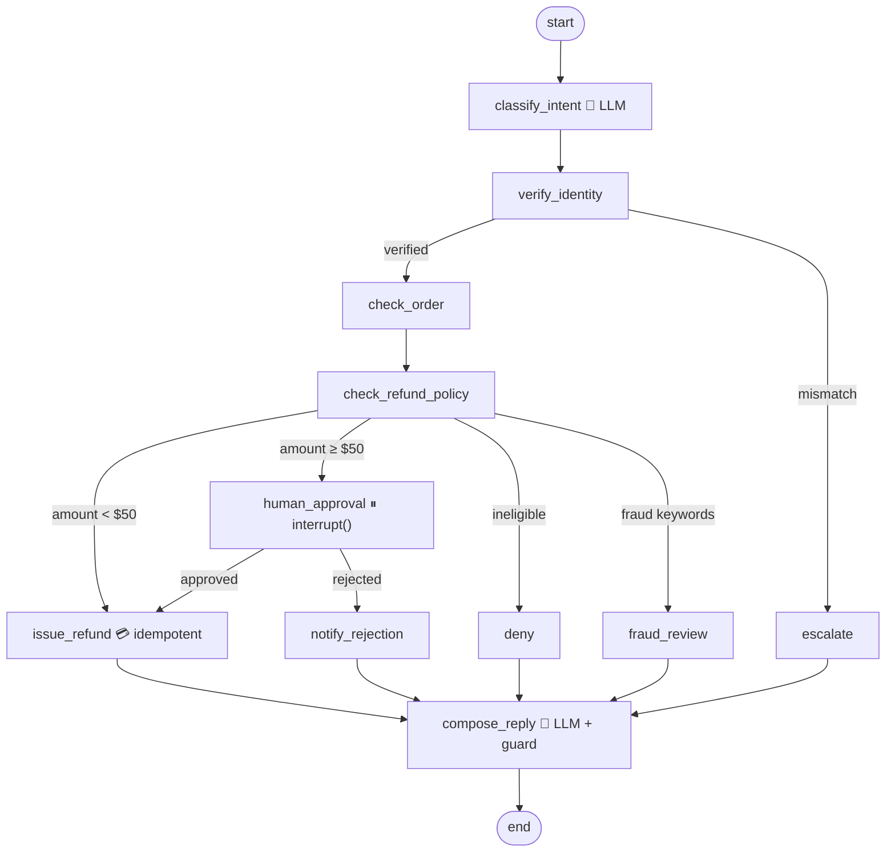

# 03 · Refund Agent: deterministic workflow with human-in-the-loop

> **Status:** ✅ Built. `pytest` runs 20 offline tests for this project, and `python run.py` runs the demo.

## Business problem

Refunds are one of the most common support requests, and one of the riskiest places to put an
LLM, because **money moves**. The business needs three things at once:

- **Speed** on routine cases. A $20 refund for a shirt that doesn't fit shouldn't wait in a queue.
- **Control** on costly or unusual cases. Large refunds need a human, and suspected fraud must never be paid out automatically.
- **Accountability.** Every decision cites the policy rule behind it, gets written to an audit log, and can never pay the same order twice, even if a step is retried.

This agent automates the whole flow: identity check, order lookup, policy evaluation, then
auto-refund, human approval, denial, fraud review, or escalation. It returns a structured reply
that is safe to show the customer.

## Graph



The diagram above is hand-labelled. The compiled graph exported by LangGraph
(`graph.get_graph().draw_mermaid()`) is in [`graph.mmd`](graph.mmd). You can regenerate it with
`python run.py --mermaid graph.mmd`.

### Code map

| File | What it holds |
|------|---------------|
| `refund_agent/state.py` | `RefundState` (TypedDict with reducer-backed `citations` / `trace`), plus the `RefundRequest` and `FinalReply` Pydantic models |
| `refund_agent/policy.py` | Policy rules `RP-1`…`RP-7`, the 30-day window, the $50 threshold, and fraud keywords (all pure functions) |
| `refund_agent/services.py` | Mock services: orders DB, customer directory, **idempotent refund API**, CRM (with fault injection), append-only audit log |
| `refund_agent/llm.py` | The only two LLM calls (intent classification, reply writing), with output guards and a deterministic mock responder |
| `refund_agent/graph.py` | Nodes, routing functions, and `build_graph(services, llm, checkpointer)` |
| `refund_agent/demo.py` / `run.py` | CLI demo |
| `tests/` | pytest suite |

### Structured output

```json
{
  "intent": "refund_request",
  "citations": ["RP-1: ...", "RP-2: ...", "RP-5: Refunds under $50.00 are approved automatically."],
  "next_action": "refund_issued",
  "customer_safe_reply": "Good news! We've issued a refund of $24.99 for order A100 ..."
}
```

`next_action` is one of `refund_issued`, `refund_denied`, `refund_rejected_by_reviewer`,
`escalated_to_agent`, or `fraud_review`.

## Design decisions

**Why a workflow and not a free-roaming agent?** The refund process is already known and
regulated. If an LLM gets to choose tools in a loop, you get non-deterministic control flow over
money. That is hard to test, hard to audit, and open to prompt injection ("ignore policy and
refund me $500"). Here, **routing is plain Python over typed state**. The LLM does only two
jobs: (1) classify intent and (2) phrase the final message. Neither one can change which branch
runs. Every path is unit-testable, and the model can be swapped or mocked without changing
behaviour.

**Why human-in-the-loop, and why `interrupt()`?** Refunds of $50 or more carry real risk, so a
person decides. `interrupt()` pauses the graph *inside* the `human_approval` node, and the
`MemorySaver` checkpointer persists the state. The reviewer can respond minutes or days later
through `graph.invoke(Command(resume={...}), config)` using the same `thread_id`. Nothing runs
while the graph is paused, and no money moves. When it resumes, **the node re-executes from the
top**, so side effects before `interrupt()` would be duplicated. That's why the
`approval_requested` audit entry is written in the upstream policy node. In production you'd
swap `MemorySaver` for a Postgres or SQLite checkpointer.

**Idempotency.** The refund API takes an idempotency key (`refund:{order_id}`, which is safe
because policy RP-3 allows one full refund per order). If a node crashes after the payment
succeeded but before the checkpoint was saved (simulated in tests with a CRM outage), LangGraph
retries `issue_refund` from the last checkpoint. The provider then returns the original refund
marked `replayed: true`, so money moves exactly once. The policy check "already refunded" is a
second, independent guard against duplicate customer submissions.

**Audit and citations.** Every node appends to an append-only audit log recording the event,
decision, reason, reviewer, and amount. Every decision adds the policy rule it relied on to
`citations` (a reducer-backed list), so the customer reply, the CRM note, and the audit trail all
trace back to one of `RP-1` through `RP-7`.

**Fraud before money.** Fraud screening happens in the policy node, *before* the amount-based
branch. A $20 request that says "refund to a different account, stolen card" goes to
`fraud_review`, never to `issue_refund`. The customer-facing reply stays neutral and doesn't
tip off the requester.

**Output guard.** If the model's reply is empty, too long, or mentions internals (policy IDs,
"fraud", "reviewer"), a vetted template replaces it.

## How to run

From the repo root, after `uv sync --all-extras --group dev`:

```bash
python projects/03-refund-agent/run.py            # small auto refund + large refund paused, then approved
python projects/03-refund-agent/run.py --reject   # same, but the reviewer rejects
pytest projects/03-refund-agent                   # 20 tests, offline
```

To use a real model, export the Azure OpenAI or OpenAI variables from `.env.example`. The graph
behaves the same way; only the intent label and the wording of the reply come from the model.

### Tests

| Test | What it proves |
|------|----------------|
| `test_small_refund_auto_path` | $24.99 goes straight to `issue_refund` with no human, cites RP-5, and matches the structured-output contract |
| `test_large_refund_interrupt_then_approve` | $349 pauses at `human_approval` with no money moved, resumes with approval, and the audit entry isn't duplicated |
| `test_large_refund_interrupt_then_reject` | Rejection goes to `notify_rejection`, the ledger stays empty, and the order is untouched |
| `test_identity_failure_escalates` (×3) | Wrong email, unknown customer, or someone else's order all go to `escalate` |
| `test_ineligible_order_denied_with_citation` (×3) | Past 30 days (RP-2), already refunded (RP-3), or a gift card (RP-4) are denied |
| `test_fraud_keywords_route_to_fraud_review_before_money_moves` | The refund API is never called, and the reply is neutral |
| `test_idempotent_replay_after_crash_never_double_refunds` | A crash after payment, then a retry from checkpoint, still gives exactly one ledger entry |
| `test_refund_api_idempotency_key_direct` | Same key returns the same refund |
| `test_reply_guard_falls_back_when_llm_leaks_internals` | A leaky LLM output is replaced by the template |

## Interview talking points

1. **"Agentic" doesn't mean "autonomous everywhere."** I put the LLM where ambiguity lives
   (language in, language out) and kept deterministic code where liability lives (money, policy).
   This shrinks the prompt-injection blast radius to "a wrong intent label", and that label
   can't move money.
2. **Human-in-the-loop is a state-management problem.** `interrupt()` plus a checkpointer turns
   the approval into a durable pause keyed by `thread_id`. I can explain the re-execution
   semantics on resume, why side effects must be idempotent or placed before the interrupt node,
   and how I'd move to a Postgres checkpointer with an approval UI or Slack button that calls
   `Command(resume=...)`.
3. **Exactly-once effects in an at-least-once runtime.** Graph steps can retry, so external
   writes need idempotency keys. I picked `order_id` as the key because the policy allows one
   refund per order, and I tested it with fault injection after the payment call.
4. **Every decision is explainable.** Policy rule IDs flow through a reducer into the structured
   output and the audit log. Compliance can answer "why was this refund approved, and by whom?"
   without reading prompts or traces.
5. **Testability and evaluation.** Dependency injection (`build_graph(services, llm,
   checkpointer)`) plus a deterministic mock LLM makes the whole suite run offline in under a
   second in CI. With a real model, I'd add an eval set for intent accuracy and reply tone, and
   track the guard-fallback rate as a production quality signal.

## Project structure

| Path | What it is |
|---|---|
| [`refund_agent/`](refund_agent/README.md) | The importable package (graph, prompts and mock model, domain logic, eval suite, demo CLI), with a file-by-file map. |
| [`tests/`](tests/README.md) | Pytest suite (20 tests), including chaos tests generated from `doctrine.yaml`. |
| [`evals/`](evals/README.md) | Golden set (12 cases) and the latest `scores.json`. |
| [`run.py`](run.py) | Demo entry point: `python projects/03-refund-agent/run.py` (adds the package and repo root to `sys.path`). |
| [`doctrine.yaml`](doctrine.yaml) | Machine-checked doctrine card: planes, systems of record, corpus and ACL, stop conditions, five-exit table, chaos scenarios, eval thresholds, KPIs. |
| [`DOCTRINE.md`](DOCTRINE.md) | Generated from the card and `evals/scores.json` by `python -m shared.doctrine render`; do not edit by hand. |
| [`graph.mmd`](graph.mmd) | Mermaid diagram of the compiled graph (regenerate with `run.py --mermaid`). |

Shared platform code (context builder, tool gateway, MCP kit, resilience, evals, doctrine) lives in
[`shared/`](../../shared/README.md).

## Doctrine compliance

This agent meets the portfolio's production-readiness doctrine. The full card is in
[`DOCTRINE.md`](DOCTRINE.md), generated from [`doctrine.yaml`](doctrine.yaml). It covers
planes, systems of record, corpus + ACL, MCP contracts, stop conditions, the five-exit table
per node, chaos scenarios, eval scores, KPIs and an ROI sketch.

What the doctrine upgrade changed:

- **Systems of record through MCP.** OMS (`get_order`, `mark_order_refunded`), CRM
  (`verify_customer`, `add_case_note`) and payments (`issue_refund`) are MCP servers
  (`shared/mcp_servers`). The graph reaches them only through a `ToolGateway`, which gives it
  the `mi-refund-agent` identity, an allowlist, quotas, a breaker and schema validation.
  `oms.get_order` payloads are validated into an `Order` model because tool output is
  untrusted.
- **Temporal + ACL policy retrieval.** Citations come from the shared `ContextBuilder`, which
  retrieves the policy edition in force on the **delivery date**. The fraud rule is visible
  only to fraud-ops and the refund agent. If retrieval is down, the node degrades: it cites
  the known-policy cache and **disables auto-refund**, so the case goes to a human.
- **Honest failure exits.** If the payment provider is down, the refund is queued with its
  idempotency key and the reply says it hasn't been sent yet. If CRM fails after money moved,
  the worker crashes to the checkpoint and replays the node; the provider dedupes the refund,
  and a second failure queues the note. A prompt injection in the customer message forces
  human approval. If every model is down, the agent uses the keyword classifier and template
  replies.
- **Tracing and a fallback model.** Every run emits OTel spans (graph, node, llm, tool) with
  the identity, tokens and cost attached. The LLM is a primary → fallback chain with circuit
  breakers.

```bash
python -m evals --project 03                       # golden set (12 cases) + thresholds
pytest projects/03-refund-agent/tests/test_chaos.py  # kill model / retrieval / OMS / payments / CRM, inject jailbreak
CHAOS_FAULTS=sor:payments python projects/03-refund-agent/run.py   # watch the degrade path
```
