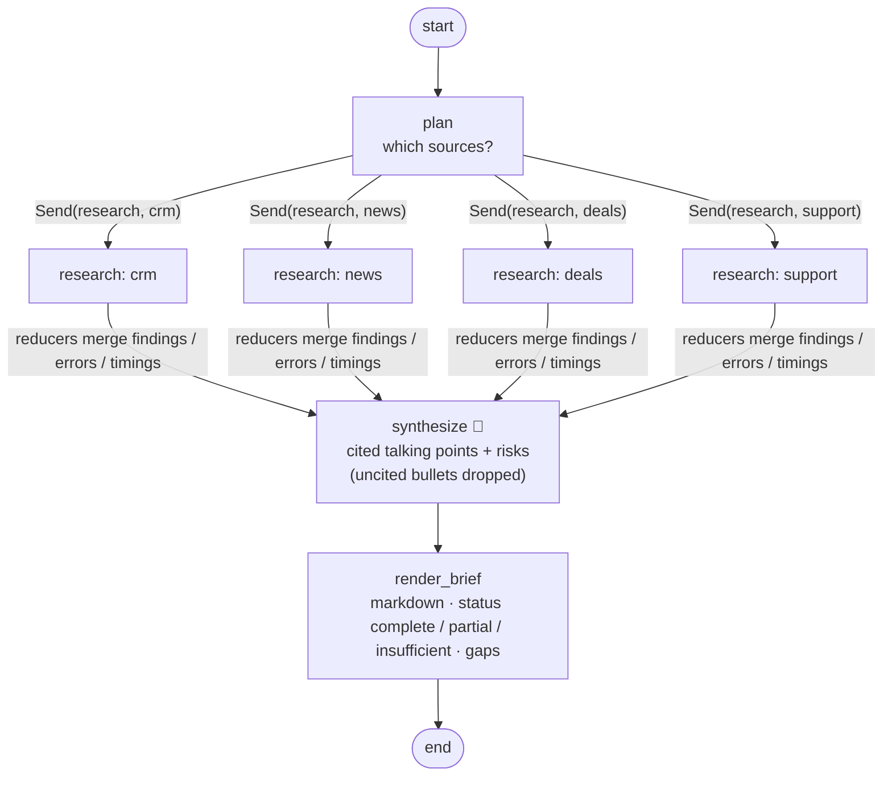

# 04 · Sales Meeting Prep: parallel fan-out / fan-in with `Send`

> **Status:** ✅ Built. `pytest projects/04-sales-meeting-prep` runs 9 offline tests, and `python run.py` runs the demo.

## Business problem

Before every customer call, account executives spend 30–60 minutes clicking through the CRM,
news, the opportunity pipeline, and the support desk to answer: *What happened last time? What
are we trying to close? What's on fire? What should I open with?* Much of that work gets
skipped, and reps walk into a meeting without knowing there's an open P1 ticket.

This graph gathers all four sources **concurrently** and produces a **one-page markdown
brief** with talking points, risks, a deals table, and **a citation for every claim**. If one
source is down, it still delivers a brief and names the gap.

## Graph



The compiled graph exported by LangGraph is in [`graph.mmd`](graph.mmd). It shows a single
`research` node, because `Send` creates its parallel instances at runtime.

| File | What it holds |
|------|---------------|
| `meeting_prep/sources.py` | Mock CRM, news, deals, and support data with source IDs, plus injectable failures, transient errors, and latency |
| `meeting_prep/graph.py` | `plan → Send×N → research → synthesize → render_brief`, reducers, retry, quorum, `Brief` schema |
| `meeting_prep/llm.py` | Synthesizer prompt and deterministic mock |

## Design decisions

- **`Send` rather than hard-coded parallel edges.** The planner decides *at runtime* which
  sources to query (for example, skip news for private companies), and one `research` worker
  node handles each `Send`. All branches run in the same super-step. With four sources at 0.2s
  each, the run takes about 0.2s instead of 0.8s (this is tested).
- **Reducers make concurrent writes safe.** `findings` uses a dict-merge reducer keyed by
  source, and `errors` and `timings` use list concatenation. Without reducers, parallel writes
  to the same key raise `InvalidUpdateError`. The synthesizer is the join: it runs once, after
  every branch finishes.
- **Partial-failure tolerance.** A branch never raises. It returns an error record instead.
  Transient errors (timeouts, connection errors) are retried once, and non-transient ones
  (auth, for example) aren't retried at all. The brief is `complete`, `partial` (with a
  **Gaps** section), or `insufficient_data` when fewer than 2 sources respond. Reps get
  something useful, plus an honest note about what's missing. I didn't use LangGraph's
  `RetryPolicy` here, because it re-raises after the final attempt and would fail the whole
  run.
- **Citations or nothing.** The LLM writes talking points and risks, but any bullet without a
  source ID, or with an ID that isn't in the successful findings, gets dropped and counted
  (`dropped_uncited`). Tables and lists are rendered deterministically from the data, not by
  the LLM.

## How to run

```bash
python projects/04-sales-meeting-prep/run.py               # healthy run (with latency) + news outage
python projects/04-sales-meeting-prep/run.py --fail crm --fail deals
pytest projects/04-sales-meeting-prep
```

## Interview talking points

1. **Map-reduce in LangGraph.** `Send` handles dynamic fan-out, reducers handle the fan-in, and
   the join node runs once per super-step. I can explain super-steps and why parallel writes
   need reducers.
2. **Designing for partial failure.** Every branch returns data or an error record. There's
   retry for transient errors only, a quorum rule, and the gap shows up in the output. It's the
   same thinking as microservice aggregation (bulkheads, graceful degradation).
3. **Latency engineering.** Wall-clock time is set by the slowest source, not the sum of all
   of them. I'd add per-branch timeouts and caching (CRM data is fine for a day) and stream the
   brief as sections complete.
4. **Trust through provenance.** Every talking point cites a record ID. Uncited or invented
   IDs are removed deterministically, and structured sections never go through the LLM.
5. **Production mapping.** Salesforce or Dynamics, a news API, and the support desk each sit
   behind MCP tools or connectors. The graph is triggered from calendar events, and the brief
   is delivered to Teams or Slack 30 minutes before the meeting. I'd measure adoption by AE
   usage and meeting outcomes.
