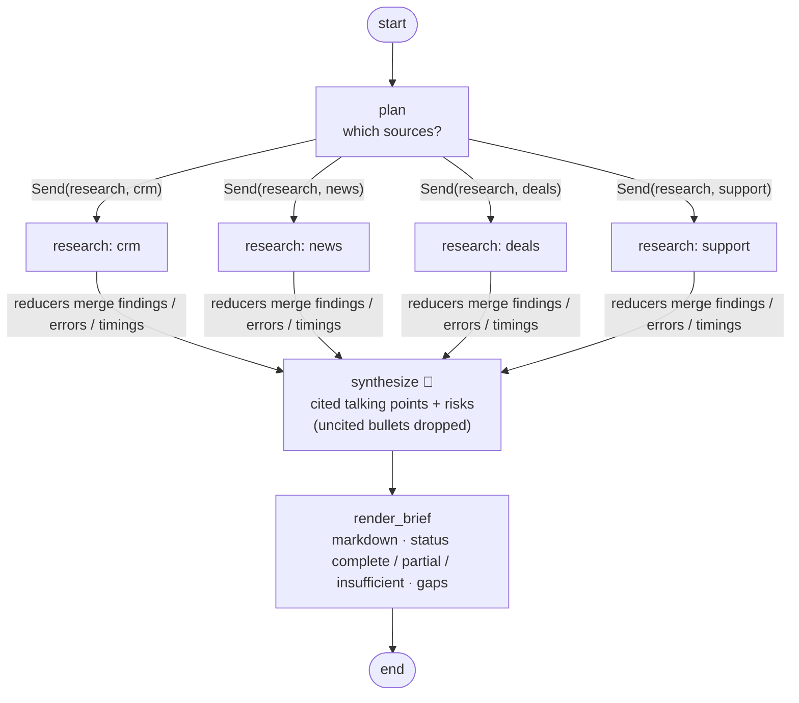

# 04 · Sales Meeting Prep: parallel fan-out / fan-in with `Send`

> **Status:** ✅ Built. `pytest projects/04-sales-meeting-prep` runs 13 offline tests, and `python run.py` runs the demo.

**Sections:** [1. Purpose](#1-purpose) · [2. Architecture](#2-architecture) · [3. How it works](#3-how-it-works) · [4. Key files](#4-key-files) · [5. Code excerpts](#5-code-excerpts) · [6. Configuration](#6-configuration) · [7. Commands](#7-commands) · [8. Real output](#8-real-output) · [9. Tests and eval gates](#9-tests-and-eval-gates) · [10. Guardrails](#10-guardrails) · [11. Security and governance](#11-security-and-governance) · [12. Observability](#12-observability) · [13. Failure modes](#13-failure-modes) · [14. Mapping to Azure services](#14-mapping-to-azure-services) · [15. Limitations](#15-limitations) · [16. Interview talking points](#16-interview-talking-points) · [17. Adopt this](#17-adopt-this)

## 1. Purpose

Before every customer call, account executives spend 30–60 minutes clicking through the CRM,
news, the opportunity pipeline, and the support desk to answer: *What happened last time? What
are we trying to close? What's on fire? What should I open with?* Much of that work gets
skipped, and reps walk into a meeting without knowing there's an open P1 ticket.

This graph gathers all four sources **concurrently** and produces a **one-page markdown
brief** with talking points, risks, a deals table, and **a citation for every claim**. If one
source is down, it still delivers a brief and names the gap.

> **In one line (from `doctrine.yaml`):** Before each customer meeting, the account executive gets a one-page brief compiled in parallel from CRM history, open deals, support health and news. Every bullet cites a record, and any missing source is shown as a gap.

## 2. Architecture

### Graph


```mermaid
flowchart TD
    START([start]) --> PLAN["plan<br/>which sources?"]
    PLAN -- "Send(research, crm)" --> R1["research: crm"]
    PLAN -- "Send(research, news)" --> R2["research: news"]
    PLAN -- "Send(research, deals)" --> R3["research: deals"]
    PLAN -- "Send(research, support)" --> R4["research: support"]
    R1 & R2 & R3 & R4 -- "reducers merge findings / errors / timings" --> SYN["synthesize 🤖<br/>cited talking points + risks<br/>(uncited bullets dropped)"]
    SYN --> BRIEF["render_brief<br/>markdown · status complete / partial / insufficient · gaps"]
    BRIEF --> END([end])
```

The compiled graph exported by LangGraph is in [`graph.mmd`](graph.mmd). It shows a single
`research` node, because `Send` creates its parallel instances at runtime.

| File | What it holds |
|------|---------------|
| `meeting_prep/sources.py` | Mock CRM, news, deals, and support data with source IDs, plus injectable failures, transient errors, and latency |
| `meeting_prep/graph.py` | `plan → Send×N → research → synthesize → render_brief`, reducers, retry, quorum, `Brief` schema |
| `meeting_prep/llm.py` | Synthesizer prompt and deterministic mock |

### Planes

<!-- output-md: python scripts/doc_tables.py 04 planes -->
| Plane | What this project depends on |
|---|---|
| Experience | calendar-triggered brief delivered to Teams/Slack 30 minutes before the meeting (markdown) |
| Agent | LangGraph map-reduce (plan -> Send fan-out research x N -> synthesize -> render_brief) with quorum rule |
| Knowledge | no corpus; findings are live system-of-record reads, cited by record id |
| Data | CRM (interactions, opportunities) and support desk via MCP; public news API direct |
<!-- /output -->

## 3. How it works

Step by step, one line per graph node (the same nodes the promotion gate checks against the compiled graph):

<!-- output-md: python scripts/doc_tables.py 04 steps -->
1. **`plan`**: source list chosen (requested subset or all).
2. **`research`**: items fetched through the gateway (schema-valid, sanitised).
3. **`synthesize`**: cited talking points and risks from successful findings only.
4. **`render_brief`**: complete brief with deterministic tables.
<!-- /output -->

### Design decisions

- **`Send` rather than hard-coded parallel edges.** The planner decides *at runtime* which
  sources to query (for example, skip news for private companies), and one `research` worker
  node handles each `Send`. All branches run in the same super-step. With four sources at 0.2s
  each, the run takes about 0.2s instead of 0.8s (this is tested).
- **Reducers make concurrent writes safe.** `findings` uses a dict-merge reducer keyed by
  source, and `errors` and `timings` use list concatenation. Without reducers, parallel writes
  to the same key raise `InvalidUpdateError`. The synthesizer is the join: it runs once, after
  every branch finishes.
- **Partial-failure tolerance.** A branch never raises. It returns an error record instead.
  Transient errors (timeouts, connection errors) are retried once, and non-transient ones
  (auth, for example) aren't retried at all. The brief is `complete`, `partial` (with a
  **Gaps** section), or `insufficient_data` when fewer than 2 sources respond. Reps get
  something useful, plus an honest note about what's missing. I didn't use LangGraph's
  `RetryPolicy` here, because it re-raises after the final attempt and would fail the whole
  run.
- **Citations or nothing.** The LLM writes talking points and risks, but any bullet without a
  source ID, or with an ID that isn't in the successful findings, gets dropped and counted
  (`dropped_uncited`). Tables and lists are rendered deterministically from the data, not by
  the LLM.

## 4. Key files

| Path | What it is |
|---|---|
| [`meeting_prep/`](meeting_prep/README.md) | The importable package (graph, prompts and mock model, domain logic, eval suite, demo CLI), with a file-by-file map. |
| [`tests/`](tests/README.md) | Pytest suite (13 tests), including chaos tests generated from `doctrine.yaml`. |
| [`evals/`](evals/README.md) | Golden set (12 cases) and the latest `scores.json`. |
| [`run.py`](run.py) | Demo entry point: `python projects/04-sales-meeting-prep/run.py` (adds the package and repo root to `sys.path`). |
| [`doctrine.yaml`](doctrine.yaml) | Machine-checked doctrine card: planes, systems of record, corpus and ACL, stop conditions, five-exit table, chaos scenarios, eval thresholds, KPIs. |
| [`DOCTRINE.md`](DOCTRINE.md) | Generated from the card and `evals/scores.json` by `python -m shared.doctrine render`; do not edit by hand. |
| [`graph.mmd`](graph.mmd) | Mermaid diagram of the compiled graph (regenerate with `run.py --mermaid`). |

Shared platform code (context builder, tool gateway, MCP kit, resilience, evals, doctrine) lives in
[`shared/`](../../shared/README.md).

## 5. Code excerpts

The graph wiring, from `build_graph` in [`graph.py`](meeting_prep/graph.py) (node functions are defined above it in the same file):

<!-- code: projects/04-sales-meeting-prep/meeting_prep/graph.py::build_graph|StateGraph( -->
```python
# build_graph() continued: wiring
g = StateGraph(PrepState)
g.add_node("plan", plan)
g.add_node("research", research, input_schema=ResearchTask)
g.add_node("synthesize", synthesize)
g.add_node("render_brief", render_brief)
g.add_edge(START, "plan")
g.add_conditional_edges("plan", fan_out, ["research"])
g.add_edge("research", "synthesize")  # fan-in: runs once after all research branches
g.add_edge("synthesize", "render_brief")
g.add_edge("render_brief", END)
compiled = g.compile(name="sales-meeting-prep")
compiled.gateway = gw
return compiled
```
<!-- /code -->

How one golden case is run and scored, from `run_case` in [`eval_suite.py`](meeting_prep/eval_suite.py):

<!-- code: projects/04-sales-meeting-prep/meeting_prep/eval_suite.py::run_case -->
```python
def run_case(case: dict[str, Any]) -> CaseResult:
    inp, exp = case["input"], case["expect"]
    sources = seed_sources(
        failures={s: ERRORS[e](f"{e} (eval)") for s, e in inp.get("fail", {}).items()},
        transient=dict(inp.get("transient", {})),
    )
    llm = MockChatModel(responder=_sloppy) if inp.get("llm") == "sloppy" else None
    state = {"account_id": inp.get("account", "ACME"), "account_name": "Acme Corp"}
    if inp.get("sources"):
        state["sources"] = inp["sources"]
    r = build_graph(sources, llm=llm).invoke(state)
    brief = r["brief"]
    bullets = brief["talking_points"] + brief["risks"]
    cited = {i for b in bullets for i in ID_RE.findall(b)}
    ok_ids = {
        i["id"] for f in r["findings"].values() if f["status"] == "ok" for i in f.get("items", [])
    }
    success = (
        brief["status"] == exp["status"]
        and sorted(brief["gaps"]) == sorted(exp.get("gaps", []))
        and set(exp.get("cites", [])) <= cited
    )
    violation = bool(cited - ok_ids)  # a citation to a record we don't have
    grounded = sum(bool(ID_RE.findall(b)) for b in bullets) / len(bullets) if bullets else None
    return CaseResult(
        case["id"],
        success,
        grounded,
        violation,
        detail=f"status={brief['status']} gaps={brief['gaps']} cited={sorted(cited)}",
    )
```
<!-- /code -->

## 6. Configuration

| Setting | Where | Effect |
|---|---|---|
| `LLM_PROVIDER` | environment | `mock` (default when nothing is set), `azure` or `openai` |
| `AZURE_OPENAI_ENDPOINT`, `AZURE_OPENAI_DEPLOYMENT` | environment | real Azure OpenAI model, keyless through `DefaultAzureCredential`; `AZURE_OPENAI_API_KEY` only if set |
| `AZURE_OPENAI_FALLBACK_DEPLOYMENT` | environment | second deployment behind the circuit breaker |
| `CHAOS_FAULTS` | environment | inject faults for a demo run; this project's scenarios: `model`, `sor:crm`, `sor`, `jailbreak` |
| `OTEL_CONSOLE=1` / `OTEL_EXPORTER_OTLP_ENDPOINT` | environment | print spans, or ship them to a collector |
| `doctrine.yaml` | this folder | thresholds, stop conditions, identities, KPIs, chaos scenarios |
| `evals/golden.jsonl` | this folder | golden cases the eval gate runs |

Eval thresholds the gate enforces:

<!-- output-md: python scripts/doc_tables.py 04 thresholds -->
| Metric | Threshold (doctrine.yaml) | Current (evals/scores.json) |
|---|---|---|
| `task_success` | `>=0.9` | 1.00 |
| `groundedness` | `>=0.95` | 1.00 |
| `policy_violation_rate` | `<=0` | 0.00 |
| `cost_per_task` | `<=0.002` | 0.00010 |
<!-- /output -->

## 7. Commands

```bash
python projects/04-sales-meeting-prep/run.py               # healthy run (with latency) + news outage
python projects/04-sales-meeting-prep/run.py --fail crm --fail deals
pytest projects/04-sales-meeting-prep
```

### Gates for this project

```bash
pytest projects/04-sales-meeting-prep   # unit + chaos tests, offline
python -m evals --project 04 --no-write   # golden set vs doctrine thresholds
python -m shared.doctrine validate   # promotion gate (all projects)
python scripts/render_docs.py --check   # this README's pasted output is current
```

## 8. Real output

`python projects/04-sales-meeting-prep/run.py` against the mock model (pasted by `scripts/render_docs.py`; timings are masked because they change per run; trace and span ids are masked):

<!-- output: python projects/04-sales-meeting-prep/run.py | sed -E "s/'ms': [0-9.]+/'ms': <ms>/g" -->
```text
===== all sources healthy (each source sleeps 0.2s) =====
branch timings: [{'source': 'crm', 'ms': <ms>, 'status': 'ok'}, {'source': 'news', 'ms': <ms>, 'status': 'ok'}, {'source': 'deals', 'ms': <ms>, 'status': 'ok'}, {'source': 'support', 'ms': <ms>, 'status': 'ok'}]
# Meeting brief: Acme Corp
**When:** 2026-09-29 10:00 ET · **Attendees:** Dana Ruiz (VP Ops), Raj Patel · **Goal:** Expand analytics to EU and secure the 3-year renewal
**Status:** complete

## Talking points
- Advance 3-year renewal ($420,000, Negotiation), target close 2026-12-15 [DEAL-2]
- Follow up on last touch (email 2026-09-18): Champion Raj Patel flagged competitor Globex pitching their analytics team. [CRM-3]
- Reinforce exec sponsor value: Exec sponsor Dana Ruiz (VP Ops) happy with rollout; wants SSO for all teams. [CRM-1]
- Open with recent news: Acme Corp opens new EU distribution hub in Rotterdam [NEWS-1]

## Risks
- Competitive threat: Champion Raj Patel flagged competitor Globex pitching their analytics team. [CRM-3]
- Open P1 ticket for 6 days: SSO login failures for EU users - acknowledge and share ETA [SUP-1]

## Open deals
| ID | Deal | Amount | Stage | Close |
|---|---|---|---|---|
| DEAL-1 | Analytics add-on (EU) | $180,000 | Proposal | 2026-10-31 |
| DEAL-2 | 3-year renewal | $420,000 | Negotiation | 2026-12-15 |

## Recent interactions
- 2026-09-18 email: Champion Raj Patel flagged competitor Globex pitching their analytics team. [CRM-3]
- 2026-09-03 call: Procurement asked about multi-year pricing; budget cycle closes Oct 31. [CRM-2]
- 2026-08-12 QBR: Exec sponsor Dana Ruiz (VP Ops) happy with rollout; wants SSO for all teams. [CRM-1]

## Support health
- P1 open: SSO login failures for EU users [SUP-1]
- P3 resolved: Export to CSV slow [SUP-2]

## News
- 2026-09-20 Acme Corp opens new EU distribution hub in Rotterdam [NEWS-1](https://news.example.com/acme-eu)
- 2026-09-10 Acme Corp names Lena Ortiz as CIO [NEWS-2](https://news.example.com/acme-cio)

## Sources
Used: crm, news, deals, support.

===== news API down -> partial brief =====
branch timings: [{'source': 'crm', 'ms': <ms>, 'status': 'ok'}, {'source': 'news', 'ms': <ms>, 'status': 'error'}, {'source': 'deals', 'ms': <ms>, 'status': 'ok'}, {'source': 'support', 'ms': <ms>, 'status': 'ok'}]
# Meeting brief: Acme Corp
**When:** 2026-09-29 10:00 ET · **Attendees:** Dana Ruiz (VP Ops), Raj Patel · **Goal:** Expand analytics to EU and secure the 3-year renewal
**Status:** partial (missing: news)

## Talking points
- Advance 3-year renewal ($420,000, Negotiation), target close 2026-12-15 [DEAL-2]
- Follow up on last touch (email 2026-09-18): Champion Raj Patel flagged competitor Globex pitching their analytics team. [CRM-3]
- Reinforce exec sponsor value: Exec sponsor Dana Ruiz (VP Ops) happy with rollout; wants SSO for all teams. [CRM-1]

## Risks
- Competitive threat: Champion Raj Patel flagged competitor Globex pitching their analytics team. [CRM-3]
- Open P1 ticket for 6 days: SSO login failures for EU users - acknowledge and share ETA [SUP-1]

## Open deals
| ID | Deal | Amount | Stage | Close |
|---|---|---|---|---|
| DEAL-1 | Analytics add-on (EU) | $180,000 | Proposal | 2026-10-31 |
| DEAL-2 | 3-year renewal | $420,000 | Negotiation | 2026-12-15 |

## Recent interactions
- 2026-09-18 email: Champion Raj Patel flagged competitor Globex pitching their analytics team. [CRM-3]
- 2026-09-03 call: Procurement asked about multi-year pricing; budget cycle closes Oct 31. [CRM-2]
- 2026-08-12 QBR: Exec sponsor Dana Ruiz (VP Ops) happy with rollout; wants SSO for all teams. [CRM-1]

## Support health
- P1 open: SSO login failures for EU users [SUP-1]
- P3 resolved: Export to CSV slow [SUP-2]

## Gaps
- **news** unavailable: ConnectionError('503 from upstream'). Verify manually.

## Sources
Used: crm, deals, support.
```
<!-- /output -->

## 9. Tests and eval gates

Tests collected for this project:

<!-- output-md: python scripts/doc_tables.py 04 tests -->
| Test file | Tests |
|---|---|
| `test_chaos.py` | 4 |
| `test_meeting_prep.py` | 9 |
| **total** | **13** |
<!-- /output -->

Eval gate for this project (`python -m evals --project 04 --no-write`):

<!-- output: python -m evals --project 04 --no-write -->
```text
project                            n   task_success   groundedness policy_violati tool_error_rat  cost_per_task  gate
---------------------------------------------------------------------------------------------------------------------
04-sales-meeting-prep             12           1.00           1.00           0.00           0.38        0.00010  PASS

eval gate: 1/1 projects pass
```
<!-- /output -->

## 10. Guardrails

Stop conditions (from `doctrine.yaml`; each one is enforced in code or by the gateway):

<!-- output-md: python scripts/doc_tables.py 04 stop -->
- one research branch per source (max 4), one retry for transient errors only
- below 2 successful sources the brief is marked insufficient_data
- uncited or invented-id bullets are dropped deterministically
<!-- /output -->

Tool identities and allow-lists (the `ToolGateway` refuses anything else):

<!-- output-md: python scripts/doc_tables.py 04 identities -->
| Tool identity | Allowed tools (gateway allow-list) |
|---|---|
| `mi-meeting-prep` | `crm.get_interaction_history`, `crm.get_open_deals`, `ticketing.list_tickets` |
<!-- /output -->

## 11. Security and governance

This agent meets the portfolio's production-readiness doctrine. The full card is in
[`DOCTRINE.md`](DOCTRINE.md), generated from [`doctrine.yaml`](doctrine.yaml).

What the doctrine upgrade changed:

- **CRM and support behind MCP.** Interaction history, open deals and tickets are now MCP
  tools (`crm.*`, `ticketing.list_tickets`). They are reached through a read-only
  `ToolGateway` running as identity `mi-meeting-prep`. Payloads are schema-validated and
  sanitised, because CRM notes are untrusted text. News stays a direct public fetcher.
- **Degrade exits.** A system-of-record outage shows up as a gap in the brief
  (`research → degrade`). If every model is down, the synthesizer falls back to rule-based
  bullets that still carry citations. Neutralised injected text is recorded as an exit.
- **Tracing.** OTel spans cover the parallel branches, the model and the tool calls.
- **Tool-error rate.** The golden set deliberately injects source failures, so the tool-error
  rate is reported but not gated.

```bash
python -m evals --project 04
pytest projects/04-sales-meeting-prep/tests/test_chaos.py
```

### Systems of record

<!-- output-md: python scripts/doc_tables.py 04 sor -->
| System of record | Kind | Contract | Access |
|---|---|---|---|
| CRM (Salesforce/Dynamics-like) | mcp | `crm.get_interaction_history, crm.get_open_deals` | read |
| Support desk | mcp | `ticketing.list_tickets` | read |
| News API | api | `public headlines by account (untrusted, cited by URL)` | read |
<!-- /output -->

### Knowledge corpora and ACL

<!-- output-md: python scripts/doc_tables.py 04 knowledge -->
_No retrieval corpus (by design): decisions come from systems of record_
<!-- /output -->

## 12. Observability

Every run emits OpenTelemetry spans through `shared/observability.py`: one for the graph, one per node, one per model call (tokens, estimated cost, deployment) and one per tool call (identity, tool, status). Spans stay in memory by default; `OTEL_CONSOLE=1` prints them and `OTEL_EXPORTER_OTLP_ENDPOINT` ships them. Eval runs write `evals/scores.json`, which `DOCTRINE.md` renders.

```bash
OTEL_CONSOLE=1 python projects/04-sales-meeting-prep/run.py   # watch the spans for one demo run
```

KPIs this project is meant to be judged on:

<!-- output-md: python scripts/doc_tables.py 04 kpis -->
| KPI | Target | How it is measured |
|---|---|---|
| AE prep time | -50% vs baseline (self-reported + calendar gap) | minutes between brief delivery and meeting start spent in CRM |
| Brief adoption | >= 70% of external meetings | briefs opened / meetings with a brief |
| Citation integrity | 100% of bullets cite an existing record | eval groundedness + zero invalid citations |
<!-- /output -->

## 13. Failure modes

Five exits per node (success, retry, compensate, degrade, escalate):

<!-- output-md: python scripts/doc_tables.py 04 playbook -->
| Node | Success | Retry | Compensate | Degrade | Escalate |
|---|---|---|---|---|---|
| `plan` | source list chosen (requested subset or all) | n/a | n/a | n/a | n/a |
| `research` | items fetched through the gateway (schema-valid, sanitised) | one retry for timeouts / SoR unavailable | n/a (read-only) | failed source recorded as a gap; injected text neutralised | n/a (AE sees the gap and verifies manually) |
| `synthesize` | cited talking points and risks from successful findings only | fallback deployment via breaker | n/a | rule-based cited bullets when all models are down | n/a |
| `render_brief` | complete brief with deterministic tables | n/a | n/a | partial brief with gaps section | insufficient_data banner tells the AE to check the CRM directly |
<!-- /output -->

Chaos scenarios asserted in `tests/test_chaos.py`:

<!-- output-md: python scripts/doc_tables.py 04 chaos -->
| Injected fault (`CHAOS_FAULTS`) | Node | Expected exit | Invariant asserted |
|---|---|---|---|
| `model` | `synthesize` | **degrade** | brief still complete with rule-based cited bullets |
| `sor:crm` | `research` | **degrade** | CRM outage -> partial brief listing crm + deals gaps, verify manually |
| `sor` | `research` | **degrade** | all systems of record down -> insufficient_data banner, news only, nothing invented |
| `jailbreak` | `research` | **degrade** | injected CRM note neutralised; no admin text in the brief |
<!-- /output -->

## 14. Mapping to Azure services

Nothing here is deployed. This is how each piece would map onto Azure:

<!-- output-md: python scripts/doc_tables.py 04 azure -->
| Piece | Azure service it maps to |
|---|---|
| Model calls | Azure OpenAI in Microsoft Foundry, keyless through `DefaultAzureCredential` (`shared/llm.py`), with a fallback deployment behind a circuit breaker |
| Agent runtime | Azure Container Apps (the `meeting_prep.graph:build_graph` graph runs inside the portfolio API image); LangGraph checkpoints in Azure Database for PostgreSQL |
| CRM (Salesforce/Dynamics-like) | MCP server on Azure Container Apps (or Azure Functions), published through Azure API Management; called with the tool identity's managed identity |
| Support desk | MCP server on Azure Container Apps (or Azure Functions), published through Azure API Management; called with the tool identity's managed identity |
| News API | REST API fronted by Azure API Management (rate limits, JWT validation), called with a managed identity |
| Tool identities | One user-assigned managed identity per row of the identity table, scoped with Azure RBAC; Microsoft Entra Agent ID when it applies |
| Traces and cost | Application Insights through the Azure Monitor OpenTelemetry exporter (`OTEL_EXPORTER_OTLP_ENDPOINT`) |
| Eval gate | Microsoft Foundry evaluations for the live model, with the same thresholds as `doctrine.yaml`; GitHub Actions blocks promotion |
| Guardrails and policy | Azure AI Content Safety (prompt shields) in front of the model; Azure Policy for private networking and tags; Key Vault for any secret |
<!-- /output -->

## 15. Limitations

<!-- output-md: python scripts/doc_tables.py 04 status -->
Maturity (self-rated in `doctrine.yaml`): **Level 3**, read-only multi-source agent over CRM/support via MCP with citation enforcement; no writes. Next rung: A2A hand-off to a proposal agent + CRM write-back of the meeting plan (HITL) once AE adoption is measured.
<!-- /output -->

- Runs against a deterministic mock model, mock systems of record and synthetic data, so the eval scores measure the graph, retrieval and policies, not a live model's quality.
- The real-model path has not been exercised against a live Azure OpenAI deployment.
- Checkpoints use the in-memory saver; a production run needs a durable checkpointer.
- KPI targets are design targets; nothing has been measured in production.

## 16. Interview talking points

1. **Map-reduce in LangGraph.** `Send` handles dynamic fan-out, reducers handle the fan-in, and
   the join node runs once per super-step. I can explain super-steps and why parallel writes
   need reducers.
2. **Designing for partial failure.** Every branch returns data or an error record. There's
   retry for transient errors only, a quorum rule, and the gap shows up in the output. It's the
   same thinking as microservice aggregation (bulkheads, graceful degradation).
3. **Latency engineering.** Wall-clock time is set by the slowest source, not the sum of all
   of them. I'd add per-branch timeouts and caching (CRM data is fine for a day) and stream the
   brief as sections complete.
4. **Trust through provenance.** Every talking point cites a record ID. Uncited or invented
   IDs are removed deterministically, and structured sections never go through the LLM.
5. **Production mapping.** Salesforce or Dynamics, a news API, and the support desk each sit
   behind MCP tools or connectors. The graph is triggered from calendar events, and the brief
   is delivered to Teams or Slack 30 minutes before the meeting. I'd measure adoption by AE
   usage and meeting outcomes.

## 17. Adopt this

How another team reuses this project:

1. **Copy the pattern, keep the platform.** Copy `projects/04-sales-meeting-prep/`, rename the `meeting_prep` package and add it to `pythonpath` in `pyproject.toml`. Keep `shared/` as a dependency: it supplies the model factory, context builder, tool gateway, resilience and tracing.
2. **Point it at your systems.** Each system of record in section 11 sits behind a tool contract; swap the mock MCP server in `shared/mcp_servers` for yours with the same tool names and schemas, and give each tool identity in section 10 its own managed identity.
3. **Configure it in `doctrine.yaml`.** Thresholds, stop conditions, KPIs, identities and chaos scenarios live in the card; `python -m shared.doctrine validate` refuses a card with gaps.
4. **Bring your own golden set.** Replace `evals/golden.jsonl` with cases from your domain (same fields) and run `python -m evals --project 04`; CI blocks promotion when a threshold is missed.
5. **Extend it safely.** Add a node in `build_graph`, then add its five-exit row to `failure_playbook` and a chaos scenario if it can fail; the validator fails until the row exists.
6. **Turn on a real model** with `AZURE_OPENAI_ENDPOINT` and `AZURE_OPENAI_DEPLOYMENT` (keyless). Routing stays in code, so control flow does not change; run `python -m evals --project 04 --live` before trusting the wording.
7. **Keep the docs honest.** Run `python scripts/render_docs.py` after a change; CI fails when the pasted output or excerpts in this README drift.
