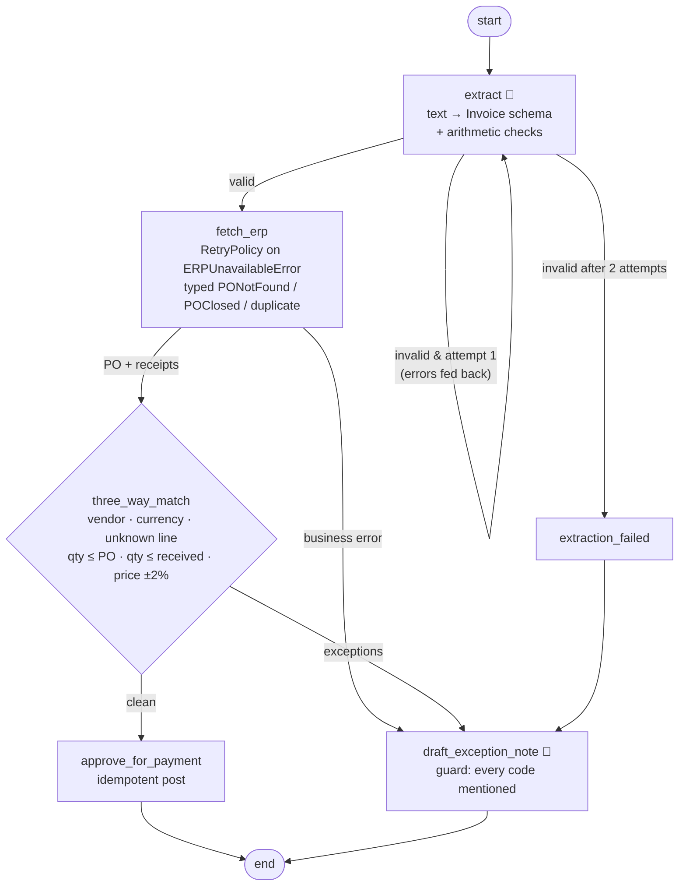

# 05 · Invoice ↔ PO Matching: extraction, three-way match, exceptions

> **Status:** ✅ Built. `pytest projects/05-invoice-po-matching` runs 12 offline tests, and `python run.py` runs the demo.

## Business problem

Accounts payable must check every supplier invoice against the **purchase order** (what we
agreed to buy, and at what price) and the **goods receipt** (what actually arrived) before
paying. This is the *three-way match*. Done by hand, it's slow, and errors cost real money:
overbilling, paying for goods that never arrived, and duplicate payments. The automation has
to:

- extract invoice data reliably from semi-structured text, and **know when it misread something**
- apply clear tolerance rules (price ±2%, no quantity overbilling, including earlier invoices)
- auto-approve clean invoices, and route everything else with a clear **exception note**
- treat ERP outages as *infrastructure* problems, not as invoice exceptions

## Graph



The compiled graph exported by LangGraph is in [`graph.mmd`](graph.mmd).

| File | What it holds |
|------|---------------|
| `invoice_match/invoices.py` | Four text invoices: clean, variance, unknown PO, and a messy layout |
| `invoice_match/schema.py` | `Invoice` / `InvoiceLine` extraction schema, `MatchException` codes, `MatchResult` |
| `invoice_match/erp.py` | Mock ERP: typed errors (`PONotFoundError`, `POClosedError`, transient `ERPUnavailableError`), receipts, invoiced quantity, idempotent posting |
| `invoice_match/matching.py` | Pure arithmetic checks and three-way match rules and tolerances |
| `invoice_match/llm.py` | Extraction and note prompts, plus a regex-based mock "LLM" (strict on attempt 1, careful on attempt 2) |
| `invoice_match/graph.py` | Pipeline graph, retry edge, `RetryPolicy` |

## Design decisions

- **The LLM extracts, code decides.** The model only turns text into a typed `Invoice`. Every
  approve or hold decision comes from pure, unit-tested rules with explicit tolerances, which
  is what auditors and controllers expect.
- **Self-checking extraction with a retry edge.** Beyond schema validation, the document's own
  arithmetic is the check: lines must sum to the subtotal, and subtotal plus tax must equal the
  total. If a check fails, the *specific* failure goes back to the extractor ("sum of lines
  160.00 ≠ subtotal 410.00, a line may be missing"). There are at most 2 attempts, and then
  the invoice gets an `EXTRACTION_FAILED` exception rather than a guess.
- **Typed errors separate business problems from infrastructure problems.**
  `PONotFoundError` and `POClosedError` become business exceptions that a clerk resolves.
  `ERPUnavailableError` is transient, so LangGraph's `RetryPolicy` on `fetch_erp` retries it.
  If the outage persists, the error **propagates** so the job runner redelivers the message
  later. That way an outage never shows up as a pile of bogus exceptions.
- **Cumulative quantity checks and idempotent posting.** Quantity is checked against the PO and
  the receipts *including previously invoiced quantity*, which catches split and double
  billing. Posting is idempotent on the invoice number, and a duplicate submission becomes
  `DUPLICATE_INVOICE`.
- **The exception note is drafted by the LLM and checked.** The note must mention every
  exception code. Otherwise a plain template is used, so a clerk never gets a friendly but
  incomplete summary.

## How to run

```bash
python projects/05-invoice-po-matching/run.py
pytest projects/05-invoice-po-matching
```

The demo covers these cases:
- a clean match
- variances: price +5%, partial receipt, and a line that isn't on the PO
- an unknown PO
- a duplicate submission
- the messy invoice: extraction retry, then the cumulative-quantity check
- a transient ERP 503 that is retried automatically

## Interview talking points

1. **Where the LLM belongs in finance workflows.** Use it for perception (unstructured text to
   schema) and communication (exception notes). Keep the controls deterministic and explainable.
   It's the same principle as project 03, applied to documents.
2. **Validation beyond the schema.** Documents carry their own checksums (line math, totals).
   Using them as a feedback signal for a bounded retry is cheap and very effective. It's the
   extraction equivalent of the critic loop.
3. **Error taxonomy.** Transient errors get retried (`RetryPolicy`), business errors become
   exceptions, and a persistent outage propagates for redelivery. Mixing these up creates
   either silent data loss or alert fatigue.
4. **Controls auditors care about.** Tolerances live in config, cumulative quantity checks,
   duplicate detection, idempotent posting, and every exception carries a code, a SKU, and a
   detail.
5. **Production path.** Azure AI Document Intelligence (prebuilt invoice model) replaces the
   regex mock for PDFs and scans. SAP S/4HANA or Oracle APIs provide POs and GRNs. Exceptions go
   to an AP work queue. Metrics: touchless rate, exception rate by code, and extraction-retry
   rate.

## Doctrine compliance

This agent meets the portfolio's production-readiness doctrine. The full card is in
[`DOCTRINE.md`](DOCTRINE.md), generated from [`doctrine.yaml`](doctrine.yaml).

What the doctrine upgrade changed:

- **ERP behind MCP.** Every ERP read and the `post_invoice` write now go through the ERP MCP
  server, via a `ToolGateway` running as identity `mi-ap-invoice-matcher`.
  - Typed business errors (`PONotFoundError`, `POClosedError`) cross the wire and are re-raised
    as the same types.
  - Outages come back as retryable errors, so the node's `RetryPolicy` behaves as before.
  - The PO payload is schema-validated.
  - `post_invoice` is idempotent on `ap:<invoice no>`.
- **Worker parking.** If the ERP is still down after the retries, `invoice_match.worker.process`
  parks the invoice for redelivery. It is never misfiled as a business exception.
- **Model fallback.** If every model deployment is down, extraction uses the deterministic
  template parser. Schema validation and the three-way match still gate payment. The
  exception note falls back to a template.
- **Untrusted invoice text.** Instruction-like text is neutralised and raises a
  `SUSPICIOUS_CONTENT` exception, so the invoice goes to AP review.
- **Tool-error rate.** The golden set deliberately includes ERP outages and business errors,
  so the tool-error rate is reported but not gated.

```bash
python -m evals --project 05
pytest projects/05-invoice-po-matching/tests/test_chaos.py
```
