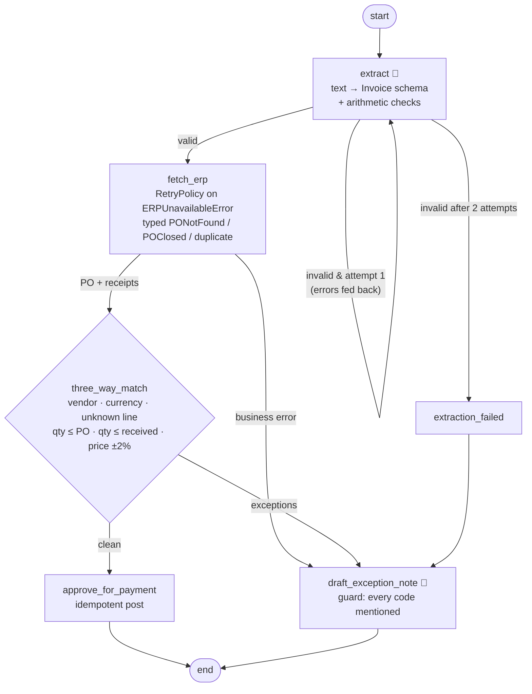

# 05 · Invoice ↔ PO Matching: extraction, three-way match, exceptions

> **Status:** ✅ Built. `pytest projects/05-invoice-po-matching` runs 15 offline tests, and `python run.py` runs the demo.

**Sections:** [1. Purpose](#1-purpose) · [2. Architecture](#2-architecture) · [3. How it works](#3-how-it-works) · [4. Key files](#4-key-files) · [5. Code excerpts](#5-code-excerpts) · [6. Configuration](#6-configuration) · [7. Commands](#7-commands) · [8. Real output](#8-real-output) · [9. Tests and eval gates](#9-tests-and-eval-gates) · [10. Guardrails](#10-guardrails) · [11. Security and governance](#11-security-and-governance) · [12. Observability](#12-observability) · [13. Failure modes](#13-failure-modes) · [14. Mapping to Azure services](#14-mapping-to-azure-services) · [15. Limitations](#15-limitations) · [16. Interview talking points](#16-interview-talking-points) · [17. Adopt this](#17-adopt-this)

## 1. Purpose

Accounts payable must check every supplier invoice against the **purchase order** (what we
agreed to buy, and at what price) and the **goods receipt** (what actually arrived) before
paying. This is the *three-way match*. Done by hand, it's slow, and errors cost real money:
overbilling, paying for goods that never arrived, and duplicate payments. The automation has
to:

- extract invoice data reliably from semi-structured text, and **know when it misread something**
- apply clear tolerance rules (price ±2%, no quantity overbilling, including earlier invoices)
- auto-approve clean invoices, and route everything else with a clear **exception note**
- treat ERP outages as *infrastructure* problems, not as invoice exceptions

> **In one line (from `doctrine.yaml`):** Vendor invoices are extracted into a strict schema and three-way matched against the ERP (PO, goods receipts, invoices already posted). Clean invoices are posted once and only once. Every other invoice goes to the AP exceptions queue with typed reasons and a drafted note.

## 2. Architecture

### Graph


```mermaid
flowchart TD
    START([start]) --> EX["extract 🤖<br/>text → Invoice schema<br/>+ arithmetic checks"]
    EX -- "invalid & attempt 1<br/>(errors fed back)" --> EX
    EX -- "invalid after 2 attempts" --> EF[extraction_failed]
    EX -- valid --> ERP["fetch_erp<br/>RetryPolicy on ERPUnavailableError<br/>typed PONotFound / POClosed / duplicate"]
    ERP -- "business error" --> NOTE
    ERP -- "PO + receipts" --> M{"three_way_match<br/>vendor · currency · unknown line<br/>qty ≤ PO · qty ≤ received · price ±2%"}
    M -- clean --> PAY["approve_for_payment<br/>idempotent post"]
    M -- exceptions --> NOTE["draft_exception_note 🤖<br/>guard: every code mentioned"]
    EF --> NOTE
    PAY --> END([end])
    NOTE --> END
```

The compiled graph exported by LangGraph is in [`graph.mmd`](graph.mmd).

| File | What it holds |
|------|---------------|
| `invoice_match/invoices.py` | Four text invoices: clean, variance, unknown PO, and a messy layout |
| `invoice_match/schema.py` | `Invoice` / `InvoiceLine` extraction schema, `MatchException` codes, `MatchResult` |
| `invoice_match/erp.py` | Mock ERP: typed errors (`PONotFoundError`, `POClosedError`, transient `ERPUnavailableError`), receipts, invoiced quantity, idempotent posting |
| `invoice_match/matching.py` | Pure arithmetic checks and three-way match rules and tolerances |
| `invoice_match/llm.py` | Extraction and note prompts, plus a regex-based mock "LLM" (strict on attempt 1, careful on attempt 2) |
| `invoice_match/graph.py` | Pipeline graph, retry edge, `RetryPolicy` |

### Planes

<!-- output-md: python scripts/doc_tables.py 05 planes -->
| Plane | What this project depends on |
|---|---|
| Experience | AP mailbox / vendor portal intake; AP exceptions queue shows the typed exception list and drafted note |
| Agent | LangGraph pipeline (extract with feedback retry -> fetch_erp with RetryPolicy -> deterministic three-way match -> post or exception note) |
| Knowledge | none at runtime (tolerances and matching rules are code, versioned and tested) |
| Data | ERP purchasing / receiving / AP via MCP (SAP-like), the system of record for POs, receipts and postings |
<!-- /output -->

## 3. How it works

Step by step, one line per graph node (the same nodes the promotion gate checks against the compiled graph):

<!-- output-md: python scripts/doc_tables.py 05 steps -->
1. **`extract`**: schema-valid invoice whose arithmetic checks pass.
2. **`extraction_failed`**: EXTRACTION_FAILED exception recorded.
3. **`fetch_erp`**: PO, receipts and invoiced quantities fetched via MCP (schema-valid).
4. **`three_way_match`**: no variances within tolerance.
5. **`approve_for_payment`**: invoice posted once (idempotency key ap:<invoice no>).
6. **`draft_exception_note`**: note mentions every exception code and a next step.
<!-- /output -->

### Design decisions

- **The LLM extracts, code decides.** The model only turns text into a typed `Invoice`. Every
  approve or hold decision comes from pure, unit-tested rules with explicit tolerances, which
  is what auditors and controllers expect.
- **Self-checking extraction with a retry edge.** Beyond schema validation, the document's own
  arithmetic is the check: lines must sum to the subtotal, and subtotal plus tax must equal the
  total. If a check fails, the *specific* failure goes back to the extractor ("sum of lines
  160.00 ≠ subtotal 410.00, a line may be missing"). There are at most 2 attempts, and then
  the invoice gets an `EXTRACTION_FAILED` exception rather than a guess.
- **Typed errors separate business problems from infrastructure problems.**
  `PONotFoundError` and `POClosedError` become business exceptions that a clerk resolves.
  `ERPUnavailableError` is transient, so LangGraph's `RetryPolicy` on `fetch_erp` retries it.
  If the outage persists, the error **propagates** so the job runner redelivers the message
  later. That way an outage never shows up as a pile of bogus exceptions.
- **Cumulative quantity checks and idempotent posting.** Quantity is checked against the PO and
  the receipts *including previously invoiced quantity*, which catches split and double
  billing. Posting is idempotent on the invoice number, and a duplicate submission becomes
  `DUPLICATE_INVOICE`.
- **The exception note is drafted by the LLM and checked.** The note must mention every
  exception code. Otherwise a plain template is used, so a clerk never gets a friendly but
  incomplete summary.

## 4. Key files

| Path | What it is |
|---|---|
| [`invoice_match/`](invoice_match/README.md) | The importable package (graph, prompts and mock model, domain logic, eval suite, demo CLI), with a file-by-file map. |
| [`tests/`](tests/README.md) | Pytest suite (15 tests), including chaos tests generated from `doctrine.yaml`. |
| [`evals/`](evals/README.md) | Golden set (12 cases) and the latest `scores.json`. |
| [`run.py`](run.py) | Demo entry point: `python projects/05-invoice-po-matching/run.py` (adds the package and repo root to `sys.path`). |
| [`doctrine.yaml`](doctrine.yaml) | Machine-checked doctrine card: planes, systems of record, corpus and ACL, stop conditions, five-exit table, chaos scenarios, eval thresholds, KPIs. |
| [`DOCTRINE.md`](DOCTRINE.md) | Generated from the card and `evals/scores.json` by `python -m shared.doctrine render`; do not edit by hand. |
| [`graph.mmd`](graph.mmd) | Mermaid diagram of the compiled graph (regenerate with `run.py --mermaid`). |

Shared platform code (context builder, tool gateway, MCP kit, resilience, evals, doctrine) lives in
[`shared/`](../../shared/README.md).

## 5. Code excerpts

The graph wiring, from `build_graph` in [`graph.py`](invoice_match/graph.py) (node functions are defined above it in the same file):

<!-- code: projects/05-invoice-po-matching/invoice_match/graph.py::build_graph|StateGraph( -->
```python
# build_graph() continued: wiring
g = StateGraph(InvoiceState)
g.add_node("extract", extract)
g.add_node("extraction_failed", extraction_failed)
g.add_node(
    "fetch_erp",
    fetch_erp,
    retry_policy=RetryPolicy(
        max_attempts=3,
        initial_interval=retry_interval,
        jitter=False,
        retry_on=ERPUnavailableError,
    ),
)
g.add_node("three_way_match", match)
g.add_node("approve_for_payment", approve_for_payment)
g.add_node("draft_exception_note", draft_exception_note)
g.add_edge(START, "extract")
g.add_conditional_edges("extract", after_extract, ["fetch_erp", "extract", "extraction_failed"])
g.add_edge("extraction_failed", "draft_exception_note")
g.add_conditional_edges("fetch_erp", after_fetch, ["three_way_match", "draft_exception_note"])
g.add_conditional_edges(
    "three_way_match", after_match, ["approve_for_payment", "draft_exception_note"]
)
g.add_edge("approve_for_payment", END)
g.add_edge("draft_exception_note", END)
compiled = g.compile(name="invoice-po-matching")
compiled.gateway = gw
return compiled
```
<!-- /code -->

How one golden case is run and scored, from `run_case` in [`eval_suite.py`](invoice_match/eval_suite.py):

<!-- code: projects/05-invoice-po-matching/invoice_match/eval_suite.py::run_case -->
```python
def run_case(case: dict[str, Any]) -> CaseResult:
    inp, exp = case["input"], case["expect"]
    erp = seed_erp()
    graph = build_graph(erp)
    for prior in inp.get("prior", []):
        graph.invoke({"raw_text": INVOICES[prior]})
    posted_before = len(erp.posted)
    erp.unavailable_for = inp.get("erp_unavailable_for", 0)
    r = process(graph, _text(inp))
    res = r["result"]
    codes = sorted({e["code"] for e in res.get("exceptions", [])})
    posted = len(erp.posted) - posted_before
    success = res["status"] == exp["status"] and codes == sorted(exp.get("codes", []))
    # Money moves only on a clean match, exactly once.
    violation = posted != (1 if exp["status"] == "approved" else 0)
    return CaseResult(
        case["id"],
        success,
        None,
        violation,
        detail=f"status={res['status']} codes={codes} posted={posted}",
    )
```
<!-- /code -->

## 6. Configuration

| Setting | Where | Effect |
|---|---|---|
| `LLM_PROVIDER` | environment | `mock` (default when nothing is set), `azure` or `openai` |
| `AZURE_OPENAI_ENDPOINT`, `AZURE_OPENAI_DEPLOYMENT` | environment | real Azure OpenAI model, keyless through `DefaultAzureCredential`; `AZURE_OPENAI_API_KEY` only if set |
| `AZURE_OPENAI_FALLBACK_DEPLOYMENT` | environment | second deployment behind the circuit breaker |
| `CHAOS_FAULTS` | environment | inject faults for a demo run; this project's scenarios: `model`, `sor`, `jailbreak` |
| `OTEL_CONSOLE=1` / `OTEL_EXPORTER_OTLP_ENDPOINT` | environment | print spans, or ship them to a collector |
| `doctrine.yaml` | this folder | thresholds, stop conditions, identities, KPIs, chaos scenarios |
| `evals/golden.jsonl` | this folder | golden cases the eval gate runs |

Eval thresholds the gate enforces:

<!-- output-md: python scripts/doc_tables.py 05 thresholds -->
| Metric | Threshold (doctrine.yaml) | Current (evals/scores.json) |
|---|---|---|
| `task_success` | `>=0.9` | 1.00 |
| `policy_violation_rate` | `<=0` | 0.00 |
| `cost_per_task` | `<=0.002` | 0.00017 |
<!-- /output -->

## 7. Commands

```bash
python projects/05-invoice-po-matching/run.py
pytest projects/05-invoice-po-matching
```

The demo covers these cases:
- a clean match
- variances: price +5%, partial receipt, and a line that isn't on the PO
- an unknown PO
- a duplicate submission
- the messy invoice: extraction retry, then the cumulative-quantity check
- a transient ERP 503 that is retried automatically

### Gates for this project

```bash
pytest projects/05-invoice-po-matching   # unit + chaos tests, offline
python -m evals --project 05 --no-write   # golden set vs doctrine thresholds
python -m shared.doctrine validate   # promotion gate (all projects)
python scripts/render_docs.py --check   # this README's pasted output is current
```

## 8. Real output

`python projects/05-invoice-po-matching/run.py` against the mock model (pasted by `scripts/render_docs.py`; trace and span ids are masked):

<!-- output: python projects/05-invoice-po-matching/run.py -->
```text
=== INV-1001: clean 3-way match ===
   path: extract#1 -> fetch_erp -> three_way_match -> approve_for_payment
   status: approved -> payment_run (payment doc 5100000001)

=== INV-2002: price variance + partial receipt + line not on PO ===
   path: extract#1 -> fetch_erp -> three_way_match -> draft_exception_note
   status: exception -> ap_exceptions_queue
   Invoice INV-2002 (PO PO-5002) is on hold:
   - QTY_EXCEEDS_RECEIPT (MTR-200): billed 10 (incl. prior invoices) > received 8
   - PRICE_VARIANCE (MTR-200): unit price 252.00 vs PO 240.00 (+5.0%, tolerance ±2.0%)
   - UNKNOWN_LINE (FEE-1): FEE-1 (Expedite fee) is not on the PO
   Next step: Ask the vendor for a corrected invoice or credit note for the disputed lines.

=== INV-3003: PO not found (typed ERP error) ===
   path: extract#1 -> fetch_erp -> draft_exception_note
   status: exception -> ap_exceptions_queue
   Invoice INV-3003 (PO PO-7777) is on hold:
   - PO_NOT_FOUND: PO PO-7777 does not exist
   Next step: Ask the requester/buyer for a valid open PO before processing.

=== INV-1001: same invoice re-submitted ===
   path: extract#1 -> fetch_erp -> draft_exception_note
   status: exception -> ap_exceptions_queue
   Invoice INV-1001 (PO PO-5001) is on hold:
   - DUPLICATE_INVOICE: INV-1001 was already posted in AP
   Next step: Reject as a duplicate and notify the vendor; do not pay twice.

=== INV-1005: messy layout: extraction retry, then cumulative qty check vs INV-1001 ===
   path: extract#1 -> extract#2 -> fetch_erp -> three_way_match -> draft_exception_note
   status: exception -> ap_exceptions_queue
   Invoice INV-1005 (PO PO-5001) is on hold:
   - QTY_EXCEEDS_PO (BOLT-10): billed 40 (incl. prior invoices) > ordered 20
   - QTY_EXCEEDS_RECEIPT (BOLT-10): billed 40 (incl. prior invoices) > received 20
   - QTY_EXCEEDS_PO (NUT-10): billed 40 (incl. prior invoices) > ordered 20
   - QTY_EXCEEDS_RECEIPT (NUT-10): billed 40 (incl. prior invoices) > received 20
   Next step: Ask the vendor for a corrected invoice or credit note for the disputed lines.

ERP calls: 5 (includes 1 transient 503 retried automatically)
```
<!-- /output -->

## 9. Tests and eval gates

Tests collected for this project:

<!-- output-md: python scripts/doc_tables.py 05 tests -->
| Test file | Tests |
|---|---|
| `test_chaos.py` | 3 |
| `test_invoice_match.py` | 12 |
| **total** | **15** |
<!-- /output -->

Eval gate for this project (`python -m evals --project 05 --no-write`):

<!-- output: python -m evals --project 05 --no-write -->
```text
project                            n   task_success   groundedness policy_violati tool_error_rat  cost_per_task  gate
---------------------------------------------------------------------------------------------------------------------
05-invoice-po-matching            12           1.00            n/a           0.00           0.14        0.00017  PASS

eval gate: 1/1 projects pass
```
<!-- /output -->

## 10. Guardrails

Stop conditions (from `doctrine.yaml`; each one is enforced in code or by the gateway):

<!-- output-md: python scripts/doc_tables.py 05 stop -->
- at most 2 extraction attempts (second one gets validation feedback)
- fetch_erp retried at most 3 times on outage, then the invoice is parked for redelivery
- post_invoice only after a clean deterministic three-way match, idempotent on invoice number
- any suspicious content or exception -> AP exceptions queue, never auto-approved
<!-- /output -->

Tool identities and allow-lists (the `ToolGateway` refuses anything else):

<!-- output-md: python scripts/doc_tables.py 05 identities -->
| Tool identity | Allowed tools (gateway allow-list) |
|---|---|
| `mi-ap-invoice-matcher` | `erp.get_purchase_order`, `erp.get_goods_receipts`, `erp.get_invoiced_quantities`, `erp.is_invoice_posted`, `erp.post_invoice` |
<!-- /output -->

## 11. Security and governance

This agent meets the portfolio's production-readiness doctrine. The full card is in
[`DOCTRINE.md`](DOCTRINE.md), generated from [`doctrine.yaml`](doctrine.yaml).

What the doctrine upgrade changed:

- **ERP behind MCP.** Every ERP read and the `post_invoice` write now go through the ERP MCP
  server, via a `ToolGateway` running as identity `mi-ap-invoice-matcher`.
  - Typed business errors (`PONotFoundError`, `POClosedError`) cross the wire and are re-raised
    as the same types.
  - Outages come back as retryable errors, so the node's `RetryPolicy` behaves as before.
  - The PO payload is schema-validated.
  - `post_invoice` is idempotent on `ap:<invoice no>`.
- **Worker parking.** If the ERP is still down after the retries, `invoice_match.worker.process`
  parks the invoice for redelivery. It is never misfiled as a business exception.
- **Model fallback.** If every model deployment is down, extraction uses the deterministic
  template parser. Schema validation and the three-way match still gate payment. The
  exception note falls back to a template.
- **Untrusted invoice text.** Instruction-like text is neutralised and raises a
  `SUSPICIOUS_CONTENT` exception, so the invoice goes to AP review.
- **Tool-error rate.** The golden set deliberately includes ERP outages and business errors,
  so the tool-error rate is reported but not gated.

```bash
python -m evals --project 05
pytest projects/05-invoice-po-matching/tests/test_chaos.py
```

### Systems of record

<!-- output-md: python scripts/doc_tables.py 05 sor -->
| System of record | Kind | Contract | Access |
|---|---|---|---|
| ERP (SAP-like purchasing, receiving, AP) | mcp | `erp.get_purchase_order, erp.get_goods_receipts, erp.get_invoiced_quantities, erp.is_invoice_posted, erp.post_invoice` | read_write |
<!-- /output -->

### Knowledge corpora and ACL

<!-- output-md: python scripts/doc_tables.py 05 knowledge -->
_No retrieval corpus (by design): decisions come from systems of record_
<!-- /output -->

## 12. Observability

Every run emits OpenTelemetry spans through `shared/observability.py`: one for the graph, one per node, one per model call (tokens, estimated cost, deployment) and one per tool call (identity, tool, status). Spans stay in memory by default; `OTEL_CONSOLE=1` prints them and `OTEL_EXPORTER_OTLP_ENDPOINT` ships them. Eval runs write `evals/scores.json`, which `DOCTRINE.md` renders.

```bash
OTEL_CONSOLE=1 python projects/05-invoice-po-matching/run.py   # watch the spans for one demo run
```

KPIs this project is meant to be judged on:

<!-- output-md: python scripts/doc_tables.py 05 kpis -->
| KPI | Target | How it is measured |
|---|---|---|
| Touchless rate | >= 60% of PO-backed invoices | approved_for_payment without human touch / all PO invoices |
| Duplicate or over-payment | 0 | post_invoice calls per invoice number; audit sample |
| Exception cycle time | -40% vs baseline | exception queued -> resolved |
<!-- /output -->

## 13. Failure modes

Five exits per node (success, retry, compensate, degrade, escalate):

<!-- output-md: python scripts/doc_tables.py 05 playbook -->
| Node | Success | Retry | Compensate | Degrade | Escalate |
|---|---|---|---|---|---|
| `extract` | schema-valid invoice whose arithmetic checks pass | second attempt with validation feedback; fallback model deployment | n/a | all models down -> deterministic template parser (validation + match still gate payment) | instruction-like text -> SUSPICIOUS_CONTENT exception for AP review |
| `extraction_failed` | EXTRACTION_FAILED exception recorded | n/a | n/a | n/a | manual keying in the AP exceptions queue |
| `fetch_erp` | PO, receipts and invoiced quantities fetched via MCP (schema-valid) | RetryPolicy x3 with backoff on ERP outage; then the worker parks the invoice for redelivery | n/a (read-only) | n/a - never guesses ERP state | PO not found / closed / duplicate -> typed exception to AP |
| `three_way_match` | no variances within tolerance | n/a (deterministic) | n/a | n/a | variances -> typed exceptions |
| `approve_for_payment` | invoice posted once (idempotency key ap:<invoice no>) | replay returns the original document (idempotent) | reversal document by AP if a posted invoice is later disputed (manual, audited) | n/a | n/a |
| `draft_exception_note` | note mentions every exception code and a next step | fallback deployment | n/a | template note when models are down or the draft omits a code | routed to ap_exceptions_queue |
<!-- /output -->

Chaos scenarios asserted in `tests/test_chaos.py`:

<!-- output-md: python scripts/doc_tables.py 05 chaos -->
| Injected fault (`CHAOS_FAULTS`) | Node | Expected exit | Invariant asserted |
|---|---|---|---|
| `model` | `extract` | **degrade** | clean invoice still approved via template parser; posted exactly once |
| `sor` | `fetch_erp` | **retry** | ERP outage retried then parked for redelivery; nothing posted, not misfiled as exception |
| `jailbreak` | `extract` | **escalate** | invoice with injected instruction goes to AP exceptions; nothing posted |
<!-- /output -->

## 14. Mapping to Azure services

Nothing here is deployed. This is how each piece would map onto Azure:

<!-- output-md: python scripts/doc_tables.py 05 azure -->
| Piece | Azure service it maps to |
|---|---|
| Model calls | Azure OpenAI in Microsoft Foundry, keyless through `DefaultAzureCredential` (`shared/llm.py`), with a fallback deployment behind a circuit breaker |
| Agent runtime | Azure Container Apps (the `invoice_match.graph:build_graph` graph runs inside the portfolio API image); LangGraph checkpoints in Azure Database for PostgreSQL |
| ERP (SAP-like purchasing, receiving, AP) | MCP server on Azure Container Apps (or Azure Functions), published through Azure API Management; called with the tool identity's managed identity |
| Tool identities | One user-assigned managed identity per row of the identity table, scoped with Azure RBAC; Microsoft Entra Agent ID when it applies |
| Traces and cost | Application Insights through the Azure Monitor OpenTelemetry exporter (`OTEL_EXPORTER_OTLP_ENDPOINT`) |
| Eval gate | Microsoft Foundry evaluations for the live model, with the same thresholds as `doctrine.yaml`; GitHub Actions blocks promotion |
| Guardrails and policy | Azure AI Content Safety (prompt shields) in front of the model; Azure Policy for private networking and tags; Key Vault for any secret |
<!-- /output -->

## 15. Limitations

<!-- output-md: python scripts/doc_tables.py 05 status -->
Maturity (self-rated in `doctrine.yaml`): **Level 4**, governed ERP reads + one idempotent write behind MCP, deterministic match as the control, typed exceptions. Next rung: vendor-master semantic model + A2A hand-off to a vendor-communication agent for credit-note requests.
<!-- /output -->

- Runs against a deterministic mock model, mock systems of record and synthetic data, so the eval scores measure the graph, retrieval and policies, not a live model's quality.
- The real-model path has not been exercised against a live Azure OpenAI deployment.
- Checkpoints use the in-memory saver; a production run needs a durable checkpointer.
- KPI targets are design targets; nothing has been measured in production.

## 16. Interview talking points

1. **Where the LLM belongs in finance workflows.** Use it for perception (unstructured text to
   schema) and communication (exception notes). Keep the controls deterministic and explainable.
   It's the same principle as project 03, applied to documents.
2. **Validation beyond the schema.** Documents carry their own checksums (line math, totals).
   Using them as a feedback signal for a bounded retry is cheap and very effective. It's the
   extraction equivalent of the critic loop.
3. **Error taxonomy.** Transient errors get retried (`RetryPolicy`), business errors become
   exceptions, and a persistent outage propagates for redelivery. Mixing these up creates
   either silent data loss or alert fatigue.
4. **Controls auditors care about.** Tolerances live in config, cumulative quantity checks,
   duplicate detection, idempotent posting, and every exception carries a code, a SKU, and a
   detail.
5. **Production path.** Azure AI Document Intelligence (prebuilt invoice model) replaces the
   regex mock for PDFs and scans. SAP S/4HANA or Oracle APIs provide POs and GRNs. Exceptions go
   to an AP work queue. Metrics: touchless rate, exception rate by code, and extraction-retry
   rate.

## 17. Adopt this

How another team reuses this project:

1. **Copy the pattern, keep the platform.** Copy `projects/05-invoice-po-matching/`, rename the `invoice_match` package and add it to `pythonpath` in `pyproject.toml`. Keep `shared/` as a dependency: it supplies the model factory, context builder, tool gateway, resilience and tracing.
2. **Point it at your systems.** Each system of record in section 11 sits behind a tool contract; swap the mock MCP server in `shared/mcp_servers` for yours with the same tool names and schemas, and give each tool identity in section 10 its own managed identity.
3. **Configure it in `doctrine.yaml`.** Thresholds, stop conditions, KPIs, identities and chaos scenarios live in the card; `python -m shared.doctrine validate` refuses a card with gaps.
4. **Bring your own golden set.** Replace `evals/golden.jsonl` with cases from your domain (same fields) and run `python -m evals --project 05`; CI blocks promotion when a threshold is missed.
5. **Extend it safely.** Add a node in `build_graph`, then add its five-exit row to `failure_playbook` and a chaos scenario if it can fail; the validator fails until the row exists.
6. **Turn on a real model** with `AZURE_OPENAI_ENDPOINT` and `AZURE_OPENAI_DEPLOYMENT` (keyless). Routing stays in code, so control flow does not change; run `python -m evals --project 05 --live` before trusting the wording.
7. **Keep the docs honest.** Run `python scripts/render_docs.py` after a change; CI fails when the pasted output or excerpts in this README drift.
