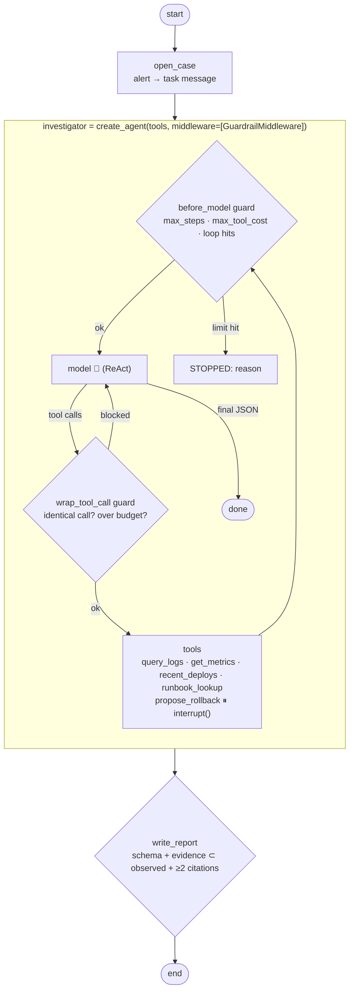

# 06 · Incident Investigator: autonomous ReAct loop with hard stops

> **Status:** ✅ Built. `pytest projects/06-incident-investigator` runs 17 offline tests, and `python run.py` runs the demo.

## Business problem

When an alert fires at 3 a.m., the on-call engineer spends the first 20–40 minutes on the
same routine: check dashboards, look at recent deploys, grep the logs, find the runbook. That
investigation is open-ended. Which tool to call next depends on what the last one showed,
which makes it a real fit for an **autonomous agent**. But an unattended agent with production
access needs hard limits:

- it has to **stop**: no infinite loops, no runaway API spend
- every conclusion must be **backed by observed evidence**
- anything that **changes production** (a rollback) needs explicit human approval
- the output must be a structured root-cause report the team can act on

## Graph



The compiled graph exported by LangGraph (with `xray=1`, including the middleware nodes) is
in [`graph.mmd`](graph.mmd).

| File | What it holds |
|------|---------------|
| `incident_agent/systems.py` | Mock logs, metrics, deploys, and runbooks for two incidents, plus an idempotent deploy system |
| `incident_agent/tools.py` | Five tools. Each result carries an evidence ID (`EV-logs-59b825`). `propose_rollback` calls `interrupt()` |
| `incident_agent/guards.py` | `GuardrailMiddleware`: step, cost, and loop hard stops |
| `incident_agent/llm.py` | System prompt, plus a deterministic ReAct policy used as the offline mock |
| `incident_agent/graph.py` | Outer graph, `RootCauseReport` schema, evidence validation |

`RootCauseReport` has: `status` (mitigated | mitigation_rejected | diagnosed | needs_human |
incomplete), `root_cause`, `summary`, `confidence`, `evidence[]`, `timeline[]`, `mitigation`,
`stop_reason`, `problems[]`, `tools_called[]`, and `tool_cost`.

## Design decisions

- **Why an autonomous loop here, when projects 03 and 05 are deterministic.** Diagnosis is
  exploratory, and the next query depends on the last observation. A ReAct agent
  (`langchain.agents.create_agent`) fits. What makes it safe is the envelope around the loop,
  not the model.
- **Hard stops live in middleware, not the prompt.** `before_model` stops the run when the
  step count or the tool-cost budget is used up, or after repeated loop attempts, and jumps
  to the end with `STOPPED: <reason>`. `wrap_tool_call` refuses to *execute* an identical
  tool+args call a second time (loop detection), or any call that would exceed the budget.
  The model is told why, and can adapt. Prompts can be ignored; middleware can't.
- **Evidence-or-escalate.** Every tool result gets an evidence ID. The final report must
  cite at least 2 IDs, and every one of them must have actually been observed. A fabricated
  ID sends the report to `needs_human`. A guardrail stop still produces an `incomplete` report
  that includes all the evidence gathered, so the on-call engineer starts from there instead
  of from zero.
- **Read tools are autonomous, writes are gated.** `propose_rollback` is the only write, and
  it calls `interrupt()` *inside the tool*. The graph pauses (the checkpointer persists it),
  and the on-call engineer approves or rejects with `Command(resume=...)`. On resume the tool
  runs again from the top, so nothing happens before the interrupt. The rollback itself is
  idempotent (`rollback:{service}:{version}`).
- **Mock policy.** Offline, the "LLM" is a deterministic ReAct policy (metrics and deploys in
  parallel, then logs, then runbook, then maybe rollback, then report). With a real model,
  the same tools, middleware, and validation apply.

## How to run

```bash
python projects/06-incident-investigator/run.py            # checkout-api (rollback approved) + search-api
python projects/06-incident-investigator/run.py --reject   # on-call rejects the rollback
pytest projects/06-incident-investigator
```

## Interview talking points

1. **When to go autonomous.** Use an agent loop only where the path genuinely depends on
   observations, as in diagnosis. Keep workflows for known processes. And scope the autonomy:
   free reads, gated writes.
2. **Termination guarantees.** Max steps, a cost budget, and loop detection on identical
   tool+args all run in middleware, with graceful degradation to an `incomplete` report plus
   evidence. I can explain why loop detection blocks *execution* instead of just warning.
3. **Grounded conclusions.** Evidence IDs work like citations in RAG. Validation rejects
   unobserved IDs and requires a minimum amount of evidence, and `needs_human` is a real
   outcome, not an error.
4. **HITL inside a tool.** `interrupt()` in `propose_rollback` makes the pause part of the tool
   contract. I can cover re-execution semantics on resume, idempotent writes, and surfacing
   approvals in PagerDuty, Slack, or Teams.
5. **Production path.** Tools backed by Azure Monitor / Log Analytics (KQL), Prometheus, the
   deploy system (Argo, GitHub Actions), and runbooks in Confluence or RAG (project 01).
   Tracing through LangSmith or OpenTelemetry. Evals replay past incidents and score root-cause
   accuracy and time to diagnosis.

## Project structure

| Path | What it is |
|---|---|
| [`incident_agent/`](incident_agent/README.md) | The importable package (graph, prompts and mock model, domain logic, eval suite, demo CLI), with a file-by-file map. |
| [`tests/`](tests/README.md) | Pytest suite (17 tests), including chaos tests generated from `doctrine.yaml`. |
| [`evals/`](evals/README.md) | Golden set (13 cases) and the latest `scores.json`. |
| [`run.py`](run.py) | Demo entry point: `python projects/06-incident-investigator/run.py` (adds the package and repo root to `sys.path`). |
| [`doctrine.yaml`](doctrine.yaml) | Machine-checked doctrine card: planes, systems of record, corpus and ACL, stop conditions, five-exit table, chaos scenarios, eval thresholds, KPIs. |
| [`DOCTRINE.md`](DOCTRINE.md) | Generated from the card and `evals/scores.json` by `python -m shared.doctrine render`; do not edit by hand. |
| [`graph.mmd`](graph.mmd) | Mermaid diagram of the compiled graph (regenerate with `run.py --mermaid`). |

Shared platform code (context builder, tool gateway, MCP kit, resilience, evals, doctrine) lives in
[`shared/`](../../shared/README.md).

## Doctrine compliance

This agent meets the portfolio's production-readiness doctrine. The full card is in
[`DOCTRINE.md`](DOCTRINE.md), generated from [`doctrine.yaml`](doctrine.yaml).

What the doctrine upgrade changed:

- **Ops tools behind MCP.** Logs, metrics, deploys and rollback are now tools on the ops MCP
  server, reached through a `ToolGateway` running as identity `mi-incident-investigator`.
  Payloads are sanitised, so an attacker-controlled log line can't steer the agent.
  - The rollback interrupt still runs inside the graph.
  - Only after the resumed approval does the agent call `ops.rollback_deploy` with
    `dry_run=False` and the key `rollback:<svc>:<ver>`.
- **Runbooks from the shared context builder.** `runbook_lookup` now queries the shared
  `ContextBuilder` (`incident_agent/knowledge.py`) with hybrid retrieval. DBA-only runbooks
  are ACL-trimmed for the SRE identity, and editions are resolved as-of the incident date.
- **Degrade exits.**
  - All models down: a middleware stops the loop cleanly and escalates.
  - Runbook search or telemetry down: the agent notes the gap, takes no write action, and
    marks the report `needs_human`.
  - Approved rollback that fails to execute: reported as *NOT EXECUTED*.
- **Exit records.** `write_report` derives `state["exits"]` from the tool artifacts.

```bash
python -m evals --project 06
pytest projects/06-incident-investigator/tests/test_chaos.py
```
