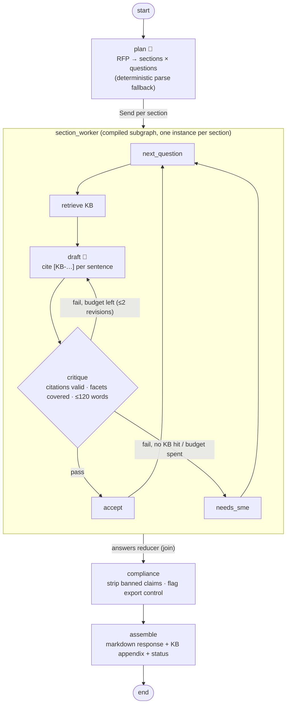

# 07 · RFP Response: planner, worker subgraphs, critic, compliance

> **Status:** ✅ Built. `pytest projects/07-rfp-response` runs 17 offline tests, and `python run.py` runs the demo.

## Business problem

Pre-sales and security teams answer the same RFPs and security questionnaires dozens of times
a quarter: encryption, SSO, SOC 2, GDPR, SLAs, DR. Answers get copied from old responses, so
outdated or risky wording spreads ("we have never been breached"), and export-control topics
slip through without legal review. The business needs:

- fast first drafts built **only from the approved answer library**, with **KB citations**
- a quality bar: every part of each question answered, concise, and cited
- automatic removal of **banned claims**, and **legal review** whenever export-control terms appear
- honest gaps: questions with no approved answer go to a subject-matter expert instead of being improvised

## Graph



The compiled graph exported by LangGraph (with `xray=1`, showing the subgraph) is in
[`graph.mmd`](graph.mmd).

| File | What it holds |
|------|---------------|
| `rfp_agent/knowledge.py` | Approved answer library (KB IDs), a sample 9-question RFP, deterministic RFP parser |
| `rfp_agent/rules.py` | Retrieval, critic rules (citations, facet coverage, length), banned-claim and export-control scanners |
| `rfp_agent/llm.py` | Planner and drafter prompts, plus deterministic mocks (lean first draft, then uses the feedback) |
| `rfp_agent/graph.py` | Section worker subgraph, parent graph, `ResponseDoc` |

## Design decisions

- **Planner plus subgraph workers.** The planner turns an unstructured RFP into a typed plan
  (validated with Pydantic, with a deterministic parser as fallback). Each section is handled
  by the **same compiled subgraph**, launched in parallel with `Send`. Each subgraph instance
  keeps its own private state (current question, drafts, issues) and only writes `answers`
  back to the parent through a reducer. That encapsulation is the main reason to use
  subgraphs.
- **Critic loop with a retry budget.** A deterministic critic checks that citations exist and
  come from the retrieved KB entries, that every facet the question asks about is covered (for
  example "at rest" *and* "in transit"), and that the answer is short enough. Failures go back
  to the drafter as concrete feedback, at most 2 times. When there's no KB hit, the question
  goes straight to an SME, because retrying can't create knowledge.
- **The compliance gate runs after drafting, over everything.** Banned claims ("never been
  breached", "guarantee 100%", "military-grade"…) are removed sentence by sentence. Answers
  stay cited, because every sentence carries its own citation. If nothing citable remains, the
  question goes to an SME. Export-control terms (ITAR, EAR, 5D992, embargoed countries) flag
  the whole response as `legal_review_required`.
- **Citations everywhere.** Every sentence cites a KB ID, the document includes a sources
  appendix, and reviewers can check each answer against the library. KB entries flagged by
  compliance (like the "legacy wording" entry) show where the library needs cleaning up.

## How to run

```bash
python projects/07-rfp-response/run.py      # 9-question RFP: critic revision, banned claim, SME gap, legal flag
pytest projects/07-rfp-response
```

## Interview talking points

1. **Plan-and-execute with subgraphs.** The planner creates structure, and `Send` maps each
   section onto a reusable compiled subgraph with private state and a reducer-based join. I can
   explain when to use a subgraph versus a node (encapsulation, reuse, separate testing, `xray`
   visualisation).
2. **Critic loops need budgets and exits.** Two revisions at most, feedback that's concrete and
   actionable, and *no* retries when the failure is missing knowledge. I'd track revision count
   per question as a quality and cost metric.
3. **Compliance as a separate, deterministic gate.** Legal requirements shouldn't depend on the
   drafter model following instructions. Scanning the final text catches anything that came
   from the KB or the model.
4. **Knowledge governance.** Answers come only from an approved library with IDs and owners. SME
   gaps and compliance hits feed back into library maintenance, which is where the long-term
   ROI comes from.
5. **Scaling and evaluation.** A real RFP has more than 300 questions: per-section parallelism,
   caching repeated questions, a cheaper model for first drafts, and a stronger model for the
   critic. Evals measure citation accuracy, facet coverage, compliance hits, and reviewer edit
   distance.

## Project structure

| Path | What it is |
|---|---|
| [`rfp_agent/`](rfp_agent/README.md) | The importable package (graph, prompts and mock model, domain logic, eval suite, demo CLI), with a file-by-file map. |
| [`tests/`](tests/README.md) | Pytest suite (17 tests), including chaos tests generated from `doctrine.yaml`. |
| [`evals/`](evals/README.md) | Golden set (12 cases) and the latest `scores.json`. |
| [`run.py`](run.py) | Demo entry point: `python projects/07-rfp-response/run.py` (adds the package and repo root to `sys.path`). |
| [`doctrine.yaml`](doctrine.yaml) | Machine-checked doctrine card: planes, systems of record, corpus and ACL, stop conditions, five-exit table, chaos scenarios, eval thresholds, KPIs. |
| [`DOCTRINE.md`](DOCTRINE.md) | Generated from the card and `evals/scores.json` by `python -m shared.doctrine render`; do not edit by hand. |
| [`graph.mmd`](graph.mmd) | Mermaid diagram of the compiled graph (regenerate with `run.py --mermaid`). |

Shared platform code (context builder, tool gateway, MCP kit, resilience, evals, doctrine) lives in
[`shared/`](../../shared/README.md).

## Doctrine compliance

This agent meets the portfolio's production-readiness doctrine. The full card is in
[`DOCTRINE.md`](DOCTRINE.md), generated from [`doctrine.yaml`](doctrine.yaml).

What the doctrine upgrade changed:

- **Shared context builder.** The answer library is now a governed knowledge product on the
  shared `ContextBuilder` (`rfp_agent/library.py`):
  - hybrid BM25 + vector retrieval with RRF
  - deal-desk-only pricing entries, ACL-trimmed so they never reach presales drafts
  - SLA editions resolved as-of the RFP submission date (pass `as_of` in the input)
  - sanitised entry text
- **Degrade exits.** If the library is down, every question goes to an SME; nothing is
  answered from model memory. If every model is down, the planner uses the deterministic
  parser and the drafter uses verbatim cited library sentences.
- **Tracing and exit records.** OTel spans cover the parallel section workers. Exits are
  collected across the subgraphs.

```bash
python -m evals --project 07
pytest projects/07-rfp-response/tests/test_chaos.py
```
