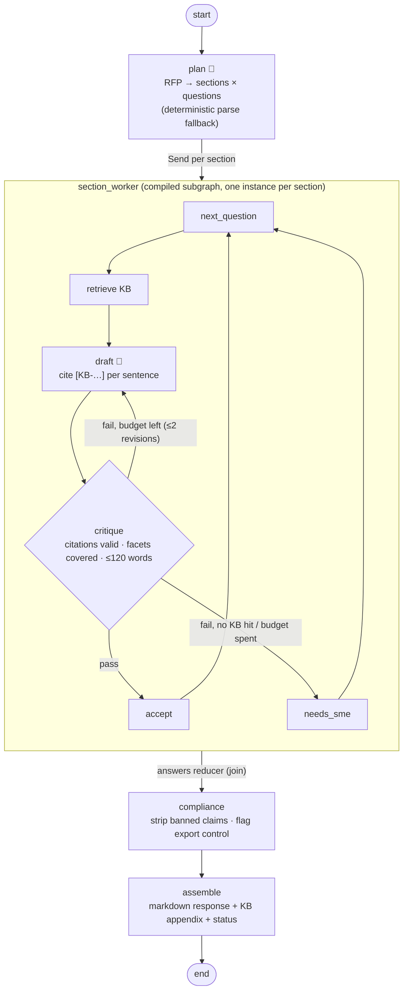

# 07 · RFP Response: planner, worker subgraphs, critic, compliance

> **Status:** ✅ Built. `pytest projects/07-rfp-response` runs 17 offline tests, and `python run.py` runs the demo.

**Sections:** [1. Purpose](#1-purpose) · [2. Architecture](#2-architecture) · [3. How it works](#3-how-it-works) · [4. Key files](#4-key-files) · [5. Code excerpts](#5-code-excerpts) · [6. Configuration](#6-configuration) · [7. Commands](#7-commands) · [8. Real output](#8-real-output) · [9. Tests and eval gates](#9-tests-and-eval-gates) · [10. Guardrails](#10-guardrails) · [11. Security and governance](#11-security-and-governance) · [12. Observability](#12-observability) · [13. Failure modes](#13-failure-modes) · [14. Mapping to Azure services](#14-mapping-to-azure-services) · [15. Limitations](#15-limitations) · [16. Interview talking points](#16-interview-talking-points) · [17. Adopt this](#17-adopt-this)

## 1. Purpose

Pre-sales and security teams answer the same RFPs and security questionnaires dozens of times
a quarter: encryption, SSO, SOC 2, GDPR, SLAs, DR. Answers get copied from old responses, so
outdated or risky wording spreads ("we have never been breached"), and export-control topics
slip through without legal review. The business needs:

- fast first drafts built **only from the approved answer library**, with **KB citations**
- a quality bar: every part of each question answered, concise, and cited
- automatic removal of **banned claims**, and **legal review** whenever export-control terms appear
- honest gaps: questions with no approved answer go to a subject-matter expert instead of being improvised

> **In one line (from `doctrine.yaml`):** Incoming RFPs are split into sections and each question is drafted from the approved answer library only. A critic checks citations and coverage, and a compliance gate strips banned claims and flags export-control terms. Anything the library cannot support goes to an SME.

## 2. Architecture

### Graph


```mermaid
flowchart TD
    START([start]) --> PLAN["plan 🤖<br/>RFP → sections × questions<br/>(deterministic parse fallback)"]
    PLAN -- "Send per section" --> SW
    subgraph SW["section_worker (compiled subgraph, one instance per section)"]
        direction TB
        NQ[next_question] --> RET["retrieve KB"]
        RET --> DR["draft 🤖<br/>cite [KB-…] per sentence"]
        DR --> CR{"critique<br/>citations valid · facets covered · ≤120 words"}
        CR -- pass --> ACC[accept]
        CR -- "fail, budget left (≤2 revisions)" --> DR
        CR -- "fail, no KB hit / budget spent" --> SME[needs_sme]
        ACC --> NQ
        SME --> NQ
    end
    SW -- "answers reducer (join)" --> COMP["compliance<br/>strip banned claims · flag export control"]
    COMP --> ASM["assemble<br/>markdown response + KB appendix + status"]
    ASM --> END([end])
```

The compiled graph exported by LangGraph (with `xray=1`, showing the subgraph) is in
[`graph.mmd`](graph.mmd).

| File | What it holds |
|------|---------------|
| `rfp_agent/knowledge.py` | Approved answer library (KB IDs), a sample 9-question RFP, deterministic RFP parser |
| `rfp_agent/rules.py` | Retrieval, critic rules (citations, facet coverage, length), banned-claim and export-control scanners |
| `rfp_agent/llm.py` | Planner and drafter prompts, plus deterministic mocks (lean first draft, then uses the feedback) |
| `rfp_agent/graph.py` | Section worker subgraph, parent graph, `ResponseDoc` |

### Planes

<!-- output-md: python scripts/doc_tables.py 07 planes -->
| Plane | What this project depends on |
|---|---|
| Experience | presales workspace / Teams; draft markdown with per-answer sources, SME and legal flags |
| Agent | LangGraph planner -> Send per section -> worker subgraph (retrieve -> draft -> critic loop) -> compliance gate -> assemble |
| Knowledge | rfp-answer-library knowledge product via shared ContextBuilder (hybrid retrieval, ACL, as-of editions, sanitiser) |
| Data | none at runtime (the library is the system of record for approved answers; CRM/portal write-back is the next rung) |
<!-- /output -->

## 3. How it works

Step by step, one line per graph node (the same nodes the promotion gate checks against the compiled graph):

<!-- output-md: python scripts/doc_tables.py 07 steps -->
1. **`plan`**: model splits the RFP into sections/questions (schema-valid).
2. **`section_worker`**: each question drafted from retrieved library entries and passes the critic.
3. **`compliance`**: no banned claims or export-control terms.
4. **`assemble`**: ready document with sources appendix.
<!-- /output -->

### Design decisions

- **Planner plus subgraph workers.** The planner turns an unstructured RFP into a typed plan
  (validated with Pydantic, with a deterministic parser as fallback). Each section is handled
  by the **same compiled subgraph**, launched in parallel with `Send`. Each subgraph instance
  keeps its own private state (current question, drafts, issues) and only writes `answers`
  back to the parent through a reducer. That encapsulation is the main reason to use
  subgraphs.
- **Critic loop with a retry budget.** A deterministic critic checks that citations exist and
  come from the retrieved KB entries, that every facet the question asks about is covered (for
  example "at rest" *and* "in transit"), and that the answer is short enough. Failures go back
  to the drafter as concrete feedback, at most 2 times. When there's no KB hit, the question
  goes straight to an SME, because retrying can't create knowledge.
- **The compliance gate runs after drafting, over everything.** Banned claims ("never been
  breached", "guarantee 100%", "military-grade"…) are removed sentence by sentence. Answers
  stay cited, because every sentence carries its own citation. If nothing citable remains, the
  question goes to an SME. Export-control terms (ITAR, EAR, 5D992, embargoed countries) flag
  the whole response as `legal_review_required`.
- **Citations everywhere.** Every sentence cites a KB ID, the document includes a sources
  appendix, and reviewers can check each answer against the library. KB entries flagged by
  compliance (like the "legacy wording" entry) show where the library needs cleaning up.

## 4. Key files

| Path | What it is |
|---|---|
| [`rfp_agent/`](rfp_agent/README.md) | The importable package (graph, prompts and mock model, domain logic, eval suite, demo CLI), with a file-by-file map. |
| [`tests/`](tests/README.md) | Pytest suite (17 tests), including chaos tests generated from `doctrine.yaml`. |
| [`evals/`](evals/README.md) | Golden set (12 cases) and the latest `scores.json`. |
| [`run.py`](run.py) | Demo entry point: `python projects/07-rfp-response/run.py` (adds the package and repo root to `sys.path`). |
| [`doctrine.yaml`](doctrine.yaml) | Machine-checked doctrine card: planes, systems of record, corpus and ACL, stop conditions, five-exit table, chaos scenarios, eval thresholds, KPIs. |
| [`DOCTRINE.md`](DOCTRINE.md) | Generated from the card and `evals/scores.json` by `python -m shared.doctrine render`; do not edit by hand. |
| [`graph.mmd`](graph.mmd) | Mermaid diagram of the compiled graph (regenerate with `run.py --mermaid`). |

Shared platform code (context builder, tool gateway, MCP kit, resilience, evals, doctrine) lives in
[`shared/`](../../shared/README.md).

## 5. Code excerpts

The graph wiring, from `build_graph` in [`graph.py`](rfp_agent/graph.py) (node functions are defined above it in the same file):

<!-- code: projects/07-rfp-response/rfp_agent/graph.py::build_graph|StateGraph( -->
```python
# build_graph() continued: wiring
g = StateGraph(RfpState)
g.add_node("plan", plan)
g.add_node("section_worker", section_graph)  # compiled subgraph as a node
g.add_node("compliance", compliance)
g.add_node("assemble", assemble)
g.add_edge(START, "plan")
g.add_conditional_edges("plan", fan_out, ["section_worker"])
g.add_edge("section_worker", "compliance")
g.add_edge("compliance", "assemble")
g.add_edge("assemble", END)
compiled = g.compile(name="rfp-response")
compiled.kb = kb
return compiled
```
<!-- /code -->

How one golden case is run and scored, from `run_case` in [`eval_suite.py`](rfp_agent/eval_suite.py):

<!-- code: projects/07-rfp-response/rfp_agent/eval_suite.py::run_case -->
```python
def run_case(case: dict[str, Any]) -> CaseResult:
    inp, exp = case["input"], case["expect"]
    r = graph().invoke({"rfp_text": _rfp(inp), "as_of": inp.get("as_of")})
    doc = r["document"]
    md = doc["markdown"]
    success = (
        doc["status"] == exp["status"]
        and doc["needs_sme"] == exp.get("needs_sme", [])
        and set(exp.get("cites", [])) <= set(doc["kb_ids_cited"])
        and all(s in md for s in exp.get("contains", []))
        and not any(s in md for s in exp.get("absent", []))
    )
    body = md.split("## Appendix")[0]
    violation = bool(set(doc["kb_ids_cited"]) & set(RESTRICTED)) or any(
        re.search(p, body, re.I) for p in BANNED_CLAIMS
    )
    accepted = [a for a in r["final_answers"] if a["status"] == "accepted"]
    grounded = sum(bool(a["citations"]) for a in accepted) / len(accepted) if accepted else None
    return CaseResult(
        case["id"],
        success,
        grounded,
        violation,
        detail=f"status={doc['status']} sme={doc['needs_sme']} cited={doc['kb_ids_cited']}",
    )
```
<!-- /code -->

## 6. Configuration

| Setting | Where | Effect |
|---|---|---|
| `LLM_PROVIDER` | environment | `mock` (default when nothing is set), `azure` or `openai` |
| `AZURE_OPENAI_ENDPOINT`, `AZURE_OPENAI_DEPLOYMENT` | environment | real Azure OpenAI model, keyless through `DefaultAzureCredential`; `AZURE_OPENAI_API_KEY` only if set |
| `AZURE_OPENAI_FALLBACK_DEPLOYMENT` | environment | second deployment behind the circuit breaker |
| `CHAOS_FAULTS` | environment | inject faults for a demo run; this project's scenarios: `model`, `retrieval`, `jailbreak` |
| `OTEL_CONSOLE=1` / `OTEL_EXPORTER_OTLP_ENDPOINT` | environment | print spans, or ship them to a collector |
| `doctrine.yaml` | this folder | thresholds, stop conditions, identities, KPIs, chaos scenarios |
| `evals/golden.jsonl` | this folder | golden cases the eval gate runs |

Eval thresholds the gate enforces:

<!-- output-md: python scripts/doc_tables.py 07 thresholds -->
| Metric | Threshold (doctrine.yaml) | Current (evals/scores.json) |
|---|---|---|
| `task_success` | `>=0.9` | 1.00 |
| `groundedness` | `>=0.95` | 1.00 |
| `policy_violation_rate` | `<=0` | 0.00 |
| `cost_per_task` | `<=0.003` | 0.00011 |
<!-- /output -->

## 7. Commands

```bash
python projects/07-rfp-response/run.py      # 9-question RFP: critic revision, banned claim, SME gap, legal flag
pytest projects/07-rfp-response
```

### Gates for this project

```bash
pytest projects/07-rfp-response   # unit + chaos tests, offline
python -m evals --project 07 --no-write   # golden set vs doctrine thresholds
python -m shared.doctrine validate   # promotion gate (all projects)
python scripts/render_docs.py --check   # this README's pasted output is current
```

## 8. Real output

`python projects/07-rfp-response/run.py` against the mock model (pasted by `scripts/render_docs.py`; trace and span ids are masked):

<!-- output: python projects/07-rfp-response/run.py -->
```text
planned sections: [('Security', 3), ('Compliance', 2), ('Operations', 3), ('Legal', 1)]

per-question critic loop:
  Q1  accepted  drafts=2 cites=['KB-SEC-001', 'KB-SEC-002']
  Q2  accepted  drafts=1 cites=['KB-SEC-003']
  Q3  accepted  drafts=1 cites=['KB-SEC-004']
  Q4  accepted  drafts=1 cites=['KB-CMP-001']
  Q5  accepted  drafts=1 cites=['KB-CMP-002']
  Q6  accepted  drafts=1 cites=['KB-OPS-001']
  Q7  accepted  drafts=1 cites=['KB-OPS-002']
  Q8  needs_sme drafts=1 cites=[]  last issues=['no knowledge-base citation']
  Q9  accepted  drafts=1 cites=['KB-EXP-001']

compliance: removed=['Q3: We have never been breached and guarantee 100% security [KB-SEC-004].']
            export-control=['5D992', 'EAR', 'ITAR']

# Response to RFP-2026-117: Contoso Health - Analytics Platform
**Status:** legal_review_required

## Security

**Q1. How is customer data encrypted at rest and in transit?**
Customer data is encrypted at rest with AES-256 using keys managed in Azure Key Vault, rotated every 90 days. All traffic is encrypted in transit with TLS 1.2 or higher; HSTS is enforced on all endpoints.
_Sources: KB-SEC-001, KB-SEC-002_

**Q2. Do you support SSO and automated user provisioning (SCIM)?**
We support SSO via SAML 2.0 and OIDC with Entra ID, Okta and Ping, and user provisioning via SCIM 2.0.
_Sources: KB-SEC-003_

**Q3. Describe your security track record.**
We maintain a 24x7 security operations center.
_Sources: KB-SEC-004_

## Compliance

**Q4. Which certifications do you hold (SOC 2, ISO 27001)?**
We hold SOC 2 Type II and ISO 27001 certifications, renewed annually; reports are available under NDA.
_Sources: KB-CMP-001_

**Q5. How do you comply with GDPR and where is EU customer data hosted?**
We are GDPR compliant, offer a DPA with SCCs, and host EU customer data in EU regions.
_Sources: KB-CMP-002_

## Operations

**Q6. What uptime SLA do you offer?**
Our SLA guarantees 99.9% monthly uptime with service credits.
_Sources: KB-OPS-001_

**Q7. What are your backup frequency, RPO and RTO?**
Backups run every 4 hours; disaster recovery targets are RPO 4 hours and RTO 8 hours, tested twice a year.
_Sources: KB-OPS-002_

**Q8. Do you offer an on-premises air-gapped deployment?**
> ⚠️ SME input required: no approved knowledge-base answer.

## Legal

**Q9. Can the platform process ITAR controlled data, and what is the export classification?**
Our encryption module is classified 5D992 under the EAR; ITAR controlled data is not supported.
_Sources: KB-EXP-001_
> 🔒 Legal review: export-control terms ['5D992', 'EAR', 'ITAR']

## Appendix: knowledge-base sources
- KB-CMP-001: Certifications
- KB-CMP-002: GDPR
- KB-EXP-001: Export classification
- KB-OPS-001: Availability SLA
- KB-OPS-002: Backup and DR
- KB-SEC-001: Encryption at rest
- KB-SEC-002: Encryption in transit
- KB-SEC-003: SSO and provisioning
- KB-SEC-004: Security track record (legacy wording)
```
<!-- /output -->

## 9. Tests and eval gates

Tests collected for this project:

<!-- output-md: python scripts/doc_tables.py 07 tests -->
| Test file | Tests |
|---|---|
| `test_chaos.py` | 3 |
| `test_library.py` | 2 |
| `test_rfp_agent.py` | 12 |
| **total** | **17** |
<!-- /output -->

Eval gate for this project (`python -m evals --project 07 --no-write`):

<!-- output: python -m evals --project 07 --no-write -->
```text
project                            n   task_success   groundedness policy_violati tool_error_rat  cost_per_task  gate
---------------------------------------------------------------------------------------------------------------------
07-rfp-response                   12           1.00           1.00           0.00           0.00        0.00011  PASS

eval gate: 1/1 projects pass
```
<!-- /output -->

## 10. Guardrails

Stop conditions (from `doctrine.yaml`; each one is enforced in code or by the gateway):

<!-- output-md: python scripts/doc_tables.py 07 stop -->
- critic sends a draft back at most twice, then SME
- no library hit -> SME immediately (no model-memory answers)
- banned claims removed; export-control terms force legal review
<!-- /output -->

Tool identities and allow-lists (the `ToolGateway` refuses anything else):

<!-- output-md: python scripts/doc_tables.py 07 identities -->
| Tool identity | Allowed tools (gateway allow-list) |
|---|---|
<!-- /output -->

## 11. Security and governance

This agent meets the portfolio's production-readiness doctrine. The full card is in
[`DOCTRINE.md`](DOCTRINE.md), generated from [`doctrine.yaml`](doctrine.yaml).

What the doctrine upgrade changed:

- **Shared context builder.** The answer library is now a governed knowledge product on the
  shared `ContextBuilder` (`rfp_agent/library.py`):
  - hybrid BM25 + vector retrieval with RRF
  - deal-desk-only pricing entries, ACL-trimmed so they never reach presales drafts
  - SLA editions resolved as-of the RFP submission date (pass `as_of` in the input)
  - sanitised entry text
- **Degrade exits.** If the library is down, every question goes to an SME; nothing is
  answered from model memory. If every model is down, the planner uses the deterministic
  parser and the drafter uses verbatim cited library sentences.
- **Tracing and exit records.** OTel spans cover the parallel section workers. Exits are
  collected across the subgraphs.

```bash
python -m evals --project 07
pytest projects/07-rfp-response/tests/test_chaos.py
```

### Systems of record

<!-- output-md: python scripts/doc_tables.py 07 sor -->
| System of record | Kind | Contract | Access |
|---|---|---|---|
| Approved answer library (content system) | document_store | `rfp-answer-library corpus (entries with owner, ACL, validity)` | read |
<!-- /output -->

### Knowledge corpora and ACL

<!-- output-md: python scripts/doc_tables.py 07 knowledge -->
| Corpus | Owner | ACL | Temporal validity | Sensitivity |
|---|---|---|---|---|
| rfp-answer-library | Jagadish Meduri (presales + security assurance) | presales + deal-desk; pricing entries deal-desk only (trimmed before ranking) | editions with valid_from / valid_to; as_of = RFP submission date | internal; pricing confidential |
<!-- /output -->

## 12. Observability

Every run emits OpenTelemetry spans through `shared/observability.py`: one for the graph, one per node, one per model call (tokens, estimated cost, deployment) and one per tool call (identity, tool, status). Spans stay in memory by default; `OTEL_CONSOLE=1` prints them and `OTEL_EXPORTER_OTLP_ENDPOINT` ships them. Eval runs write `evals/scores.json`, which `DOCTRINE.md` renders.

```bash
OTEL_CONSOLE=1 python projects/07-rfp-response/run.py   # watch the spans for one demo run
```

KPIs this project is meant to be judged on:

<!-- output-md: python scripts/doc_tables.py 07 kpis -->
| KPI | Target | How it is measured |
|---|---|---|
| First-draft coverage | >= 70% of questions answered from the library | accepted answers / questions |
| Response cycle time | -50% vs baseline | RFP received -> submitted |
| Compliance escapes | 0 banned claims or unreviewed export-control terms submitted | eval + submission audit |
<!-- /output -->

## 13. Failure modes

Five exits per node (success, retry, compensate, degrade, escalate):

<!-- output-md: python scripts/doc_tables.py 07 playbook -->
| Node | Success | Retry | Compensate | Degrade | Escalate |
|---|---|---|---|---|---|
| `plan` | model splits the RFP into sections/questions (schema-valid) | fallback deployment | n/a | deterministic header/Qn parser (bad output or all models down) | n/a |
| `section_worker` | each question drafted from retrieved library entries and passes the critic | critic loop (max 2 revisions); fallback model deployment | n/a | library outage -> SME for every question; models down -> verbatim cited library sentences; injected text neutralised | no library hit / budget spent -> needs_sme |
| `compliance` | no banned claims or export-control terms | n/a (deterministic) | banned sentences removed; answer with nothing citable left -> SME | n/a | export-control terms flagged for legal |
| `assemble` | ready document with sources appendix | n/a | n/a | n/a | needs_sme / legal_review_required status for the human owner |
<!-- /output -->

Chaos scenarios asserted in `tests/test_chaos.py`:

<!-- output-md: python scripts/doc_tables.py 07 chaos -->
| Injected fault (`CHAOS_FAULTS`) | Node | Expected exit | Invariant asserted |
|---|---|---|---|
| `model` | `plan` | **degrade** | deterministic plan + verbatim cited drafts; same 8 answered, Q8 to SME |
| `retrieval` | `section_worker` | **degrade** | library down -> every question to SME, nothing drafted from model memory |
| `jailbreak` | `section_worker` | **degrade** | poisoned library entry neutralised; no admin text in the document |
<!-- /output -->

## 14. Mapping to Azure services

Nothing here is deployed. This is how each piece would map onto Azure:

<!-- output-md: python scripts/doc_tables.py 07 azure -->
| Piece | Azure service it maps to |
|---|---|
| Model calls | Azure OpenAI in Microsoft Foundry, keyless through `DefaultAzureCredential` (`shared/llm.py`), with a fallback deployment behind a circuit breaker |
| Agent runtime | Azure Container Apps (the `rfp_agent.graph:build_graph` graph runs inside the portfolio API image); LangGraph checkpoints in Azure Database for PostgreSQL |
| Corpus `rfp-answer-library` | Azure AI Search index with security-trimming filters for the ACL and `valid_from`/`valid_to` fields; sensitivity `internal; pricing confidential` as a Microsoft Purview label |
| Approved answer library (content system) | Azure Blob Storage or SharePoint content indexed by Azure AI Search, labelled in Microsoft Purview |
| Tool identities | One user-assigned managed identity per row of the identity table, scoped with Azure RBAC; Microsoft Entra Agent ID when it applies |
| Traces and cost | Application Insights through the Azure Monitor OpenTelemetry exporter (`OTEL_EXPORTER_OTLP_ENDPOINT`) |
| Eval gate | Microsoft Foundry evaluations for the live model, with the same thresholds as `doctrine.yaml`; GitHub Actions blocks promotion |
| Guardrails and policy | Azure AI Content Safety (prompt shields) in front of the model; Azure Policy for private networking and tags; Key Vault for any secret |
<!-- /output -->

## 15. Limitations

<!-- output-md: python scripts/doc_tables.py 07 status -->
Maturity (self-rated in `doctrine.yaml`): **Level 3**, governed knowledge product + planner/worker/critic with deterministic compliance gate; read-only, human submits. Next rung: MCP write to the RFP portal / CRM opportunity (HITL) and A2A request to the legal-review agent for export-control hits.
<!-- /output -->

- Runs against a deterministic mock model, mock systems of record and synthetic data, so the eval scores measure the graph, retrieval and policies, not a live model's quality.
- The real-model path has not been exercised against a live Azure OpenAI deployment.
- Checkpoints use the in-memory saver; a production run needs a durable checkpointer.
- KPI targets are design targets; nothing has been measured in production.

## 16. Interview talking points

1. **Plan-and-execute with subgraphs.** The planner creates structure, and `Send` maps each
   section onto a reusable compiled subgraph with private state and a reducer-based join. I can
   explain when to use a subgraph versus a node (encapsulation, reuse, separate testing, `xray`
   visualisation).
2. **Critic loops need budgets and exits.** Two revisions at most, feedback that's concrete and
   actionable, and *no* retries when the failure is missing knowledge. I'd track revision count
   per question as a quality and cost metric.
3. **Compliance as a separate, deterministic gate.** Legal requirements shouldn't depend on the
   drafter model following instructions. Scanning the final text catches anything that came
   from the KB or the model.
4. **Knowledge governance.** Answers come only from an approved library with IDs and owners. SME
   gaps and compliance hits feed back into library maintenance, which is where the long-term
   ROI comes from.
5. **Scaling and evaluation.** A real RFP has more than 300 questions: per-section parallelism,
   caching repeated questions, a cheaper model for first drafts, and a stronger model for the
   critic. Evals measure citation accuracy, facet coverage, compliance hits, and reviewer edit
   distance.

## 17. Adopt this

How another team reuses this project:

1. **Copy the pattern, keep the platform.** Copy `projects/07-rfp-response/`, rename the `rfp_agent` package and add it to `pythonpath` in `pyproject.toml`. Keep `shared/` as a dependency: it supplies the model factory, context builder, tool gateway, resilience and tracing.
2. **Point it at your systems.** Each system of record in section 11 sits behind a tool contract; swap the mock MCP server in `shared/mcp_servers` for yours with the same tool names and schemas, and give each tool identity in section 10 its own managed identity.
3. **Configure it in `doctrine.yaml`.** Thresholds, stop conditions, KPIs, identities and chaos scenarios live in the card; `python -m shared.doctrine validate` refuses a card with gaps.
4. **Bring your own golden set.** Replace `evals/golden.jsonl` with cases from your domain (same fields) and run `python -m evals --project 07`; CI blocks promotion when a threshold is missed.
5. **Extend it safely.** Add a node in `build_graph`, then add its five-exit row to `failure_playbook` and a chaos scenario if it can fail; the validator fails until the row exists.
6. **Turn on a real model** with `AZURE_OPENAI_ENDPOINT` and `AZURE_OPENAI_DEPLOYMENT` (keyless). Routing stays in code, so control flow does not change; run `python -m evals --project 07 --live` before trusting the wording.
7. **Keep the docs honest.** Run `python scripts/render_docs.py` after a change; CI fails when the pasted output or excerpts in this README drift.
