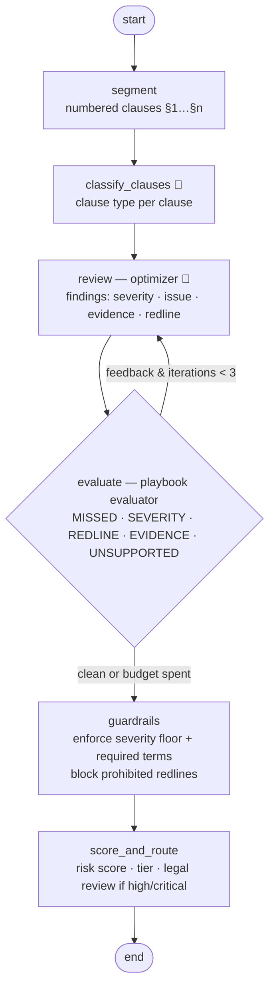

# 08 · Contract Review: evaluator-optimizer loop plus an eval gate

> **Status:** ✅ Built. `pytest projects/08-contract-review` runs 13 offline tests. `python run.py` runs the demo, and `python evals/run_eval.py` runs the eval gate.

## Business problem

Legal and procurement review every vendor contract against a **playbook**: capped liability,
mutual indemnity, fair termination, sane auto-renewal, payment terms, a DPA with 72-hour
breach notice. The first pass is repetitive and slow, and small misses are expensive (for
example, uncapped liability). An AI first pass has to:

- find deviations clause by clause, with **severity** and **approved redline language**
- never under-rate a risk the playbook calls critical, and never invent risks
- never propose redlines that give away protections
- be **measured**: precision and recall on a labelled set, with a gate before any
  prompt, model, or playbook change ships

## Graph



The compiled graph exported by LangGraph is in [`graph.mmd`](graph.mmd).

| File | What it holds |
|------|---------------|
| `contract_review/library.py` | Clause library: keywords, red-flag regexes with severity, standard position, approved redline, required terms. Also required clauses, prohibited redline patterns, disclaimer |
| `contract_review/rules.py` | Segmentation, keyword classification, `expected_findings` (playbook floor), `evaluate`, guardrail check, scoring |
| `contract_review/llm.py` | Classify and review prompts, plus a mock reviewer that under-rates on the first pass and then follows feedback |
| `contract_review/graph.py` | Evaluator-optimizer graph, `ReviewReport` |
| `contract_review/contracts.py` | Demo MSA and a **6-contract labelled eval set** |
| `contract_review/evaluation.py`, `evals/run_eval.py` | Eval harness (precision, recall, F1, severity accuracy) and the CI gate |

## Design decisions

- **Evaluator-optimizer.** The LLM (optimizer) writes nuanced findings and tailored redlines.
  The evaluator checks them against the playbook: missed red flags, severity below the floor,
  redlines missing required protective terms, evidence that isn't an exact quote, and
  unsupported (invented) findings. Its feedback is specific and machine-generated, and the
  optimizer revises. There are at most 3 iterations. In the demo, one revision resolves all 9
  feedback items.
- **Guardrails don't trust convergence.** If the budget runs out, `guardrails` enforces the
  floor anyway. It adds missed risks, raises severity, substitutes approved redline language
  (marked `source: evaluator_enforced`), and blocks prohibited redlines ("waive all",
  "unlimited liability"…). Every report carries a *not legal advice* disclaimer, and anything
  high or critical routes to legal.
- **Severity scoring.** Points per severity (critical 10, high 6, medium 3, low 1) add up to a
  risk score and a tier (low, medium, high), which drive routing and reporting.
- **The eval harness is part of the product.** `evals/run_eval.py` runs the full graph over a
  labelled set and prints per-case false positives and false negatives, precision, recall, F1,
  and severity accuracy. It **exits non-zero** below the thresholds, and it's wired into CI as
  a gate. The current result is P = R = 0.92. The set deliberately includes an "evergreen"
  renewal the rules miss, and a *standard* indirect-damages exclusion a naive rule flags. The
  eval exists to surface exactly those playbook gaps.

## How to run

```bash
python projects/08-contract-review/run.py                    # demo MSA: loop trace + findings + redlines
python projects/08-contract-review/evals/run_eval.py         # eval table + GATE PASS/FAIL (exit code)
python projects/08-contract-review/evals/run_eval.py --min-recall 0.95   # see the gate fail
pytest projects/08-contract-review
```

## Interview talking points

1. **Evaluator-optimizer vs self-critique.** The evaluator is grounded in the playbook (rules
   and required terms), not in the model's opinion of itself. The feedback is actionable and
   the loop is bounded, with a deterministic floor when it doesn't converge.
2. **LLMOps eval gating.** A labelled set, precision/recall/F1 plus severity accuracy, and a
   CI gate with a non-zero exit. Every prompt, model, or playbook change gets measured. I'd
   grow the set from lawyer corrections and track metrics per clause type.
3. **Reading the error analysis.** The FP (a standard indirect-damages exclusion) and the FN
   (an "evergreen" renewal) point at rule-precision and recall gaps in the playbook, not at
   the model. That's how you prioritise fixes.
4. **Guardrails for high-stakes output.** Severity floors, approved language, prohibited
   patterns, a disclaimer, and mandatory legal routing. The AI accelerates the lawyer and
   doesn't replace them.
5. **Production path.** Word add-in or CLM integration (Ironclad, Icertis), with Azure AI
   Document Intelligence for PDFs. An LLM-as-judge could supplement the rule evaluator for
   nuance, and lawyer accept/reject data feeds the eval set.

## Project structure

| Path | What it is |
|---|---|
| [`contract_review/`](contract_review/README.md) | The importable package (graph, prompts and mock model, domain logic, eval suite, demo CLI), with a file-by-file map. |
| [`tests/`](tests/README.md) | Pytest suite (13 tests), including chaos tests generated from `doctrine.yaml`. |
| [`evals/`](evals/README.md) | Golden set (12 cases) and the latest `scores.json`. |
| [`run.py`](run.py) | Demo entry point: `python projects/08-contract-review/run.py` (adds the package and repo root to `sys.path`). |
| [`doctrine.yaml`](doctrine.yaml) | Machine-checked doctrine card: planes, systems of record, corpus and ACL, stop conditions, five-exit table, chaos scenarios, eval thresholds, KPIs. |
| [`DOCTRINE.md`](DOCTRINE.md) | Generated from the card and `evals/scores.json` by `python -m shared.doctrine render`; do not edit by hand. |
| [`graph.mmd`](graph.mmd) | Mermaid diagram of the compiled graph (regenerate with `run.py --mermaid`). |

Shared platform code (context builder, tool gateway, MCP kit, resilience, evals, doctrine) lives in
[`shared/`](../../shared/README.md).

## Doctrine compliance

This agent meets the portfolio's production-readiness doctrine. The full card is in
[`DOCTRINE.md`](DOCTRINE.md), generated from [`doctrine.yaml`](doctrine.yaml).

What the doctrine upgrade changed:

- **Playbook from the shared context builder.** The playbook text the reviewer reads is now
  retrieved per clause from the shared `ContextBuilder` (`contract_review/playbook.py`).
  Senior-counsel negotiation fallbacks are ACL-trimmed, so a concession can never leak into a
  redline. The rules engine and guardrails stay in code as the deterministic control.
- **Degrade exits.** If every model is down, the graph uses the keyword classifier and a
  rules-only review, where the evaluator floor supplies the findings and approved redlines.
  If playbook search is down, it also runs rules-only. Suspected injection in the contract
  text is neutralised and forces legal review.
- **Golden-set convention.** The labelled set now lives in `evals/golden.jsonl` (12 cases).
  `run_eval.py` still reports precision and recall on the original six-contract subset.
  - `python -m evals` scores exact per-contract matches.
  - Three cases are known-hard, so task success is **0.75**. That is honest, not perfect,
    and the gate is set at 0.7.

```bash
python -m evals --project 08
python projects/08-contract-review/evals/run_eval.py
pytest projects/08-contract-review/tests/test_chaos.py
```
