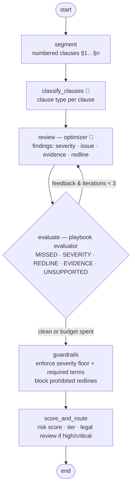

# 08 · Contract Review: evaluator-optimizer loop plus an eval gate

> **Status:** ✅ Built. `pytest projects/08-contract-review` runs 13 offline tests. `python run.py` runs the demo, and `python evals/run_eval.py` runs the eval gate.

**Sections:** [1. Purpose](#1-purpose) · [2. Architecture](#2-architecture) · [3. How it works](#3-how-it-works) · [4. Key files](#4-key-files) · [5. Code excerpts](#5-code-excerpts) · [6. Configuration](#6-configuration) · [7. Commands](#7-commands) · [8. Real output](#8-real-output) · [9. Tests and eval gates](#9-tests-and-eval-gates) · [10. Guardrails](#10-guardrails) · [11. Security and governance](#11-security-and-governance) · [12. Observability](#12-observability) · [13. Failure modes](#13-failure-modes) · [14. Mapping to Azure services](#14-mapping-to-azure-services) · [15. Limitations](#15-limitations) · [16. Interview talking points](#16-interview-talking-points) · [17. Adopt this](#17-adopt-this)

## 1. Purpose

Legal and procurement review every vendor contract against a **playbook**: capped liability,
mutual indemnity, fair termination, sane auto-renewal, payment terms, a DPA with 72-hour
breach notice. The first pass is repetitive and slow, and small misses are expensive (for
example, uncapped liability). An AI first pass has to:

- find deviations clause by clause, with **severity** and **approved redline language**
- never under-rate a risk the playbook calls critical, and never invent risks
- never propose redlines that give away protections
- be **measured**: precision and recall on a labelled set, with a gate before any
  prompt, model, or playbook change ships

> **In one line (from `doctrine.yaml`):** Inbound third-party contracts are segmented and classified by clause. Each clause is reviewed against the legal playbook and checked by a deterministic evaluator; guardrails enforce the playbook floor. The contract is then routed to legal or the business owner with a risk score and approved redlines.

## 2. Architecture

### Graph


```mermaid
flowchart TD
    START([start]) --> SEG["segment<br/>numbered clauses §1…§n"]
    SEG --> CL["classify_clauses 🤖<br/>clause type per clause"]
    CL --> REV["review — optimizer 🤖<br/>findings: severity · issue · evidence · redline"]
    REV --> EV{"evaluate — playbook evaluator<br/>MISSED · SEVERITY · REDLINE · EVIDENCE · UNSUPPORTED"}
    EV -- "feedback & iterations < 3" --> REV
    EV -- "clean or budget spent" --> GR["guardrails<br/>enforce severity floor + required terms<br/>block prohibited redlines"]
    GR --> SC["score_and_route<br/>risk score · tier · legal review if high/critical"]
    SC --> END([end])
```

The compiled graph exported by LangGraph is in [`graph.mmd`](graph.mmd).

| File | What it holds |
|------|---------------|
| `contract_review/library.py` | Clause library: keywords, red-flag regexes with severity, standard position, approved redline, required terms. Also required clauses, prohibited redline patterns, disclaimer |
| `contract_review/rules.py` | Segmentation, keyword classification, `expected_findings` (playbook floor), `evaluate`, guardrail check, scoring |
| `contract_review/llm.py` | Classify and review prompts, plus a mock reviewer that under-rates on the first pass and then follows feedback |
| `contract_review/graph.py` | Evaluator-optimizer graph, `ReviewReport` |
| `contract_review/contracts.py` | Demo MSA and a **6-contract labelled eval set** |
| `contract_review/evaluation.py`, `evals/run_eval.py` | Eval harness (precision, recall, F1, severity accuracy) and the CI gate |

### Planes

<!-- output-md: python scripts/doc_tables.py 08 planes -->
| Plane | What this project depends on |
|---|---|
| Experience | legal intake queue / CLM sidebar; report with findings, evidence quotes, redlines, route and disclaimer |
| Agent | LangGraph evaluator-optimizer (segment -> classify -> review <-> evaluate x3 -> guardrails -> score_and_route) |
| Knowledge | legal-playbook knowledge product via shared ContextBuilder (per-clause retrieval, ACL on senior fallbacks) |
| Data | none at runtime (contract text is the input; CLM write-back is the next rung) |
<!-- /output -->

## 3. How it works

Step by step, one line per graph node (the same nodes the promotion gate checks against the compiled graph):

<!-- output-md: python scripts/doc_tables.py 08 steps -->
1. **`segment`**: numbered clauses extracted.
2. **`classify_clauses`**: model labels each clause type.
3. **`review`**: findings drafted against retrieved playbook entries.
4. **`evaluate`**: draft matches the playbook floor.
5. **`guardrails`**: floor enforced; no prohibited redline.
6. **`score_and_route`**: risk score + route with disclaimer.
<!-- /output -->

### Design decisions

- **Evaluator-optimizer.** The LLM (optimizer) writes nuanced findings and tailored redlines.
  The evaluator checks them against the playbook: missed red flags, severity below the floor,
  redlines missing required protective terms, evidence that isn't an exact quote, and
  unsupported (invented) findings. Its feedback is specific and machine-generated, and the
  optimizer revises. There are at most 3 iterations. In the demo, one revision resolves all 9
  feedback items.
- **Guardrails don't trust convergence.** If the budget runs out, `guardrails` enforces the
  floor anyway. It adds missed risks, raises severity, substitutes approved redline language
  (marked `source: evaluator_enforced`), and blocks prohibited redlines ("waive all",
  "unlimited liability"…). Every report carries a *not legal advice* disclaimer, and anything
  high or critical routes to legal.
- **Severity scoring.** Points per severity (critical 10, high 6, medium 3, low 1) add up to a
  risk score and a tier (low, medium, high), which drive routing and reporting.
- **The eval harness is part of the product.** `evals/run_eval.py` runs the full graph over a
  labelled set and prints per-case false positives and false negatives, precision, recall, F1,
  and severity accuracy. It **exits non-zero** below the thresholds, and it's wired into CI as
  a gate. The current result is P = R = 0.92. The set deliberately includes an "evergreen"
  renewal the rules miss, and a *standard* indirect-damages exclusion a naive rule flags. The
  eval exists to surface exactly those playbook gaps.

## 4. Key files

| Path | What it is |
|---|---|
| [`contract_review/`](contract_review/README.md) | The importable package (graph, prompts and mock model, domain logic, eval suite, demo CLI), with a file-by-file map. |
| [`tests/`](tests/README.md) | Pytest suite (13 tests), including chaos tests generated from `doctrine.yaml`. |
| [`evals/`](evals/README.md) | Golden set (12 cases) and the latest `scores.json`. |
| [`run.py`](run.py) | Demo entry point: `python projects/08-contract-review/run.py` (adds the package and repo root to `sys.path`). |
| [`doctrine.yaml`](doctrine.yaml) | Machine-checked doctrine card: planes, systems of record, corpus and ACL, stop conditions, five-exit table, chaos scenarios, eval thresholds, KPIs. |
| [`DOCTRINE.md`](DOCTRINE.md) | Generated from the card and `evals/scores.json` by `python -m shared.doctrine render`; do not edit by hand. |
| [`graph.mmd`](graph.mmd) | Mermaid diagram of the compiled graph (regenerate with `run.py --mermaid`). |

Shared platform code (context builder, tool gateway, MCP kit, resilience, evals, doctrine) lives in
[`shared/`](../../shared/README.md).

## 5. Code excerpts

The graph wiring, from `build_graph` in [`graph.py`](contract_review/graph.py) (node functions are defined above it in the same file):

<!-- code: projects/08-contract-review/contract_review/graph.py::build_graph|StateGraph( -->
```python
# build_graph() continued: wiring
g = StateGraph(ReviewState)
g.add_node("segment", segment_node)
g.add_node("classify_clauses", classify_clauses)
g.add_node("review", review)
g.add_node("evaluate", evaluate_node)
g.add_node("guardrails", guardrails)
g.add_node("score_and_route", score_and_route)
g.add_edge(START, "segment")
g.add_edge("segment", "classify_clauses")
g.add_edge("classify_clauses", "review")
g.add_edge("review", "evaluate")
g.add_conditional_edges("evaluate", after_eval, ["review", "guardrails"])
g.add_edge("guardrails", "score_and_route")
g.add_edge("score_and_route", END)
compiled = g.compile(name="contract-review")
compiled.kb = kb
return compiled
```
<!-- /code -->

How one golden case is run and scored, from `run_case` in [`eval_suite.py`](contract_review/eval_suite.py):

<!-- code: projects/08-contract-review/contract_review/eval_suite.py::run_case -->
```python
def run_case(case: dict[str, Any]) -> CaseResult:
    text, exp = case["input"]["text"], case["expect"]
    rep = graph().invoke({"text": text})["report"]
    pred = {f["clause_type"]: f["severity"] for f in rep["findings"]}
    success = pred == exp["gold"] and rep["route"] == exp.get("route", rep["route"])
    redlines = " ".join(f["redline"] for f in rep["findings"])
    violation = (
        any(violates_guardrail(f["redline"]) for f in rep["findings"])
        or any(fb.split(":")[0].lower() in redlines.lower() for fb in FALLBACKS.values())
        or "Not legal advice" not in rep["disclaimer"]
    )
    quoted = [f for f in rep["findings"] if f["evidence"]]
    body = re.sub(r"\s+", " ", text).lower()
    grounded = sum(f["evidence"].lower() in body for f in quoted) / len(quoted) if quoted else None
    return CaseResult(
        case["id"],
        success,
        grounded,
        violation,
        detail=f"pred={pred} gold={exp['gold']} route={rep['route']}",
    )
```
<!-- /code -->

## 6. Configuration

| Setting | Where | Effect |
|---|---|---|
| `LLM_PROVIDER` | environment | `mock` (default when nothing is set), `azure` or `openai` |
| `AZURE_OPENAI_ENDPOINT`, `AZURE_OPENAI_DEPLOYMENT` | environment | real Azure OpenAI model, keyless through `DefaultAzureCredential`; `AZURE_OPENAI_API_KEY` only if set |
| `AZURE_OPENAI_FALLBACK_DEPLOYMENT` | environment | second deployment behind the circuit breaker |
| `CHAOS_FAULTS` | environment | inject faults for a demo run; this project's scenarios: `model`, `retrieval`, `jailbreak` |
| `OTEL_CONSOLE=1` / `OTEL_EXPORTER_OTLP_ENDPOINT` | environment | print spans, or ship them to a collector |
| `doctrine.yaml` | this folder | thresholds, stop conditions, identities, KPIs, chaos scenarios |
| `evals/golden.jsonl` | this folder | golden cases the eval gate runs |

Eval thresholds the gate enforces:

<!-- output-md: python scripts/doc_tables.py 08 thresholds -->
| Metric | Threshold (doctrine.yaml) | Current (evals/scores.json) |
|---|---|---|
| `task_success` | `>=0.7` | 0.75 |
| `groundedness` | `>=0.95` | 1.00 |
| `policy_violation_rate` | `<=0` | 0.00 |
| `cost_per_task` | `<=0.003` | 0.00033 |
<!-- /output -->

## 7. Commands

```bash
python projects/08-contract-review/run.py                    # demo MSA: loop trace + findings + redlines
python projects/08-contract-review/evals/run_eval.py         # eval table + GATE PASS/FAIL (exit code)
python projects/08-contract-review/evals/run_eval.py --min-recall 0.95   # see the gate fail
pytest projects/08-contract-review
```

### Gates for this project

```bash
pytest projects/08-contract-review   # unit + chaos tests, offline
python -m evals --project 08 --no-write   # golden set vs doctrine thresholds
python -m shared.doctrine validate   # promotion gate (all projects)
python scripts/render_docs.py --check   # this README's pasted output is current
```

## 8. Real output

`python projects/08-contract-review/run.py` against the mock model (pasted by `scripts/render_docs.py`; trace and span ids are masked):

<!-- output: python projects/08-contract-review/run.py -->
```text
clauses: [('§1', 'payment_terms'), ('§2', 'auto_renewal'), ('§3', 'termination'), ('§4', 'limitation_of_liability'), ('§5', 'indemnification'), ('§6', 'confidentiality'), ('§7', 'governing_law')]

evaluator-optimizer iterations:
  iter 1: 5 findings, 9 feedback items
      - REDLINE payment_terms: must include ['Net 45', '1% per month']
      - REDLINE auto_renewal: must include ['30 days']
      - SEVERITY termination: medium is too low, playbook says high
      - REDLINE termination: must include ['either party', '30 days']
      - SEVERITY limitation_of_liability: medium is too low, playbook says critical
      - REDLINE limitation_of_liability: must include ['12 months', 'indirect']
      - SEVERITY indemnification: medium is too low, playbook says high
      - REDLINE indemnification: must include ['each party', 'third-party']
      - MISSED data_protection (missing clause): No data protection / DPA clause although personal data is processed; severity high
  iter 2: 6 findings, 0 feedback items

MASTER SERVICES AGREEMENT - Northwind Analytics ("Vendor") and Contoso Health ("Customer")
risk score 34 (high) -> legal_review_required; evaluation passed: True
  [CRITICAL] §4  limitation_of_liability: Uncapped liability for the customer
             redline: Each party's aggregate liability shall not exceed the fees paid in the 12 months preceding the claim; neither party is liable for indirect or consequential damages.
  [HIGH    ] §3  termination: Vendor can terminate for convenience; customer cannot
             redline: Either party may terminate for material breach not cured within 30 days of written notice.
  [HIGH    ] §5  indemnification: One-sided, unlimited customer indemnity
             redline: Each party shall indemnify the other against third-party claims arising from its gross negligence, wilful misconduct or IP infringement.
  [HIGH    ] —   data_protection: No data protection / DPA clause although personal data is processed
             redline: Vendor shall notify Customer of any personal data breach within 72 hours and process personal data only under the attached DPA.
  [MEDIUM  ] §1  payment_terms: Late-payment interest above 1%/month
             redline: Invoices are payable Net 45; late amounts accrue interest of at most 1% per month.
  [MEDIUM  ] §2  auto_renewal: Auto-renewal with a long opt-out notice period
             redline: The agreement renews for successive one-year terms unless either party gives 30 days' written notice of non-renewal.

AI-assisted first-pass review against the company playbook. Not legal advice; a lawyer must approve before any redline is sent.
```
<!-- /output -->

## 9. Tests and eval gates

Tests collected for this project:

<!-- output-md: python scripts/doc_tables.py 08 tests -->
| Test file | Tests |
|---|---|
| `test_chaos.py` | 3 |
| `test_contract_review.py` | 8 |
| `test_playbook.py` | 2 |
| **total** | **13** |
<!-- /output -->

Eval gate for this project (`python -m evals --project 08 --no-write`):

<!-- output: python -m evals --project 08 --no-write -->
```text
project                            n   task_success   groundedness policy_violati tool_error_rat  cost_per_task  gate
---------------------------------------------------------------------------------------------------------------------
08-contract-review                12           0.75           1.00           0.00           0.00        0.00033  PASS

eval gate: 1/1 projects pass
```
<!-- /output -->

## 10. Guardrails

Stop conditions (from `doctrine.yaml`; each one is enforced in code or by the gateway):

<!-- output-md: python scripts/doc_tables.py 08 stop -->
- at most 3 review iterations (1 draft + 2 revisions), then guardrails enforce the floor
- prohibited redline patterns are always replaced with the approved redline
- any critical/high finding or suspected injection -> legal review
<!-- /output -->

Tool identities and allow-lists (the `ToolGateway` refuses anything else):

<!-- output-md: python scripts/doc_tables.py 08 identities -->
| Tool identity | Allowed tools (gateway allow-list) |
|---|---|
<!-- /output -->

## 11. Security and governance

This agent meets the portfolio's production-readiness doctrine. The full card is in
[`DOCTRINE.md`](DOCTRINE.md), generated from [`doctrine.yaml`](doctrine.yaml).

What the doctrine upgrade changed:

- **Playbook from the shared context builder.** The playbook text the reviewer reads is now
  retrieved per clause from the shared `ContextBuilder` (`contract_review/playbook.py`).
  Senior-counsel negotiation fallbacks are ACL-trimmed, so a concession can never leak into a
  redline. The rules engine and guardrails stay in code as the deterministic control.
- **Degrade exits.** If every model is down, the graph uses the keyword classifier and a
  rules-only review, where the evaluator floor supplies the findings and approved redlines.
  If playbook search is down, it also runs rules-only. Suspected injection in the contract
  text is neutralised and forces legal review.
- **Golden-set convention.** The labelled set now lives in `evals/golden.jsonl` (12 cases).
  `run_eval.py` still reports precision and recall on the original six-contract subset.
  - `python -m evals` scores exact per-contract matches.
  - Three cases are known-hard, so task success is **0.75**. That is honest, not perfect,
    and the gate is set at 0.7.

```bash
python -m evals --project 08
python projects/08-contract-review/evals/run_eval.py
pytest projects/08-contract-review/tests/test_chaos.py
```

### Systems of record

<!-- output-md: python scripts/doc_tables.py 08 sor -->
| System of record | Kind | Contract | Access |
|---|---|---|---|
| Legal playbook repository | document_store | `legal-playbook corpus (standard + approved redline per clause type; fallbacks senior-only)` | read |
<!-- /output -->

### Knowledge corpora and ACL

<!-- output-md: python scripts/doc_tables.py 08 knowledge -->
| Corpus | Owner | ACL | Temporal validity | Sensitivity |
|---|---|---|---|---|
| legal-playbook | Jagadish Meduri (legal operations) | legal-ops for standard positions; negotiation fallbacks legal-senior only (trimmed before ranking) | current approved edition only; playbook changes are versioned and re-evaluated in CI | confidential (negotiation positions) |
<!-- /output -->

## 12. Observability

Every run emits OpenTelemetry spans through `shared/observability.py`: one for the graph, one per node, one per model call (tokens, estimated cost, deployment) and one per tool call (identity, tool, status). Spans stay in memory by default; `OTEL_CONSOLE=1` prints them and `OTEL_EXPORTER_OTLP_ENDPOINT` ships them. Eval runs write `evals/scores.json`, which `DOCTRINE.md` renders.

```bash
OTEL_CONSOLE=1 python projects/08-contract-review/run.py   # watch the spans for one demo run
```

KPIs this project is meant to be judged on:

<!-- output-md: python scripts/doc_tables.py 08 kpis -->
| KPI | Target | How it is measured |
|---|---|---|
| First-pass review time | -60% vs manual | contract received -> first-pass review delivered |
| Risk recall on labelled set | >= 0.9 (precision >= 0.8) | run_eval.py precision / recall |
| Unsafe redlines | 0 | guardrail blocks reaching a sent redline |
<!-- /output -->

## 13. Failure modes

Five exits per node (success, retry, compensate, degrade, escalate):

<!-- output-md: python scripts/doc_tables.py 08 playbook -->
| Node | Success | Retry | Compensate | Degrade | Escalate |
|---|---|---|---|---|---|
| `segment` | numbered clauses extracted | n/a (deterministic) | n/a | instruction-like text neutralised before any model call | suspected prompt injection -> legal review route |
| `classify_clauses` | model labels each clause type | fallback deployment | n/a | keyword classifier when models are down | n/a |
| `review` | findings drafted against retrieved playbook entries | evaluator feedback loop (max 3); fallback deployment | n/a | models or playbook search down -> rules-only review (evaluator floor supplies findings + approved redlines) | n/a |
| `evaluate` | draft matches the playbook floor | sends feedback to review | n/a | n/a | unresolved feedback carried into the report |
| `guardrails` | floor enforced; no prohibited redline | n/a | prohibited or incomplete redlines replaced with approved language | n/a | n/a |
| `score_and_route` | risk score + route with disclaimer | n/a | n/a | n/a | legal_review_required for critical/high or injection |
<!-- /output -->

Chaos scenarios asserted in `tests/test_chaos.py`:

<!-- output-md: python scripts/doc_tables.py 08 chaos -->
| Injected fault (`CHAOS_FAULTS`) | Node | Expected exit | Invariant asserted |
|---|---|---|---|
| `model` | `review` | **degrade** | rules-only review still flags liability, indemnity and termination and routes to legal |
| `retrieval` | `review` | **degrade** | playbook search down -> rules-only review with the same floor and route |
| `jailbreak` | `segment` | **escalate** | injected clause neutralised, injection flagged, routed to legal |
<!-- /output -->

## 14. Mapping to Azure services

Nothing here is deployed. This is how each piece would map onto Azure:

<!-- output-md: python scripts/doc_tables.py 08 azure -->
| Piece | Azure service it maps to |
|---|---|
| Model calls | Azure OpenAI in Microsoft Foundry, keyless through `DefaultAzureCredential` (`shared/llm.py`), with a fallback deployment behind a circuit breaker |
| Agent runtime | Azure Container Apps (the `contract_review.graph:build_graph` graph runs inside the portfolio API image); LangGraph checkpoints in Azure Database for PostgreSQL |
| Corpus `legal-playbook` | Azure AI Search index with security-trimming filters for the ACL and `valid_from`/`valid_to` fields; sensitivity `confidential (negotiation positions)` as a Microsoft Purview label |
| Legal playbook repository | Azure Blob Storage or SharePoint content indexed by Azure AI Search, labelled in Microsoft Purview |
| Tool identities | One user-assigned managed identity per row of the identity table, scoped with Azure RBAC; Microsoft Entra Agent ID when it applies |
| Traces and cost | Application Insights through the Azure Monitor OpenTelemetry exporter (`OTEL_EXPORTER_OTLP_ENDPOINT`) |
| Eval gate | Microsoft Foundry evaluations for the live model, with the same thresholds as `doctrine.yaml`; GitHub Actions blocks promotion |
| Guardrails and policy | Azure AI Content Safety (prompt shields) in front of the model; Azure Policy for private networking and tags; Key Vault for any secret |
<!-- /output -->

## 15. Limitations

<!-- output-md: python scripts/doc_tables.py 08 status -->
Maturity (self-rated in `doctrine.yaml`): **Level 3**, LLM reviewer bounded by a deterministic evaluator + guardrails, governed playbook retrieval; advisory only (lawyer approves). Next rung: MCP write of the review into the CLM system (HITL) and A2A hand-off to a negotiation-drafting agent.
<!-- /output -->

- Runs against a deterministic mock model, mock systems of record and synthetic data, so the eval scores measure the graph, retrieval and policies, not a live model's quality.
- The real-model path has not been exercised against a live Azure OpenAI deployment.
- Checkpoints use the in-memory saver; a production run needs a durable checkpointer.
- KPI targets are design targets; nothing has been measured in production.

## 16. Interview talking points

1. **Evaluator-optimizer vs self-critique.** The evaluator is grounded in the playbook (rules
   and required terms), not in the model's opinion of itself. The feedback is actionable and
   the loop is bounded, with a deterministic floor when it doesn't converge.
2. **LLMOps eval gating.** A labelled set, precision/recall/F1 plus severity accuracy, and a
   CI gate with a non-zero exit. Every prompt, model, or playbook change gets measured. I'd
   grow the set from lawyer corrections and track metrics per clause type.
3. **Reading the error analysis.** The FP (a standard indirect-damages exclusion) and the FN
   (an "evergreen" renewal) point at rule-precision and recall gaps in the playbook, not at
   the model. That's how you prioritise fixes.
4. **Guardrails for high-stakes output.** Severity floors, approved language, prohibited
   patterns, a disclaimer, and mandatory legal routing. The AI accelerates the lawyer and
   doesn't replace them.
5. **Production path.** Word add-in or CLM integration (Ironclad, Icertis), with Azure AI
   Document Intelligence for PDFs. An LLM-as-judge could supplement the rule evaluator for
   nuance, and lawyer accept/reject data feeds the eval set.

## 17. Adopt this

How another team reuses this project:

1. **Copy the pattern, keep the platform.** Copy `projects/08-contract-review/`, rename the `contract_review` package and add it to `pythonpath` in `pyproject.toml`. Keep `shared/` as a dependency: it supplies the model factory, context builder, tool gateway, resilience and tracing.
2. **Point it at your systems.** Each system of record in section 11 sits behind a tool contract; swap the mock MCP server in `shared/mcp_servers` for yours with the same tool names and schemas, and give each tool identity in section 10 its own managed identity.
3. **Configure it in `doctrine.yaml`.** Thresholds, stop conditions, KPIs, identities and chaos scenarios live in the card; `python -m shared.doctrine validate` refuses a card with gaps.
4. **Bring your own golden set.** Replace `evals/golden.jsonl` with cases from your domain (same fields) and run `python -m evals --project 08`; CI blocks promotion when a threshold is missed.
5. **Extend it safely.** Add a node in `build_graph`, then add its five-exit row to `failure_playbook` and a chaos scenario if it can fail; the validator fails until the row exists.
6. **Turn on a real model** with `AZURE_OPENAI_ENDPOINT` and `AZURE_OPENAI_DEPLOYMENT` (keyless). Routing stays in code, so control flow does not change; run `python -m evals --project 08 --live` before trusting the wording.
7. **Keep the docs honest.** Run `python scripts/render_docs.py` after a change; CI fails when the pasted output or excerpts in this README drift.
