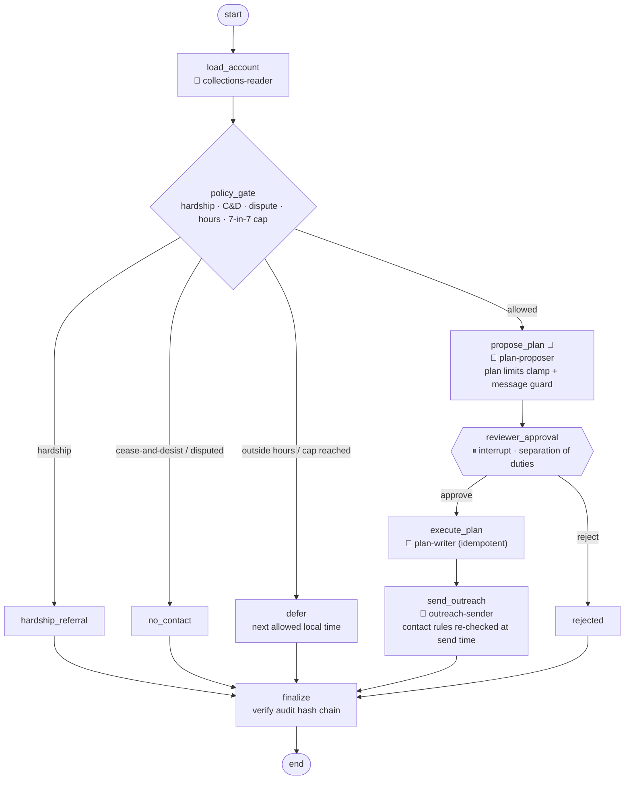

# 09 · Collections Agent: governance-first agentic workflow

> **Status:** ✅ Built. `pytest projects/09-collections-agent` runs 12 offline tests. `python run.py` runs the demo (`--reject` makes the reviewer decline).

## Business problem

Accounts-receivable teams chase overdue invoices and negotiate payment plans. It's a strong
fit for automation, and it's also **one of the most regulated things an agent can do**. Debt
collection has contact-hour and frequency rules, cease-and-desist and dispute handling,
hardship obligations, and banned language, and every action has to hold up in an audit. An
agent here is only acceptable if it is:

- **least-privilege**: the part that reads accounts can't send messages or write plans
- **policy-bound**: hardship, cease-and-desist, disputes, allowed hours, and frequency caps
  are enforced in code, not by prompts
- **human-gated**: no payment plan is created without a named reviewer's approval
- **auditable**: every read, write, decision, and denial is in a tamper-evident log, with PII
  masked

## Graph



🔑 marks the tool identity a node runs as. The compiled graph is exported to [`graph.mmd`](graph.mmd).

### Scoped tool registry

| Identity | Scopes | Tools |
|----------|--------|-------|
| `collections-reader` | `accounts:read`, `history:read` | `get_account`, `get_contact_history` |
| `plan-proposer` | `accounts:read`, `plans:propose` | `get_account`, `quote_plan` (no side effects) |
| `plan-writer` | `plans:write` | `create_payment_plan`, used only after approval |
| `outreach-sender` | `messages:send` | `send_message` |

Out-of-scope calls raise `PermissionDenied` and are written to the audit log as
`permission_denied`.

## Design decisions

- **Separate identities per capability, not one god-agent.** Each node gets a `ScopedClient`
  bound to one identity, and the registry checks the tool's required scope on every call. In
  production these would be separate Entra ID managed identities or service principals with
  their own RBAC and secrets, so a prompt-injected or buggy drafting step *physically can't*
  write a plan. Tests assert that the only identities that ever performed writes are
  `plan-writer` and `outreach-sender`.
- **Policy lives in deterministic code.** `policy.py` covers hardship referral, cease-and-desist,
  disputes, 08:00–21:00 in the *debtor's* time zone, and max 7 attempts in 7 days. The LLM is
  never asked whether it's allowed to contact someone. Contact rules are **re-checked at send
  time**, because a human review can push past 21:00. In that case the plan is created and the
  message is deferred.
- **The LLM proposes, policy clamps, a human approves.** The negotiator LLM sees a minimised,
  PII-free view (balance and days past due only). Proposals outside the limits (≤12 months,
  ≥$25 installment, ≤10% discount) are clamped and the violations are shown to the reviewer.
  Drafted messages that contain banned phrases (threats, lawsuit, arrest, third-party
  disclosure) or lack the debt-collector disclosure are replaced with an approved template.
- **Human-in-the-loop with `interrupt()` plus a checkpointer.** The reviewer receives a masked
  request and resumes with `Command(resume={"decision", "reviewer"})`. Separation of duties:
  a missing reviewer, or a reviewer that is one of the agent identities, is auto-rejected.
  Plan writes are idempotent, so retries and resumes can't double-book.
- **Tamper-evident audit.** Each entry stores `prev_hash`, and `hash = sha256(prev_hash +
  canonical JSON)`. `verify()` recomputes the chain and reports the first bad sequence number,
  so edits, deletions, and reordering are all detected. PII is masked **before** it's written:
  sensitive keys are redacted (name becomes `M***`), emails, phones, and account numbers are
  pattern-masked, and message bodies are stored only as a `sha256:` fingerprint, which is
  enough to prove what was sent without storing it.

## How to run

```bash
python projects/09-collections-agent/run.py            # 5 accounts: approve path + 4 policy branches + audit
python projects/09-collections-agent/run.py --reject   # reviewer declines -> nothing is written
python projects/09-collections-agent/run.py --mermaid projects/09-collections-agent/graph.mmd
pytest projects/09-collections-agent
```

## Interview talking points

1. **Least privilege for agents.** Tool identities are scoped per capability (read, propose,
   write, send), denials are audited, and write identities are only reachable after human
   approval. It's the same principle as RBAC for microservices, applied to LLM tool use.
2. **Governance in code, not prompts.** Regulatory contact rules and hardship handling are
   deterministic, testable functions, and they're re-checked at the moment of action
   (time-of-check vs time-of-use).
3. **HITL done properly.** Durable `interrupt()` with a checkpointer, a masked review payload,
   clamped violations surfaced to the reviewer, separation of duties, and idempotent writes
   after resume.
4. **Audit you can defend.** A hash-chained log with verification (tests tamper with it and
   delete from it), PII masking at write time, and body fingerprints. In production, anchor the
   chain head in immutable storage (Azure immutable blob / WORM) or a ledger database
   periodically.
5. **Production path.** Managed identities per tool, Key Vault, APIM in front of write APIs,
   Postgres checkpointer, a reviewer UI in Teams, consent and channel preferences, and
   observability via LangSmith / App Insights with the audit log as the system of record.
