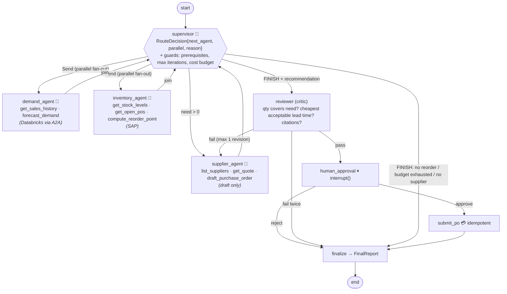

# 10 · Supply-Chain Multi-Agent: supervisor, specialists, critic, human approval

> **Status:** ✅ Built. `pytest projects/10-supply-chain-multi-agent` runs 23 offline tests, and `python run.py` runs the demo.

## Business problem

Replenishment decisions need data from systems owned by different teams. Demand signals live
in the data platform (Databricks), stock, open POs and MRP parameters live in the ERP (SAP),
and prices and lead times come from suppliers. Today a planner copies numbers between three
screens, works out how much to order, picks a vendor (often the "usual" one, not the cheapest
acceptable one), and raises a PO. It's slow, error-prone, and hard to audit.

This project handles that decision with a **team of specialist agents under a supervisor**:

- The demand and inventory agents gather facts **in parallel**.
- The supplier agent sources quotes and **drafts** a PO.
- A **reviewer** checks the math, the vendor choice, and the provenance of every number, and
  can send the supplier agent back once.
- A **human buyer approves** before anything is sent. Submission is **idempotent**, so a retry
  never sends the same PO twice.

## Graph



The diagram above is hand-labelled. The compiled graph exported by LangGraph is in
[`graph.mmd`](graph.mmd). You can regenerate it with `python run.py --mermaid graph.mmd`.

### Code map

| File | What it holds |
|------|---------------|
| `supply_chain/state.py` | `SupplyChainState`: `messages` (`add_messages`), `slots` (dict-merge reducer so parallel agents never clash), `hops` / `cost_units` (additive reducers). Also the `RouteDecision`, `Recommendation`, and `FinalReport` Pydantic models |
| `supply_chain/supervisor.py` | Supervisor prompt, the compact status it sees, the deterministic `plan_next` policy, the guard (`validate`), and the mock supervisor LLM |
| `supply_chain/agents.py` | `Specialist` wrapper around `langchain.agents.create_agent` (one per agent, each with its own prompt and tools), plus the deterministic tool-calling mock LLMs |
| `supply_chain/tools.py` | Per-agent tool factories (least privilege). Tools return `(summary, artifact)` |
| `supply_chain/reviewer.py` | Critic checks |
| `supply_chain/policy.py` | Pure math: need quantity, acceptable quotes, budgets |
| `supply_chain/services.py` | Mock sales warehouse, ERP (drafts plus **idempotent submit**), supplier network (with an outage), and notifier (fault injection) |
| `supply_chain/graph.py` | Nodes, `Send` fan-out, `Command` routing from reviewer and approval, interrupt, checkpointer |
| `supply_chain/demo.py` / `run.py` | CLI demo with the hop trace |

### Scenarios (mock data)

| SKU | What happens |
|-----|--------------|
| SKU-100 | Needs 309 units. Acme is both preferred and cheapest acceptable. Pauses for approval, then submits |
| SKU-200 | Stock covers forecast plus safety stock, so the supervisor finishes **without** calling the supplier agent |
| SKU-300 | The preferred supplier's (Umbrella) quote API is down, and Wayne's 30-day lead time is too long, so it **falls back** to Stark |
| SKU-400 | The supplier agent picks preferred Hooli ($5.00). The **reviewer** rejects it in favour of PiedPiper ($4.60, 10 days), and the second draft passes |
| SKU-100 (reject) | The buyer rejects, so no PO is submitted |

## Design decisions

**Supervisor vs swarm vs single agent.**
- **Single agent:** one agent holding all eight tools and all the context would work at this
  size, but it breaks least privilege (the forecaster could draft POs). It also bloats every
  prompt with every tool schema and makes failures hard to pin on anyone.
- **Swarm:** peer-to-peer handoffs suit open-ended conversations, where the active agent talks
  to the user and hands off. But control flow gets harder to reason about, bound, and audit.
- **Supervisor:** a supervisor fits a **known business process with independent sub-tasks**. It
  gives one place for routing, budgets, and guards, one place to parallelise (demand and
  inventory don't depend on each other), and a clean trace of "who did what, when".

**LLM proposes, code disposes.** The supervisor LLM returns a structured `RouteDecision`.
`validate()` enforces prerequisites: no sourcing before forecast and stock exist, no FINISH
before the plan is complete, and only independent agents may run in parallel. Invalid or
unparseable output falls back to the deterministic `plan_next` policy, and the hop is flagged
`overridden`. A **max-iterations** guard and a **cost budget** (LLM calls plus tool calls)
stop runaway loops.

**Numbers come from tools, not prose.** Tools use `response_format="content_and_artifact"`.
The LLM reads a short summary, while the graph reads the typed artifact. Every number in the
recommendation has a **citation** to the agent and tool that produced it, e.g.
`inventory_agent.get_open_pos` or `supplier_agent.get_quote(Acme)`. If a specialist skips its
tool, the wrapper computes the value deterministically and tags it `*.guard_fallback`.

**Critic with bounded retries.** The reviewer checks three things: the quantity covers
`forecast − on hand − open POs + safety stock`, the chosen supplier is the cheapest quote
with a lead time of 14 days or less, and every number is cited from the right agent. On
failure it sends concrete feedback to the supplier agent **once** (`Command(goto=...)`). A
second failure escalates instead of looping.

**HITL and idempotency.** `interrupt()` in `human_approval` pauses the run, and `MemorySaver`
persists it. The buyer resumes with `Command(resume={"approved": ..., "approver": ...})`.
Submission uses `po-submit:{draft_id}` as an idempotency key. The tests crash the notifier
*after* the ERP accepted the PO, resume from the checkpoint, and confirm the supplier got
exactly one PO. No agent has a submit tool. Sending a PO is a graph node, not an LLM choice.

**Tracing and audit.** Every hop appends to `state["hops"]`: step, agent, tools called,
LLM-call count, duration, supervisor reason, reviewer issues, approver. It's checkpointed with
the run, so it doubles as an audit log. In production I'd also emit the same spans to
**OpenTelemetry** (Azure Monitor / App Insights) or **LangSmith**. Setting
`LANGSMITH_TRACING=true` plus an API key traces LangGraph runs with no code changes. That's
noted here and not wired up, to keep the repo offline.

## Mapping to production: A2A with SAP and Databricks on Azure

| This repo | Production on Azure |
|-----------|---------------------|
| `Specialist.run(task) -> AgentRun` | An **A2A** client call to a remote agent. The supervisor only depends on this interface |
| `demand_agent` + `SalesWarehouse` | A **Databricks** agent (Mosaic AI Agent Framework / model serving) over Unity Catalog sales tables, exposed as an A2A endpoint |
| `inventory_agent` + `Erp` | A **SAP** agent (SAP Joule / BTP, or an MCP/OData tool server over S/4HANA MM/MRP APIs), read-only scope |
| `supplier_agent` | An agent in **Azure AI Foundry Agent Service** / **Microsoft Agent Framework**, with tools for supplier portal / Ariba quotes and a PO *draft* API |
| `submit_po` + idempotency key | An S/4HANA PO create call behind an approval gate, with an idempotency key or ERP external reference |
| `interrupt()` + `MemorySaver` | A durable checkpointer (Postgres / Cosmos DB), with approval surfaced in Teams (Adaptive Card) that calls `Command(resume=...)` |
| Least-privilege tool sets | Separate managed identities / Entra app registrations per agent, APIM policies, and Key Vault for secrets |
| `hops` audit list | OpenTelemetry → Azure Monitor, plus Foundry tracing and an immutable audit store |

A LangGraph supervisor can orchestrate agents built on other frameworks through A2A. Each team
owns and deploys its own agent, and the orchestrator owns routing, budgets, review, and approval.

## How to run

From the repo root, after `uv sync --all-extras --group dev`:

```bash
python projects/10-supply-chain-multi-agent/run.py                 # all scenarios with hop trace
python projects/10-supply-chain-multi-agent/run.py --sku SKU-300   # one SKU
python projects/10-supply-chain-multi-agent/run.py --mermaid projects/10-supply-chain-multi-agent/graph.mmd
pytest projects/10-supply-chain-multi-agent                        # 23 tests, offline
```

To use a real model, set the Azure OpenAI or OpenAI variables from `.env.example`. The
supervisor and all three specialists then use the real model for routing and tool calling,
and the guards, reviewer, and approval step stay the same.

### Tests

The tests cover:
- routing order
- parallel fan-out running in one super-step, followed by a single supervisor join
- the no-reorder path
- the fallback supplier
- the reviewer loop, and the reviewer giving up after one revision
- citations on every number
- approval then submit, and rejection
- idempotent submit after a crash
- the max-iterations guard and the cost-budget guard
- the supervisor guard overriding invalid or unparseable LLM output
- the fallback when a specialist skips its tools
- least-privilege tool scopes (no submit tool anywhere)

## Interview talking points

1. **Choosing the topology.** I'd pick a supervisor over a swarm or a single agent because the
   process is known, the sub-tasks are independent, and I want one place for budgets, guards,
   and audit. A swarm fits open-ended multi-turn conversation better. A single agent is fine
   until tool count and privilege scope grow.
2. **Parallelism and state design.** `Send` fans demand and inventory out in the same
   super-step. Reducers (`add_messages`, a dict-merge on `slots`, additive `hops` and
   `cost_units`) make concurrent writes safe, and the supervisor acts as the join. I can explain
   why a plain `dict` key would raise `InvalidUpdateError` under parallel writes.
3. **Controlling non-determinism.** The LLM proposes routes and tool calls, and deterministic
   guards validate them. Numbers flow through tool artifacts with per-number citations. There
   are max iterations, a cost budget, and one bounded critic retry. The failure modes are
   named, tested, and show up in the trace.
4. **Safe side effects.** Agents can only *draft*. Submission sits behind `interrupt()` and an
   idempotency key, so crash-and-retry is proven not to double-send a PO. Least privilege is
   enforced by construction, since each agent's tool factory only closes over its own system.
5. **Path to production on Azure.** Each specialist maps to a remote agent over A2A: Databricks
   for demand, SAP for inventory, Foundry / Agent Framework for sourcing. It needs a durable
   checkpointer, Teams approval cards, per-agent managed identities, and OpenTelemetry or
   LangSmith tracing. The in-process `Specialist.run` interface is the seam where the swap
   happens.

## Project structure

| Path | What it is |
|---|---|
| [`supply_chain/`](supply_chain/README.md) | The importable package (graph, prompts and mock model, domain logic, eval suite, demo CLI), with a file-by-file map. |
| [`tests/`](tests/README.md) | Pytest suite (23 tests), including chaos tests generated from `doctrine.yaml`. |
| [`evals/`](evals/README.md) | Golden set (17 cases) and the latest `scores.json`. |
| [`run.py`](run.py) | Demo entry point: `python projects/10-supply-chain-multi-agent/run.py` (adds the package and repo root to `sys.path`). |
| [`doctrine.yaml`](doctrine.yaml) | Machine-checked doctrine card: planes, systems of record, corpus and ACL, stop conditions, five-exit table, chaos scenarios, eval thresholds, KPIs. |
| [`DOCTRINE.md`](DOCTRINE.md) | Generated from the card and `evals/scores.json` by `python -m shared.doctrine render`; do not edit by hand. |
| [`graph.mmd`](graph.mmd) | Mermaid diagram of the compiled graph (regenerate with `run.py --mermaid`). |

Shared platform code (context builder, tool gateway, MCP kit, resilience, evals, doctrine) lives in
[`shared/`](../../shared/README.md).

## Doctrine compliance

This agent meets the portfolio's production-readiness doctrine. The full card is in
[`DOCTRINE.md`](DOCTRINE.md), generated from [`doctrine.yaml`](doctrine.yaml).

What the doctrine upgrade changed:

- **Systems of record behind MCP, one identity per agent.** Specialist tools keep their names
  but now call MCP servers through scoped `ToolGateway`s (`supply_chain/sor.py`):
  - demand → `analytics.get_measure` (certified `weekly_units` measure, not free SQL)
  - inventory → `erp.get_stock`, `erp.get_open_purchase_orders`
  - supplier → `suppliers.list_suppliers`, `suppliers.get_supplier_quote`, `erp.create_po_draft`
  - orchestrator (`submit_po` only) → `erp.submit_purchase_order`, `erp.cancel_po_draft`
- **Five exits per node.**
  - Model down: supervisor falls back to the deterministic plan policy; demand/inventory use
    their guard fallbacks; the supplier agent does deterministic cheapest-acceptable sourcing.
  - ERP or semantic model down after retries: the run is deferred (`sor_unavailable`) instead
    of planning on partial data.
  - Release fails after approval: the draft is cancelled (compensation) and the buyer is told.
  - Injected text in a supplier quote is neutralised by the gateway and recorded as an exit.
- **Tracing and exit records.** OTel spans are on, and exits go to `state["exits"]`.

```bash
python -m evals --project 10
pytest projects/10-supply-chain-multi-agent/tests/test_chaos.py
```
