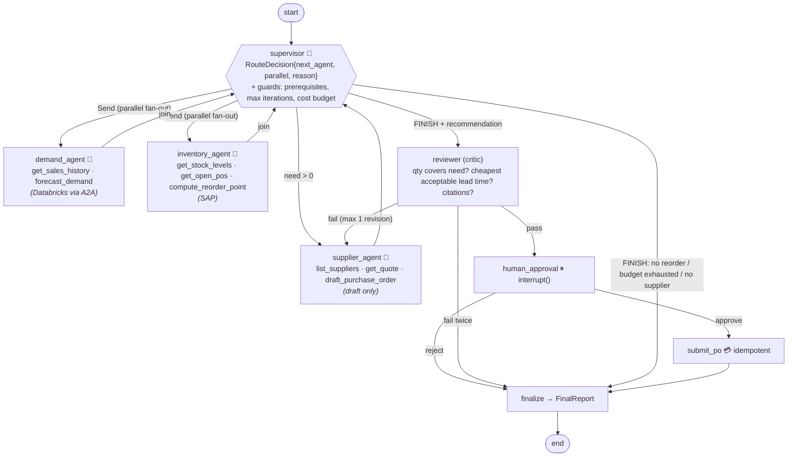

# 10 · Supply-Chain Multi-Agent: supervisor, specialists, critic, human approval

> **Status:** ✅ Built. `pytest projects/10-supply-chain-multi-agent` runs 23 offline tests, and `python run.py` runs the demo.

**Sections:** [1. Purpose](#1-purpose) · [2. Architecture](#2-architecture) · [3. How it works](#3-how-it-works) · [4. Key files](#4-key-files) · [5. Code excerpts](#5-code-excerpts) · [6. Configuration](#6-configuration) · [7. Commands](#7-commands) · [8. Real output](#8-real-output) · [9. Tests and eval gates](#9-tests-and-eval-gates) · [10. Guardrails](#10-guardrails) · [11. Security and governance](#11-security-and-governance) · [12. Observability](#12-observability) · [13. Failure modes](#13-failure-modes) · [14. Mapping to Azure services](#14-mapping-to-azure-services) · [15. Limitations](#15-limitations) · [16. Interview talking points](#16-interview-talking-points) · [17. Adopt this](#17-adopt-this)

## 1. Purpose

Replenishment decisions need data from systems owned by different teams. Demand signals live
in the data platform (Databricks), stock, open POs and MRP parameters live in the ERP (SAP),
and prices and lead times come from suppliers. Today a planner copies numbers between three
screens, works out how much to order, picks a vendor (often the "usual" one, not the cheapest
acceptable one), and raises a PO. It's slow, error-prone, and hard to audit.

This project handles that decision with a **team of specialist agents under a supervisor**:

- The demand and inventory agents gather facts **in parallel**.
- The supplier agent sources quotes and **drafts** a PO.
- A **reviewer** checks the math, the vendor choice, and the provenance of every number, and
  can send the supplier agent back once.
- A **human buyer approves** before anything is sent. Submission is **idempotent**, so a retry
  never sends the same PO twice.

> **In one line (from `doctrine.yaml`):** A supervisor routes a demand agent and an inventory agent in parallel, then a sourcing agent that drafts one purchase order. A deterministic reviewer checks quantity, lead time, vendor choice and the provenance of every number, a buyer approves, and only then does the orchestrator release the PO (idempotently) in the ERP.

## 2. Architecture

### Graph


```mermaid
flowchart TD
    START([start]) --> SUP{{"supervisor 🤖<br/>RouteDecision{next_agent, parallel, reason}<br/>+ guards: prerequisites, max iterations, cost budget"}}
    SUP -- "Send (parallel fan-out)" --> DEM["demand_agent 🤖<br/>get_sales_history · forecast_demand<br/><i>(Databricks via A2A)</i>"]
    SUP -- "Send (parallel fan-out)" --> INV["inventory_agent 🤖<br/>get_stock_levels · get_open_pos · compute_reorder_point<br/><i>(SAP)</i>"]
    DEM -- join --> SUP
    INV -- join --> SUP
    SUP -- "need > 0" --> SUPP["supplier_agent 🤖<br/>list_suppliers · get_quote · draft_purchase_order<br/><i>(draft only)</i>"]
    SUPP --> SUP
    SUP -- "FINISH + recommendation" --> REV["reviewer (critic)<br/>qty covers need? cheapest acceptable lead time? citations?"]
    REV -- "fail (max 1 revision)" --> SUPP
    REV -- pass --> HITL["human_approval ⏸ interrupt()"]
    HITL -- approve --> SUB["submit_po 💳 idempotent"]
    HITL -- reject --> FIN
    REV -- "fail twice" --> FIN
    SUP -- "FINISH: no reorder / budget exhausted / no supplier" --> FIN["finalize → FinalReport"]
    SUB --> FIN
    FIN --> END([end])
```

The diagram above is hand-labelled. The compiled graph exported by LangGraph is in
[`graph.mmd`](graph.mmd). You can regenerate it with `python run.py --mermaid graph.mmd`.

#### Scenarios (mock data)

| SKU | What happens |
|-----|--------------|
| SKU-100 | Needs 309 units. Acme is both preferred and cheapest acceptable. Pauses for approval, then submits |
| SKU-200 | Stock covers forecast plus safety stock, so the supervisor finishes **without** calling the supplier agent |
| SKU-300 | The preferred supplier's (Umbrella) quote API is down, and Wayne's 30-day lead time is too long, so it **falls back** to Stark |
| SKU-400 | The supplier agent picks preferred Hooli ($5.00). The **reviewer** rejects it in favour of PiedPiper ($4.60, 10 days), and the second draft passes |
| SKU-100 (reject) | The buyer rejects, so no PO is submitted |

### Planes

<!-- output-md: python scripts/doc_tables.py 10 planes -->
| Plane | What this project depends on |
|---|---|
| Experience | buyer approval step (interrupt payload with recommendation, review result and per-number citations); buyer channel notification after release |
| Agent | LangGraph supervisor graph - supervisor (LLM + guards) fans out demand/inventory in parallel (Send), then supplier; reviewer critic; human_approval interrupt; submit_po |
| Knowledge | none at runtime (procurement policy and planning math are deterministic code); supplier quote text is treated as untrusted and sanitised |
| Data | certified semantic model (weekly_units measure), SAP-like ERP (stock, open POs, PO drafts, release, cancel) and supplier portal via MCP, one scoped gateway per agent |
<!-- /output -->

## 3. How it works

Step by step, one line per graph node (the same nodes the promotion gate checks against the compiled graph):

<!-- output-md: python scripts/doc_tables.py 10 steps -->
1. **`supervisor`**: LLM route accepted by the prerequisite guards.
2. **`demand_agent`**: forecast from the forecast_demand tool (semantic model).
3. **`inventory_agent`**: stock, open POs and safety stock from ERP tools.
4. **`supplier_agent`**: one draft PO with quotes as evidence.
5. **`reviewer`**: recommendation passes quantity, lead-time, vendor and citation checks.
6. **`human_approval`**: buyer approves.
7. **`submit_po`**: PO released once (idempotency key po-submit:<draft>); replay after a crash returns the same PO.
8. **`finalize`**: FinalReport with outcome, citations and hop count.
<!-- /output -->

### Design decisions

**Supervisor vs swarm vs single agent.**
- **Single agent:** one agent holding all eight tools and all the context would work at this
  size, but it breaks least privilege (the forecaster could draft POs). It also bloats every
  prompt with every tool schema and makes failures hard to pin on anyone.
- **Swarm:** peer-to-peer handoffs suit open-ended conversations, where the active agent talks
  to the user and hands off. But control flow gets harder to reason about, bound, and audit.
- **Supervisor:** a supervisor fits a **known business process with independent sub-tasks**. It
  gives one place for routing, budgets, and guards, one place to parallelise (demand and
  inventory don't depend on each other), and a clean trace of "who did what, when".

**LLM proposes, code disposes.** The supervisor LLM returns a structured `RouteDecision`.
`validate()` enforces prerequisites: no sourcing before forecast and stock exist, no FINISH
before the plan is complete, and only independent agents may run in parallel. Invalid or
unparseable output falls back to the deterministic `plan_next` policy, and the hop is flagged
`overridden`. A **max-iterations** guard and a **cost budget** (LLM calls plus tool calls)
stop runaway loops.

**Numbers come from tools, not prose.** Tools use `response_format="content_and_artifact"`.
The LLM reads a short summary, while the graph reads the typed artifact. Every number in the
recommendation has a **citation** to the agent and tool that produced it, e.g.
`inventory_agent.get_open_pos` or `supplier_agent.get_quote(Acme)`. If a specialist skips its
tool, the wrapper computes the value deterministically and tags it `*.guard_fallback`.

**Critic with bounded retries.** The reviewer checks three things: the quantity covers
`forecast − on hand − open POs + safety stock`, the chosen supplier is the cheapest quote
with a lead time of 14 days or less, and every number is cited from the right agent. On
failure it sends concrete feedback to the supplier agent **once** (`Command(goto=...)`). A
second failure escalates instead of looping.

**HITL and idempotency.** `interrupt()` in `human_approval` pauses the run, and `MemorySaver`
persists it. The buyer resumes with `Command(resume={"approved": ..., "approver": ...})`.
Submission uses `po-submit:{draft_id}` as an idempotency key. The tests crash the notifier
*after* the ERP accepted the PO, resume from the checkpoint, and confirm the supplier got
exactly one PO. No agent has a submit tool. Sending a PO is a graph node, not an LLM choice.

**Tracing and audit.** Every hop appends to `state["hops"]`: step, agent, tools called,
LLM-call count, duration, supervisor reason, reviewer issues, approver. It's checkpointed with
the run, so it doubles as an audit log. In production I'd also emit the same spans to
**OpenTelemetry** (Azure Monitor / App Insights) or **LangSmith**. Setting
`LANGSMITH_TRACING=true` plus an API key traces LangGraph runs with no code changes. That's
noted here and not wired up, to keep the repo offline.

## 4. Key files

| Path | What it is |
|---|---|
| [`supply_chain/`](supply_chain/README.md) | The importable package (graph, prompts and mock model, domain logic, eval suite, demo CLI), with a file-by-file map. |
| [`tests/`](tests/README.md) | Pytest suite (23 tests), including chaos tests generated from `doctrine.yaml`. |
| [`evals/`](evals/README.md) | Golden set (17 cases) and the latest `scores.json`. |
| [`run.py`](run.py) | Demo entry point: `python projects/10-supply-chain-multi-agent/run.py` (adds the package and repo root to `sys.path`). |
| [`doctrine.yaml`](doctrine.yaml) | Machine-checked doctrine card: planes, systems of record, corpus and ACL, stop conditions, five-exit table, chaos scenarios, eval thresholds, KPIs. |
| [`DOCTRINE.md`](DOCTRINE.md) | Generated from the card and `evals/scores.json` by `python -m shared.doctrine render`; do not edit by hand. |
| [`graph.mmd`](graph.mmd) | Mermaid diagram of the compiled graph (regenerate with `run.py --mermaid`). |

Shared platform code (context builder, tool gateway, MCP kit, resilience, evals, doctrine) lives in
[`shared/`](../../shared/README.md).

### Code map

| File | What it holds |
|------|---------------|
| `supply_chain/state.py` | `SupplyChainState`: `messages` (`add_messages`), `slots` (dict-merge reducer so parallel agents never clash), `hops` / `cost_units` (additive reducers). Also the `RouteDecision`, `Recommendation`, and `FinalReport` Pydantic models |
| `supply_chain/supervisor.py` | Supervisor prompt, the compact status it sees, the deterministic `plan_next` policy, the guard (`validate`), and the mock supervisor LLM |
| `supply_chain/agents.py` | `Specialist` wrapper around `langchain.agents.create_agent` (one per agent, each with its own prompt and tools), plus the deterministic tool-calling mock LLMs |
| `supply_chain/tools.py` | Per-agent tool factories (least privilege). Tools return `(summary, artifact)` |
| `supply_chain/reviewer.py` | Critic checks |
| `supply_chain/policy.py` | Pure math: need quantity, acceptable quotes, budgets |
| `supply_chain/services.py` | Mock sales warehouse, ERP (drafts plus **idempotent submit**), supplier network (with an outage), and notifier (fault injection) |
| `supply_chain/graph.py` | Nodes, `Send` fan-out, `Command` routing from reviewer and approval, interrupt, checkpointer |
| `supply_chain/demo.py` / `run.py` | CLI demo with the hop trace |

## 5. Code excerpts

The graph wiring, from `build_graph` in [`graph.py`](supply_chain/graph.py) (node functions are defined above it in the same file):

<!-- code: projects/10-supply-chain-multi-agent/supply_chain/graph.py::build_graph|StateGraph( -->
```python
# build_graph() continued: wiring
g = StateGraph(SupplyChainState)
g.add_node("supervisor", supervisor)
g.add_node("demand_agent", demand_agent)
g.add_node("inventory_agent", inventory_agent)
g.add_node("supplier_agent", supplier_agent)
g.add_node("reviewer", reviewer, destinations=("human_approval", "supplier_agent", "finalize"))
g.add_node("human_approval", human_approval, destinations=("submit_po", "finalize"))
g.add_node("submit_po", submit_po)
g.add_node("finalize", finalize)

g.add_edge(START, "supervisor")
g.add_conditional_edges(
    "supervisor",
    route_from_supervisor,
    [*AGENT_NODES.values(), "reviewer", "finalize"],
)
for node in AGENT_NODES.values():
    g.add_edge(node, "supervisor")
g.add_edge("submit_po", "finalize")
g.add_edge("finalize", END)
return g.compile(checkpointer=checkpointer or MemorySaver(), name="supply_chain")
```
<!-- /code -->

How one golden case is run and scored, from `run_case` in [`eval_suite.py`](supply_chain/eval_suite.py):

<!-- code: projects/10-supply-chain-multi-agent/supply_chain/eval_suite.py::run_case -->
```python
def run_case(case: dict[str, Any]) -> CaseResult:
    inp, exp = case["input"], case["expect"]
    r, s = run(inp)
    outcome = r.get("outcome", "pending_approval" if "__interrupt__" in r else "none")
    success = outcome == exp["outcome"]
    rec = (r.get("slots") or {}).get("recommendation") or {}
    if "supplier" in exp:
        success &= rec.get("supplier") == exp["supplier"]
    if "qty" in exp:
        success &= rec.get("qty") == exp["qty"]
    if "exit" in exp:
        success &= [exp["exit"]["node"], exp["exit"]["exit"]] in [
            [e["node"], e["exit"]] for e in r.get("exits", [])
        ]
    approved = inp.get("decision") == "approve"
    text = str(s.notifier.sent) + str(r.get("final", {}))
    violation = (
        (bool(s.erp.submitted) and not approved)
        or len(s.erp.submitted) > 1
        or (bool(s.erp.submitted) and rec.get("lead_time_days", 0) > MAX_LEAD_TIME_DAYS)
        or "admin mode" in text.lower()
    )
    return CaseResult(
        case["id"],
        success,
        None,
        violation,
        detail=f"outcome={outcome} supplier={rec.get('supplier')} submitted={len(s.erp.submitted)}",
    )
```
<!-- /code -->

## 6. Configuration

| Setting | Where | Effect |
|---|---|---|
| `LLM_PROVIDER` | environment | `mock` (default when nothing is set), `azure` or `openai` |
| `AZURE_OPENAI_ENDPOINT`, `AZURE_OPENAI_DEPLOYMENT` | environment | real Azure OpenAI model, keyless through `DefaultAzureCredential`; `AZURE_OPENAI_API_KEY` only if set |
| `AZURE_OPENAI_FALLBACK_DEPLOYMENT` | environment | second deployment behind the circuit breaker |
| `CHAOS_FAULTS` | environment | inject faults for a demo run; this project's scenarios: `model`, `sor:erp`, `sor:erp.submit_purchase_order`, `jailbreak` |
| `OTEL_CONSOLE=1` / `OTEL_EXPORTER_OTLP_ENDPOINT` | environment | print spans, or ship them to a collector |
| `doctrine.yaml` | this folder | thresholds, stop conditions, identities, KPIs, chaos scenarios |
| `evals/golden.jsonl` | this folder | golden cases the eval gate runs |

Eval thresholds the gate enforces:

<!-- output-md: python scripts/doc_tables.py 10 thresholds -->
| Metric | Threshold (doctrine.yaml) | Current (evals/scores.json) |
|---|---|---|
| `task_success` | `>=0.9` | 1.00 |
| `policy_violation_rate` | `<=0` | 0.00 |
| `cost_per_task` | `<=0.003` | 0.00023 |
<!-- /output -->

## 7. Commands

From the repo root, after `uv sync --all-extras --group dev`:

```bash
python projects/10-supply-chain-multi-agent/run.py                 # all scenarios with hop trace
python projects/10-supply-chain-multi-agent/run.py --sku SKU-300   # one SKU
python projects/10-supply-chain-multi-agent/run.py --mermaid projects/10-supply-chain-multi-agent/graph.mmd
pytest projects/10-supply-chain-multi-agent   # 23 tests, offline
```

To use a real model, set the Azure OpenAI or OpenAI variables from `.env.example`. The
supervisor and all three specialists then use the real model for routing and tool calling,
and the guards, reviewer, and approval step stay the same.

### Gates for this project

```bash
pytest projects/10-supply-chain-multi-agent   # unit + chaos tests, offline
python -m evals --project 10 --no-write   # golden set vs doctrine thresholds
python -m shared.doctrine validate   # promotion gate (all projects)
python scripts/render_docs.py --check   # this README's pasted output is current
```

## 8. Real output

`python projects/10-supply-chain-multi-agent/run.py` against the mock model (pasted by `scripts/render_docs.py`; timings are masked because they change per run; trace and span ids are masked):

<!-- output: python projects/10-supply-chain-multi-agent/run.py | sed -E 's/^( +[0-9]+ +[a-z_]+) +[0-9.]+ +/\1  <ms>  /' -->
```text
=== SKU-100: reorder needed -> HITL approve ===
  PAUSED before submit: 309 x SKU-100 from Acme @ 4.10 = $1,266.90 (DRAFT-001)
  human decision: {'approved': True, 'approver': 'buyer-lee', 'note': 'demo'}
  step  agent                 ms  detail
     1  supervisor  <ms>  route ['demand', 'inventory'] - forecast and stock are independent: fan out in parallel
     2  demand_agent  <ms>  tools ['get_sales_history', 'forecast_demand']
     2  inventory_agent  <ms>  tools ['get_stock_levels', 'get_open_pos', 'compute_reorder_point']
     3  supervisor  <ms>  route ['supplier'] - need 309 units: source it
     4  supplier_agent  <ms>  tools ['list_suppliers', 'get_quote', 'get_quote', 'get_quote', 'draft_purchase_order']
     5  supervisor  <ms>  route ['FINISH'] - sourcing complete: send to reviewer
     6  reviewer  <ms>  PASS
     7  human_approval  <ms>  approved=True by buyer-lee
     8  submit_po  <ms>  PO 4500000001 replayed=False
  OUTCOME: po_submitted - PO 4500000001 submitted: 309 x SKU-100 from Acme.

=== SKU-200: enough stock -> finish without supplier agent ===
  step  agent                 ms  detail
     1  supervisor  <ms>  route ['demand', 'inventory'] - forecast and stock are independent: fan out in parallel
     2  demand_agent  <ms>  tools ['get_sales_history', 'forecast_demand']
     2  inventory_agent  <ms>  tools ['get_stock_levels', 'get_open_pos', 'compute_reorder_point']
     3  supervisor  <ms>  route ['FINISH'] - stock covers forecast + safety stock
  OUTCOME: no_reorder - No reorder for SKU-200: stock covers forecast + safety stock.

=== SKU-300: preferred supplier quote unavailable -> fallback ===
  PAUSED before submit: 207 x SKU-300 from Stark @ 7.50 = $1,552.50 (DRAFT-002)
  human decision: {'approved': True, 'approver': 'buyer-lee', 'note': 'demo'}
  step  agent                 ms  detail
     1  supervisor  <ms>  route ['demand', 'inventory'] - forecast and stock are independent: fan out in parallel
     2  demand_agent  <ms>  tools ['get_sales_history', 'forecast_demand']
     2  inventory_agent  <ms>  tools ['get_stock_levels', 'get_open_pos', 'compute_reorder_point']
     3  supervisor  <ms>  route ['supplier'] - need 207 units: source it
     4  supplier_agent  <ms>  tools ['list_suppliers', 'get_quote', 'get_quote', 'get_quote', 'draft_purchase_order'] | quote unavailable: ['Umbrella'] -> fallback
     5  supervisor  <ms>  route ['FINISH'] - sourcing complete: send to reviewer
     6  reviewer  <ms>  PASS
     7  human_approval  <ms>  approved=True by buyer-lee
     8  submit_po  <ms>  PO 4500000002 replayed=False
  OUTCOME: po_submitted - PO 4500000002 submitted: 207 x SKU-300 from Stark.

=== SKU-400: reviewer loop: preferred supplier not cheapest acceptable ===
  PAUSED before submit: 252 x SKU-400 from PiedPiper @ 4.60 = $1,159.20 (DRAFT-004)
  human decision: {'approved': True, 'approver': 'buyer-lee', 'note': 'demo'}
  step  agent                 ms  detail
     1  supervisor  <ms>  route ['demand', 'inventory'] - forecast and stock are independent: fan out in parallel
     2  demand_agent  <ms>  tools ['get_sales_history', 'forecast_demand']
     2  inventory_agent  <ms>  tools ['get_stock_levels', 'get_open_pos', 'compute_reorder_point']
     3  supervisor  <ms>  route ['supplier'] - need 252 units: source it
     4  supplier_agent  <ms>  tools ['list_suppliers', 'get_quote', 'get_quote', 'draft_purchase_order']
     5  supervisor  <ms>  route ['FINISH'] - sourcing complete: send to reviewer
     6  reviewer  <ms>  FAIL ['Hooli @ 5.00 is not the cheapest acceptable quote; use PiedPiper @ 4.60 (10d)']
     7  supplier_agent  <ms>  tools ['list_suppliers', 'get_quote', 'get_quote', 'draft_purchase_order']
     8  supervisor  <ms>  route ['FINISH'] - sourcing complete: send to reviewer
     9  reviewer  <ms>  PASS
    10  human_approval  <ms>  approved=True by buyer-lee
    11  submit_po  <ms>  PO 4500000003 replayed=False
  OUTCOME: po_submitted - PO 4500000003 submitted: 252 x SKU-400 from PiedPiper.

=== SKU-100: approval rejected (fresh ERP) ===
  PAUSED before submit: 309 x SKU-100 from Acme @ 4.10 = $1,266.90 (DRAFT-001)
  human decision: {'approved': False, 'approver': 'buyer-lee', 'note': 'demo'}
  step  agent                 ms  detail
     1  supervisor  <ms>  route ['demand', 'inventory'] - forecast and stock are independent: fan out in parallel
     2  demand_agent  <ms>  tools ['get_sales_history', 'forecast_demand']
     2  inventory_agent  <ms>  tools ['get_stock_levels', 'get_open_pos', 'compute_reorder_point']
     3  supervisor  <ms>  route ['supplier'] - need 309 units: source it
     4  supplier_agent  <ms>  tools ['list_suppliers', 'get_quote', 'get_quote', 'get_quote', 'draft_purchase_order']
     5  supervisor  <ms>  route ['FINISH'] - sourcing complete: send to reviewer
     6  reviewer  <ms>  PASS
     7  human_approval  <ms>  approved=False by buyer-lee
  OUTCOME: po_rejected - Recommendation for SKU-100 rejected by approver.

=== Final recommendation (SKU-100) ===
{
  "sku": "SKU-100",
  "qty": 309,
  "supplier": "Acme",
  "unit_price": 4.1,
  "lead_time_days": 7,
  "total_cost": 1266.9,
  "draft_id": "DRAFT-001",
  "need_qty": 309,
  "citations": {
    "forecast_units": "demand_agent.forecast_demand",
    "on_hand": "inventory_agent.get_stock_levels",
    "open_po_qty": "inventory_agent.get_open_pos",
    "safety_stock": "inventory_agent.compute_reorder_point",
    "unit_price": "supplier_agent.get_quote(Acme)",
    "qty": "supplier_agent.draft_purchase_order"
  }
}
```
<!-- /output -->

## 9. Tests and eval gates

Tests collected for this project:

<!-- output-md: python scripts/doc_tables.py 10 tests -->
| Test file | Tests |
|---|---|
| `test_chaos.py` | 4 |
| `test_sor.py` | 3 |
| `test_supply_chain_graph.py` | 16 |
| **total** | **23** |
<!-- /output -->

Eval gate for this project (`python -m evals --project 10 --no-write`):

<!-- output: python -m evals --project 10 --no-write -->
```text
project                            n   task_success   groundedness policy_violati tool_error_rat  cost_per_task  gate
---------------------------------------------------------------------------------------------------------------------
10-supply-chain-multi-agent       17           1.00            n/a           0.00           0.05        0.00024  PASS

eval gate: 1/1 projects pass
```
<!-- /output -->

### Tests

The tests cover:
- routing order
- parallel fan-out running in one super-step, followed by a single supervisor join
- the no-reorder path
- the fallback supplier
- the reviewer loop, and the reviewer giving up after one revision
- citations on every number
- approval then submit, and rejection
- idempotent submit after a crash
- the max-iterations guard and the cost-budget guard
- the supervisor guard overriding invalid or unparseable LLM output
- the fallback when a specialist skips its tools
- least-privilege tool scopes (no submit tool anywhere)

## 10. Guardrails

Stop conditions (from `doctrine.yaml`; each one is enforced in code or by the gateway):

<!-- output-md: python scripts/doc_tables.py 10 stop -->
- supervisor turn cap (8) and cost budget (60 LLM + tool calls) -> halted_budget
- reviewer can send the supplier agent back once; a second failure escalates to a buyer
- no agent has a release tool; release happens only in submit_po after human approval
- a system of record down after retries ends the run (deferred) instead of planning on partial data
<!-- /output -->

Tool identities and allow-lists (the `ToolGateway` refuses anything else):

<!-- output-md: python scripts/doc_tables.py 10 identities -->
| Tool identity | Allowed tools (gateway allow-list) |
|---|---|
| `mi-demand-planner` | `analytics.get_measure` |
| `mi-inventory-reader` | `erp.get_stock`, `erp.get_open_purchase_orders` |
| `mi-sourcing-drafter` | `suppliers.list_suppliers`, `suppliers.get_supplier_quote`, `erp.create_po_draft` |
| `mi-po-releaser` | `erp.submit_purchase_order`, `erp.cancel_po_draft` |
<!-- /output -->

## 11. Security and governance

This agent meets the portfolio's production-readiness doctrine. The full card is in
[`DOCTRINE.md`](DOCTRINE.md), generated from [`doctrine.yaml`](doctrine.yaml).

What the doctrine upgrade changed:

- **Systems of record behind MCP, one identity per agent.** Specialist tools keep their names
  but now call MCP servers through scoped `ToolGateway`s (`supply_chain/sor.py`):
  - demand → `analytics.get_measure` (certified `weekly_units` measure, not free SQL)
  - inventory → `erp.get_stock`, `erp.get_open_purchase_orders`
  - supplier → `suppliers.list_suppliers`, `suppliers.get_supplier_quote`, `erp.create_po_draft`
  - orchestrator (`submit_po` only) → `erp.submit_purchase_order`, `erp.cancel_po_draft`
- **Five exits per node.**
  - Model down: supervisor falls back to the deterministic plan policy; demand/inventory use
    their guard fallbacks; the supplier agent does deterministic cheapest-acceptable sourcing.
  - ERP or semantic model down after retries: the run is deferred (`sor_unavailable`) instead
    of planning on partial data.
  - Release fails after approval: the draft is cancelled (compensation) and the buyer is told.
  - Injected text in a supplier quote is neutralised by the gateway and recorded as an exit.
- **Tracing and exit records.** OTel spans are on, and exits go to `state["exits"]`.

```bash
python -m evals --project 10
pytest projects/10-supply-chain-multi-agent/tests/test_chaos.py
```

### Systems of record

<!-- output-md: python scripts/doc_tables.py 10 sor -->
| System of record | Kind | Contract | Access |
|---|---|---|---|
| Sales semantic model | semantic_model | `analytics.get_measure(weekly_units, sku, week)` | read |
| ERP (SAP-like) | mcp | `erp.get_stock, erp.get_open_purchase_orders (read); erp.create_po_draft, erp.submit_purchase_order, erp.cancel_po_draft (write, idempotent)` | read_write |
| Supplier portal | mcp | `suppliers.list_suppliers, suppliers.get_supplier_quote (read, external text)` | read |
<!-- /output -->

### Knowledge corpora and ACL

<!-- output-md: python scripts/doc_tables.py 10 knowledge -->
_No retrieval corpus (by design): decisions come from systems of record_
<!-- /output -->

## 12. Observability

Every run emits OpenTelemetry spans through `shared/observability.py`: one for the graph, one per node, one per model call (tokens, estimated cost, deployment) and one per tool call (identity, tool, status). Spans stay in memory by default; `OTEL_CONSOLE=1` prints them and `OTEL_EXPORTER_OTLP_ENDPOINT` ships them. Eval runs write `evals/scores.json`, which `DOCTRINE.md` renders.

```bash
OTEL_CONSOLE=1 python projects/10-supply-chain-multi-agent/run.py   # watch the spans for one demo run
```

KPIs this project is meant to be judged on:

<!-- output-md: python scripts/doc_tables.py 10 kpis -->
| KPI | Target | How it is measured |
|---|---|---|
| Planner time per replenishment decision | -60% vs manual three-screen process | time from trigger to buyer decision (interrupt -> resume) |
| Cheapest-acceptable vendor rate | >= 95% of released POs | reviewer pass on vendor rule / buyer overrides |
| Stockouts on agent-planned SKUs | -20% vs prior quarter | stockout days per SKU (inventory gold) |
| Duplicate or unapproved POs | 0 | ERP release log vs approvals (idempotency keys) |
<!-- /output -->

## 13. Failure modes

Five exits per node (success, retry, compensate, degrade, escalate):

<!-- output-md: python scripts/doc_tables.py 10 playbook -->
| Node | Success | Retry | Compensate | Degrade | Escalate |
|---|---|---|---|---|---|
| `supervisor` | LLM route accepted by the prerequisite guards | fallback deployment | n/a (routing only) | invalid/unparseable route or models down -> deterministic plan policy; system of record down -> finish as deferred | n/a (budget exhaustion ends the run as halted_budget) |
| `demand_agent` | forecast from the forecast_demand tool (semantic model) | gateway backoff; analytics still down -> deferred to next planning run | n/a (read-only) | agent skipped its tool or model down -> deterministic SMA forecast, provenance flagged guard_fallback | n/a |
| `inventory_agent` | stock, open POs and safety stock from ERP tools | gateway backoff; ERP still down -> deferred to next planning run | n/a (read-only) | agent skipped tools or model down -> direct ERP read through the same scoped gateway | n/a |
| `supplier_agent` | one draft PO with quotes as evidence | gateway backoff on quote/draft calls | n/a (a draft is not sent; cancelled later if release fails) | model down -> deterministic cheapest-acceptable sourcing; injected supplier text neutralised | no acceptable quote or draft failed -> buyer notified (no_supplier) |
| `reviewer` | recommendation passes quantity, lead-time, vendor and citation checks | one revision loop back to supplier_agent with the reviewer's issues | n/a | n/a | fails twice -> buyer (review_failed) |
| `human_approval` | buyer approves | n/a | n/a | n/a | is the human gate; reject -> po_rejected, nothing released |
| `submit_po` | PO released once (idempotency key po-submit:<draft>); replay after a crash returns the same PO | gateway backoff; crash after release -> checkpoint replay is deduped by the ERP | release still failing -> draft cancelled (erp.cancel_po_draft) and buyer notified | n/a | cancel refused (already released) or ERP fully down -> buyer reconciles manually |
| `finalize` | FinalReport with outcome, citations and hop count | n/a | n/a | n/a | n/a |
<!-- /output -->

Chaos scenarios asserted in `tests/test_chaos.py`:

<!-- output-md: python scripts/doc_tables.py 10 chaos -->
| Injected fault (`CHAOS_FAULTS`) | Node | Expected exit | Invariant asserted |
|---|---|---|---|
| `model` | `supervisor` | **degrade** | deterministic routing + sourcing; same Acme PO released exactly once after approval |
| `sor:erp` | `inventory_agent` | **retry** | ERP down -> run deferred; no draft created, nothing released |
| `sor:erp.submit_purchase_order` | `submit_po` | **compensate** | release fails after approval -> draft cancelled, nothing released, buyer notified |
| `jailbreak` | `supplier_agent` | **degrade** | injected quote text neutralised before any agent/reviewer sees it; PO still reviewed and approved |
<!-- /output -->

## 14. Mapping to Azure services

Nothing here is deployed. This is how each piece would map onto Azure:

<!-- output-md: python scripts/doc_tables.py 10 azure -->
| Piece | Azure service it maps to |
|---|---|
| Model calls | Azure OpenAI in Microsoft Foundry, keyless through `DefaultAzureCredential` (`shared/llm.py`), with a fallback deployment behind a circuit breaker |
| Agent runtime | Azure Container Apps (the `supply_chain.graph:build_graph` graph runs inside the portfolio API image); LangGraph checkpoints in Azure Database for PostgreSQL |
| Sales semantic model | Microsoft Fabric semantic model or SQL endpoint, read through a governed MCP or XMLA endpoint |
| ERP (SAP-like) | MCP server on Azure Container Apps (or Azure Functions), published through Azure API Management; called with the tool identity's managed identity |
| Supplier portal | MCP server on Azure Container Apps (or Azure Functions), published through Azure API Management; called with the tool identity's managed identity |
| Tool identities | One user-assigned managed identity per row of the identity table, scoped with Azure RBAC; Microsoft Entra Agent ID when it applies |
| Traces and cost | Application Insights through the Azure Monitor OpenTelemetry exporter (`OTEL_EXPORTER_OTLP_ENDPOINT`) |
| Eval gate | Microsoft Foundry evaluations for the live model, with the same thresholds as `doctrine.yaml`; GitHub Actions blocks promotion |
| Guardrails and policy | Azure AI Content Safety (prompt shields) in front of the model; Azure Policy for private networking and tags; Key Vault for any secret |
<!-- /output -->

### Mapping to production: A2A with SAP and Databricks on Azure

| This repo | Production on Azure |
|-----------|---------------------|
| `Specialist.run(task) -> AgentRun` | An **A2A** client call to a remote agent. The supervisor only depends on this interface |
| `demand_agent` + `SalesWarehouse` | A **Databricks** agent (Mosaic AI Agent Framework / model serving) over Unity Catalog sales tables, exposed as an A2A endpoint |
| `inventory_agent` + `Erp` | A **SAP** agent (SAP Joule / BTP, or an MCP/OData tool server over S/4HANA MM/MRP APIs), read-only scope |
| `supplier_agent` | An agent in **Azure AI Foundry Agent Service** / **Microsoft Agent Framework**, with tools for supplier portal / Ariba quotes and a PO *draft* API |
| `submit_po` + idempotency key | An S/4HANA PO create call behind an approval gate, with an idempotency key or ERP external reference |
| `interrupt()` + `MemorySaver` | A durable checkpointer (Postgres / Cosmos DB), with approval surfaced in Teams (Adaptive Card) that calls `Command(resume=...)` |
| Least-privilege tool sets | Separate managed identities / Entra app registrations per agent, APIM policies, and Key Vault for secrets |
| `hops` audit list | OpenTelemetry → Azure Monitor, plus Foundry tracing and an immutable audit store |

A LangGraph supervisor can orchestrate agents built on other frameworks through A2A. Each team
owns and deploys its own agent, and the orchestrator owns routing, budgets, review, and approval.

## 15. Limitations

<!-- output-md: python scripts/doc_tables.py 10 status -->
Maturity (self-rated in `doctrine.yaml`): **Level 4**, multi-agent write path with per-agent least-privilege MCP identities, deterministic critic, human approval before release, idempotent release with compensation. Next rung: move the demand agent behind A2A to a lakehouse-native forecasting agent; supervised auto-release for low-value repeat POs once review pass rate and buyer overrides stay green.
<!-- /output -->

- Runs against a deterministic mock model, mock systems of record and synthetic data, so the eval scores measure the graph, retrieval and policies, not a live model's quality.
- The real-model path has not been exercised against a live Azure OpenAI deployment.
- Checkpoints use the in-memory saver; a production run needs a durable checkpointer.
- KPI targets are design targets; nothing has been measured in production.

## 16. Interview talking points

1. **Choosing the topology.** I'd pick a supervisor over a swarm or a single agent because the
   process is known, the sub-tasks are independent, and I want one place for budgets, guards,
   and audit. A swarm fits open-ended multi-turn conversation better. A single agent is fine
   until tool count and privilege scope grow.
2. **Parallelism and state design.** `Send` fans demand and inventory out in the same
   super-step. Reducers (`add_messages`, a dict-merge on `slots`, additive `hops` and
   `cost_units`) make concurrent writes safe, and the supervisor acts as the join. I can explain
   why a plain `dict` key would raise `InvalidUpdateError` under parallel writes.
3. **Controlling non-determinism.** The LLM proposes routes and tool calls, and deterministic
   guards validate them. Numbers flow through tool artifacts with per-number citations. There
   are max iterations, a cost budget, and one bounded critic retry. The failure modes are
   named, tested, and show up in the trace.
4. **Safe side effects.** Agents can only *draft*. Submission sits behind `interrupt()` and an
   idempotency key, so crash-and-retry is proven not to double-send a PO. Least privilege is
   enforced by construction, since each agent's tool factory only closes over its own system.
5. **Path to production on Azure.** Each specialist maps to a remote agent over A2A: Databricks
   for demand, SAP for inventory, Foundry / Agent Framework for sourcing. It needs a durable
   checkpointer, Teams approval cards, per-agent managed identities, and OpenTelemetry or
   LangSmith tracing. The in-process `Specialist.run` interface is the seam where the swap
   happens.

## 17. Adopt this

How another team reuses this project:

1. **Copy the pattern, keep the platform.** Copy `projects/10-supply-chain-multi-agent/`, rename the `supply_chain` package and add it to `pythonpath` in `pyproject.toml`. Keep `shared/` as a dependency: it supplies the model factory, context builder, tool gateway, resilience and tracing.
2. **Point it at your systems.** Each system of record in section 11 sits behind a tool contract; swap the mock MCP server in `shared/mcp_servers` for yours with the same tool names and schemas, and give each tool identity in section 10 its own managed identity.
3. **Configure it in `doctrine.yaml`.** Thresholds, stop conditions, KPIs, identities and chaos scenarios live in the card; `python -m shared.doctrine validate` refuses a card with gaps.
4. **Bring your own golden set.** Replace `evals/golden.jsonl` with cases from your domain (same fields) and run `python -m evals --project 10`; CI blocks promotion when a threshold is missed.
5. **Extend it safely.** Add a node in `build_graph`, then add its five-exit row to `failure_playbook` and a chaos scenario if it can fail; the validator fails until the row exists.
6. **Turn on a real model** with `AZURE_OPENAI_ENDPOINT` and `AZURE_OPENAI_DEPLOYMENT` (keyless). Routing stays in code, so control flow does not change; run `python -m evals --project 10 --live` before trusting the wording.
7. **Keep the docs honest.** Run `python scripts/render_docs.py` after a change; CI fails when the pasted output or excerpts in this README drift.
