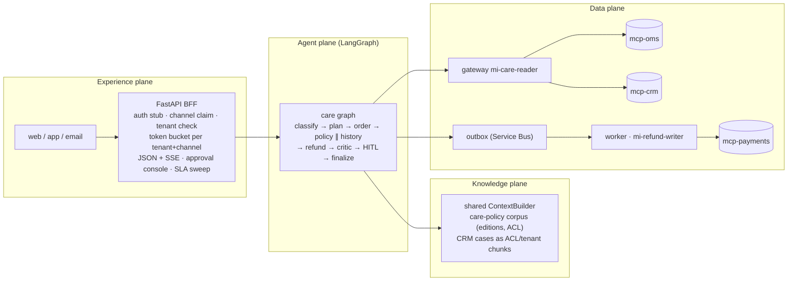
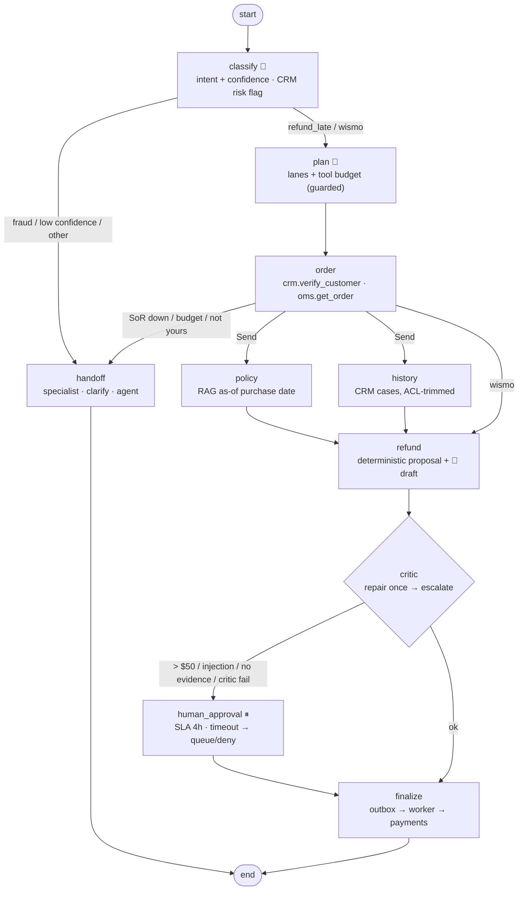

# 11 · End-to-End Customer Care: "My shipment is late, can I get a refund?"

> **Status:** ✅ Built. `pytest projects/11-customer-care-e2e` runs 25 offline tests, `python run.py` runs the demo, and `docker compose` runs the BFF with three MCP server containers.

## Business problem

"Where is my parcel, and can I get my money back?" is one of the highest-volume contacts in
retail and logistics care. Answering it well touches everything: which channel the customer
used and who they are, the order and the carrier scans, the refund policy that applied when
they bought (not today's), the case history (minus internal notes), a refund decision, a
specialist for large or risky amounts, the payment provider, and an honest reply when the
provider is slow.

This project runs that request end to end, with every doctrine control in code. It follows
the ten steps in order:

1. **Channel.** A FastAPI BFF checks the bearer token, the channel claim and the tenant, and
   rate-limits per tenant and channel.
2. **Intent.** A classifier with a confidence gate, plus a fraud pre-route on the CRM risk
   flag, runs before any refund tool is reachable.
3. **Plan.** A planner picks the context lanes and a tool budget. It is guarded: no refund is
   planned without the policy lane.
4. **Order.** Identity and order ownership are checked over MCP (OMS + CRM).
5. **Context, in parallel.**
   - Policy is retrieved **as of the purchase date**, with ACL.
   - CRM cases are **trimmed per principal and tenant**, then sanitised.
6. **Refund.** A deterministic proposal comes from the edition's rules, and the model drafts
   the wording.
7. **Critic.** It repairs a draft once, then escalates.
8. **HITL.** A specialist approves with a 4-hour SLA timer. On timeout the request is queued
   or denied, and never paid silently.
9. **Write.** The refund command goes to an outbox (Service Bus stand-in). A worker with the
   only money-moving identity dispatches it, and the provider dedupes on the key.
10. **Reply.** The customer gets an honest status: "confirmed refund R-…" or "queued, reference
    CS-…, not yet confirmed". It is streamed over SSE.

## Architecture (four planes)



## Graph



### Code map

| File | What it holds |
|---|---|
| `care_e2e/bff.py` | FastAPI BFF: token stub, channel/tenant checks, `TokenBucket`, JSON + SSE, approvals, SLA sweep |
| `care_e2e/graph.py` | the care graph and `sweep_expired` (SLA timer) |
| `care_e2e/knowledge.py` | care-policy corpus (editions + ACL) and CRM case chunks |
| `care_e2e/policy.py` | deterministic refund rules per edition, limits and budgets |
| `care_e2e/critic.py` | draft checks: money-moved claims, citation, amount, leakage, injection |
| `care_e2e/sor.py` | OMS/CRM/payments backends, reader + writer gateways, `CARE_MCP_URLS` switch |
| `care_e2e/worker.py` | outbox dispatch/drain (the only money-moving path) |
| `care_e2e/mcp_main.py` | one system of record as a streamable-HTTP MCP server (compose service) |
| `Dockerfile`, `docker-compose.yml`, `deploy/azure/` | container topology and an Azure Container Apps + APIM Bicep skeleton (not deployed) |

## Design decisions

- **Identity comes from the token, never the body.** The BFF builds the graph request from
  claims. Ben's token asking about Ana's order gets "couldn't find that order", and the reply
  never confirms that someone else's order exists.
- **The model never sets amounts.** The policy edition is retrieved for citation, and the
  thresholds for that edition are code (`policy.decide`). The model only drafts wording, and
  the critic checks that the draft states exactly the approved amount.
- **As-of the business event.** Retrieval uses the purchase date, so a December 2025 order
  gets the 2025 edition (shipping-fee refund only), even though the 2026 edition would pay in
  full.
- **ACL before ranking, on CRM data too.** Case notes carry groups and a tenant. Billing-only
  and fraud notes never reach the model, and the fraud playbook is `fraud-ops`-only.
- **Critic: repair once, then escalate.** One retry catches sloppy drafts. A second failure
  sends the deterministic template to a human instead of looping.
- **HITL has a clock.** Interrupts carry `sla_due`, and a sweep job resumes expired ones with
  a timeout. The default policy queues for review with an honest message. `deny` is
  configurable. Neither path pays.
- **Outbox for money.** Writes are commands with idempotency keys. A slow provider (gateway
  timeout 0.5 s) leaves the command queued, and the customer gets a reference, not a false
  "issued". Redelivery is safe because the provider dedupes on the key.
- **Same code in-process and in containers.** `CARE_MCP_URLS` switches the gateways from
  in-process MCP to streamable HTTP. `test_http_topology.py` runs the compose topology
  without Docker.

## How to run

```bash
python projects/11-customer-care-e2e/run.py                 # BFF demo (SSE, HITL, queue, fraud)
python projects/11-customer-care-e2e/run.py --mermaid graph.mmd
PYTHONPATH=.:projects/11-customer-care-e2e uvicorn care_e2e.bff:app --factory --port 8080
docker compose -f projects/11-customer-care-e2e/docker-compose.yml up --build
```

```bash
curl -N -X POST localhost:8080/v1/channels/web/messages/stream \
  -H 'Authorization: Bearer tok-ana' -H 'X-Tenant-Id: acme-retail' \
  -H 'content-type: application/json' \
  -d '{"message": "My shipment O-1001 is late, can I get a refund?"}'
```

### Tests

```bash
pytest projects/11-customer-care-e2e      # graph, BFF, HTTP topology, chaos
python -m evals --project 11               # 21 golden cases
```

## Interview talking points

1. **Where each control lives.**
   - Auth, channel and rate limits sit in the experience plane (BFF/APIM).
   - Budgets, critic and HITL sit in the agent plane.
   - ACL and as-of retrieval sit in the knowledge plane.
   - Idempotency and the outbox sit in the data plane.

   Each can be tested on its own, and a chaos test proves each one's exit.
2. **Honest status beats fast status.** The reply is assembled after execution, and the
   critic forbids "has been refunded" in drafts. When the provider times out, the customer
   gets a reference and a promise to follow up. That is what keeps second contacts down.
3. **Temporal correctness is a data problem, not a prompt problem.** Filter by validity on
   the business event date before ranking. Don't ask the model which policy applied.
4. **HITL needs an SLA and a default that is safe.** An approval that nobody picks up must
   never turn into a payment. The sweep job and the `queue`/`deny` policy make that explicit
   and testable.
5. **Portability.** The same graph runs with in-memory MCP in tests and with streamable-HTTP
   MCP containers in compose and Container Apps. The gateway, allowlists and schema checks
   are identical, so production doesn't run on untested code paths.

## Industry ROI story

For a retailer or parcel carrier, late-delivery contacts spike in peak season, exactly when
agents are scarcest. Containing the policy-clear cases (small, late, eligible) frees agents
for the exceptions, and the answers are consistent because eligibility is code. The costs are
specialist time for large refunds, a modest token bill (the model only classifies and drafts),
and the platform work to put OMS, CRM and payments behind MCP. The main value protected is
leakage and trust: no refund outside policy, and no customer told money moved when it didn't.

## Doctrine compliance

The full card is in [`DOCTRINE.md`](DOCTRINE.md), generated from [`doctrine.yaml`](doctrine.yaml):
planes, systems of record, the two corpora with ACL and temporal rules, MCP contracts, two
managed identities, stop conditions, a five-exit row for every node, chaos scenarios (model,
retrieval, OMS, payments, jailbreak), eval thresholds and current scores.

```bash
python -m evals --project 11
pytest projects/11-customer-care-e2e/tests/test_chaos.py
```
