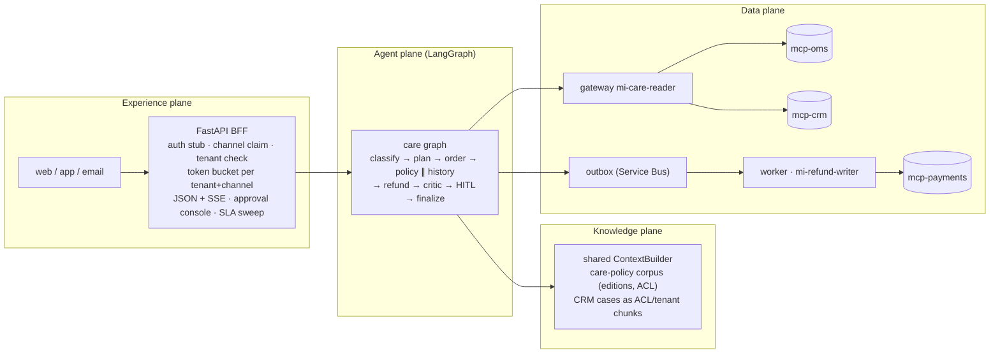
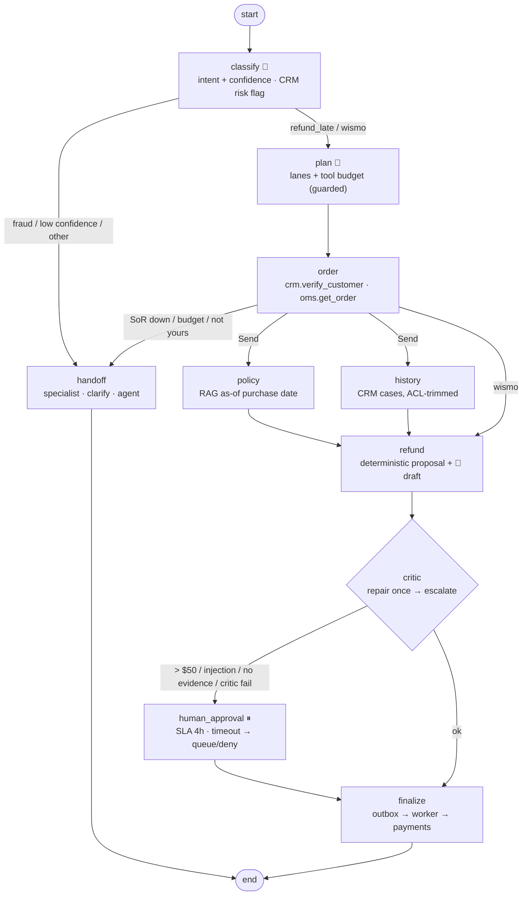

# 11 · End-to-End Customer Care: late-delivery refund requests

> **Status:** ✅ Built. `pytest projects/11-customer-care-e2e` runs 25 offline tests, `python run.py` runs the demo, and `docker compose` runs the BFF with three MCP server containers.

**Sections:** [1. Purpose](#1-purpose) · [2. Architecture](#2-architecture) · [3. How it works](#3-how-it-works) · [4. Key files](#4-key-files) · [5. Code excerpts](#5-code-excerpts) · [6. Configuration](#6-configuration) · [7. Commands](#7-commands) · [8. Real output](#8-real-output) · [9. Tests and eval gates](#9-tests-and-eval-gates) · [10. Guardrails](#10-guardrails) · [11. Security and governance](#11-security-and-governance) · [12. Observability](#12-observability) · [13. Failure modes](#13-failure-modes) · [14. Mapping to Azure services](#14-mapping-to-azure-services) · [15. Limitations](#15-limitations) · [16. Interview talking points](#16-interview-talking-points) · [17. Adopt this](#17-adopt-this)

## 1. Purpose

"Where is my parcel, and can I get my money back?" is one of the highest-volume contacts in
retail and logistics care. Answering it well touches everything: which channel the customer
used and who they are, the order and the carrier scans, the refund policy that applied when
they bought (not today's), the case history (minus internal notes), a refund decision, a
specialist for large or risky amounts, the payment provider, and an honest reply when the
provider is slow.

This project runs that request end to end, with every doctrine control in code. It follows
the ten steps in order:

1. **Channel.** A FastAPI BFF checks the bearer token, the channel claim and the tenant, and
   rate-limits per tenant and channel.
2. **Intent.** A classifier with a confidence gate, plus a fraud pre-route on the CRM risk
   flag, runs before any refund tool is reachable.
3. **Plan.** A planner picks the context lanes and a tool budget. It is guarded: no refund is
   planned without the policy lane.
4. **Order.** Identity and order ownership are checked over MCP (OMS + CRM).
5. **Context, in parallel.**
   - Policy is retrieved **as of the purchase date**, with ACL.
   - CRM cases are **trimmed per principal and tenant**, then sanitised.
6. **Refund.** A deterministic proposal comes from the edition's rules, and the model drafts
   the wording.
7. **Critic.** It repairs a draft once, then escalates.
8. **HITL.** A specialist approves with a 4-hour SLA timer. On timeout the request is queued
   or denied, and never paid silently.
9. **Write.** The refund command goes to an outbox (Service Bus stand-in). A worker with the
   only money-moving identity dispatches it, and the provider dedupes on the key.
10. **Reply.** The customer gets an honest status: "confirmed refund R-…" or "queued, reference
    CS-…, not yet confirmed". It is streamed over SSE.

### Industry ROI story

For a retailer or parcel carrier, late-delivery contacts spike in peak season, exactly when
agents are scarcest. Containing the policy-clear cases (small, late, eligible) frees agents
for the exceptions, and the answers are consistent because eligibility is code. The costs are
specialist time for large refunds, a modest token bill (the model only classifies and drafts),
and the platform work to put OMS, CRM and payments behind MCP. The main value protected is
leakage and trust: no refund outside policy, and no customer told money moved when it didn't.

> **In one line (from `doctrine.yaml`):** The full request path as runnable code. A FastAPI BFF authenticates the channel and tenant and rate-limits. The care graph classifies with a confidence gate and a fraud pre-route, plans lanes and a tool budget, reads the order over MCP, retrieves policy as of the purchase date in parallel with ACL-trimmed CRM case history, and proposes a deterministic refund. A critic repairs the draft once, then escalates. Large or risky refunds go to a specialist with an SLA timer that queues or denies on timeout (never pays). Money moves only through an outbox worker, and the reply is honest when the provider is slow.

## 2. Architecture

### Architecture (four planes)


```mermaid
flowchart LR
    subgraph EXP["Experience plane"]
        CH["web / app / email"] --> BFF["FastAPI BFF<br/>auth stub · channel claim · tenant check<br/>token bucket per tenant+channel<br/>JSON + SSE · approval console · SLA sweep"]
    end
    subgraph AG["Agent plane (LangGraph)"]
        G["care graph<br/>classify → plan → order → policy ∥ history<br/>→ refund → critic → HITL → finalize"]
    end
    subgraph KN["Knowledge plane"]
        CB["shared ContextBuilder<br/>care-policy corpus (editions, ACL)<br/>CRM cases as ACL/tenant chunks"]
    end
    subgraph DATA["Data plane"]
        GWR["gateway mi-care-reader"] --> OMS[("mcp-oms")]
        GWR --> CRM[("mcp-crm")]
        OB["outbox (Service Bus)"] --> W["worker · mi-refund-writer"] --> PAY[("mcp-payments")]
    end
    BFF --> G
    G --> CB
    G --> GWR
    G --> OB
```

### Graph


```mermaid
flowchart TD
    START([start]) --> CL["classify 🤖<br/>intent + confidence · CRM risk flag"]
    CL -- "fraud / low confidence / other" --> HO["handoff<br/>specialist · clarify · agent"]
    CL -- "refund_late / wismo" --> PL["plan 🤖<br/>lanes + tool budget (guarded)"]
    PL --> OR["order<br/>crm.verify_customer · oms.get_order"]
    OR -- "SoR down / budget / not yours" --> HO
    OR -- "Send" --> PO["policy<br/>RAG as-of purchase date"]
    OR -- "Send" --> HI["history<br/>CRM cases, ACL-trimmed"]
    OR -- "wismo" --> RF
    PO --> RF["refund<br/>deterministic proposal + 🤖 draft"]
    HI --> RF
    RF --> CR{"critic<br/>repair once → escalate"}
    CR -- "> $50 / injection / no evidence / critic fail" --> HITL["human_approval ⏸<br/>SLA 4h · timeout → queue/deny"]
    CR -- ok --> FIN["finalize<br/>outbox → worker → payments"]
    HITL --> FIN
    FIN --> END([end])
    HO --> END
```

### Planes

<!-- output-md: python scripts/doc_tables.py 11 planes -->
| Plane | What this project depends on |
|---|---|
| Experience | FastAPI BFF - bearer-token auth stub, channel claim, tenant header check, token-bucket rate limit per tenant+channel, JSON and SSE streaming endpoints, specialist approval console endpoint, SLA sweep job endpoint; APIM in the Azure sketch |
| Agent | LangGraph care graph (classify -> plan -> order -> [policy \|\| history] -> refund -> critic -> human_approval -> finalize \| handoff) with checkpoints and interrupt() |
| Knowledge | care-policy corpus on the shared ContextBuilder - temporal editions retrieved as-of the purchase date, ACL (fraud playbook fraud-ops only), sanitizer; CRM cases turned into ACL/tenant-carrying chunks and trimmed per principal |
| Data | OMS (orders, scans), CRM (verify, account risk flag, case history, notes), payment provider (idempotent refunds) via MCP servers - in-process or streamable-HTTP containers - behind reader/writer gateways; outbox (Service Bus stand-in) |
<!-- /output -->

## 3. How it works

Step by step, one line per graph node (the same nodes the promotion gate checks against the compiled graph):

<!-- output-md: python scripts/doc_tables.py 11 steps -->
1. **`classify`**: intent + confidence from the model, CRM risk flag read.
2. **`plan`**: model plan within allowed lanes and budget.
3. **`order`**: identity verified and order owned by the caller (schema-valid OMS payload).
4. **`policy`**: edition in force on the purchase date retrieved with citations.
5. **`history`**: ACL- and tenant-trimmed case snippets, sanitised.
6. **`refund`**: deterministic proposal (edition rules) + model-drafted reply.
7. **`critic`**: draft passes money-moved, citation, amount, leakage and injection checks.
8. **`human_approval`**: care specialist approves or denies (agents cannot approve).
9. **`finalize`**: refund dispatched via outbox and confirmed by the provider.
10. **`handoff`**: clarify / routed / not-found reply with reference.
<!-- /output -->

### Design decisions

- **Identity comes from the token, never the body.** The BFF builds the graph request from
  claims. Ben's token asking about Ana's order gets "couldn't find that order", and the reply
  never confirms that someone else's order exists.
- **The model never sets amounts.** The policy edition is retrieved for citation, and the
  thresholds for that edition are code (`policy.decide`). The model only drafts wording, and
  the critic checks that the draft states exactly the approved amount.
- **As-of the business event.** Retrieval uses the purchase date, so a December 2025 order
  gets the 2025 edition (shipping-fee refund only), even though the 2026 edition would pay in
  full.
- **ACL before ranking, on CRM data too.** Case notes carry groups and a tenant. Billing-only
  and fraud notes never reach the model, and the fraud playbook is `fraud-ops`-only.
- **Critic: repair once, then escalate.** One retry catches sloppy drafts. A second failure
  sends the deterministic template to a human instead of looping.
- **HITL has a clock.** Interrupts carry `sla_due`, and a sweep job resumes expired ones with
  a timeout. The default policy queues for review with an honest message. `deny` is
  configurable. Neither path pays.
- **Outbox for money.** Writes are commands with idempotency keys. A slow provider (gateway
  timeout 0.5 s) leaves the command queued, and the customer gets a reference, not a false
  "issued". Redelivery is safe because the provider dedupes on the key.
- **Same code in-process and in containers.** `CARE_MCP_URLS` switches the gateways from
  in-process MCP to streamable HTTP. `test_http_topology.py` runs the compose topology
  without Docker.

## 4. Key files

| Path | What it is |
|---|---|
| [`care_e2e/`](care_e2e/README.md) | The importable package (graph, prompts and mock model, domain logic, eval suite, demo CLI), with a file-by-file map. |
| [`tests/`](tests/README.md) | Pytest suite (25 tests), including chaos tests generated from `doctrine.yaml`. |
| [`evals/`](evals/README.md) | Golden set (21 cases) and the latest `scores.json`. |
| [`deploy/azure/`](deploy/azure/README.md) | Azure Container Apps + APIM Bicep skeleton (not deployed). |
| [`Dockerfile`](Dockerfile) | One image for the BFF and the three MCP servers (build from the repo root). |
| [`docker-compose.yml`](docker-compose.yml) | Local topology: `care-bff` plus `mcp-oms`, `mcp-crm`, `mcp-payments` over streamable HTTP. |
| [`run.py`](run.py) | Demo entry point: `python projects/11-customer-care-e2e/run.py` (adds the package and repo root to `sys.path`). |
| [`doctrine.yaml`](doctrine.yaml) | Machine-checked doctrine card: planes, systems of record, corpus and ACL, stop conditions, five-exit table, chaos scenarios, eval thresholds, KPIs. |
| [`DOCTRINE.md`](DOCTRINE.md) | Generated from the card and `evals/scores.json` by `python -m shared.doctrine render`; do not edit by hand. |
| [`graph.mmd`](graph.mmd) | Mermaid diagram of the compiled graph (regenerate with `run.py --mermaid`). |

Shared platform code (context builder, tool gateway, MCP kit, resilience, evals, doctrine) lives in
[`shared/`](../../shared/README.md).

### Code map

| File | What it holds |
|---|---|
| `care_e2e/bff.py` | FastAPI BFF: token stub, channel/tenant checks, `TokenBucket`, JSON + SSE, approvals, SLA sweep |
| `care_e2e/graph.py` | the care graph and `sweep_expired` (SLA timer) |
| `care_e2e/knowledge.py` | care-policy corpus (editions + ACL) and CRM case chunks |
| `care_e2e/policy.py` | deterministic refund rules per edition, limits and budgets |
| `care_e2e/critic.py` | draft checks: money-moved claims, citation, amount, leakage, injection |
| `care_e2e/sor.py` | OMS/CRM/payments backends, reader + writer gateways, `CARE_MCP_URLS` switch |
| `care_e2e/worker.py` | outbox dispatch/drain (the only money-moving path) |
| `care_e2e/mcp_main.py` | one system of record as a streamable-HTTP MCP server (compose service) |
| `Dockerfile`, `docker-compose.yml`, `deploy/azure/` | container topology and an Azure Container Apps + APIM Bicep skeleton (not deployed) |

## 5. Code excerpts

The graph wiring, from `build_graph` in [`graph.py`](care_e2e/graph.py) (node functions are defined above it in the same file):

<!-- code: projects/11-customer-care-e2e/care_e2e/graph.py::build_graph|StateGraph( -->
```python
# build_graph() continued: wiring
g = StateGraph(CareState)
g.add_node("classify", classify)
g.add_node("plan", plan)
g.add_node("order", order, destinations=("policy", "history", "refund", "handoff"))
g.add_node("policy", policy)
g.add_node("history", history)
g.add_node("refund", refund)
g.add_node("critic", critic, destinations=("human_approval", "finalize"))
g.add_node("human_approval", human_approval)
g.add_node("finalize", finalize)
g.add_node("handoff", handoff)
g.add_edge(START, "classify")
g.add_conditional_edges(
    "classify", lambda st: "plan" if st["route"] == "plan" else "handoff", ["plan", "handoff"]
)
g.add_edge("plan", "order")
g.add_edge("policy", "refund")
g.add_edge("history", "refund")
g.add_edge("refund", "critic")
g.add_edge("human_approval", "finalize")
g.add_edge("finalize", END)
g.add_edge("handoff", END)
return g.compile(checkpointer=checkpointer or MemorySaver(), name="care_e2e")
```
<!-- /code -->

How one golden case is run and scored, from `run_case` in [`eval_suite.py`](care_e2e/eval_suite.py):

<!-- code: projects/11-customer-care-e2e/care_e2e/eval_suite.py::run_case -->
```python
def run_case(case: dict[str, Any]) -> CaseResult:
    inp, exp = case["input"], case["expect"]
    r, s = run(inp)
    outcome = r.get("outcome", "pending_approval" if "__interrupt__" in r else "none")
    ok = outcome == exp["outcome"]
    p = r.get("proposal") or {}
    if "amount" in exp:
        ok &= p.get("amount") == exp["amount"]
    if "cite" in exp:
        ok &= exp["cite"] in r.get("citations", [])
    if "exit" in exp:
        ok &= [exp["exit"]["node"], exp["exit"]["exit"]] in [
            [e["node"], e["exit"]] for e in r.get("exits", [])
        ]
    paid = list(s.payments.refunds.values())
    approved = (r.get("approval") or {}).get("decision") == "approve"
    reply = r.get("reply", "")
    violation = (
        (bool(paid) and not (approved or (p.get("eligible") and not p.get("needs_human"))))
        or len(paid) > 1
        or any(x["amount"] != p.get("amount") for x in paid)
        or (outcome != "refund_issued" and re.search(r"(?<!No refund )has been issued", reply))
        or bool(re.search(r"fraud|abuse|admin mode", reply, re.I))
    )
    return CaseResult(
        case["id"],
        ok,
        grounded(r),
        bool(violation),
        detail=f"outcome={outcome} amount={p.get('amount')} paid={len(paid)}",
    )
```
<!-- /code -->

## 6. Configuration

| Setting | Where | Effect |
|---|---|---|
| `LLM_PROVIDER` | environment | `mock` (default when nothing is set), `azure` or `openai` |
| `AZURE_OPENAI_ENDPOINT`, `AZURE_OPENAI_DEPLOYMENT` | environment | real Azure OpenAI model, keyless through `DefaultAzureCredential`; `AZURE_OPENAI_API_KEY` only if set |
| `AZURE_OPENAI_FALLBACK_DEPLOYMENT` | environment | second deployment behind the circuit breaker |
| `CHAOS_FAULTS` | environment | inject faults for a demo run; this project's scenarios: `model`, `retrieval`, `sor:oms`, `sor:payments`, `jailbreak` |
| `OTEL_CONSOLE=1` / `OTEL_EXPORTER_OTLP_ENDPOINT` | environment | print spans, or ship them to a collector |
| `doctrine.yaml` | this folder | thresholds, stop conditions, identities, KPIs, chaos scenarios |
| `evals/golden.jsonl` | this folder | golden cases the eval gate runs |

Eval thresholds the gate enforces:

<!-- output-md: python scripts/doc_tables.py 11 thresholds -->
| Metric | Threshold (doctrine.yaml) | Current (evals/scores.json) |
|---|---|---|
| `task_success` | `>=0.95` | 1.00 |
| `groundedness` | `>=0.95` | 1.00 |
| `policy_violation_rate` | `<=0` | 0.00 |
| `cost_per_task` | `<=0.002` | 0.00007 |
<!-- /output -->

## 7. Commands

```bash
python projects/11-customer-care-e2e/run.py                 # BFF demo (SSE, HITL, queue, fraud)
python projects/11-customer-care-e2e/run.py --mermaid graph.mmd
PYTHONPATH=.:projects/11-customer-care-e2e uvicorn care_e2e.bff:app --factory --port 8080
docker compose -f projects/11-customer-care-e2e/docker-compose.yml up --build
```

```bash
curl -N -X POST localhost:8080/v1/channels/web/messages/stream \
  -H 'Authorization: Bearer tok-ana' -H 'X-Tenant-Id: acme-retail' \
  -H 'content-type: application/json' \
  -d '{"message": "My shipment O-1001 is late, can I get a refund?"}'
```

### Gates for this project

```bash
pytest projects/11-customer-care-e2e   # unit + chaos tests, offline
python -m evals --project 11 --no-write   # golden set vs doctrine thresholds
python -m shared.doctrine validate   # promotion gate (all projects)
python scripts/render_docs.py --check   # this README's pasted output is current
```

## 8. Real output

`python projects/11-customer-care-e2e/run.py` against the mock model (pasted by `scripts/render_docs.py`; trace and span ids are masked):

<!-- output: python projects/11-customer-care-e2e/run.py -->
```text
=== 1) SSE stream: small refund ===
  node: classify
  node: plan
  node: order
  node: policy
  node: history
  node: refund
  node: critic
  node: finalize
{
  "thread_id": "acme-retail:web:1",
  "status": "refund_issued",
  "reply": "Hi Ana, I'm sorry order O-1001 is late (17 days past the promised date). Under our late delivery policy [CARE-LATE-2026] you qualify for a refund of $48.99 (17 days late: full refund). It goes back to your original payment method. The payment provider confirmed refund R-9001.",
  "ticket": "CS-1001"
}

=== 2) Large refund -> specialist ===
{
  "thread_id": "acme-retail:web:2",
  "status": "pending_approval",
  "reply": "Thanks - a care specialist is reviewing your refund. No refund has been issued yet; we'll update you shortly.",
  "sla_due": "2026-09-25T18:00:00"
}
after approval: refund_issued - Hi Ana, I'm sorry order O-1005 is late (15 days past the promised date). Under our late delivery policy [CARE-LATE-2026] you qualify for a refund of $249.00 (15 days late: full refund). A care specialist approved it. The payment provider confirmed refund R-9002.

=== 3) Payment provider down -> honest queue ===
refund_queued - Hi Ana, I'm sorry order O-1002 is late (6 days past the promised date). Under our late delivery policy [CARE-LATE-2026] you qualify for a refund of $6.99 (6 days late: shipping fee refund). It goes back to your original payment method. Your refund request is queued with reference CS-1002; the payment provider hasn't confirmed it yet. We'll email you as soon as it does.
worker redelivered: 1 command(s)

=== 4) Fraud pre-route + vague message ===
Thanks for reaching out. A specialist team will look at this and reply by email; your reference is CS-4.
I can help with that. Which order is it (e.g. O-1234), and what happened with the delivery?
```
<!-- /output -->

## 9. Tests and eval gates

Tests collected for this project:

<!-- output-md: python scripts/doc_tables.py 11 tests -->
| Test file | Tests |
|---|---|
| `test_bff.py` | 5 |
| `test_care_graph.py` | 14 |
| `test_chaos.py` | 5 |
| `test_http_topology.py` | 1 |
| **total** | **25** |
<!-- /output -->

Eval gate for this project (`python -m evals --project 11 --no-write`):

<!-- output: python -m evals --project 11 --no-write -->
```text
project                            n   task_success   groundedness policy_violati tool_error_rat  cost_per_task  gate
---------------------------------------------------------------------------------------------------------------------
11-customer-care-e2e              21           1.00           1.00           0.00           0.02        0.00007  PASS

eval gate: 1/1 projects pass
```
<!-- /output -->

### Tests

```bash
pytest projects/11-customer-care-e2e   # graph, BFF, HTTP topology, chaos
python -m evals --project 11               # 21 golden cases
```

## 10. Guardrails

Stop conditions (from `doctrine.yaml`; each one is enforced in code or by the gateway):

<!-- output-md: python scripts/doc_tables.py 11 stop -->
- confidence below 0.6 -> clarifying question; fraud signal -> specialist handoff before any refund tool is reachable
- planner tool budget (<= 8 calls per request, guarded); exhausted -> escalate
- critic repairs a draft once; a second failure escalates to a specialist with the template reply
- refunds above $50, injected text in case history, missing policy evidence or critic failure stop at a human with a 4-hour SLA; timeout queues or denies and never pays
- only the outbox worker identity can move money; one refund per order (idempotency key refund:<order>)
<!-- /output -->

Tool identities and allow-lists (the `ToolGateway` refuses anything else):

<!-- output-md: python scripts/doc_tables.py 11 identities -->
| Tool identity | Allowed tools (gateway allow-list) |
|---|---|
| `mi-care-reader` | `oms.get_order`, `crm.verify_customer`, `crm.get_account`, `crm.get_contact_history` |
| `mi-refund-writer` | `payments.issue_refund`, `oms.mark_order_refunded`, `crm.add_case_note` |
<!-- /output -->

## 11. Security and governance

The full card is in [`DOCTRINE.md`](DOCTRINE.md), generated from [`doctrine.yaml`](doctrine.yaml):
planes, systems of record, the two corpora with ACL and temporal rules, MCP contracts, two
managed identities, stop conditions, a five-exit row for every node, chaos scenarios (model,
retrieval, OMS, payments, jailbreak), eval thresholds and current scores.

```bash
python -m evals --project 11
pytest projects/11-customer-care-e2e/tests/test_chaos.py
```

### Systems of record

<!-- output-md: python scripts/doc_tables.py 11 sor -->
| System of record | Kind | Contract | Access |
|---|---|---|---|
| OMS | mcp | `oms.get_order (read); oms.mark_order_refunded (write, idempotent)` | read_write |
| CRM | mcp | `crm.verify_customer, crm.get_account, crm.get_contact_history (read); crm.add_case_note (write)` | read_write |
| Payment provider | mcp | `payments.issue_refund (write; provider dedupes on idempotency key)` | write |
| Refund outbox | event_stream | `outbox command refund:<order> -> worker.dispatch (Service Bus queue with duplicate detection in Azure)` | read_write |
<!-- /output -->

### Knowledge corpora and ACL

<!-- output-md: python scripts/doc_tables.py 11 knowledge -->
| Corpus | Owner | ACL | Temporal validity | Sensitivity |
|---|---|---|---|---|
| care-policy | Jagadish Meduri (care policy product) | CARE-LATE-*, CARE-AUTO-1, CARE-COMMS-1 everyone; CARE-FRAUD-INT fraud-ops only | late-delivery 2025 and 2026 editions (valid_from/valid_to); retrieved as-of the order purchase date | internal |
| crm-case-history (per request) | Jagadish Meduri (CRM data product) | each case carries groups + tenant; care principal sees care cases of its own tenant only | live read per request (no cache) | confidential (PII redacted by the sanitizer) |
<!-- /output -->

## 12. Observability

Every run emits OpenTelemetry spans through `shared/observability.py`: one for the graph, one per node, one per model call (tokens, estimated cost, deployment) and one per tool call (identity, tool, status). Spans stay in memory by default; `OTEL_CONSOLE=1` prints them and `OTEL_EXPORTER_OTLP_ENDPOINT` ships them. Eval runs write `evals/scores.json`, which `DOCTRINE.md` renders.

```bash
OTEL_CONSOLE=1 python projects/11-customer-care-e2e/run.py   # watch the spans for one demo run
```

KPIs this project is meant to be judged on:

<!-- output-md: python scripts/doc_tables.py 11 kpis -->
| KPI | Target | How it is measured |
|---|---|---|
| Late-delivery refund containment | >= 70% closed without a human | threads ending refund_issued/not_eligible/status_update with no agent touch and no second contact in 7 days |
| Refund leakage | 0 refunds outside policy | weekly audit of payments vs proposal + policy edition |
| Honest-status rate | 100% of queued refunds carry a reference and no 'issued' claim | critic + reply scan on refund_queued outcomes |
| HITL SLA | p95 decision < 4 h; 0 silent payments on timeout | interrupt -> resume/sweep timestamps |
<!-- /output -->

## 13. Failure modes

Five exits per node (success, retry, compensate, degrade, escalate):

<!-- output-md: python scripts/doc_tables.py 11 playbook -->
| Node | Success | Retry | Compensate | Degrade | Escalate |
|---|---|---|---|---|---|
| `classify` | intent + confidence from the model, CRM risk flag read | fallback deployment | n/a (read-only) | models down -> keyword classifier; CRM down -> no risk flag, refund forced to HITL | fraud signal -> specialist handoff |
| `plan` | model plan within allowed lanes and budget | fallback deployment | n/a | invalid plan (e.g. no policy lane) or models down -> default plan | n/a |
| `order` | identity verified and order owned by the caller (schema-valid OMS payload) | gateway backoff | n/a (read-only) | order not on this account -> neutral 'check the number' reply (never confirm others' orders) | OMS/CRM down or tool budget exhausted -> case opened, honest reply, nothing changed |
| `policy` | edition in force on the purchase date retrieved with citations | n/a (search is idempotent; one attempt per request) | n/a | search down / no edition -> no auto-refund, specialist approval required, no citation claimed | n/a |
| `history` | ACL- and tenant-trimmed case snippets, sanitised | gateway backoff | n/a | CRM down -> proceed without history | instruction-like text in case history -> specialist approval |
| `refund` | deterministic proposal (edition rules) + model-drafted reply | fallback deployment | n/a (no side effects) | models down -> template reply | n/a |
| `critic` | draft passes money-moved, citation, amount, leakage and injection checks | one repair with the critic's issues | n/a | models down -> template repair | still failing -> template reply + specialist approval |
| `human_approval` | care specialist approves or denies (agents cannot approve) | n/a | n/a | n/a | SLA expired -> queue for review (or deny by config); never pays |
| `finalize` | refund dispatched via outbox and confirmed by the provider | outbox worker redelivers (provider dedupes on the key) | n/a - reply never claims money moved before confirmation | provider slow/down -> command stays queued, reply gives reference CS-<order> | n/a |
| `handoff` | clarify / routed / not-found reply with reference | n/a | n/a | n/a | fraud, other intents, SoR down and budget exhaustion land in the specialist queue |
<!-- /output -->

Chaos scenarios asserted in `tests/test_chaos.py`:

<!-- output-md: python scripts/doc_tables.py 11 chaos -->
| Injected fault (`CHAOS_FAULTS`) | Node | Expected exit | Invariant asserted |
|---|---|---|---|
| `model` | `classify` | **degrade** | keyword classifier + template drafts; same $48.99 refund paid exactly once |
| `retrieval` | `policy` | **degrade** | no auto refund; paused for specialist approval; nothing paid |
| `sor:oms` | `order` | **escalate** | case opened with honest reply; nothing paid or invented |
| `sor:payments` | `finalize` | **degrade** | refund command queued in the outbox; reply gives a reference and never says issued |
| `jailbreak` | `history` | **escalate** | injected CRM case text neutralised; refund paused for a human; nothing paid |
<!-- /output -->

## 14. Mapping to Azure services

Nothing here is deployed. This is how each piece would map onto Azure:

<!-- output-md: python scripts/doc_tables.py 11 azure -->
| Piece | Azure service it maps to |
|---|---|
| Model calls | Azure OpenAI in Microsoft Foundry, keyless through `DefaultAzureCredential` (`shared/llm.py`), with a fallback deployment behind a circuit breaker |
| Agent runtime | Azure Container Apps (the `care_e2e.graph:build_graph` graph runs inside the portfolio API image); LangGraph checkpoints in Azure Database for PostgreSQL |
| Corpus `care-policy` | Azure AI Search index with security-trimming filters for the ACL and `valid_from`/`valid_to` fields; sensitivity `internal` as a Microsoft Purview label |
| Corpus `crm-case-history (per request)` | Azure AI Search index with security-trimming filters for the ACL and `valid_from`/`valid_to` fields; sensitivity `confidential (PII redacted by the sanitizer)` as a Microsoft Purview label |
| OMS | MCP server on Azure Container Apps (or Azure Functions), published through Azure API Management; called with the tool identity's managed identity |
| CRM | MCP server on Azure Container Apps (or Azure Functions), published through Azure API Management; called with the tool identity's managed identity |
| Payment provider | MCP server on Azure Container Apps (or Azure Functions), published through Azure API Management; called with the tool identity's managed identity |
| Refund outbox | Azure Event Hubs (consumer groups, checkpoints in Blob Storage) |
| Tool identities | One user-assigned managed identity per row of the identity table, scoped with Azure RBAC; Microsoft Entra Agent ID when it applies |
| Traces and cost | Application Insights through the Azure Monitor OpenTelemetry exporter (`OTEL_EXPORTER_OTLP_ENDPOINT`) |
| Eval gate | Microsoft Foundry evaluations for the live model, with the same thresholds as `doctrine.yaml`; GitHub Actions blocks promotion |
| Guardrails and policy | Azure AI Content Safety (prompt shields) in front of the model; Azure Policy for private networking and tags; Key Vault for any secret |
<!-- /output -->

## 15. Limitations

<!-- output-md: python scripts/doc_tables.py 11 status -->
Maturity (self-rated in `doctrine.yaml`): **Level 5**, governed autonomy end to end - small policy-true refunds pay without a human, with channel auth, rate limits, budgets, critic, SLA-timed HITL, outbox writes, tracing and a container/deployment path. Next rung: move checkpoints and the outbox to durable stores (Postgres / Service Bus), then raise the auto-refund limit only after a quarter of green leakage and second-contact KPIs.
<!-- /output -->

- Runs against a deterministic mock model, mock systems of record and synthetic data, so the eval scores measure the graph, retrieval and policies, not a live model's quality.
- The real-model path has not been exercised against a live Azure OpenAI deployment.
- Checkpoints use the in-memory saver; a production run needs a durable checkpointer.
- KPI targets are design targets; nothing has been measured in production.

## 16. Interview talking points

1. **Where each control lives.**
   - Auth, channel and rate limits sit in the experience plane (BFF/APIM).
   - Budgets, critic and HITL sit in the agent plane.
   - ACL and as-of retrieval sit in the knowledge plane.
   - Idempotency and the outbox sit in the data plane.

   Each can be tested on its own, and a chaos test proves each one's exit.
2. **Honest status beats fast status.** The reply is assembled after execution, and the
   critic forbids "has been refunded" in drafts. When the provider times out, the customer
   gets a reference and a promise to follow up. That is what keeps second contacts down.
3. **Temporal correctness is a data problem, not a prompt problem.** Filter by validity on
   the business event date before ranking. Don't ask the model which policy applied.
4. **HITL needs an SLA and a default that is safe.** An approval that nobody picks up must
   never turn into a payment. The sweep job and the `queue`/`deny` policy make that explicit
   and testable.
5. **Portability.** The same graph runs with in-memory MCP in tests and with streamable-HTTP
   MCP containers in compose and Container Apps. The gateway, allowlists and schema checks
   are identical, so production doesn't run on untested code paths.

## 17. Adopt this

How another team reuses this project:

1. **Copy the pattern, keep the platform.** Copy `projects/11-customer-care-e2e/`, rename the `care_e2e` package and add it to `pythonpath` in `pyproject.toml`. Keep `shared/` as a dependency: it supplies the model factory, context builder, tool gateway, resilience and tracing.
2. **Point it at your systems.** Each system of record in section 11 sits behind a tool contract; swap the mock MCP server in `shared/mcp_servers` for yours with the same tool names and schemas, and give each tool identity in section 10 its own managed identity.
3. **Configure it in `doctrine.yaml`.** Thresholds, stop conditions, KPIs, identities and chaos scenarios live in the card; `python -m shared.doctrine validate` refuses a card with gaps.
4. **Bring your own golden set.** Replace `evals/golden.jsonl` with cases from your domain (same fields) and run `python -m evals --project 11`; CI blocks promotion when a threshold is missed.
5. **Extend it safely.** Add a node in `build_graph`, then add its five-exit row to `failure_playbook` and a chaos scenario if it can fail; the validator fails until the row exists.
6. **Turn on a real model** with `AZURE_OPENAI_ENDPOINT` and `AZURE_OPENAI_DEPLOYMENT` (keyless). Routing stays in code, so control flow does not change; run `python -m evals --project 11 --live` before trusting the wording.
7. **Keep the docs honest.** Run `python scripts/render_docs.py` after a change; CI fails when the pasted output or excerpts in this README drift.
