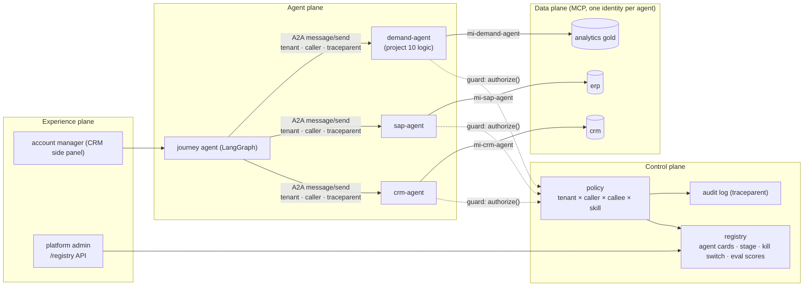
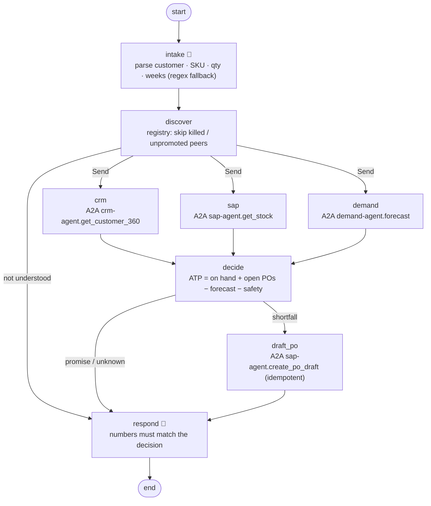

# 12 · Agent Control Plane: registry, A2A contract, who-may-call-whom

> **Status:** ✅ Built. `pytest projects/12-agent-control-plane` runs the offline tests, and `python run.py` runs the governed-mesh demo.

## Business problem

Once a company has more than a handful of agents, they start calling each other: a
customer-journey agent needs the CRM agent, the ERP agent and the demand-forecasting agent.
Without a control plane, every pair of agents invents its own integration, nobody knows which
agent may write to which system for which tenant, a bad release can't be switched off quickly,
and a trace stops at the first agent boundary.

This project builds that control plane and a demo mesh on top of it:

- **Registry with agent cards.** Purpose, skills with a side-effect class, MCP tools, models,
  budgets, owner, allowed callers, tenants and eval scores.
- **Promotion gate.** New agents start in `dev`. Promotion to `prod` needs eval scores above a
  bar that gets stricter with the side-effect class (read-only < reversible write <
  irreversible write).
- **A2A task contract.** Built on the public A2A protocol shape. The card is served at
  `/.well-known/agent.json`, and tasks go through JSON-RPC `message/send` with `tasks/get`.
  Tasks carry the tenant, the calling agent and a W3C `traceparent`.
- **Enforcement at the callee.** Checks run in this order: registration required → kill switch
  → prod stage → tenant entitlement → allowed callers → per-tenant skill policy → budget →
  schema. Each rejection returns a coded error, and every decision is written to an audit log
  together with its traceparent.
- **Demo.** Account managers ask the journey agent "can we promise 300 × SKU-200 to ACME within
  4 weeks?". The journey agent asks three peers in parallel:
  - the CRM agent;
  - an SAP-like agent;
  - a Databricks-like demand agent that reuses project 10's forecasting logic.

  It then computes a deterministic ATP and, on a shortfall, drafts a PO through the SAP agent.

## Architecture (four planes)



## Graph



### Code map

| File | What it holds |
|---|---|
| `control_plane/registry.py` | `AgentRecord` (the card), `Registry` (register → dev, gate, promote, kill, revive, events), `PROMOTION_BARS` |
| `control_plane/plane.py` | `ControlPlane.authorize()`: ordered checks, coded rejections, audit log with traceparent; `guard_for()` for A2A servers |
| `control_plane/agents.py` | the mesh: CRM / SAP-like / demand agents as A2A apps over their own MCP gateways, default per-tenant policy |
| `control_plane/journey.py` | journey agent graph (parallel A2A fan-out, deterministic ATP, idempotent PO draft) |
| `control_plane/api.py` | FastAPI: registry admin endpoints + every peer's A2A endpoint mounted under `/agents/<name>` |
| `shared/a2a/` | reusable A2A contract: models, server (`a2a_app`), client (traceparent injection) |

## Design decisions

- **Enforce at the callee, not the caller.** The guard runs inside every peer's A2A server,
  before schema validation and before any handler code. A caller that skips discovery, or a
  rogue script with a made-up agent name, is rejected all the same.
- **Registration is the unit of governance.** An unregistered agent can neither call nor be
  called. The registry decides what "prod" means, and the promotion bar is keyed to the worst
  side-effect class among the agent's skills.
- **Policy is per tenant and per skill.** The journey agent may draft POs for `northwind` but
  not for `contoso`. The marketing agent may read stock but never write. That is data in the
  control plane, not code in the agents.
- **Kill switch without a redeploy.** Killing an agent takes effect on the next task (-32011).
  The journey agent's `discover` node also reads the registry, so it skips a killed peer and
  says "cannot confirm" instead of hammering it.
- **One trace across agents.** The A2A client starts its span under the current LangGraph node
  span and injects `traceparent`. Each peer's server span continues it. A test asserts that the
  three parallel peer calls share one trace id.
- **Peers own their systems.** Only `sap-agent` holds the ERP identity. The journey agent never
  sees an ERP tool, so it can reach ERP only through a governed, audited skill.
- **Numbers from data, words from the model.** ATP is computed deterministically. The model's
  reply is replaced by a template if it doesn't contain the computed ATP.

## How to run

```bash
python projects/12-agent-control-plane/run.py                  # governed mesh demo
python projects/12-agent-control-plane/run.py --mermaid graph.mmd
PYTHONPATH=.:projects/12-agent-control-plane:projects/10-supply-chain-multi-agent \
  uvicorn control_plane.api:app --factory --port 8081
curl localhost:8081/agents/sap-agent/.well-known/agent.json
```

### Tests

```bash
pytest projects/12-agent-control-plane     # registry, policy, A2A contract, journey, trace, chaos
python -m evals --project 12                # 14 golden cases
```

## Interview talking points

1. **Why a control plane at all.** With N agents there are N² possible integrations. The
   registry and the policy turn those into N registrations plus one rule table that security
   can read.
2. **Ordered checks and coded errors.** Registration → kill → stage → tenant → allowed callers
   → skill policy → budget → schema. The first failure wins and is audited, so "why was this
   rejected" is always answerable, and callers can tell *degrade* (-32004 unavailable) from
   *escalate* (-32010 policy).
3. **Promotion is evidence-based.** Eval scores live on the card, and the gate compares them
   with a bar per side-effect class. A 0.91 task-success agent can go live if it only reads,
   but not if it writes irreversibly.
4. **Trace and tenant propagation are part of the contract.** They are headers on every task,
   not something each team remembers to add. The audit log keys every decision to a trace.
5. **Reuse, not rewrite.** The demand agent wraps project 10's forecasting function behind
   A2A. Exposing an existing capability to the mesh is a card plus a skill handler.

## Industry ROI story

In a manufacturer or distributor, "can we promise this order?" needs CRM, ERP and demand data
owned by different teams. Without a mesh, account managers ask three people and wait. With a
governed mesh, the answer is immediate and a PO draft is ready for the buyer on a shortfall.
The larger return is at the platform level. New agents plug into an existing contract and
policy instead of commissioning point-to-point integrations. Risk reviews approve one
enforcement point. Incidents are contained by a kill switch in seconds. The costs are a small
platform team and the registry/policy store.

## Doctrine compliance

The full card is in [`DOCTRINE.md`](DOCTRINE.md), generated from [`doctrine.yaml`](doctrine.yaml):
planes, systems of record, MCP and A2A contracts, per-agent identities, stop conditions, a
five-exit row for every node, chaos scenarios (model, A2A peer down, CRM down inside a peer,
jailbreak in CRM notes), eval thresholds and current scores.
