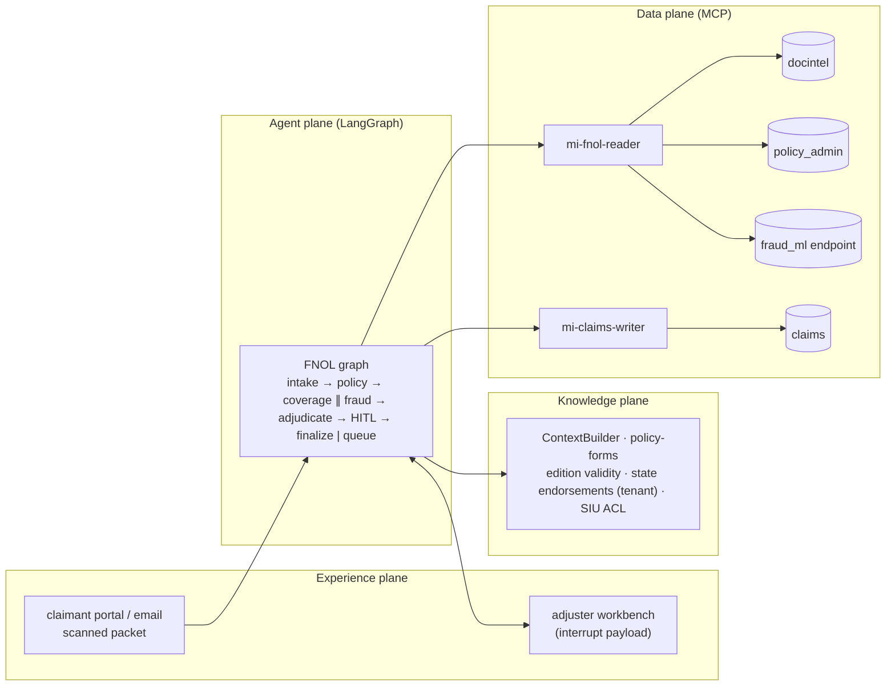
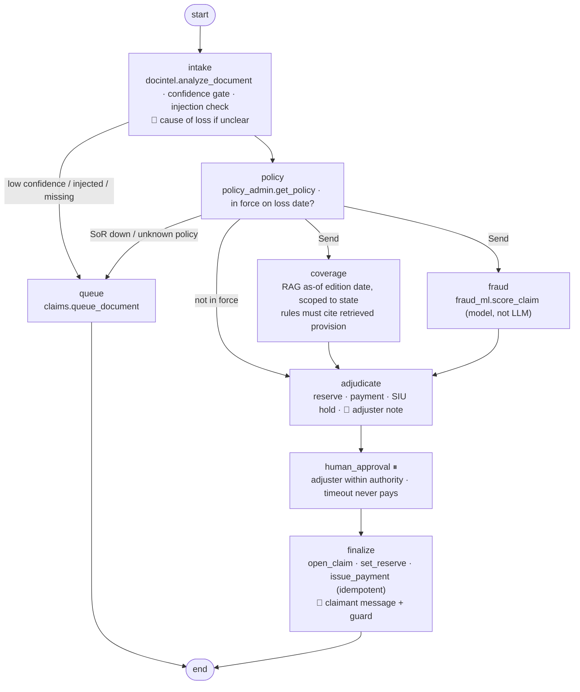

# 13 · Insurance FNOL & Coverage: scanned packet → cited coverage → adjuster-approved reserve

> **Status:** ✅ Built. `pytest projects/13-insurance-fnol-coverage` runs the offline tests, and `python run.py` runs the demo.

## Business problem

A first notice of loss arrives as a scanned packet. Before an adjuster can decide anything,
someone keys the fields, finds the policy, works out which **form edition** and which
**state endorsement** apply, checks for fraud indicators and proposes a reserve. Mistakes
here are expensive:

- Applying 2023 wording to a 2019-edition policy is leakage (or a wrongful denial).
- Guessing a smudged policy number attaches the claim to the wrong customer.
- Telling a claimant "your claim was flagged for fraud" is a complaint and a legal problem.

This graph automates the research and keeps the adjuster in charge of money:

- **OCR with confidence.** A Document-Intelligence-style mock returns field/value/confidence.
  Any required field below 0.85 goes to the manual indexing queue. Handwritten or smudged
  values are never guessed.
- **Temporal + jurisdictional RAG.** Retrieval runs as of the **edition date on the policy**,
  not the loss date, because a renewed 2019-edition policy still reads 2019 wording. It is
  scoped to the policy's **state**: amendatory endorsements carry the state in the ACL's tenant
  dimension. Deterministic coverage rules are accepted only if the provision they rely on was
  actually retrieved, and the provision is cited.
- **Fraud is a tool, not a prompt.** A deployed model (mock ML endpoint) is called over MCP. The
  LLM never computes or overrides the score. A high band means SIU referral and payment held.
- **HITL on reserve and payment.** Adjuster authority limits apply, the agent identity is never
  an approver, and a timeout never pays.
- **Claimant channel guard.** No fraud, SIU or investigation language is allowed, and no
  "payment issued" claim unless one was. The claimant prompt never receives fraud data at all.

## Architecture (four planes)



## Graph



### Code map

| File | What it holds |
|---|---|
| `fnol/ocr.py` | Document-Intelligence-style extractor mock (field, value, confidence), confidence floor |
| `fnol/knowledge.py` | policy-forms corpus: editions with validity, state endorsements scoped by tenant, SIU ACL |
| `fnol/rules.py` | deterministic coverage + payable rules per edition/state (each names its provision) |
| `fnol/sor.py` | MCP servers (docintel, policy_admin, fraud_ml, claims) and reader/writer gateways |
| `fnol/graph.py` | the graph, adjuster authority limits, claimant guard |
| `fnol/systems.py` | mock policies, packets, fraud endpoint, claims ledger |

## Design decisions

- **As-of the edition, not the loss date.** The edition printed on the policy decides the
  wording. The same 21-day seepage is excluded under the 2023 edition (14-day rule) and covered
  under 2019 (30-day rule). A test proves retrieval never returns the other edition's wording.
- **Jurisdiction as an ACL dimension.** State endorsements carry `tenant=<state>`, so Texas
  mold sublimits can't leak into a California claim. This reuses the shared trimming, which
  runs before ranking.
- **Rules decide, retrieval proves.** Coverage is code. A decision whose provision wasn't
  retrieved becomes `unknown`, and nothing is paid. Groundedness is measured on every covered
  or excluded decision.
- **Queue beats guess.** Confidence is per field. A required field under the floor, an unknown
  policy, an extractor outage or injected text in the packet all go to manual indexing, with an
  honest reference for the claimant.
- **Fraud stays internal.** The score lives only in the adjuster payload. The claimant prompt
  is built from a fact set with no fraud fields, and a regex guard on the output replaces any
  leaky draft with a template (tested with a deliberately leaky model).
- **Money is adjuster-approved and idempotent.** Keys `fnol:`, `reserve:` and `pay:` per packet
  make replays harmless. Authority limits refer over-limit approvals upward.

## How to run

```bash
python projects/13-insurance-fnol-coverage/run.py
python projects/13-insurance-fnol-coverage/run.py --mermaid graph.mmd
pytest projects/13-insurance-fnol-coverage
python -m evals --project 13        # 22 golden cases
```

## Interview talking points

1. **Temporal RAG is about the right clock.** For policy forms, the clock is the edition on the
   contract, not today and not the loss date. Picking the wrong clock is a leakage bug, not a
   retrieval-quality issue.
2. **Confidence is a routing signal.** OCR confidence per field decides between straight
   through and manual indexing. The model never "fixes" a smudged policy number.
3. **Use existing models as tools.** The fraud model is governed, versioned and monitored
   already. Wrapping it as an MCP tool keeps the LLM out of scoring and keeps model risk
   management intact.
4. **Channel-aware output.** The same case has an internal view (SIU, score, reasons) and an
   external view. The separation is enforced twice: in the facts given to the prompt and by an
   output guard.
5. **HITL with authority.** Approvals check who approved and whether the amount is within their
   authority. A timeout leaves the claim in the queue. None of these paths pay.

## Industry ROI story

For a P&C carrier, FNOL intake and coverage research are a large share of desk-adjuster time
on every claim, and edition or endorsement mistakes show up later as leakage, reopenings or
complaints. Automating extraction, edition-correct research and a cited proposal returns that
time to judgement and makes decisions consistent across adjusters. Money still moves only on
adjuster approval, so the gain comes from cycle time and accuracy without loosening controls.
Costs are OCR and model usage plus integration with policy admin, claims and the fraud
endpoint.

## Project structure

| Path | What it is |
|---|---|
| [`fnol/`](fnol/README.md) | The importable package (graph, prompts and mock model, domain logic, eval suite, demo CLI), with a file-by-file map. |
| [`tests/`](tests/README.md) | Pytest suite (17 tests), including chaos tests generated from `doctrine.yaml`. |
| [`evals/`](evals/README.md) | Golden set (22 cases) and the latest `scores.json`. |
| [`run.py`](run.py) | Demo entry point: `python projects/13-insurance-fnol-coverage/run.py` (adds the package and repo root to `sys.path`). |
| [`doctrine.yaml`](doctrine.yaml) | Machine-checked doctrine card: planes, systems of record, corpus and ACL, stop conditions, five-exit table, chaos scenarios, eval thresholds, KPIs. |
| [`DOCTRINE.md`](DOCTRINE.md) | Generated from the card and `evals/scores.json` by `python -m shared.doctrine render`; do not edit by hand. |
| [`graph.mmd`](graph.mmd) | Mermaid diagram of the compiled graph (regenerate with `run.py --mermaid`). |

Shared platform code (context builder, tool gateway, MCP kit, resilience, evals, doctrine) lives in
[`shared/`](../../shared/README.md).

## Doctrine compliance

See [`DOCTRINE.md`](DOCTRINE.md), generated from [`doctrine.yaml`](doctrine.yaml): planes,
systems of record (document store, policy admin, fraud endpoint, claims), the policy-forms
corpus with edition/jurisdiction rules, MCP contracts, reader/writer identities, stop
conditions, five-exit rows for all eight nodes, chaos scenarios (model, retrieval, fraud
endpoint, policy admin, jailbreak) and eval scores.
