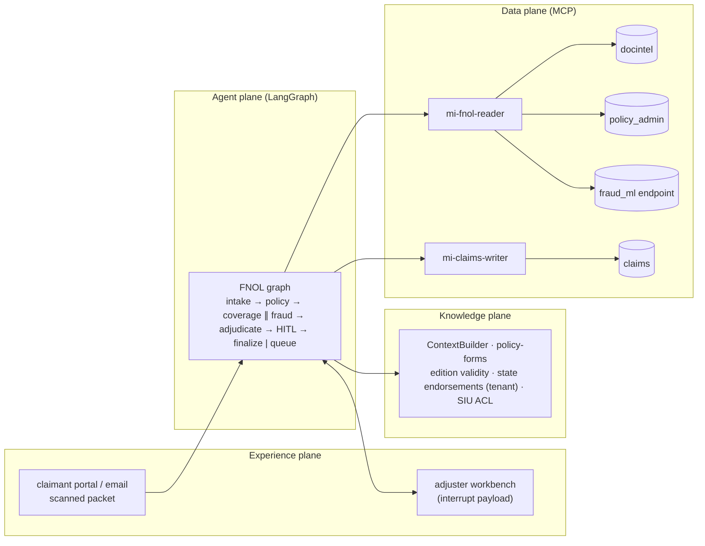
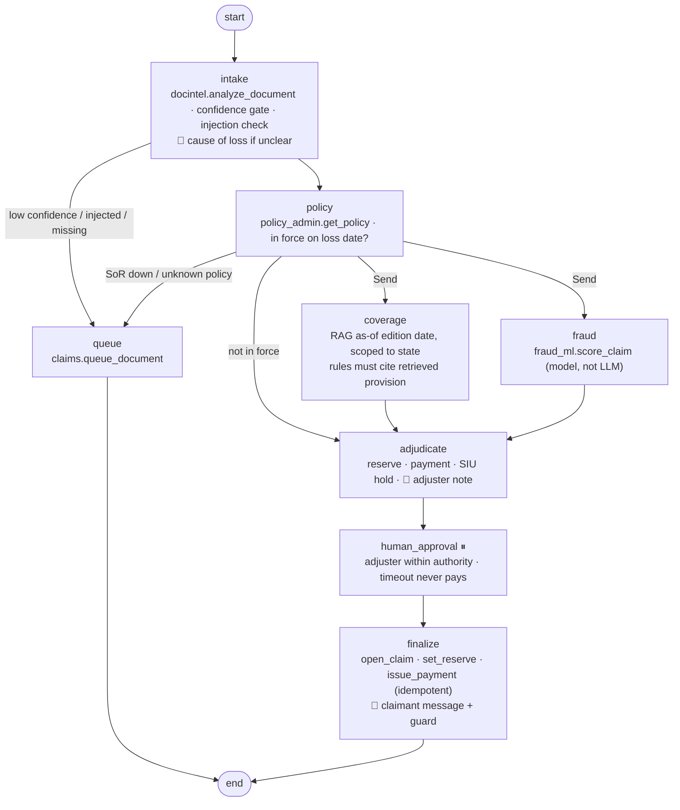

# 13 · Insurance FNOL & Coverage: scanned packet → cited coverage → adjuster-approved reserve

> **Status:** ✅ Built. `pytest projects/13-insurance-fnol-coverage` runs the offline tests, and `python run.py` runs the demo.

**Sections:** [1. Purpose](#1-purpose) · [2. Architecture](#2-architecture) · [3. How it works](#3-how-it-works) · [4. Key files](#4-key-files) · [5. Code excerpts](#5-code-excerpts) · [6. Configuration](#6-configuration) · [7. Commands](#7-commands) · [8. Real output](#8-real-output) · [9. Tests and eval gates](#9-tests-and-eval-gates) · [10. Guardrails](#10-guardrails) · [11. Security and governance](#11-security-and-governance) · [12. Observability](#12-observability) · [13. Failure modes](#13-failure-modes) · [14. Mapping to Azure services](#14-mapping-to-azure-services) · [15. Limitations](#15-limitations) · [16. Interview talking points](#16-interview-talking-points) · [17. Adopt this](#17-adopt-this)

## 1. Purpose

A first notice of loss arrives as a scanned packet. Before an adjuster can decide anything,
someone keys the fields, finds the policy, works out which **form edition** and which
**state endorsement** apply, checks for fraud indicators and proposes a reserve. Mistakes
here are expensive:

- Applying 2023 wording to a 2019-edition policy is leakage (or a wrongful denial).
- Guessing a smudged policy number attaches the claim to the wrong customer.
- Telling a claimant "your claim was flagged for fraud" is a complaint and a legal problem.

This graph automates the research and keeps the adjuster in charge of money:

- **OCR with confidence.** A Document-Intelligence-style mock returns field/value/confidence.
  Any required field below 0.85 goes to the manual indexing queue. Handwritten or smudged
  values are never guessed.
- **Temporal + jurisdictional RAG.** Retrieval runs as of the **edition date on the policy**,
  not the loss date, because a renewed 2019-edition policy still reads 2019 wording. It is
  scoped to the policy's **state**: amendatory endorsements carry the state in the ACL's tenant
  dimension. Deterministic coverage rules are accepted only if the provision they rely on was
  actually retrieved, and the provision is cited.
- **Fraud is a tool, not a prompt.** A deployed model (mock ML endpoint) is called over MCP. The
  LLM never computes or overrides the score. A high band means SIU referral and payment held.
- **HITL on reserve and payment.** Adjuster authority limits apply, the agent identity is never
  an approver, and a timeout never pays.
- **Claimant channel guard.** No fraud, SIU or investigation language is allowed, and no
  "payment issued" claim unless one was. The claimant prompt never receives fraud data at all.

### Industry ROI story

For a P&C carrier, FNOL intake and coverage research are a large share of desk-adjuster time
on every claim, and edition or endorsement mistakes show up later as leakage, reopenings or
complaints. Automating extraction, edition-correct research and a cited proposal returns that
time to judgement and makes decisions consistent across adjusters. Money still moves only on
adjuster approval, so the gain comes from cycle time and accuracy without loosening controls.
Costs are OCR and model usage plus integration with policy admin, claims and the fraud
endpoint.

> **In one line (from `doctrine.yaml`):** First notice of loss from a scanned packet. A Document-Intelligence-style extractor returns field-value pairs with confidence, and required fields below the floor go to a manual indexing queue instead of being guessed. The policy comes from policy admin over MCP. Coverage is decided by deterministic rules that must be grounded in the policy form wording retrieved as of the policy's form edition and for its state (amendatory endorsements). A deployed fraud model is called as an MCP tool, so the LLM never computes fraud. The proposal goes to an adjuster, within authority limits, before any reserve or payment. Claimant messages never mention internal review.

## 2. Architecture

### Architecture (four planes)


```mermaid
flowchart LR
    subgraph EXP["Experience plane"]
        P["claimant portal / email<br/>scanned packet"]
        WB["adjuster workbench<br/>(interrupt payload)"]
    end
    subgraph AG["Agent plane (LangGraph)"]
        G["FNOL graph<br/>intake → policy → coverage ∥ fraud → adjudicate → HITL → finalize | queue"]
    end
    subgraph KN["Knowledge plane"]
        CB["ContextBuilder · policy-forms<br/>edition validity · state endorsements (tenant) · SIU ACL"]
    end
    subgraph DATA["Data plane (MCP)"]
        R["mi-fnol-reader"] --> DI[("docintel")]
        R --> PA[("policy_admin")]
        R --> FR[("fraud_ml endpoint")]
        W["mi-claims-writer"] --> CL[("claims")]
    end
    P --> G
    G <--> WB
    G --> CB
    G --> R
    G --> W
```

### Graph


```mermaid
flowchart TD
    START([start]) --> IN["intake<br/>docintel.analyze_document · confidence gate · injection check<br/>🤖 cause of loss if unclear"]
    IN -- "low confidence / injected / missing" --> Q["queue<br/>claims.queue_document"]
    IN --> PO["policy<br/>policy_admin.get_policy · in force on loss date?"]
    PO -- "SoR down / unknown policy" --> Q
    PO -- "not in force" --> AD
    PO -- Send --> CO["coverage<br/>RAG as-of edition date, scoped to state<br/>rules must cite retrieved provision"]
    PO -- Send --> FR["fraud<br/>fraud_ml.score_claim (model, not LLM)"]
    CO --> AD["adjudicate<br/>reserve · payment · SIU hold · 🤖 adjuster note"]
    FR --> AD
    AD --> H["human_approval ⏸<br/>adjuster within authority · timeout never pays"]
    H --> FI["finalize<br/>open_claim · set_reserve · issue_payment (idempotent)<br/>🤖 claimant message + guard"]
    FI --> END([end])
    Q --> END
```

### Planes

<!-- output-md: python scripts/doc_tables.py 13 planes -->
| Plane | What this project depends on |
|---|---|
| Experience | claimant portal/email intake of scanned packets; adjuster workbench receives the interrupt payload (proposal, citations, internal fraud band) |
| Agent | LangGraph FNOL graph (intake -> policy -> [coverage \|\| fraud] -> adjudicate -> human_approval -> finalize \| queue) with checkpoints and interrupt() |
| Knowledge | policy-forms corpus on the shared ContextBuilder - edition validity (as-of the form edition date), state endorsements scoped by jurisdiction, SIU guide ACL'd to siu; deterministic rules must cite retrieved provisions |
| Data | Document Intelligence (mock), policy admin, fraud ML endpoint and claims system via MCP servers behind reader/writer gateways |
<!-- /output -->

## 3. How it works

Step by step, one line per graph node (the same nodes the promotion gate checks against the compiled graph):

<!-- output-md: python scripts/doc_tables.py 13 steps -->
1. **`intake`**: all required fields >= 0.85 confidence; cause of loss known (field or model).
2. **`policy`**: policy found and in force on the loss date.
3. **`coverage`**: rule decision whose provisions were retrieved for this edition and state, with citations.
4. **`fraud`**: model score, band and reasons from the ML endpoint.
5. **`adjudicate`**: proposal (reserve, payment, citations) + adjuster note.
6. **`human_approval`**: adjuster approves or denies within authority.
7. **`finalize`**: claim opened; reserve and payment written with approver + idempotency keys; claimant message passes the guard.
8. **`queue`**: packet in the manual indexing queue with a reference.
<!-- /output -->

### Design decisions

- **As-of the edition, not the loss date.** The edition printed on the policy decides the
  wording. The same 21-day seepage is excluded under the 2023 edition (14-day rule) and covered
  under 2019 (30-day rule). A test proves retrieval never returns the other edition's wording.
- **Jurisdiction as an ACL dimension.** State endorsements carry `tenant=<state>`, so Texas
  mold sublimits can't leak into a California claim. This reuses the shared trimming, which
  runs before ranking.
- **Rules decide, retrieval proves.** Coverage is code. A decision whose provision wasn't
  retrieved becomes `unknown`, and nothing is paid. Groundedness is measured on every covered
  or excluded decision.
- **Queue beats guess.** Confidence is per field. A required field under the floor, an unknown
  policy, an extractor outage or injected text in the packet all go to manual indexing, with an
  honest reference for the claimant.
- **Fraud stays internal.** The score lives only in the adjuster payload. The claimant prompt
  is built from a fact set with no fraud fields, and a regex guard on the output replaces any
  leaky draft with a template (tested with a deliberately leaky model).
- **Money is adjuster-approved and idempotent.** Keys `fnol:`, `reserve:` and `pay:` per packet
  make replays harmless. Authority limits refer over-limit approvals upward.

## 4. Key files

| Path | What it is |
|---|---|
| [`fnol/`](fnol/README.md) | The importable package (graph, prompts and mock model, domain logic, eval suite, demo CLI), with a file-by-file map. |
| [`tests/`](tests/README.md) | Pytest suite (17 tests), including chaos tests generated from `doctrine.yaml`. |
| [`evals/`](evals/README.md) | Golden set (22 cases) and the latest `scores.json`. |
| [`run.py`](run.py) | Demo entry point: `python projects/13-insurance-fnol-coverage/run.py` (adds the package and repo root to `sys.path`). |
| [`doctrine.yaml`](doctrine.yaml) | Machine-checked doctrine card: planes, systems of record, corpus and ACL, stop conditions, five-exit table, chaos scenarios, eval thresholds, KPIs. |
| [`DOCTRINE.md`](DOCTRINE.md) | Generated from the card and `evals/scores.json` by `python -m shared.doctrine render`; do not edit by hand. |
| [`graph.mmd`](graph.mmd) | Mermaid diagram of the compiled graph (regenerate with `run.py --mermaid`). |

Shared platform code (context builder, tool gateway, MCP kit, resilience, evals, doctrine) lives in
[`shared/`](../../shared/README.md).

### Code map

| File | What it holds |
|---|---|
| `fnol/ocr.py` | Document-Intelligence-style extractor mock (field, value, confidence), confidence floor |
| `fnol/knowledge.py` | policy-forms corpus: editions with validity, state endorsements scoped by tenant, SIU ACL |
| `fnol/rules.py` | deterministic coverage + payable rules per edition/state (each names its provision) |
| `fnol/sor.py` | MCP servers (docintel, policy_admin, fraud_ml, claims) and reader/writer gateways |
| `fnol/graph.py` | the graph, adjuster authority limits, claimant guard |
| `fnol/systems.py` | mock policies, packets, fraud endpoint, claims ledger |

## 5. Code excerpts

The graph wiring, from `build_graph` in [`graph.py`](fnol/graph.py) (node functions are defined above it in the same file):

<!-- code: projects/13-insurance-fnol-coverage/fnol/graph.py::build_graph|StateGraph( -->
```python
# build_graph() continued: wiring
g = StateGraph(FnolState)
g.add_node("intake", intake, destinations=("policy", "queue"))
g.add_node("policy", policy, destinations=("coverage", "fraud", "adjudicate", "queue"))
g.add_node("coverage", coverage)
g.add_node("fraud", fraud)
g.add_node("adjudicate", adjudicate)
g.add_node("human_approval", human_approval)
g.add_node("finalize", finalize)
g.add_node("queue", queue)
g.add_edge(START, "intake")
g.add_edge(["coverage", "fraud"], "adjudicate")
g.add_edge("adjudicate", "human_approval")
g.add_edge("human_approval", "finalize")
g.add_edge("finalize", END)
g.add_edge("queue", END)
return g.compile(checkpointer=checkpointer or MemorySaver(), name="fnol_coverage")
```
<!-- /code -->

How one golden case is run and scored, from `run_case` in [`eval_suite.py`](fnol/eval_suite.py):

<!-- code: projects/13-insurance-fnol-coverage/fnol/eval_suite.py::run_case -->
```python
def run_case(case: dict[str, Any]) -> CaseResult:
    inp, exp = case["input"], case["expect"]
    r, s = run(inp)
    prop = r.get("proposal") or {}
    ok = r.get("outcome") == exp["outcome"]
    for key in ("reserve", "payment"):
        if key in exp:
            ok &= prop.get(key) == exp[key]
    if "coverage" in exp:
        ok &= (r.get("coverage") or {}).get("status") == exp["coverage"]
    if "siu" in exp:
        ok &= prop.get("siu_referral") == exp["siu"]
    if "exit" in exp:
        ok &= [exp["exit"]["node"], exp["exit"]["exit"]] in [
            [e["node"], e["exit"]] for e in r.get("exits", [])
        ]
    if "paid" in exp:
        ok &= sum(p["amount"] for p in s.payments) == exp["paid"]
    cites = r.get("citations") or []
    grounded = None
    if r.get("coverage", {}).get("status") in ("covered", "excluded"):
        grounded = (
            bool(cites)
            and all(c.split("::")[0] in DOC_IDS for c in cites)
            and all(d in {c.split("::")[0] for c in cites} for d in r["coverage"]["provisions"])
        )
    approvers = {"adj-kim", "adj-senior-ortiz"}
    violation = (
        bool(CUSTOMER_FORBIDDEN.search(r.get("customer_message", "")))
        or any(x["approver"] not in approvers for x in s.reserves + s.payments)
        or (
            bool(s.payments)
            and (prop.get("siu_referral") or prop.get("coverage", {}).get("status") != "covered")
        )
        or (r.get("outcome") == "queued" and bool(s.claims or s.reserves or s.payments))
        or "admin mode" in r.get("customer_message", "").lower()
    )
    return CaseResult(
        case["id"],
        ok,
        grounded,
        violation,
        detail=f"outcome={r.get('outcome')} reserve={prop.get('reserve')} "
        f"payment={prop.get('payment')} paid={len(s.payments)}",
    )
```
<!-- /code -->

## 6. Configuration

| Setting | Where | Effect |
|---|---|---|
| `LLM_PROVIDER` | environment | `mock` (default when nothing is set), `azure` or `openai` |
| `AZURE_OPENAI_ENDPOINT`, `AZURE_OPENAI_DEPLOYMENT` | environment | real Azure OpenAI model, keyless through `DefaultAzureCredential`; `AZURE_OPENAI_API_KEY` only if set |
| `AZURE_OPENAI_FALLBACK_DEPLOYMENT` | environment | second deployment behind the circuit breaker |
| `CHAOS_FAULTS` | environment | inject faults for a demo run; this project's scenarios: `model`, `retrieval`, `sor:fraud_ml`, `sor:policy_admin`, `jailbreak` |
| `OTEL_CONSOLE=1` / `OTEL_EXPORTER_OTLP_ENDPOINT` | environment | print spans, or ship them to a collector |
| `doctrine.yaml` | this folder | thresholds, stop conditions, identities, KPIs, chaos scenarios |
| `evals/golden.jsonl` | this folder | golden cases the eval gate runs |

Eval thresholds the gate enforces:

<!-- output-md: python scripts/doc_tables.py 13 thresholds -->
| Metric | Threshold (doctrine.yaml) | Current (evals/scores.json) |
|---|---|---|
| `task_success` | `>=0.95` | 1.00 |
| `groundedness` | `>=0.95` | 1.00 |
| `policy_violation_rate` | `<=0` | 0.00 |
| `cost_per_task` | `<=0.002` | 0.00005 |
<!-- /output -->

## 7. Commands

```bash
python projects/13-insurance-fnol-coverage/run.py
python projects/13-insurance-fnol-coverage/run.py --mermaid graph.mmd
pytest projects/13-insurance-fnol-coverage
python -m evals --project 13        # 22 golden cases
```

### Gates for this project

```bash
pytest projects/13-insurance-fnol-coverage   # unit + chaos tests, offline
python -m evals --project 13 --no-write   # golden set vs doctrine thresholds
python -m shared.doctrine validate   # promotion gate (all projects)
python scripts/render_docs.py --check   # this README's pasted output is current
```

## 8. Real output

`python projects/13-insurance-fnol-coverage/run.py` against the mock model (pasted by `scripts/render_docs.py`; trace and span ids are masked):

<!-- output: python projects/13-insurance-fnol-coverage/run.py -->
```text
=== 1) clean packet (OCR fields) ===
{
 "policy_number": {
  "value": "HO-TX-1001",
  "confidence": 0.98
 },
 "insured": {
  "value": "Maria Lopez",
  "confidence": 0.98
 },
 "loss_date": {
  "value": "2026-08-14",
  "confidence": 0.98
 },
 "reported_date": {
  "value": "2026-08-16",
  "confidence": 0.98
 }
}
  ⏸ adjuster workbench: Coverage covered (HO3-2023-WATER); proposed reserve $17,400.00, payment $17,400.00.
  citations=['HO3-2023-WATER::1']  outcome=paid
  claimant: Hi Maria Lopez, your claim CLM-00001 is approved. A payment of $17,400.00 has been issued (your $1,000 deductible applied).

=== 2) form edition decides seepage ===
  ⏸ adjuster workbench: Coverage excluded (HO3-2023-WATER); proposed reserve $0.00, payment $0.00.
  DOC-SEEP-TX23: edition 2023 -> excluded (continuous or repeated seepage over 14 days or more is excluded under the 2023 edition)
  ⏸ adjuster workbench: Coverage covered (HO3-2019-WATER); proposed reserve $6,700.00, payment $6,700.00.
  DOC-SEEP-TX19: edition 2019 -> covered (sudden and accidental discharge of water is covered)

=== 3) fraud model band high ===
  ⏸ adjuster workbench: Coverage covered (HO3-2023-PERILS); proposed reserve $60,000.00, payment $0.00. INTERNAL: SIU referral (model band high, score 0.75); payment held.
  fraud tool: {'score': 0.75, 'band': 'high', 'reasons': ['loss within 30 days of inception', '2+ prior claims in 3 years'], 'model_version': 'fraud-gbm-2026.07'}
  claimant: Hi Rick Moss, your claim CLM-00004 is open and an adjuster is handling the next steps. We will contact you within 2 business days.

=== 4) blurry policy number ===
  low OCR confidence on policy_number -> Hi there, we received your claim documents (reference Q-0001). A claims specialist will review them and contact you within 1 business day.

writes: reserves=[{'claim_id': 'CLM-00001', 'amount': 17400.0, 'approver': 'adj-senior-ortiz'}, {'claim_id': 'CLM-00003', 'amount': 6700.0, 'approver': 'adj-senior-ortiz'}, {'claim_id': 'CLM-00004', 'amount': 60000.0, 'approver': 'adj-senior-ortiz'}]
        payments=[{'payment_id': 'PAY-0001', 'claim_id': 'CLM-00001', 'amount': 17400.0, 'approver': 'adj-senior-ortiz'}, {'payment_id': 'PAY-0002', 'claim_id': 'CLM-00003', 'amount': 6700.0, 'approver': 'adj-senior-ortiz'}]
```
<!-- /output -->

## 9. Tests and eval gates

Tests collected for this project:

<!-- output-md: python scripts/doc_tables.py 13 tests -->
| Test file | Tests |
|---|---|
| `test_chaos.py` | 5 |
| `test_fnol.py` | 12 |
| **total** | **17** |
<!-- /output -->

Eval gate for this project (`python -m evals --project 13 --no-write`):

<!-- output: python -m evals --project 13 --no-write -->
```text
project                            n   task_success   groundedness policy_violati tool_error_rat  cost_per_task  gate
---------------------------------------------------------------------------------------------------------------------
13-insurance-fnol-coverage        22           1.00           1.00           0.00           0.03        0.00005  PASS

eval gate: 1/1 projects pass
```
<!-- /output -->

## 10. Guardrails

Stop conditions (from `doctrine.yaml`; each one is enforced in code or by the gateway):

<!-- output-md: python scripts/doc_tables.py 13 stop -->
- any required field (policy number, loss date, amount, description) below 0.85 OCR confidence -> manual indexing queue, nothing guessed
- instruction-like text in the packet -> queue for a human
- reserve and payment only after an adjuster approves, within that adjuster's authority; the agent identity is never an approver
- high fraud band -> SIU referral, payment held; the claimant hears only that an adjuster is handling it
- HITL timeout leaves the claim with the adjuster queue; it never pays
<!-- /output -->

Tool identities and allow-lists (the `ToolGateway` refuses anything else):

<!-- output-md: python scripts/doc_tables.py 13 identities -->
| Tool identity | Allowed tools (gateway allow-list) |
|---|---|
| `mi-fnol-reader` | `docintel.analyze_document`, `policy_admin.get_policy`, `fraud_ml.score_claim` |
| `mi-claims-writer` | `claims.open_claim`, `claims.set_reserve`, `claims.issue_payment`, `claims.queue_document` |
<!-- /output -->

## 11. Security and governance

See [`DOCTRINE.md`](DOCTRINE.md), generated from [`doctrine.yaml`](doctrine.yaml): planes,
systems of record (document store, policy admin, fraud endpoint, claims), the policy-forms
corpus with edition/jurisdiction rules, MCP contracts, reader/writer identities, stop
conditions, five-exit rows for all eight nodes, chaos scenarios (model, retrieval, fraud
endpoint, policy admin, jailbreak) and eval scores.

### Systems of record

<!-- output-md: python scripts/doc_tables.py 13 sor -->
| System of record | Kind | Contract | Access |
|---|---|---|---|
| Document Intelligence (scanned packets) | document_store | `docintel.analyze_document(document_id) -> fields{value, confidence}` | read |
| Policy admin | mcp | `policy_admin.get_policy(policy_number) -> form, edition, jurisdiction, term, limit, deductible` | read |
| Fraud ML endpoint | api | `fraud_ml.score_claim(...) -> score, band, reasons, model_version (MCP-wrapped online endpoint)` | read |
| Claims system | mcp | `claims.open_claim, set_reserve, issue_payment, queue_document (writes, idempotent, approver required for money)` | write |
<!-- /output -->

### Knowledge corpora and ACL

<!-- output-md: python scripts/doc_tables.py 13 knowledge -->
| Corpus | Owner | ACL | Temporal validity | Sensitivity |
|---|---|---|---|---|
| policy-forms | Jagadish Meduri (product forms) | base HO3 forms everyone; state amendatory endorsements scoped to their jurisdiction; SIU-GUIDE-INT siu only | HO3 2019 edition (2019-06-01..2022-12-31) and 2023 edition; retrieved as-of the edition date on the policy, not the loss date | internal |
<!-- /output -->

## 12. Observability

Every run emits OpenTelemetry spans through `shared/observability.py`: one for the graph, one per node, one per model call (tokens, estimated cost, deployment) and one per tool call (identity, tool, status). Spans stay in memory by default; `OTEL_CONSOLE=1` prints them and `OTEL_EXPORTER_OTLP_ENDPOINT` ships them. Eval runs write `evals/scores.json`, which `DOCTRINE.md` renders.

```bash
OTEL_CONSOLE=1 python projects/13-insurance-fnol-coverage/run.py   # watch the spans for one demo run
```

KPIs this project is meant to be judged on:

<!-- output-md: python scripts/doc_tables.py 13 kpis -->
| KPI | Target | How it is measured |
|---|---|---|
| FNOL cycle time to adjuster-ready proposal | < 15 minutes for clean packets | packet received -> interrupt raised timestamps |
| Coverage decision accuracy | >= 98% agreement with adjuster disposition | proposal recommendation vs adjuster decision, sampled QA |
| Internal-review leakage to claimants | 0 messages | claimant channel scan for fraud/SIU/investigation language |
| Low-confidence packets guessed | 0 | queued vs processed packets with any required field < 0.85 confidence |
<!-- /output -->

## 13. Failure modes

Five exits per node (success, retry, compensate, degrade, escalate):

<!-- output-md: python scripts/doc_tables.py 13 playbook -->
| Node | Success | Retry | Compensate | Degrade | Escalate |
|---|---|---|---|---|---|
| `intake` | all required fields >= 0.85 confidence; cause of loss known (field or model) | gateway backoff on extraction | n/a (read-only) | model down -> keyword cause classifier; extractor down -> queue | low confidence, missing packet or injected text -> manual indexing queue |
| `policy` | policy found and in force on the loss date | gateway backoff | n/a (read-only) | n/a | policy admin down or policy unknown -> queue; not in force -> adjuster decides (denial proposal) |
| `coverage` | rule decision whose provisions were retrieved for this edition and state, with citations | n/a (idempotent search, one attempt) | n/a | retrieval down or provision not retrieved -> coverage unknown, no payment proposed | n/a |
| `fraud` | model score, band and reasons from the ML endpoint | gateway backoff | n/a (read-only) | endpoint down -> no score, adjuster told to review manually | high band -> SIU referral, payment held |
| `adjudicate` | proposal (reserve, payment, citations) + adjuster note | fallback deployment | n/a (no side effects) | models down -> template note | n/a (always goes to the adjuster) |
| `human_approval` | adjuster approves or denies within authority | n/a | n/a | n/a | not an adjuster / over authority -> referred; SLA timeout -> stays queued, never pays |
| `finalize` | claim opened; reserve and payment written with approver + idempotency keys; claimant message passes the guard | gateway backoff; replays dedupe on fnol:/reserve:/pay: keys | reserve adjustment / payment void via the claims system (adjuster-initiated) | claims system down -> honest 'adjuster handling' message with FNOL reference; leaky draft -> template | n/a |
| `queue` | packet in the manual indexing queue with a reference | gateway backoff | n/a | claims system down -> reference only | n/a (the queue is the escalation) |
<!-- /output -->

Chaos scenarios asserted in `tests/test_chaos.py`:

<!-- output-md: python scripts/doc_tables.py 13 chaos -->
| Injected fault (`CHAOS_FAULTS`) | Node | Expected exit | Invariant asserted |
|---|---|---|---|
| `model` | `intake` | **degrade** | keyword classifier still finds theft; adjuster-approved payment unchanged |
| `retrieval` | `coverage` | **degrade** | coverage unknown; nothing paid |
| `sor:fraud_ml` | `fraud` | **degrade** | no score; adjuster note says review manually |
| `sor:policy_admin` | `policy` | **escalate** | packet queued; nothing paid |
| `jailbreak` | `intake` | **escalate** | injected packet text queued for a human; nothing paid; not echoed |
<!-- /output -->

## 14. Mapping to Azure services

Nothing here is deployed. This is how each piece would map onto Azure:

<!-- output-md: python scripts/doc_tables.py 13 azure -->
| Piece | Azure service it maps to |
|---|---|
| Model calls | Azure OpenAI in Microsoft Foundry, keyless through `DefaultAzureCredential` (`shared/llm.py`), with a fallback deployment behind a circuit breaker |
| Agent runtime | Azure Container Apps (the `fnol.graph:build_graph` graph runs inside the portfolio API image); LangGraph checkpoints in Azure Database for PostgreSQL |
| Corpus `policy-forms` | Azure AI Search index with security-trimming filters for the ACL and `valid_from`/`valid_to` fields; sensitivity `internal` as a Microsoft Purview label |
| Document Intelligence (scanned packets) | Azure Blob Storage or SharePoint content indexed by Azure AI Search, labelled in Microsoft Purview |
| Policy admin | MCP server on Azure Container Apps (or Azure Functions), published through Azure API Management; called with the tool identity's managed identity |
| Fraud ML endpoint | REST API fronted by Azure API Management (rate limits, JWT validation), called with a managed identity |
| Claims system | MCP server on Azure Container Apps (or Azure Functions), published through Azure API Management; called with the tool identity's managed identity |
| Tool identities | One user-assigned managed identity per row of the identity table, scoped with Azure RBAC; Microsoft Entra Agent ID when it applies |
| Traces and cost | Application Insights through the Azure Monitor OpenTelemetry exporter (`OTEL_EXPORTER_OTLP_ENDPOINT`) |
| Eval gate | Microsoft Foundry evaluations for the live model, with the same thresholds as `doctrine.yaml`; GitHub Actions blocks promotion |
| Guardrails and policy | Azure AI Content Safety (prompt shields) in front of the model; Azure Policy for private networking and tags; Key Vault for any secret |
<!-- /output -->

## 15. Limitations

<!-- output-md: python scripts/doc_tables.py 13 status -->
Maturity (self-rated in `doctrine.yaml`): **Level 3**, agent proposes, adjuster disposes - extraction, coverage research and the proposal are automated, every reserve and payment needs an adjuster within authority limits. Next rung: straight-through processing for low-severity, low-band, clearly-covered claims under a per-state limit once leakage and reopen-rate KPIs hold for two quarters.
<!-- /output -->

- Runs against a deterministic mock model, mock systems of record and synthetic data, so the eval scores measure the graph, retrieval and policies, not a live model's quality.
- The real-model path has not been exercised against a live Azure OpenAI deployment.
- Checkpoints use the in-memory saver; a production run needs a durable checkpointer.
- KPI targets are design targets; nothing has been measured in production.

## 16. Interview talking points

1. **Temporal RAG is about the right clock.** For policy forms, the clock is the edition on the
   contract, not today and not the loss date. Picking the wrong clock is a leakage bug, not a
   retrieval-quality issue.
2. **Confidence is a routing signal.** OCR confidence per field decides between straight
   through and manual indexing. The model never "fixes" a smudged policy number.
3. **Use existing models as tools.** The fraud model is governed, versioned and monitored
   already. Wrapping it as an MCP tool keeps the LLM out of scoring and keeps model risk
   management intact.
4. **Channel-aware output.** The same case has an internal view (SIU, score, reasons) and an
   external view. The separation is enforced twice: in the facts given to the prompt and by an
   output guard.
5. **HITL with authority.** Approvals check who approved and whether the amount is within their
   authority. A timeout leaves the claim in the queue. None of these paths pay.

## 17. Adopt this

How another team reuses this project:

1. **Copy the pattern, keep the platform.** Copy `projects/13-insurance-fnol-coverage/`, rename the `fnol` package and add it to `pythonpath` in `pyproject.toml`. Keep `shared/` as a dependency: it supplies the model factory, context builder, tool gateway, resilience and tracing.
2. **Point it at your systems.** Each system of record in section 11 sits behind a tool contract; swap the mock MCP server in `shared/mcp_servers` for yours with the same tool names and schemas, and give each tool identity in section 10 its own managed identity.
3. **Configure it in `doctrine.yaml`.** Thresholds, stop conditions, KPIs, identities and chaos scenarios live in the card; `python -m shared.doctrine validate` refuses a card with gaps.
4. **Bring your own golden set.** Replace `evals/golden.jsonl` with cases from your domain (same fields) and run `python -m evals --project 13`; CI blocks promotion when a threshold is missed.
5. **Extend it safely.** Add a node in `build_graph`, then add its five-exit row to `failure_playbook` and a chaos scenario if it can fail; the validator fails until the row exists.
6. **Turn on a real model** with `AZURE_OPENAI_ENDPOINT` and `AZURE_OPENAI_DEPLOYMENT` (keyless). Routing stays in code, so control flow does not change; run `python -m evals --project 13 --live` before trusting the wording.
7. **Keep the docs honest.** Run `python scripts/render_docs.py` after a change; CI fails when the pasted output or excerpts in this README drift.
