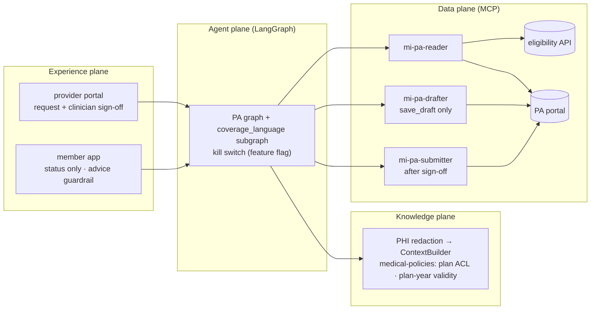
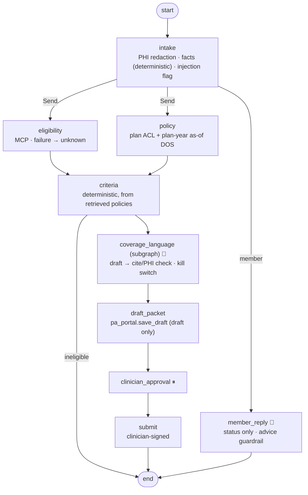

# 14 · Healthcare Prior Authorization: draft-only packets, clinician sign-off, PHI-safe

> **Status:** ✅ Built. `pytest projects/14-healthcare-prior-auth` runs the offline tests, and `python run.py` runs the demo.

## Business problem

Prior authorization is one of the heaviest administrative loads in US healthcare. Staff read
the chart, find the right medical policy for the member's plan and plan year, check each
criterion, assemble a packet and chase a signature. Getting it wrong means pends, denials and
delayed care. An assistant can do most of the assembly, but healthcare has hard lines:

- PHI must stay out of logs and model context.
- An eligibility outage must never read as "eligible".
- The bot never submits on its own.
- Members never get medical advice from it.
- Generated coverage wording must be switchable off in seconds if it misbehaves.

## What the graph does

- **PHI redaction in the knowledge plane.** Names, MRN, DOB, SSN, phone and email are removed
  before the note is packed or sent to a model. A `PhiFilter` on the `prior_auth` logger
  redacts every record, including one where the code deliberately logs the raw note.
- **ACL + plan-year RAG.** Plan-specific policies carry `plan:<id>` groups, so Gold PPO never
  retrieves Silver HMO referral rules. Editions are valid per plan year and retrieved as of
  the date of service: the same note meets the 2026 lumbar-MRI rule (4 weeks) and misses the
  2025 rule (6 weeks).
- **Eligibility via MCP; failure means `unknown`.** The packet is flagged "verify before
  service". A member who is ineligible on the date of service gets no packet.
- **Deterministic criteria, with citations.** A criterion is evaluated only if its policy was
  actually retrieved.
- **Coverage-language subgraph behind a kill switch.** The model words the summary, and a
  citation check plus a PHI check replace bad output with a template. With the kill switch off
  there is no generated wording at all, and the rest of the workflow keeps running.
- **Draft only → clinician approval → signed submission.**
  - The agent identity can only call `save_draft`.
  - Submission uses a separate identity after sign-off.
  - The portal itself rejects any submission without a registered clinician's signature.
- **Member channel is status-only.** Questions that ask for advice are refused and pointed to
  the nurse line. Any model output containing advice (dosages, "you should…", drug names) is
  blocked.

## Architecture (four planes)



## Graph



## Design decisions

- **Redact before the model, filter before the log.** Redaction lives in the knowledge plane,
  so no prompt or context pack sees PHI. The log filter is a safety net that holds even when
  someone logs a raw value, and a test does exactly that.
- **Plans are ACL groups, plan years are validity windows.** Both filters run before ranking,
  in the shared builder, so a wrong-plan or wrong-year policy can't influence the answer.
- **Three identities.** Reader, drafter and submitter. The drafting agent literally has no
  submit tool. The submitter is used only after a clinician signs, and the portal verifies
  the signature again.
- **Unknown is a first-class answer.** Eligibility errors become `unknown` with a flag, and a
  policy that wasn't retrieved leaves the criterion `unknown`. Nothing is assumed.
- **The kill switch has a narrow scope.** It switches off the generative wording, not the
  workflow. Staff still get the criteria checklist and citations.
- **Member guardrail on both sides.** Input: advice questions are refused before any model
  call. Output: advice patterns are blocked. It is tested with a model that deliberately
  gives advice.

## How to run

```bash
python projects/14-healthcare-prior-auth/run.py
python projects/14-healthcare-prior-auth/run.py --mermaid graph.mmd
pytest projects/14-healthcare-prior-auth
python -m evals --project 14        # 20 golden cases
```

## Interview talking points

1. **PHI is a data-plane and knowledge-plane concern, not a prompt instruction.** Redact
   before context assembly, filter logs, and test both with real-looking identifiers.
2. **Plan-year temporal RAG.** Medical policy changes every plan year. Filtering on the date
   of service is what makes the 4-week vs 6-week answer correct.
3. **Draft-only by construction.** Least privilege through identities and tool allowlists,
   plus server-side signature enforcement. The model can't talk its way into a submission.
4. **Kill switches should be surgical.** Turning off one risky capability (generated coverage
   wording) keeps the service up. That is what lets an incident commander use the switch
   without hesitating.
5. **Channel guardrails are hard rules.** Refusing medical advice is deterministic, checked on
   the way in and on the way out, and measured as a policy-violation KPI.

## Industry ROI story

For a provider group or health system, prior-auth preparation takes staff time on every
imaging and surgical order, and pends for missing documentation delay care. A criteria-checked,
cited packet ready for the clinician cuts preparation time and shows gaps (such as a missing
referral) before submission, which is what improves first-pass approvals. Payers benefit from
cleaner submissions too. Clinical accountability doesn't move: a clinician signs every request
and members get status only. Costs are model usage, eligibility API access and keeping medical
policies current each plan year.

## Project structure

| Path | What it is |
|---|---|
| [`prior_auth/`](prior_auth/README.md) | The importable package (graph, prompts and mock model, domain logic, eval suite, demo CLI), with a file-by-file map. |
| [`tests/`](tests/README.md) | Pytest suite (17 tests), including chaos tests generated from `doctrine.yaml`. |
| [`evals/`](evals/README.md) | Golden set (20 cases) and the latest `scores.json`. |
| [`run.py`](run.py) | Demo entry point: `python projects/14-healthcare-prior-auth/run.py` (adds the package and repo root to `sys.path`). |
| [`doctrine.yaml`](doctrine.yaml) | Machine-checked doctrine card: planes, systems of record, corpus and ACL, stop conditions, five-exit table, chaos scenarios, eval thresholds, KPIs. |
| [`DOCTRINE.md`](DOCTRINE.md) | Generated from the card and `evals/scores.json` by `python -m shared.doctrine render`; do not edit by hand. |
| [`graph.mmd`](graph.mmd) | Mermaid diagram of the compiled graph (regenerate with `run.py --mermaid`). |

Shared platform code (context builder, tool gateway, MCP kit, resilience, evals, doctrine) lives in
[`shared/`](../../shared/README.md).

## Doctrine compliance

See [`DOCTRINE.md`](DOCTRINE.md), generated from [`doctrine.yaml`](doctrine.yaml): planes,
eligibility API and PA portal contracts, the medical-policies corpus (plan ACL, plan-year
validity), three identities, stop conditions, five-exit rows for all nine nodes, chaos
scenarios (model, retrieval, eligibility, portal, jailbreak) and eval scores.
