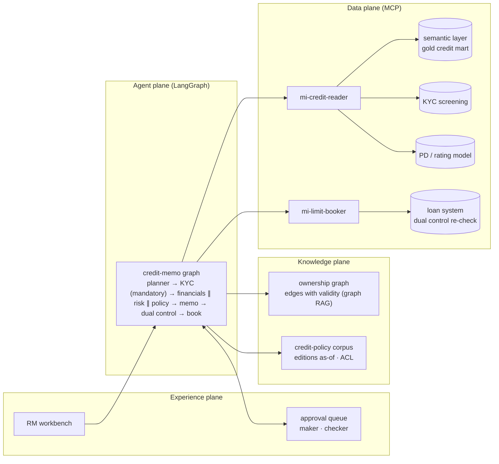
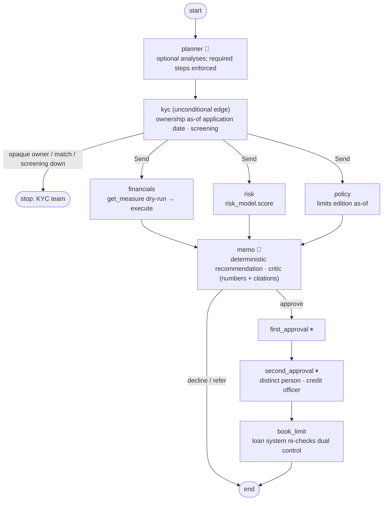

# 15 · Banking Credit Memo: governed measures, ownership graph, dual control

> **Status:** ✅ Built. `pytest projects/15-banking-credit-memo` runs the offline tests, and `python run.py` runs the demo.

## Business problem

A commercial credit memo pulls together financial ratios, beneficial ownership, the bank's
risk rating and the credit policy limits. The analyst then writes it up, and two people sign
off. It is slow, and the failure modes are serious:

- a ratio computed from the wrong table;
- an ownership chart that is out of date;
- a memo figure nobody can trace;
- a limit booked on one signature;
- a "fast-track" that skips KYC.

This graph automates the preparation and makes the controls structural:

- **Semantic layer, not SQL.** `get_measure(name, grain, filters, dry_run)` exposes only
  registered measures (revenue, EBITDA, leverage, DSCR…) over the gold mart. `borrower_id` is
  mandatory, unknown keys and SQL-looking values are rejected, and every call is dry-run first
  so the compiled plan can be checked.
- **Graph RAG for beneficial ownership over time.** Ownership edges carry
  `valid_from`/`valid_to`, and the walk multiplies stakes along each path as of the
  **application date**. In 2025 Jane Park (48%) and Marcus Lee (32%) are UBOs. After the 2026
  restructuring only Marcus (56%) is. The edges used become citable `OWN::e*` evidence.
- **Existing risk model as a tool.** PD and grade come from the validated scorecard
  (`risk_model.score`). The LLM never estimates risk.
- **Memo with citations and a critic.** Every number in the memo must appear in governed
  results, and every citation must be one the graph produced. Otherwise the deterministic
  template is used.
- **Dual control on money/limit tools.** Two distinct approvers are required, and the second
  must be a credit officer. The loan system re-checks both conditions server-side.
- **The fallback model cannot skip KYC.** KYC is an unconditional edge after the planner. A
  cheaper fallback deployment that "fast-tracks an existing client" gets its plan overridden,
  and the trust-owned borrower still stops at KYC.

## Architecture (four planes)



## Graph



## Design decisions

- **Governed measures are the only door to data.** The agent can't write SQL because no tool
  accepts SQL. The dry-run plan (model, expression, filters, row estimate) is checked before
  executing, which also makes the query auditable.
- **Ownership is a temporal graph, not a document.** Chunked PDFs of org charts go stale and
  can't be multiplied through holding companies. Edges with validity can, and each edge used
  is a citation.
- **Recommendation is code, wording is the model.** Leverage and DSCR are compared with the
  limits edition in force on the application date. The model writes prose around facts it
  can't change, and the critic proves it.
- **Mandatory controls live in the topology.** The planner can add optional analyses (a 3-year
  trend) but can't remove KYC. Swapping models (primary → fallback) changes wording, never the
  path.
- **Dual control twice.** The graph refuses the same person or a non-credit-officer as second
  approver. The loan system enforces the same rule independently, so a buggy or compromised
  caller still can't book on one signature.
- **Missing data means refer.** If financials, the risk score or the policy is missing, the
  recommendation is `refer` and there is no approval path.

## How to run

```bash
python projects/15-banking-credit-memo/run.py
python projects/15-banking-credit-memo/run.py --mermaid graph.mmd
pytest projects/15-banking-credit-memo
python -m evals --project 15        # 18 golden cases
```

## Interview talking points

1. **Semantic layer as an agent tool.** Name, grain and filters, with a dry run. It removes a
   whole class of text-to-SQL errors and makes every number traceable to a governed
   definition and version.
2. **Graph RAG where the data is a graph.** Beneficial ownership needs path multiplication and
   time travel. Vector search over documents can't give "who owned ≥25% on 15 June 2025".
3. **Reuse validated models.** The PD scorecard already went through model validation. Calling
   it as a tool keeps model-risk governance intact, and the LLM adds explanation, not
   estimation.
4. **Topology beats prompts for mandatory controls.** "Always run KYC" in a prompt is a
   suggestion. An unconditional edge is a guarantee, and a test proves it survives a fallback
   model that tries to skip it.
5. **Defence in depth on writes.** Dual control is checked in the graph and again in the
   system of record, with idempotency keys so replays never double-book.

## Industry ROI story

For a commercial bank, memo preparation is a large part of the time from application to
decision, and data-lineage findings are a recurring audit theme. Automating the gathering of
governed financials, the ownership trace and the first draft shortens turnaround for borrowers
and lets each analyst carry more applications. Every figure is cited back to a governed
measure, which cuts review rework. Credit discipline doesn't change: KYC is structural and
limits need two signatures. Costs are model usage and integration with the semantic layer,
screening and the loan system.

## Doctrine compliance

See [`DOCTRINE.md`](DOCTRINE.md), generated from [`doctrine.yaml`](doctrine.yaml): planes,
semantic layer / screening / PD model / loan system contracts, credit-policy corpus and the
ownership graph (both temporal), identities, stop conditions, five-exit rows for all nine
nodes, chaos scenarios (model, retrieval, semantic layer, screening, jailbreak) and eval scores.
