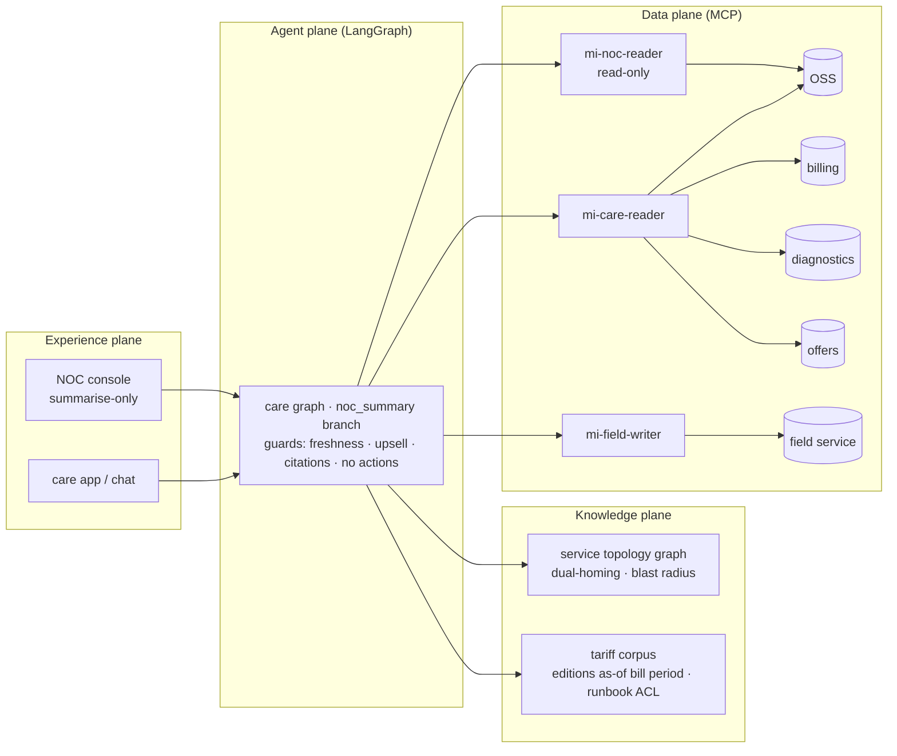
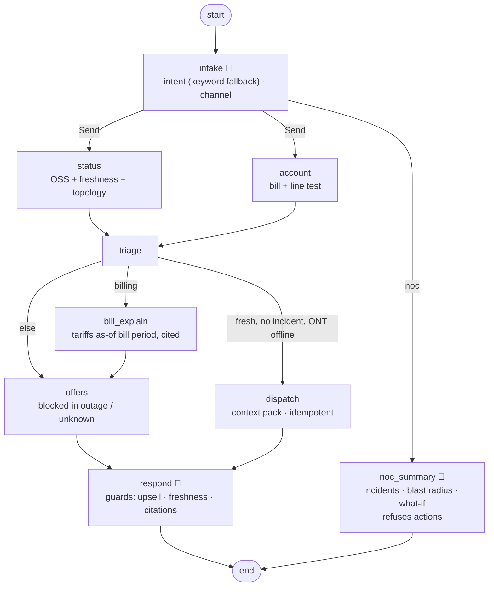

# 16 · Telecom Outage-Aware Care: blast radius, fresh truth, no upsell in outages

> **Status:** ✅ Built. `pytest projects/16-telecom-outage-care` runs the offline tests, and `python run.py` runs the demo.

## Business problem

When an aggregation switch fails, thousands of customers contact care at once. A care bot
that doesn't know the network does real damage:

- it tells customers to restart their router;
- it books technicians for a fault the network team is already fixing;
- it offers upgrades to people who have no service.

It is just as bad to call an outage "confirmed" from a status feed that stopped updating an
hour ago. This project makes care **network-aware and honest**:

- **Service topology graph with redundancy.** `blast_radius()` walks `depends_on`. A
  dual-homed cell site survives a single aggregation failure, so its customers are told
  (correctly) that no outage affects them. What-if queries account for incidents that are
  already active.
- **Outage truth from the OSS, with a freshness check.** If the feed's last observation is
  older than 15 minutes, the status is `unknown`. The answer says so ("our network status data
  is 50 minutes old"), and nothing downstream acts on it (no dispatch, no offers).
- **Bill explanation with citations.** Every line is tied to a tariff retrieved as of the
  **bill period**, so a 2025 bill cites the 2025 Fiber 500 price and a 2026 bill the 2026 one.
  Lines without a retrieved tariff are flagged for follow-up rather than guessed.
- **Upsell blocked during outages.** The offer node suppresses offers on a confirmed or
  unverifiable outage, and a response guard strips upsell language even from a pushy model.
- **Field dispatch context pack.** A technician is booked only when the status is fresh, no
  incident covers the path and the line test fails. The pack carries the service path,
  equipment, diagnostics, nearby incidents and safety notes, and it is idempotent per account
  per day.
- **NOC assistant summarises only.** It runs on a read-only identity (`oss.get_active_incidents`
  only), refuses action requests and strips action language from model output.

## Architecture (four planes)



## Graph



## Design decisions

- **Topology beats geography.** "Is there an outage in my area?" is the wrong question. The
  right one is whether the customer's access node still has an upstream path. Redundancy-aware
  blast radius answers it deterministically.
- **Freshness is part of truth.** An old observation isn't a fact, so the status becomes
  `unknown` and is disclosed. Stale data never triggers a truck roll, because a hidden outage
  would make it wasted.
- **Suppress offers when you can't vouch for the service.** Offers are blocked for confirmed
  and for unverifiable outages. The guard sits in two places: the offer node and the response.
- **Cite tariffs by bill period.** Price changes are the most common billing question, and
  as-of retrieval makes "why did it go up" answerable with the right edition.
- **Separate identities for care, field and NOC.** The NOC identity has one read tool, so
  "summarise only" is enforced by least privilege, not just by the prompt.

## How to run

```bash
python projects/16-telecom-outage-care/run.py
python projects/16-telecom-outage-care/run.py --mermaid graph.mmd
pytest projects/16-telecom-outage-care
python -m evals --project 16        # 19 golden cases
```

## Interview talking points

1. **Graph knowledge for network questions.** Blast radius is graph reachability with
   redundancy. Vector search can't answer "what else dies if AGG-1 dies, given AGG-2 is
   already down".
2. **Data freshness as a guard.** The same OSS payload yields "confirmed" or "can't confirm"
   depending on its age. That is the difference between an honest bot and a confident wrong
   one.
3. **Commercial guardrails.** Upsell suppression during outages is an explicit policy with a
   KPI, enforced before and after the model.
4. **Truck-roll economics.** Dispatch only when the network is ruled out, with a context pack
   that saves the technician a call to the NOC. It is idempotent so repeat contacts don't book
   twice.
5. **Summarise-only assistants.** For the NOC, value comes from fast, accurate summaries.
   Authority to change the network stays with engineers and the change process, and the
   identity makes that impossible to bypass.

## Industry ROI story

For a broadband and mobile operator, outage contact spikes, avoidable truck rolls and billing
questions are among the largest drivers of care cost and churn risk. Network-aware answers
deflect outage contacts with a truthful ETA. Ruling out the network before dispatch cuts truck
rolls that were never going to fix anything, and cited bill explanations reduce billing
escalations. Suppressing offers during outages protects NPS in exactly the moments customers
remember. Costs are OSS, billing and field-service integration and model usage.

## Doctrine compliance

See [`DOCTRINE.md`](DOCTRINE.md), generated from [`doctrine.yaml`](doctrine.yaml): planes, five
systems of record, the tariff corpus (editions, ACL) and the topology graph, three identities
(including read-only NOC), stop conditions, five-exit rows for all nine nodes, chaos scenarios
(model, OSS, retrieval, jailbreak) and eval scores.
