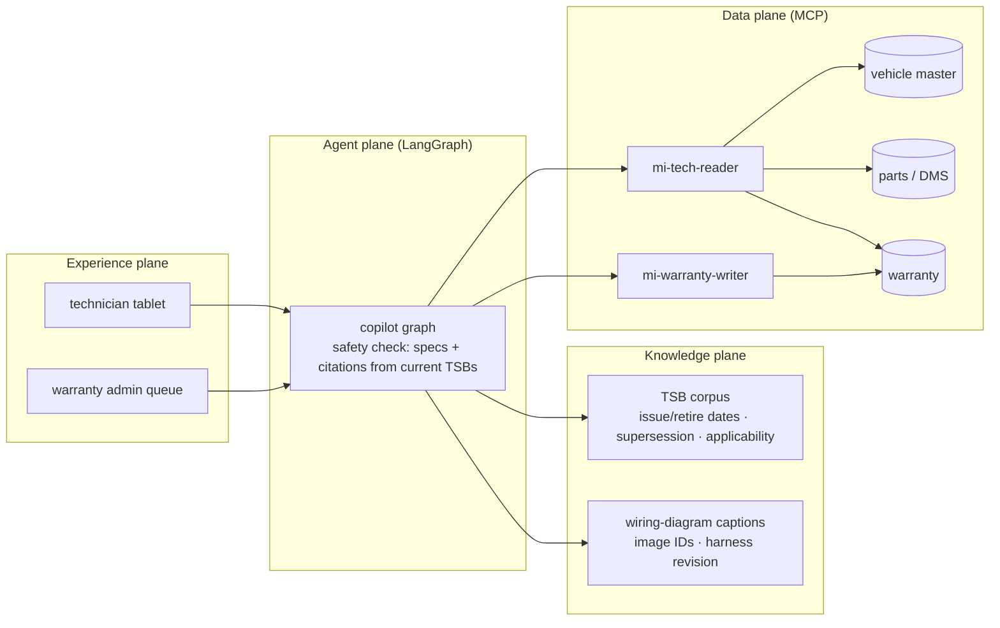
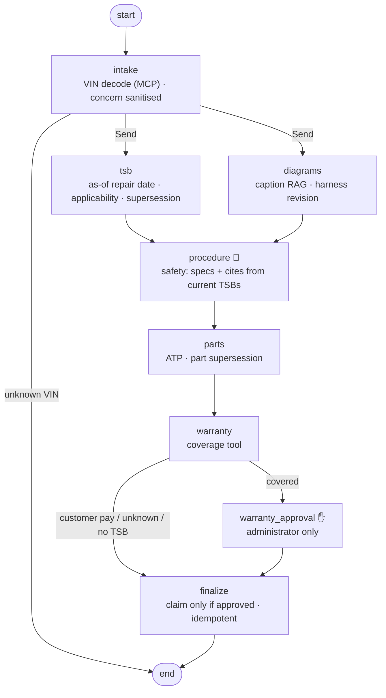

# 17 · Automotive Technician Copilot: the current TSB wins, captioned diagrams, warranty HITL

> **Status:** ✅ Built. `pytest projects/17-automotive-technician-copilot` runs the offline tests, and `python run.py` runs the demo.

## Business problem

Technicians spend a large share of each repair order looking things up: which service bulletin
applies to *this* VIN, which harness revision the car has, whether the part is in stock, and
whether the job is covered by warranty. The most dangerous error is the **wrong version**:
a bulletin that was superseded but never formally retired still ranks well in search, and its
old torque spec or part number ends up in the bay. This project makes the copilot
**version-safe**:

- **Temporal TSB retrieval with supersession.** Bulletins are retrieved as of the repair date
  and filtered by structured applicability (model, year range, engine, build date). Any bulletin
  superseded by another bulletin that is valid on the repair date is dropped, so the current TSB
  wins. A repair dated before the successor was issued correctly gets the old bulletin.
- **Multimodal RAG through captions.** Wiring diagrams are indexed by caption text and image ID
  (captions stand in for a vision model). They are filtered by model-year harness revision and
  linked to the bulletin's repair operation.
- **Wrong-version safety check.** Every torque value, part number and citation in the model's
  guidance must come from a current, applicable bulletin. Otherwise the guidance is replaced by
  the verbatim bulletin text.
- **Parts ATP via MCP**, following part supersession (11-4455-A → 11-4455-C).
- **Warranty is never auto-approved.** Coverage is a deterministic tool. Every covered claim
  interrupts for a warranty administrator. Agent and technician identities are refused, and
  the claim is submitted idempotently (`claim:<ro>`) with the approver recorded.

## Architecture (four planes)



## Graph



## Code map

| File | Purpose |
|---|---|
| `tech_copilot/knowledge.py` | TSB + diagram corpus, applicability registry, `applies()`, `current_only()` |
| `tech_copilot/systems.py` | mock vehicle master, parts ATP, warranty programs |
| `tech_copilot/sor.py` | MCP servers and reader / warranty-writer gateways |
| `tech_copilot/graph.py` | LangGraph graph, safety check, warranty HITL |
| `tech_copilot/eval_suite.py` | golden-set runner, violation checks, chaos scenarios |

## Design decisions

- **Supersession is metadata, not similarity.** An old bulletin that was never retired looks
  just as relevant as the new one. `current_only()` drops it when a successor is valid on the
  repair date, whether or not the successor was retrieved.
- **As-of the repair date, not today.** Re-checking a 2022 repair shows the bulletin that was
  current in 2022. This matters for warranty audits and comebacks.
- **Check the numbers, not the prose.** Torque values and part numbers are extracted with regex
  and compared with the current bulletin text. A mismatch replaces the whole guidance with the
  bulletin text, because a partly corrected spec sheet is worse than a verbatim one.
- **Diagrams follow the repair operation.** Images are linked to bulletins through the op code,
  so an infotainment job never shows a coolant wiring diagram just because it ranked.
- **Warranty authority lives in people and identities.** The graph always interrupts for
  covered claims, and only administrators can resume with an approval. The writer identity is
  separate from the reader identity.

## How to run

```bash
python projects/17-automotive-technician-copilot/run.py
python projects/17-automotive-technician-copilot/run.py --mermaid graph.mmd
pytest projects/17-automotive-technician-copilot
python -m evals --project 17        # 17 golden cases
```

## Interview talking points

1. **The wrong-version problem.** Search ranks a superseded bulletin as highly as its successor.
   I handle supersession structurally (`current_only`) and then check every spec in the output
   against the current bulletin. A test uses a model that "remembers" 25 Nm and proves it never
   reaches the technician.
2. **Temporal correctness in both directions.** The same car gets 32 Nm today and 25 Nm for a
   repair dated before the new bulletin, and a retired bulletin is never used.
3. **Multimodal without a vision model.** Captions plus image IDs give citeable, filterable
   diagram retrieval today. A vision model can be added later behind the same image IDs.
4. **HITL where money moves.** Coverage is computed by a tool, not the LLM. Covered claims
   always pause for an administrator, and an agent identity trying to approve is refused and
   escalated.
5. **Degrade honestly.** Parts down means ATP is unknown but guidance still works. Warranty down
   means coverage is unknown and no claim is made. Bulletin index down means no specs at all,
   only the standard diagnostic flow.

## Industry ROI story

Dealer service profitability depends on technician productivity and first-time fix. Bulletin
and diagram lookup is non-billable time, and a wrong-version spec causes comebacks and safety
exposure. Showing only the current, applicable bulletin with the right harness revision
shortens diagnosis. Checking parts ATP up front stops vehicles waiting on lifts. Claims built
with the correct op code, parts and bulletin reference cut OEM rejections and chargebacks.
Warranty spend stays under human control. Measure it with repair order clock times,
comeback rate and claim rejection rate, before and after.

## Project structure

| Path | What it is |
|---|---|
| [`tech_copilot/`](tech_copilot/README.md) | The importable package (graph, prompts and mock model, domain logic, eval suite, demo CLI), with a file-by-file map. |
| [`tests/`](tests/README.md) | Pytest suite (18 tests), including chaos tests generated from `doctrine.yaml`. |
| [`evals/`](evals/README.md) | Golden set (17 cases) and the latest `scores.json`. |
| [`run.py`](run.py) | Demo entry point: `python projects/17-automotive-technician-copilot/run.py` (adds the package and repo root to `sys.path`). |
| [`doctrine.yaml`](doctrine.yaml) | Machine-checked doctrine card: planes, systems of record, corpus and ACL, stop conditions, five-exit table, chaos scenarios, eval thresholds, KPIs. |
| [`DOCTRINE.md`](DOCTRINE.md) | Generated from the card and `evals/scores.json` by `python -m shared.doctrine render`; do not edit by hand. |
| [`graph.mmd`](graph.mmd) | Mermaid diagram of the compiled graph (regenerate with `run.py --mermaid`). |

Shared platform code (context builder, tool gateway, MCP kit, resilience, evals, doctrine) lives in
[`shared/`](../../shared/README.md).

## Doctrine compliance

See [`DOCTRINE.md`](DOCTRINE.md), generated from [`doctrine.yaml`](doctrine.yaml): planes, three
systems of record, TSB and diagram corpora (temporal validity, supersession, ACL), two
identities, stop conditions, five-exit rows for all eight nodes, chaos scenarios (model,
retrieval, parts, warranty, jailbreak) and eval scores.
