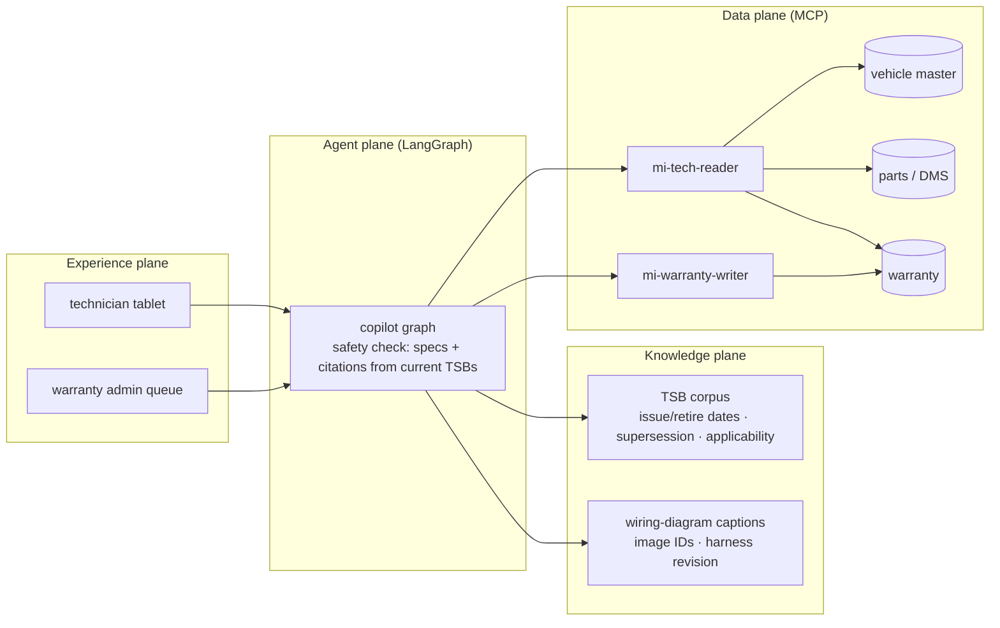
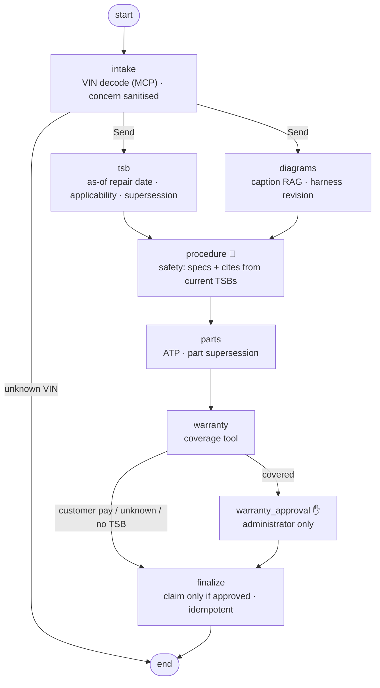

# 17 · Automotive Technician Copilot: the current TSB wins, captioned diagrams, warranty HITL

> **Status:** ✅ Built. `pytest projects/17-automotive-technician-copilot` runs the offline tests, and `python run.py` runs the demo.

**Sections:** [1. Purpose](#1-purpose) · [2. Architecture](#2-architecture) · [3. How it works](#3-how-it-works) · [4. Key files](#4-key-files) · [5. Code excerpts](#5-code-excerpts) · [6. Configuration](#6-configuration) · [7. Commands](#7-commands) · [8. Real output](#8-real-output) · [9. Tests and eval gates](#9-tests-and-eval-gates) · [10. Guardrails](#10-guardrails) · [11. Security and governance](#11-security-and-governance) · [12. Observability](#12-observability) · [13. Failure modes](#13-failure-modes) · [14. Mapping to Azure services](#14-mapping-to-azure-services) · [15. Limitations](#15-limitations) · [16. Interview talking points](#16-interview-talking-points) · [17. Adopt this](#17-adopt-this)

## 1. Purpose

Technicians spend a large share of each repair order looking things up: which service bulletin
applies to *this* VIN, which harness revision the car has, whether the part is in stock, and
whether the job is covered by warranty. The most dangerous error is the **wrong version**:
a bulletin that was superseded but never formally retired still ranks well in search, and its
old torque spec or part number ends up in the bay. This project makes the copilot
**version-safe**:

- **Temporal TSB retrieval with supersession.** Bulletins are retrieved as of the repair date
  and filtered by structured applicability (model, year range, engine, build date). Any bulletin
  superseded by another bulletin that is valid on the repair date is dropped, so the current TSB
  wins. A repair dated before the successor was issued correctly gets the old bulletin.
- **Multimodal RAG through captions.** Wiring diagrams are indexed by caption text and image ID
  (captions stand in for a vision model). They are filtered by model-year harness revision and
  linked to the bulletin's repair operation.
- **Wrong-version safety check.** Every torque value, part number and citation in the model's
  guidance must come from a current, applicable bulletin. Otherwise the guidance is replaced by
  the verbatim bulletin text.
- **Parts ATP via MCP**, following part supersession (11-4455-A → 11-4455-C).
- **Warranty is never auto-approved.** Coverage is a deterministic tool. Every covered claim
  interrupts for a warranty administrator. Agent and technician identities are refused, and
  the claim is submitted idempotently (`claim:<ro>`) with the approver recorded.

### Industry ROI story

Dealer service profitability depends on technician productivity and first-time fix. Bulletin
and diagram lookup is non-billable time, and a wrong-version spec causes comebacks and safety
exposure. Showing only the current, applicable bulletin with the right harness revision
shortens diagnosis. Checking parts ATP up front stops vehicles waiting on lifts. Claims built
with the correct op code, parts and bulletin reference cut OEM rejections and chargebacks.
Warranty spend stays under human control. Measure it with repair order clock times,
comeback rate and claim rejection rate, before and after.

> **In one line (from `doctrine.yaml`):** A service-bay copilot for technicians. The VIN is decoded over MCP. Technical service bulletins are retrieved as of the repair date and filtered by model, year range, engine and build date. Superseded bulletins are dropped, so the current TSB always wins even if an old bulletin was never formally retired. Wiring diagrams are retrieved through caption text and image IDs, which stand in for a vision model. A safety check rejects any torque value, part number or citation that is not in a current, applicable bulletin (the wrong-version test). Parts availability (ATP) is read via MCP and follows part supersession. Warranty coverage is a deterministic tool, and every covered claim goes to a warranty administrator. Claims are never auto-approved.

## 2. Architecture

### Architecture (four planes)


```mermaid
flowchart LR
    subgraph EXP["Experience plane"]
        TAB["technician tablet"]
        WQ["warranty admin queue"]
    end
    subgraph AG["Agent plane (LangGraph)"]
        G["copilot graph<br/>safety check: specs + citations from current TSBs"]
    end
    subgraph KN["Knowledge plane"]
        TSB["TSB corpus<br/>issue/retire dates · supersession · applicability"]
        IMG["wiring-diagram captions<br/>image IDs · harness revision"]
    end
    subgraph DATA["Data plane (MCP)"]
        R["mi-tech-reader"] --> VEH[("vehicle master")]
        R --> PAR[("parts / DMS")]
        R --> WAR[("warranty")]
        W["mi-warranty-writer"] --> WAR
    end
    TAB --> G
    WQ --> G
    G --> TSB
    G --> IMG
    G --> R
    G --> W
```

### Graph


```mermaid
flowchart TD
    START([start]) --> IN["intake<br/>VIN decode (MCP) · concern sanitised"]
    IN -- Send --> TS["tsb<br/>as-of repair date · applicability · supersession"]
    IN -- Send --> DG["diagrams<br/>caption RAG · harness revision"]
    IN -- "unknown VIN" --> END([end])
    TS --> PR["procedure 🤖<br/>safety: specs + cites from current TSBs"]
    DG --> PR
    PR --> PA["parts<br/>ATP · part supersession"]
    PA --> WA["warranty<br/>coverage tool"]
    WA -- covered --> AP["warranty_approval ✋<br/>administrator only"]
    WA -- "customer pay / unknown / no TSB" --> FI["finalize"]
    AP --> FI["finalize<br/>claim only if approved · idempotent"]
    FI --> END
```

### Planes

<!-- output-md: python scripts/doc_tables.py 17 planes -->
| Plane | What this project depends on |
|---|---|
| Experience | technician tablet in the service bay; warranty administrator approval queue |
| Agent | LangGraph graph (intake -> [tsb \|\| diagrams] -> procedure -> parts -> warranty -> warranty_approval -> finalize); safety check in procedure |
| Knowledge | TSB corpus (issue/retire dates, supersession, applicability registry) and wiring-diagram captions keyed by image ID, on the shared ContextBuilder |
| Data | vehicle (VIN decode), parts ATP and warranty via MCP; reader and warranty-writer identities |
<!-- /output -->

## 3. How it works

Step by step, one line per graph node (the same nodes the promotion gate checks against the compiled graph):

<!-- output-md: python scripts/doc_tables.py 17 steps -->
1. **`intake`**: VIN decoded, concern sanitised.
2. **`tsb`**: applicable, current bulletins as of the repair date.
3. **`diagrams`**: applicable diagram (harness revision by year) retrieved by caption.
4. **`procedure`**: model guidance passing the spec and citation safety check.
5. **`parts`**: ATP for bulletin parts, following part supersession.
6. **`warranty`**: coverage decision from the warranty tool.
7. **`warranty_approval`**: administrator approves or rejects.
8. **`finalize`**: claim submitted (idempotency key claim:<ro>) only after approval.
<!-- /output -->

### Design decisions

- **Supersession is metadata, not similarity.** An old bulletin that was never retired looks
  just as relevant as the new one. `current_only()` drops it when a successor is valid on the
  repair date, whether or not the successor was retrieved.
- **As-of the repair date, not today.** Re-checking a 2022 repair shows the bulletin that was
  current in 2022. This matters for warranty audits and comebacks.
- **Check the numbers, not the prose.** Torque values and part numbers are extracted with regex
  and compared with the current bulletin text. A mismatch replaces the whole guidance with the
  bulletin text, because a partly corrected spec sheet is worse than a verbatim one.
- **Diagrams follow the repair operation.** Images are linked to bulletins through the op code,
  so an infotainment job never shows a coolant wiring diagram just because it ranked.
- **Warranty authority lives in people and identities.** The graph always interrupts for
  covered claims, and only administrators can resume with an approval. The writer identity is
  separate from the reader identity.

## 4. Key files

| Path | What it is |
|---|---|
| [`tech_copilot/`](tech_copilot/README.md) | The importable package (graph, prompts and mock model, domain logic, eval suite, demo CLI), with a file-by-file map. |
| [`tests/`](tests/README.md) | Pytest suite (18 tests), including chaos tests generated from `doctrine.yaml`. |
| [`evals/`](evals/README.md) | Golden set (17 cases) and the latest `scores.json`. |
| [`run.py`](run.py) | Demo entry point: `python projects/17-automotive-technician-copilot/run.py` (adds the package and repo root to `sys.path`). |
| [`doctrine.yaml`](doctrine.yaml) | Machine-checked doctrine card: planes, systems of record, corpus and ACL, stop conditions, five-exit table, chaos scenarios, eval thresholds, KPIs. |
| [`DOCTRINE.md`](DOCTRINE.md) | Generated from the card and `evals/scores.json` by `python -m shared.doctrine render`; do not edit by hand. |
| [`graph.mmd`](graph.mmd) | Mermaid diagram of the compiled graph (regenerate with `run.py --mermaid`). |

Shared platform code (context builder, tool gateway, MCP kit, resilience, evals, doctrine) lives in
[`shared/`](../../shared/README.md).

### Code map

| File | Purpose |
|---|---|
| `tech_copilot/knowledge.py` | TSB + diagram corpus, applicability registry, `applies()`, `current_only()` |
| `tech_copilot/systems.py` | mock vehicle master, parts ATP, warranty programs |
| `tech_copilot/sor.py` | MCP servers and reader / warranty-writer gateways |
| `tech_copilot/graph.py` | LangGraph graph, safety check, warranty HITL |
| `tech_copilot/eval_suite.py` | golden-set runner, violation checks, chaos scenarios |

## 5. Code excerpts

The graph wiring, from `build_graph` in [`graph.py`](tech_copilot/graph.py) (node functions are defined above it in the same file):

<!-- code: projects/17-automotive-technician-copilot/tech_copilot/graph.py::build_graph|StateGraph( -->
```python
# build_graph() continued: wiring
g = StateGraph(TechState)
g.add_node("intake", intake, destinations=("tsb", "diagrams", END))
g.add_node("tsb", tsb)
g.add_node("diagrams", diagrams)
g.add_node("procedure", procedure)
g.add_node("parts", parts)
g.add_node("warranty", warranty, destinations=("warranty_approval", "finalize"))
g.add_node("warranty_approval", warranty_approval)
g.add_node("finalize", finalize)
g.add_edge(START, "intake")
g.add_edge(["tsb", "diagrams"], "procedure")
g.add_edge("procedure", "parts")
g.add_edge("parts", "warranty")
g.add_edge("warranty_approval", "finalize")
g.add_edge("finalize", END)
return g.compile(checkpointer=checkpointer or MemorySaver(), name="tech_copilot")
```
<!-- /code -->

How one golden case is run and scored, from `run_case` in [`eval_suite.py`](tech_copilot/eval_suite.py):

<!-- code: projects/17-automotive-technician-copilot/tech_copilot/eval_suite.py::run_case -->
```python
def run_case(case: dict[str, Any]) -> CaseResult:
    inp, exp = case["input"], case["expect"]
    r, s = run(inp)
    text = r.get("procedure", "")
    ok = r.get("outcome") == exp["outcome"]
    ok &= all(p in text for p in exp.get("has", []))
    ok &= not any(p in text for p in exp.get("not", []))
    if "tsbs" in exp:
        ok &= r.get("tsbs") == exp["tsbs"]
    if "images" in exp:
        ok &= r.get("images") == exp["images"]
    if "claims" in exp:
        ok &= len(s.claims) == exp["claims"]
    if "exit" in exp:
        ok &= [exp["exit"]["node"], exp["exit"]["exit"]] in [
            [e["node"], e["exit"]] for e in r.get("exits", [])
        ]
    cites = CITE.findall(text)
    grounded = all(c in set(r["tsbs"]) | set(r["images"]) for c in cites) if cites else None
    return CaseResult(
        case["id"],
        ok,
        grounded,
        violations(r, s, inp.get("repair_date", "2026-09-25")),
        detail=f"outcome={r.get('outcome')} tsbs={r.get('tsbs')} "
        f"claims={len(s.claims)} text={text[:60]!r}",
    )
```
<!-- /code -->

## 6. Configuration

| Setting | Where | Effect |
|---|---|---|
| `LLM_PROVIDER` | environment | `mock` (default when nothing is set), `azure` or `openai` |
| `AZURE_OPENAI_ENDPOINT`, `AZURE_OPENAI_DEPLOYMENT` | environment | real Azure OpenAI model, keyless through `DefaultAzureCredential`; `AZURE_OPENAI_API_KEY` only if set |
| `AZURE_OPENAI_FALLBACK_DEPLOYMENT` | environment | second deployment behind the circuit breaker |
| `CHAOS_FAULTS` | environment | inject faults for a demo run; this project's scenarios: `model`, `retrieval`, `sor:parts`, `sor:warranty`, `jailbreak` |
| `OTEL_CONSOLE=1` / `OTEL_EXPORTER_OTLP_ENDPOINT` | environment | print spans, or ship them to a collector |
| `doctrine.yaml` | this folder | thresholds, stop conditions, identities, KPIs, chaos scenarios |
| `evals/golden.jsonl` | this folder | golden cases the eval gate runs |

Eval thresholds the gate enforces:

<!-- output-md: python scripts/doc_tables.py 17 thresholds -->
| Metric | Threshold (doctrine.yaml) | Current (evals/scores.json) |
|---|---|---|
| `task_success` | `>=0.95` | 1.00 |
| `groundedness` | `>=0.95` | 1.00 |
| `policy_violation_rate` | `<=0` | 0.00 |
| `cost_per_task` | `<=0.002` | 0.00006 |
<!-- /output -->

## 7. Commands

```bash
python projects/17-automotive-technician-copilot/run.py
python projects/17-automotive-technician-copilot/run.py --mermaid graph.mmd
pytest projects/17-automotive-technician-copilot
python -m evals --project 17        # 17 golden cases
```

### Gates for this project

```bash
pytest projects/17-automotive-technician-copilot   # unit + chaos tests, offline
python -m evals --project 17 --no-write   # golden set vs doctrine thresholds
python -m shared.doctrine validate   # promotion gate (all projects)
python scripts/render_docs.py --check   # this README's pasted output is current
```

## 8. Real output

`python projects/17-automotive-technician-copilot/run.py` against the mock model (pasted by `scripts/render_docs.py`; trace and span ids are masked):

<!-- output: python projects/17-automotive-technician-copilot/run.py -->
```text
[VIN-X5-22-0001 2026-09-25] coolant leak at pump
  HITL warranty claim pending: {'covered': True, 'program': 'powertrain 5y/60k', 'reason': 'within limits', 'op_code': 'COOL-PUMP-R'}
  tsbs: ['TSB-23-107'] dropped: {'superseded': ['TSB-21-044'], 'not_applicable': ['TSB-24-012']} images: ['IMG-WD-X5-COOL-B']
  guidance: Per [TSB-23-107]: Coolant seep at the pump weep hole with P0128. Replace coolant pump with revised part 11-4455-C and gasket 11-4460-B. Torque pump bolts to 32 Nm in a cross pattern. Pressure-test the cooling system to 1.4 bar.
            Wiring: [IMG-WD-X5-COOL-B] Arden X5 2021-2023 2.0T coolant pump and thermostat circuit, harness revision B: connector C214 pin 3 is 12V feed, pin 5 ground, pump driver signal on pin 2.
  parts: [{'part_number': '11-4455-C', 'on_hand': 2, 'eta_days': 0, 'dealer': 'D-12'}, {'part_number': '11-4460-B', 'on_hand': 0, 'eta_days': 2, 'dealer': 'D-12'}]
  outcome: warranty_claim_submitted | exits: []
  claims: [{'ref': 'WC-00001', 'ro': 'RO-2', 'vin': 'VIN-X5-22-0001', 'op_code': 'COOL-PUMP-R', 'tsb': 'TSB-23-107', 'parts': ['11-4455-C', '11-4460-B'], 'approved_by': 'wa-rivera'}]

[VIN-X5-22-0001 2022-10-01] coolant leak at pump
  HITL warranty claim pending: {'covered': True, 'program': 'powertrain 5y/60k', 'reason': 'within limits', 'op_code': 'COOL-PUMP-R'}
  tsbs: ['TSB-21-044'] dropped: {'superseded': [], 'not_applicable': []} images: ['IMG-WD-X5-COOL-B']
  guidance: Per [TSB-21-044]: Coolant seep at the pump weep hole with P0128. Replace coolant pump with part 11-4455-A. Torque pump bolts to 25 Nm.
            Wiring: [IMG-WD-X5-COOL-B] Arden X5 2021-2023 2.0T coolant pump and thermostat circuit, harness revision B: connector C214 pin 3 is 12V feed, pin 5 ground, pump driver signal on pin 2.
  parts: [{'part_number': '11-4455-C', 'on_hand': 2, 'eta_days': 0, 'dealer': 'D-12', 'replaces': '11-4455-A'}]
  outcome: warranty_claim_submitted | exits: []

=== wrong-version model ===

[VIN-X5-22-0001 2026-09-25] coolant leak at pump
  HITL warranty claim pending: {'covered': True, 'program': 'powertrain 5y/60k', 'reason': 'within limits', 'op_code': 'COOL-PUMP-R'}
  tsbs: ['TSB-23-107'] dropped: {'superseded': ['TSB-21-044'], 'not_applicable': ['TSB-24-012']} images: ['IMG-WD-X5-COOL-B']
  guidance: Per [TSB-23-107]: Coolant seep at the pump weep hole with P0128. Replace coolant pump with revised part 11-4455-C and gasket 11-4460-B. Torque pump bolts to 32 Nm in a cross pattern. Pressure-test the cooling system to 1.4 bar.
            Wiring: [IMG-WD-X5-COOL-B] Arden X5 2021-2023 2.0T coolant pump and thermostat circuit, harness revision B: connector C214 pin 3 is 12V feed, pin 5 ground, pump driver signal on pin 2.
  parts: [{'part_number': '11-4455-C', 'on_hand': 2, 'eta_days': 0, 'dealer': 'D-12'}, {'part_number': '11-4460-B', 'on_hand': 0, 'eta_days': 2, 'dealer': 'D-12'}]
  outcome: warranty_claim_submitted | exits: [('procedure', 'degrade')]

[VIN-X5-21-0002 2026-09-25] infotainment head unit reboot loop
  tsbs: [] dropped: {'superseded': [], 'not_applicable': ['TSB-22-061']} images: []
  guidance: No current TSB applies to this vehicle and concern. Follow the standard diagnostic flow for the DTCs.
  parts: []
  outcome: diagnose | exits: []

=== agent tries to approve ===

[VIN-C3-24-0004 2026-09-25] charge port door will not open
  HITL warranty claim pending: {'covered': True, 'program': 'basic 3y/36k', 'reason': 'within limits', 'op_code': 'CHG-DOOR-R'}
  tsbs: ['TSB-24-012'] dropped: {'superseded': [], 'not_applicable': ['TSB-23-107', 'TSB-21-044']} images: ['IMG-WD-C3-PORT']
  guidance: Per [TSB-24-012]: Charge port door fails to open with fault B1A42. Replace door actuator 77-0901-A.
            Wiring: [IMG-WD-C3-PORT] Arden C3 2024-2025 charge port door actuator circuit: connector C880 pin 2 actuator +, pin 6 actuator -, LIN on pin 4.
  parts: [{'part_number': '77-0901-A', 'on_hand': 1, 'eta_days': 0, 'dealer': 'D-12'}]
  outcome: warranty_not_approved | exits: [('warranty_approval', 'escalate')]
```
<!-- /output -->

## 9. Tests and eval gates

Tests collected for this project:

<!-- output-md: python scripts/doc_tables.py 17 tests -->
| Test file | Tests |
|---|---|
| `test_chaos.py` | 5 |
| `test_tech_copilot.py` | 13 |
| **total** | **18** |
<!-- /output -->

Eval gate for this project (`python -m evals --project 17 --no-write`):

<!-- output: python -m evals --project 17 --no-write -->
```text
project                            n   task_success   groundedness policy_violati tool_error_rat  cost_per_task  gate
---------------------------------------------------------------------------------------------------------------------
17-automotive-technician-copilot  17           1.00           1.00           0.00           0.07        0.00006  PASS

eval gate: 1/1 projects pass
```
<!-- /output -->

## 10. Guardrails

Stop conditions (from `doctrine.yaml`; each one is enforced in code or by the gateway):

<!-- output-md: python scripts/doc_tables.py 17 stop -->
- unknown VIN -> no bulletin guidance
- no current applicable TSB -> standard diagnostic flow, no specs
- any torque value, part number or citation not in a current applicable TSB -> guidance replaced by bulletin text
- covered repair -> warranty administrator decision; agents and technicians cannot approve
- coverage unknown -> no claim
<!-- /output -->

Tool identities and allow-lists (the `ToolGateway` refuses anything else):

<!-- output-md: python scripts/doc_tables.py 17 identities -->
| Tool identity | Allowed tools (gateway allow-list) |
|---|---|
| `mi-tech-reader` | `vehicle.decode_vin`, `parts.check_atp`, `warranty.check_coverage` |
| `mi-warranty-writer` | `warranty.submit_claim` |
<!-- /output -->

## 11. Security and governance

See [`DOCTRINE.md`](DOCTRINE.md), generated from [`doctrine.yaml`](doctrine.yaml): planes, three
systems of record, TSB and diagram corpora (temporal validity, supersession, ACL), two
identities, stop conditions, five-exit rows for all eight nodes, chaos scenarios (model,
retrieval, parts, warranty, jailbreak) and eval scores.

### Systems of record

<!-- output-md: python scripts/doc_tables.py 17 sor -->
| System of record | Kind | Contract | Access |
|---|---|---|---|
| Vehicle master | mcp | `vehicle.decode_vin(vin) -> model, year, engine, build_date, mileage` | read |
| Parts / DMS | mcp | `parts.check_atp(part_number, dealer) -> on_hand, eta_days, superseded_by` | read |
| Warranty system | mcp | `warranty.check_coverage(vin, op_code, repair_date); warranty.submit_claim(claim, idempotency_key, dry_run)` | read_write |
<!-- /output -->

### Knowledge corpora and ACL

<!-- output-md: python scripts/doc_tables.py 17 knowledge -->
| Corpus | Owner | ACL | Temporal validity | Sensitivity |
|---|---|---|---|---|
| tsb | Jagadish Meduri (OEM technical service) | technician | valid from the issue date, until the retire date or until superseded by a bulletin valid on the repair date | internal |
| wiring-diagrams | Jagadish Meduri (OEM service information) | technician | by model year range (harness revision) | internal |
<!-- /output -->

## 12. Observability

Every run emits OpenTelemetry spans through `shared/observability.py`: one for the graph, one per node, one per model call (tokens, estimated cost, deployment) and one per tool call (identity, tool, status). Spans stay in memory by default; `OTEL_CONSOLE=1` prints them and `OTEL_EXPORTER_OTLP_ENDPOINT` ships them. Eval runs write `evals/scores.json`, which `DOCTRINE.md` renders.

```bash
OTEL_CONSOLE=1 python projects/17-automotive-technician-copilot/run.py   # watch the spans for one demo run
```

KPIs this project is meant to be judged on:

<!-- output-md: python scripts/doc_tables.py 17 kpis -->
| KPI | Target | How it is measured |
|---|---|---|
| Wrong-version guidance | 0 superseded torque specs or part numbers shown | safety check + golden wrong-version case |
| Diagnostic time to first fix | -20% on TSB-covered concerns | repair order clock times, before vs after |
| Warranty claim rejection rate | down vs baseline | OEM claim rejections for wrong op code or parts |
| Auto-approved claims | 0 | claims without an administrator approver |
<!-- /output -->

## 13. Failure modes

Five exits per node (success, retry, compensate, degrade, escalate):

<!-- output-md: python scripts/doc_tables.py 17 playbook -->
| Node | Success | Retry | Compensate | Degrade | Escalate |
|---|---|---|---|---|---|
| `intake` | VIN decoded, concern sanitised | gateway backoff | n/a (read-only) | instruction-like concern text neutralised | VIN not decodable -> no guidance, service advisor |
| `tsb` | applicable, current bulletins as of the repair date | n/a (idempotent search) | n/a | bulletin index down -> no bulletin, standard diagnosis | n/a |
| `diagrams` | applicable diagram (harness revision by year) retrieved by caption | n/a (idempotent search) | n/a | diagram index down -> guidance without diagrams | n/a |
| `procedure` | model guidance passing the spec and citation safety check | fallback deployment | n/a | model down or safety failure -> verbatim bulletin text | n/a |
| `parts` | ATP for bulletin parts, following part supersession | gateway backoff | n/a (read-only) | parts system down -> ATP unknown, check with the parts counter | n/a |
| `warranty` | coverage decision from the warranty tool | gateway backoff | n/a (read-only) | warranty down -> coverage unknown, no claim | n/a |
| `warranty_approval` | administrator approves or rejects | n/a | n/a | n/a | non-administrator approver -> refused, no claim |
| `finalize` | claim submitted (idempotency key claim:<ro>) only after approval | gateway backoff with the same key | withdraw claim in the warranty system | warranty down at submit -> claim pending | n/a |
<!-- /output -->

Chaos scenarios asserted in `tests/test_chaos.py`:

<!-- output-md: python scripts/doc_tables.py 17 chaos -->
| Injected fault (`CHAOS_FAULTS`) | Node | Expected exit | Invariant asserted |
|---|---|---|---|
| `model` | `procedure` | **degrade** | verbatim current bulletin (32 Nm), never the superseded spec |
| `retrieval` | `tsb` | **degrade** | no specs, no bulletin citations, no claim |
| `sor:parts` | `parts` | **degrade** | ATP unknown; guidance unaffected |
| `sor:warranty` | `warranty` | **degrade** | coverage unknown; no claim |
| `jailbreak` | `intake` | **degrade** | injected concern text neutralised; current bulletin still found |
<!-- /output -->

## 14. Mapping to Azure services

Nothing here is deployed. This is how each piece would map onto Azure:

<!-- output-md: python scripts/doc_tables.py 17 azure -->
| Piece | Azure service it maps to |
|---|---|
| Model calls | Azure OpenAI in Microsoft Foundry, keyless through `DefaultAzureCredential` (`shared/llm.py`), with a fallback deployment behind a circuit breaker |
| Agent runtime | Azure Container Apps (the `tech_copilot.graph:build_graph` graph runs inside the portfolio API image); LangGraph checkpoints in Azure Database for PostgreSQL |
| Corpus `tsb` | Azure AI Search index with security-trimming filters for the ACL and `valid_from`/`valid_to` fields; sensitivity `internal` as a Microsoft Purview label |
| Corpus `wiring-diagrams` | Azure AI Search index with security-trimming filters for the ACL and `valid_from`/`valid_to` fields; sensitivity `internal` as a Microsoft Purview label |
| Vehicle master | MCP server on Azure Container Apps (or Azure Functions), published through Azure API Management; called with the tool identity's managed identity |
| Parts / DMS | MCP server on Azure Container Apps (or Azure Functions), published through Azure API Management; called with the tool identity's managed identity |
| Warranty system | MCP server on Azure Container Apps (or Azure Functions), published through Azure API Management; called with the tool identity's managed identity |
| Tool identities | One user-assigned managed identity per row of the identity table, scoped with Azure RBAC; Microsoft Entra Agent ID when it applies |
| Traces and cost | Application Insights through the Azure Monitor OpenTelemetry exporter (`OTEL_EXPORTER_OTLP_ENDPOINT`) |
| Eval gate | Microsoft Foundry evaluations for the live model, with the same thresholds as `doctrine.yaml`; GitHub Actions blocks promotion |
| Guardrails and policy | Azure AI Content Safety (prompt shields) in front of the model; Azure Policy for private networking and tags; Key Vault for any secret |
<!-- /output -->

## 15. Limitations

<!-- output-md: python scripts/doc_tables.py 17 status -->
Maturity (self-rated in `doctrine.yaml`): **Level 3**, the copilot drafts guidance and prepares claims; a technician does the work and a warranty administrator approves every claim. Next rung: add a real vision model over diagram images with caption-agreement checks, and auto-approve low-value claims once audit agreement is proven.
<!-- /output -->

- Runs against a deterministic mock model, mock systems of record and synthetic data, so the eval scores measure the graph, retrieval and policies, not a live model's quality.
- The real-model path has not been exercised against a live Azure OpenAI deployment.
- Checkpoints use the in-memory saver; a production run needs a durable checkpointer.
- KPI targets are design targets; nothing has been measured in production.

## 16. Interview talking points

1. **The wrong-version problem.** Search ranks a superseded bulletin as highly as its successor.
   I handle supersession structurally (`current_only`) and then check every spec in the output
   against the current bulletin. A test uses a model that "remembers" 25 Nm and proves it never
   reaches the technician.
2. **Temporal correctness in both directions.** The same car gets 32 Nm today and 25 Nm for a
   repair dated before the new bulletin, and a retired bulletin is never used.
3. **Multimodal without a vision model.** Captions plus image IDs give citeable, filterable
   diagram retrieval today. A vision model can be added later behind the same image IDs.
4. **HITL where money moves.** Coverage is computed by a tool, not the LLM. Covered claims
   always pause for an administrator, and an agent identity trying to approve is refused and
   escalated.
5. **Degrade honestly.** Parts down means ATP is unknown but guidance still works. Warranty down
   means coverage is unknown and no claim is made. Bulletin index down means no specs at all,
   only the standard diagnostic flow.

## 17. Adopt this

How another team reuses this project:

1. **Copy the pattern, keep the platform.** Copy `projects/17-automotive-technician-copilot/`, rename the `tech_copilot` package and add it to `pythonpath` in `pyproject.toml`. Keep `shared/` as a dependency: it supplies the model factory, context builder, tool gateway, resilience and tracing.
2. **Point it at your systems.** Each system of record in section 11 sits behind a tool contract; swap the mock MCP server in `shared/mcp_servers` for yours with the same tool names and schemas, and give each tool identity in section 10 its own managed identity.
3. **Configure it in `doctrine.yaml`.** Thresholds, stop conditions, KPIs, identities and chaos scenarios live in the card; `python -m shared.doctrine validate` refuses a card with gaps.
4. **Bring your own golden set.** Replace `evals/golden.jsonl` with cases from your domain (same fields) and run `python -m evals --project 17`; CI blocks promotion when a threshold is missed.
5. **Extend it safely.** Add a node in `build_graph`, then add its five-exit row to `failure_playbook` and a chaos scenario if it can fail; the validator fails until the row exists.
6. **Turn on a real model** with `AZURE_OPENAI_ENDPOINT` and `AZURE_OPENAI_DEPLOYMENT` (keyless). Routing stays in code, so control flow does not change; run `python -m evals --project 17 --live` before trusting the wording.
7. **Keep the docs honest.** Run `python scripts/render_docs.py` after a change; CI fails when the pasted output or excerpts in this README drift.
