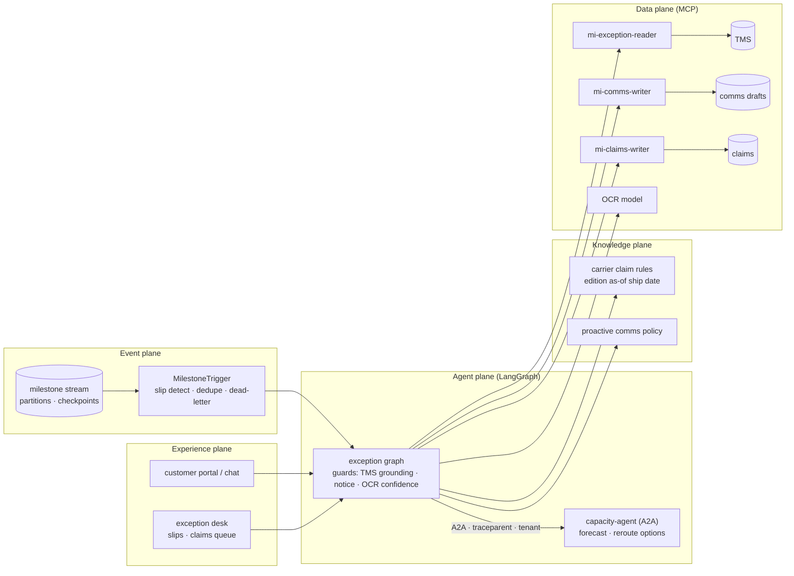
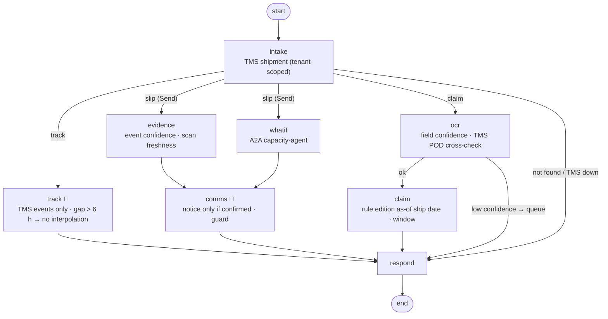

# 18 · Logistics Exception Agent: event-driven slips, TMS-grounded tracking, no interpolation

> **Status:** ✅ Built. `pytest projects/18-logistics-exception-agent` runs the offline tests, and `python run.py` runs the demo.

## Business problem

When a freight milestone slips, three things go wrong at once. Customers flood the service
desk with "where is my shipment?". Agents (human or AI) guess a location from the last scan.
Damage claims miss the carrier's filing window. This project makes exception handling
**event-driven and honest**:

- **Milestone stream consumer.** It is an Event Hubs stand-in with partitions keyed by
  shipment, a consumer group and checkpoints. Slipped milestones (≥ 2 h late, or missed)
  trigger the graph once per (shipment, milestone), even when a lost checkpoint causes a
  replay. Malformed events are dead-lettered.
- **Tracking grounded on TMS events only.** Answers cite scan event IDs. A guard rejects any
  location, citation or speculation that does not come from the events.
- **No interpolation.** If an undelivered shipment has had no scans for more than 6 hours, the
  agent gives the last confirmed scan, says it can't tell where the shipment is now, and
  escalates for a carrier trace.
- **Proactive notices only on high confidence.** A notice is drafted only when the slip is
  confirmed by carrier EDI or a driver-app scan (confidence ≥ 0.9) and scans are current.
  Inferred events go to the exception desk. Notices never speculate on the cause, never name
  locations, and use only the TMS ETA.
- **Carrier claims from OCR'd documents.** Document-Intelligence-style fields come with
  confidence. Low confidence, or a POD exception that TMS never recorded, queues the packet.
  The filing window comes from the carrier rule edition in force on the ship date.
- **Network what-if over A2A.** A demand/capacity agent (same contract as project 12, reusing
  project 10's forecast) returns reroute options with a lane-capacity check. It rejects
  unregistered callers and bad schemas.

## Architecture (four planes)



## Graph



## Code map

| File | Purpose |
|---|---|
| `exception_agent/events.py` | Event Hubs stand-in, consumer + checkpoints, `MilestoneTrigger` |
| `exception_agent/ocr.py` | OCR mock with per-field confidence |
| `exception_agent/knowledge.py` | carrier claim rules (editions) and comms policy |
| `exception_agent/systems.py` / `sor.py` | mock TMS, comms, claims; MCP servers and gateways |
| `exception_agent/capacity.py` | demand/capacity agent over A2A (reuses project 10's forecast) |
| `exception_agent/graph.py` | LangGraph graph and guards |
| `exception_agent/eval_suite.py` | golden runner, violation checks, chaos scenarios |

## Design decisions

- **The stream triggers, the graph decides.** The consumer only detects slips and dedupes. All
  judgement (confidence, freshness, notices) lives in the graph, where it is traced and
  evaluated. Idempotency keys on the writes back up the trigger dedupe.
- **Absence of data is data.** A scan gap is reported as a gap. A model that "helpfully" puts
  the truck near Pittsburgh is overruled by a guard that allows only locations from TMS events.
- **Confidence gates side effects, not just answers.** Inferred ETA-model events never reach
  customers. They go to a person, because a false delay notice costs trust just like a
  missed one.
- **Cross-check documents against the system of record.** A POD exception on paper that TMS
  never recorded is a red flag, so the packet goes to a specialist.
- **Peers are services with contracts.** The capacity agent is discoverable via its agent card,
  validates input schemas and enforces caller/tenant policy. If it is down, the slip flow
  continues without options.

## How to run

```bash
python projects/18-logistics-exception-agent/run.py
python projects/18-logistics-exception-agent/run.py --mermaid graph.mmd
pytest projects/18-logistics-exception-agent
python -m evals --project 18        # 21 golden cases
```

## Interview talking points

1. **Event-driven agents need stream semantics.** It has partitions for ordering, checkpoints
   for at-least-once delivery, dedupe for exactly-once effects and a dead-letter path for bad
   events. I test a lost checkpoint and prove there is no second notice.
2. **Grounding means refusing too.** The tracking answer cites event IDs. When scans stop, the
   correct answer is "last seen here, at this time", not an interpolated guess.
3. **Confidence-gated side effects.** Customer notices require EDI/driver-app confidence and
   fresh scans. Otherwise the case goes to the exception desk. Guards strip speculation about
   cause and any ETA not from the TMS.
4. **Temporal rules for money.** The carrier claim window comes from the rule edition in force
   on the ship date (180 days in 2025, 120 in 2026). Low-confidence OCR is queued, never filed.
5. **A2A done properly.** The capacity agent has an agent card, schema rejection, caller and
   tenant policy, and trace propagation. Chaos tests cover the agent being down (degrade) and
   refusing (escalate).

## Industry ROI story

"Where is my shipment?" is the largest contact driver in freight customer service, and every
slipped milestone creates more. Notifying customers of confirmed slips before they ask, and
answering tracking questions from TMS events, deflects contacts and protects trust. Refusing
to guess avoids promises that break later. Claims drafted within the correct filing window
recover damage costs that missed deadlines would otherwise write off. Capacity what-ifs turn
alerts into options for ops. Measure it with contact rate per slipped shipment, notice lead
time, claim recovery rate and late-filing rejections, before and after.

## Doctrine compliance

See [`DOCTRINE.md`](DOCTRINE.md), generated from [`doctrine.yaml`](doctrine.yaml): planes, five
systems of record (including the event stream and OCR), claim-rule and comms-policy corpora,
the A2A contract, three identities, stop conditions, five-exit rows for all eight nodes, chaos
scenarios (model, TMS, capacity agent, retrieval, jailbreak) and eval scores.
