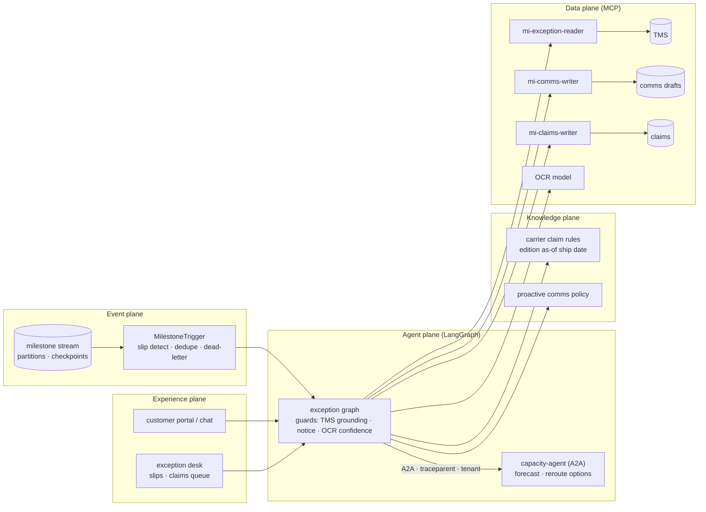
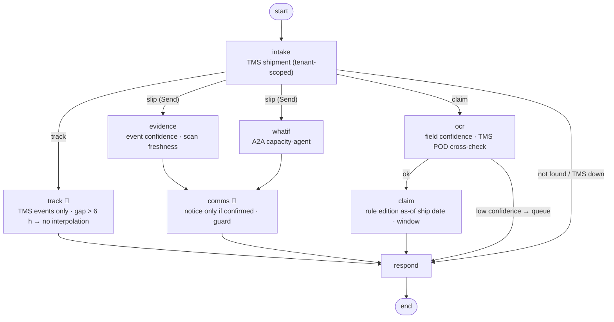

# 18 · Logistics Exception Agent: event-driven slips, TMS-grounded tracking, no interpolation

> **Status:** ✅ Built. `pytest projects/18-logistics-exception-agent` runs the offline tests, and `python run.py` runs the demo.

**Sections:** [1. Purpose](#1-purpose) · [2. Architecture](#2-architecture) · [3. How it works](#3-how-it-works) · [4. Key files](#4-key-files) · [5. Code excerpts](#5-code-excerpts) · [6. Configuration](#6-configuration) · [7. Commands](#7-commands) · [8. Real output](#8-real-output) · [9. Tests and eval gates](#9-tests-and-eval-gates) · [10. Guardrails](#10-guardrails) · [11. Security and governance](#11-security-and-governance) · [12. Observability](#12-observability) · [13. Failure modes](#13-failure-modes) · [14. Mapping to Azure services](#14-mapping-to-azure-services) · [15. Limitations](#15-limitations) · [16. Interview talking points](#16-interview-talking-points) · [17. Adopt this](#17-adopt-this)

## 1. Purpose

When a freight milestone slips, three things go wrong at once. Customers flood the service
desk with "where is my shipment?". Agents (human or AI) guess a location from the last scan.
Damage claims miss the carrier's filing window. This project makes exception handling
**event-driven and honest**:

- **Milestone stream consumer.** It is an Event Hubs stand-in with partitions keyed by
  shipment, a consumer group and checkpoints. Slipped milestones (≥ 2 h late, or missed)
  trigger the graph once per (shipment, milestone), even when a lost checkpoint causes a
  replay. Malformed events are dead-lettered.
- **Tracking grounded on TMS events only.** Answers cite scan event IDs. A guard rejects any
  location, citation or speculation that does not come from the events.
- **No interpolation.** If an undelivered shipment has had no scans for more than 6 hours, the
  agent gives the last confirmed scan, says it can't tell where the shipment is now, and
  escalates for a carrier trace.
- **Proactive notices only on high confidence.** A notice is drafted only when the slip is
  confirmed by carrier EDI or a driver-app scan (confidence ≥ 0.9) and scans are current.
  Inferred events go to the exception desk. Notices never speculate on the cause, never name
  locations, and use only the TMS ETA.
- **Carrier claims from OCR'd documents.** Document-Intelligence-style fields come with
  confidence. Low confidence, or a POD exception that TMS never recorded, queues the packet.
  The filing window comes from the carrier rule edition in force on the ship date.
- **Network what-if over A2A.** A demand/capacity agent (same contract as project 12, reusing
  project 10's forecast) returns reroute options with a lane-capacity check. It rejects
  unregistered callers and bad schemas.

### Industry ROI story

"Where is my shipment?" is the largest contact driver in freight customer service, and every
slipped milestone creates more. Notifying customers of confirmed slips before they ask, and
answering tracking questions from TMS events, deflects contacts and protects trust. Refusing
to guess avoids promises that break later. Claims drafted within the correct filing window
recover damage costs that missed deadlines would otherwise write off. Capacity what-ifs turn
alerts into options for ops. Measure it with contact rate per slipped shipment, notice lead
time, claim recovery rate and late-filing rejections, before and after.

> **In one line (from `doctrine.yaml`):** An event-driven exception agent. A consumer on the milestone stream (Event Hubs stand-in with partitions, a consumer group and checkpoints) triggers the graph once per slipped milestone. Malformed events go to a dead-letter list, and replays never trigger twice. Tracking answers come only from TMS scan events and cite event IDs. If scans stop, the agent states the last confirmed scan and refuses to estimate the location. A proactive customer notice is drafted only when the slip is confirmed by a high-confidence event and scans are current. Carrier damage claims are built from OCR'd documents: low OCR confidence, or a POD exception missing from TMS, sends the packet to a claims queue. Filing windows come from the carrier rule edition in force on the ship date. A network what-if goes over A2A to a demand/capacity agent.

## 2. Architecture

### Architecture (four planes)


```mermaid
flowchart LR
    subgraph EXP["Experience plane"]
        POR["customer portal / chat"]
        DESK["exception desk<br/>slips · claims queue"]
    end
    subgraph EVT["Event plane"]
        EH[("milestone stream<br/>partitions · checkpoints")] --> TRG["MilestoneTrigger<br/>slip detect · dedupe · dead-letter"]
    end
    subgraph AG["Agent plane (LangGraph)"]
        G["exception graph<br/>guards: TMS grounding · notice · OCR confidence"]
        CAP["capacity-agent (A2A)<br/>forecast · reroute options"]
    end
    subgraph KN["Knowledge plane"]
        RUL["carrier claim rules<br/>edition as-of ship date"]
        POL["proactive comms policy"]
    end
    subgraph DATA["Data plane (MCP)"]
        RD["mi-exception-reader"] --> TMS[("TMS")]
        CW["mi-comms-writer"] --> COM[("comms drafts")]
        KW["mi-claims-writer"] --> CLM[("claims")]
        OCR["OCR model"]
    end
    TRG --> G
    POR --> G
    DESK --> G
    G -- "A2A · traceparent · tenant" --> CAP
    G --> RUL
    G --> POL
    G --> RD
    G --> CW
    G --> KW
    G --> OCR
```

### Graph


```mermaid
flowchart TD
    START([start]) --> IN["intake<br/>TMS shipment (tenant-scoped)"]
    IN -- track --> TR["track 🤖<br/>TMS events only · gap > 6 h → no interpolation"]
    IN -- "slip (Send)" --> EV["evidence<br/>event confidence · scan freshness"]
    IN -- "slip (Send)" --> WI["whatif<br/>A2A capacity-agent"]
    IN -- claim --> OC["ocr<br/>field confidence · TMS POD cross-check"]
    IN -- "not found / TMS down" --> RE
    EV --> CO["comms 🤖<br/>notice only if confirmed · guard"]
    WI --> CO
    OC -- ok --> CL["claim<br/>rule edition as-of ship date · window"]
    OC -- "low confidence → queue" --> RE["respond"]
    TR --> RE
    CO --> RE
    CL --> RE
    RE --> END([end])
```

### Planes

<!-- output-md: python scripts/doc_tables.py 18 planes -->
| Plane | What this project depends on |
|---|---|
| Experience | customer portal / chat (tracking, notices) and exception-desk console (slips, claims queue) |
| Agent | LangGraph graph (intake -> track \| [evidence \|\| whatif (A2A)] -> comms \| ocr -> claim -> respond) triggered by a milestone-stream consumer or a customer request |
| Knowledge | carrier claim rules by tariff edition (temporal) and the proactive-communication policy on the shared ContextBuilder; tracking facts only from TMS events |
| Data | TMS, comms and claims via MCP; milestone event stream; OCR model; capacity agent over A2A |
<!-- /output -->

## 3. How it works

Step by step, one line per graph node (the same nodes the promotion gate checks against the compiled graph):

<!-- output-md: python scripts/doc_tables.py 18 steps -->
1. **`intake`**: shipment loaded for the tenant and routed by request kind.
2. **`track`**: answer grounded on TMS scan events with event-ID citations.
3. **`evidence`**: event confidence and scan freshness assessed.
4. **`whatif`**: capacity agent returns reroute options over A2A.
5. **`comms`**: proactive notice draft (idempotency key notice:<shipment>:<milestone>) for confirmed slips.
6. **`ocr`**: required fields above the confidence floor and POD exception confirmed in TMS.
7. **`claim`**: claim draft within the filing window of the rule edition on the ship date (key claim:<shipment>).
8. **`respond`**: answer assembled (plus ops what-if on slips).
<!-- /output -->

### Design decisions

- **The stream triggers, the graph decides.** The consumer only detects slips and dedupes. All
  judgement (confidence, freshness, notices) lives in the graph, where it is traced and
  evaluated. Idempotency keys on the writes back up the trigger dedupe.
- **Absence of data is data.** A scan gap is reported as a gap. A model that "helpfully" puts
  the truck near Pittsburgh is overruled by a guard that allows only locations from TMS events.
- **Confidence gates side effects, not just answers.** Inferred ETA-model events never reach
  customers. They go to a person, because a false delay notice costs trust just like a
  missed one.
- **Cross-check documents against the system of record.** A POD exception on paper that TMS
  never recorded is a red flag, so the packet goes to a specialist.
- **Peers are services with contracts.** The capacity agent is discoverable via its agent card,
  validates input schemas and enforces caller/tenant policy. If it is down, the slip flow
  continues without options.

## 4. Key files

| Path | What it is |
|---|---|
| [`exception_agent/`](exception_agent/README.md) | The importable package (graph, prompts and mock model, domain logic, eval suite, demo CLI), with a file-by-file map. |
| [`tests/`](tests/README.md) | Pytest suite (19 tests), including chaos tests generated from `doctrine.yaml`. |
| [`evals/`](evals/README.md) | Golden set (21 cases) and the latest `scores.json`. |
| [`run.py`](run.py) | Demo entry point: `python projects/18-logistics-exception-agent/run.py` (adds the package and repo root to `sys.path`). |
| [`doctrine.yaml`](doctrine.yaml) | Machine-checked doctrine card: planes, systems of record, corpus and ACL, stop conditions, five-exit table, chaos scenarios, eval thresholds, KPIs. |
| [`DOCTRINE.md`](DOCTRINE.md) | Generated from the card and `evals/scores.json` by `python -m shared.doctrine render`; do not edit by hand. |
| [`graph.mmd`](graph.mmd) | Mermaid diagram of the compiled graph (regenerate with `run.py --mermaid`). |

Shared platform code (context builder, tool gateway, MCP kit, resilience, evals, doctrine) lives in
[`shared/`](../../shared/README.md).

### Code map

| File | Purpose |
|---|---|
| `exception_agent/events.py` | Event Hubs stand-in, consumer + checkpoints, `MilestoneTrigger` |
| `exception_agent/ocr.py` | OCR mock with per-field confidence |
| `exception_agent/knowledge.py` | carrier claim rules (editions) and comms policy |
| `exception_agent/systems.py` / `sor.py` | mock TMS, comms, claims; MCP servers and gateways |
| `exception_agent/capacity.py` | demand/capacity agent over A2A (reuses project 10's forecast) |
| `exception_agent/graph.py` | LangGraph graph and guards |
| `exception_agent/eval_suite.py` | golden runner, violation checks, chaos scenarios |

## 5. Code excerpts

The graph wiring, from `build_graph` in [`graph.py`](exception_agent/graph.py) (node functions are defined above it in the same file):

<!-- code: projects/18-logistics-exception-agent/exception_agent/graph.py::build_graph|StateGraph( -->
```python
# build_graph() continued: wiring
g = StateGraph(ExState)
g.add_node("intake", intake, destinations=("track", "evidence", "whatif", "ocr", "respond"))
g.add_node("track", track)
g.add_node("evidence", evidence)
g.add_node("whatif", whatif)
g.add_node("comms", comms)
g.add_node("ocr", ocr, destinations=("claim", "respond"))
g.add_node("claim", claim)
g.add_node("respond", respond)
g.add_edge(START, "intake")
g.add_edge(["evidence", "whatif"], "comms")
g.add_edge("track", "respond")
g.add_edge("comms", "respond")
g.add_edge("claim", "respond")
g.add_edge("respond", END)
return g.compile(checkpointer=checkpointer or MemorySaver(), name="exception_agent")
```
<!-- /code -->

How one golden case is run and scored, from `run_case` in [`eval_suite.py`](exception_agent/eval_suite.py):

<!-- code: projects/18-logistics-exception-agent/exception_agent/eval_suite.py::run_case -->
```python
def run_case(case: dict[str, Any]) -> CaseResult:
    inp, exp = case["input"], case["expect"]
    r, s = run(inp)
    ans = r.get("answer", "")
    ok = r.get("outcome") == exp["outcome"]
    ok &= all(p in ans for p in exp.get("has", []))
    ok &= not any(p in ans for p in exp.get("not", []))
    for k, attr in (("notices", "notices"), ("claims", "claims"), ("queued", "review_queue")):
        if k in exp:
            ok &= len(getattr(s, attr)) == exp[k]
    if "dead_letter" in exp:
        ok &= len(r["dead_letter"]) == exp["dead_letter"]
    if "exit" in exp:
        ok &= [exp["exit"]["node"], exp["exit"]["exit"]] in [
            [e["node"], e["exit"]] for e in r.get("exits", [])
        ]
    cites = CITE.findall(ans)
    ev_ids = {e["event_id"] for evs in s.scans.values() for e in evs}
    grounded = all(c in ev_ids | KNOWN_DOCS for c in cites) if cites else None
    return CaseResult(
        case["id"],
        ok,
        grounded,
        violations(inp, r, s),
        detail=f"outcome={r.get('outcome')} notices={len(s.notices)} "
        f"claims={len(s.claims)} answer={ans[:70]!r}",
    )
```
<!-- /code -->

## 6. Configuration

| Setting | Where | Effect |
|---|---|---|
| `LLM_PROVIDER` | environment | `mock` (default when nothing is set), `azure` or `openai` |
| `AZURE_OPENAI_ENDPOINT`, `AZURE_OPENAI_DEPLOYMENT` | environment | real Azure OpenAI model, keyless through `DefaultAzureCredential`; `AZURE_OPENAI_API_KEY` only if set |
| `AZURE_OPENAI_FALLBACK_DEPLOYMENT` | environment | second deployment behind the circuit breaker |
| `CHAOS_FAULTS` | environment | inject faults for a demo run; this project's scenarios: `model`, `sor:tms`, `a2a:capacity-agent`, `retrieval`, `jailbreak` |
| `OTEL_CONSOLE=1` / `OTEL_EXPORTER_OTLP_ENDPOINT` | environment | print spans, or ship them to a collector |
| `doctrine.yaml` | this folder | thresholds, stop conditions, identities, KPIs, chaos scenarios |
| `evals/golden.jsonl` | this folder | golden cases the eval gate runs |

Eval thresholds the gate enforces:

<!-- output-md: python scripts/doc_tables.py 18 thresholds -->
| Metric | Threshold (doctrine.yaml) | Current (evals/scores.json) |
|---|---|---|
| `task_success` | `>=0.95` | 1.00 |
| `groundedness` | `>=0.95` | 1.00 |
| `policy_violation_rate` | `<=0` | 0.00 |
| `cost_per_task` | `<=0.002` | 0.00001 |
<!-- /output -->

## 7. Commands

```bash
python projects/18-logistics-exception-agent/run.py
python projects/18-logistics-exception-agent/run.py --mermaid graph.mmd
pytest projects/18-logistics-exception-agent
python -m evals --project 18        # 21 golden cases
```

### Gates for this project

```bash
pytest projects/18-logistics-exception-agent   # unit + chaos tests, offline
python -m evals --project 18 --no-write   # golden set vs doctrine thresholds
python -m shared.doctrine validate   # promotion gate (all projects)
python scripts/render_docs.py --check   # this README's pasted output is current
```

## 8. Real output

`python projects/18-logistics-exception-agent/run.py` against the mock model (pasted by `scripts/render_docs.py`; trace and span ids are masked):

<!-- output: python projects/18-logistics-exception-agent/run.py -->
```text
=== milestone stream (Event Hubs stand-in, 2 partitions) ===
  triggered SH-1001 -> notice_drafted
    Hello Acme Industrial, your shipment SH-1001 missed its planned arrived hub milestone and will not arrive by 2026-09-26T17:00. New ETA: 2026-09-27T12:00. We are monitoring it and will update you. Ops what-if: team truck via Ridgeline Freight (+10 h, recovers); air via SkyBridge Air (+20 h, recovers) (lane load 89.0%).
  -- checkpoint lost (crash before checkpoint write): replaying the partition --
  replay triggered 0 new runs (dedupe on shipment+milestone)
  notices: 1  dead-letter: [{'partition': 1, 'offset': 2, 'error': '4 validation errors for MilestoneEvent'}]

=== tracking (TMS events only) ===
  [track SH-1001] -> tracked
    Latest carrier scan: arrived hub at Cleveland OH hub on 2026-09-25T14:30 [EV-1001-3]. TMS ETA: 2026-09-27T12:00.
  [track SH-1002] -> scan_gap
    The last confirmed scan was departed hub at Shreveport LA hub on 2026-09-24T19:00 [EV-1002-2]. There have been no scans for 20 hours, so I can't tell you where the shipment is now. I've asked the carrier desk to trace it.

=== inferred slip ===
  [slip SH-1004] -> ops_review
    No customer notice drafted (event confidence 0.6 (inferred)); routed to the exception desk to confirm with the carrier. Ops what-if: team truck via Ridgeline Freight (+10 h, recovers); air via SkyBridge Air (+20 h, recovers) (lane load 89.0%).

=== carrier claims from OCR'd documents ===
  [claim SH-1003] -> claim_drafted
    Carrier claim draft CC-0001 created for Ridgeline Freight; file by 2027-01-12 per [CLM-RIDGELINE-2026].
  [claim SH-1003] -> claim_queued
    Claim packet queued for a claims specialist (RV-0001): low OCR confidence: amount.

  OCR sample: Claimed Amount: 42?00
```
<!-- /output -->

## 9. Tests and eval gates

Tests collected for this project:

<!-- output-md: python scripts/doc_tables.py 18 tests -->
| Test file | Tests |
|---|---|
| `test_chaos.py` | 5 |
| `test_exception_agent.py` | 14 |
| **total** | **19** |
<!-- /output -->

Eval gate for this project (`python -m evals --project 18 --no-write`):

<!-- output: python -m evals --project 18 --no-write -->
```text
project                            n   task_success   groundedness policy_violati tool_error_rat  cost_per_task  gate
---------------------------------------------------------------------------------------------------------------------
18-logistics-exception-agent      21           1.00           1.00           0.00           0.04        0.00001  PASS

eval gate: 1/1 projects pass
```
<!-- /output -->

## 10. Guardrails

Stop conditions (from `doctrine.yaml`; each one is enforced in code or by the gateway):

<!-- output-md: python scripts/doc_tables.py 18 stop -->
- no scans for more than 6 hours on an undelivered shipment -> last confirmed scan only, no location estimate, carrier trace
- track answers cite TMS event IDs; locations, speculation or cites not from TMS events -> template
- inferred or low-confidence (< 0.9) milestone events, or stale scans -> no customer notice, exception desk
- notices never speculate on cause, never name locations and use only the TMS ETA
- low OCR confidence, missing TMS POD exception or passed filing window -> claims queue, no claim draft
- one trigger per (shipment, milestone); malformed events dead-lettered
<!-- /output -->

Tool identities and allow-lists (the `ToolGateway` refuses anything else):

<!-- output-md: python scripts/doc_tables.py 18 identities -->
| Tool identity | Allowed tools (gateway allow-list) |
|---|---|
| `mi-exception-reader` | `tms.get_shipment`, `tms.get_scan_events` |
| `mi-comms-writer` | `comms.draft_notice` |
| `mi-claims-writer` | `claims.create_claim_draft`, `claims.queue_review` |
<!-- /output -->

## 11. Security and governance

See [`DOCTRINE.md`](DOCTRINE.md), generated from [`doctrine.yaml`](doctrine.yaml): planes, five
systems of record (including the event stream and OCR), claim-rule and comms-policy corpora,
the A2A contract, three identities, stop conditions, five-exit rows for all eight nodes, chaos
scenarios (model, TMS, capacity agent, retrieval, jailbreak) and eval scores.

### Systems of record

<!-- output-md: python scripts/doc_tables.py 18 sor -->
| System of record | Kind | Contract | Access |
|---|---|---|---|
| Milestone stream (Event Hubs) | event_stream | `MilestoneEvent {shipment_id, tenant, milestone, planned_at, actual_at, status, source, confidence}` | read |
| TMS | mcp | `tms.get_shipment(shipment_id, tenant); tms.get_scan_events(shipment_id)` | read |
| Customer comms | mcp | `comms.draft_notice(notice, idempotency_key, dry_run)` | write |
| Carrier claims | mcp | `claims.create_claim_draft(claim, idempotency_key, dry_run); claims.queue_review(item, idempotency_key, dry_run)` | write |
| Freight document OCR | document_store | `analyze(content) -> fields {value, confidence}` | read |
<!-- /output -->

### Knowledge corpora and ACL

<!-- output-md: python scripts/doc_tables.py 18 knowledge -->
| Corpus | Owner | ACL | Temporal validity | Sensitivity |
|---|---|---|---|---|
| claim-rules | Jagadish Meduri (carrier management) | logistics-ops | carrier rule edition valid on the ship date (e.g. Ridgeline 2025: 180 days, 2026: 120 days) | internal |
| comms-policy | Jagadish Meduri (customer operations) | logistics-ops | policy edition by year | internal |
<!-- /output -->

## 12. Observability

Every run emits OpenTelemetry spans through `shared/observability.py`: one for the graph, one per node, one per model call (tokens, estimated cost, deployment) and one per tool call (identity, tool, status). Spans stay in memory by default; `OTEL_CONSOLE=1` prints them and `OTEL_EXPORTER_OTLP_ENDPOINT` ships them. Eval runs write `evals/scores.json`, which `DOCTRINE.md` renders.

```bash
OTEL_CONSOLE=1 python projects/18-logistics-exception-agent/run.py   # watch the spans for one demo run
```

KPIs this project is meant to be judged on:

<!-- output-md: python scripts/doc_tables.py 18 kpis -->
| KPI | Target | How it is measured |
|---|---|---|
| Proactive notice coverage | >= 90% of confirmed slips notified before the customer asks | notice drafts vs slipped milestones with EDI/driver-app confidence |
| Interpolated locations | 0 | track answers naming a location not in TMS events (eval + reply scan) |
| False delay notices | 0 from inferred events | notices whose triggering event was inferred or stale |
| Claim filing within window | 100% of eligible claims drafted before the deadline | claim drafts vs deadline from the carrier rule edition |
<!-- /output -->

## 13. Failure modes

Five exits per node (success, retry, compensate, degrade, escalate):

<!-- output-md: python scripts/doc_tables.py 18 playbook -->
| Node | Success | Retry | Compensate | Degrade | Escalate |
|---|---|---|---|---|---|
| `intake` | shipment loaded for the tenant and routed by request kind | gateway backoff | n/a (read-only) | TMS down -> honest 'unavailable', no guess; instruction-like question neutralised | n/a |
| `track` | answer grounded on TMS scan events with event-ID citations | fallback deployment | n/a | model down or grounding-guard failure -> template from the latest event; injected remark neutralised | scan gap > 6 h -> no interpolation, carrier trace |
| `evidence` | event confidence and scan freshness assessed | gateway backoff | n/a (read-only) | TMS events down -> confidence not established, no notice | n/a |
| `whatif` | capacity agent returns reroute options over A2A | n/a (single A2A call; client timeout) | n/a (read-only) | capacity agent down -> no options, slip handling continues | capacity agent refuses (policy) -> exception desk |
| `comms` | proactive notice draft (idempotency key notice:<shipment>:<milestone>) for confirmed slips | fallback deployment; gateway backoff with the same key | withdraw the notice draft | model down or notice guard -> template; policy or comms down -> no notice, exception desk | low-confidence or stale evidence -> exception desk review |
| `ocr` | required fields above the confidence floor and POD exception confirmed in TMS | n/a (deterministic) | n/a | instruction-like text in documents neutralised | low confidence or TMS mismatch -> claims queue |
| `claim` | claim draft within the filing window of the rule edition on the ship date (key claim:<shipment>) | gateway backoff with the same key | withdraw the claim draft | rules retrieval down -> claims queue | filing window passed or no carrier rules -> claims queue |
| `respond` | answer assembled (plus ops what-if on slips) | n/a | n/a | n/a | n/a |
<!-- /output -->

Chaos scenarios asserted in `tests/test_chaos.py`:

<!-- output-md: python scripts/doc_tables.py 18 chaos -->
| Injected fault (`CHAOS_FAULTS`) | Node | Expected exit | Invariant asserted |
|---|---|---|---|
| `model` | `track` | **degrade** | template answer from the latest TMS event, cited |
| `sor:tms` | `intake` | **degrade** | honest unavailable answer; no event IDs or locations |
| `a2a:capacity-agent` | `whatif` | **degrade** | notice still drafted; no reroute options claimed |
| `retrieval` | `claim` | **degrade** | claim queued for review; no claim draft |
| `jailbreak` | `track` | **degrade** | injected scan remark neutralised; never echoed |
<!-- /output -->

## 14. Mapping to Azure services

Nothing here is deployed. This is how each piece would map onto Azure:

<!-- output-md: python scripts/doc_tables.py 18 azure -->
| Piece | Azure service it maps to |
|---|---|
| Model calls | Azure OpenAI in Microsoft Foundry, keyless through `DefaultAzureCredential` (`shared/llm.py`), with a fallback deployment behind a circuit breaker |
| Agent runtime | Azure Container Apps (the `exception_agent.graph:build_graph` graph runs inside the portfolio API image); LangGraph checkpoints in Azure Database for PostgreSQL |
| Corpus `claim-rules` | Azure AI Search index with security-trimming filters for the ACL and `valid_from`/`valid_to` fields; sensitivity `internal` as a Microsoft Purview label |
| Corpus `comms-policy` | Azure AI Search index with security-trimming filters for the ACL and `valid_from`/`valid_to` fields; sensitivity `internal` as a Microsoft Purview label |
| Milestone stream (Event Hubs) | Azure Event Hubs (consumer groups, checkpoints in Blob Storage) |
| TMS | MCP server on Azure Container Apps (or Azure Functions), published through Azure API Management; called with the tool identity's managed identity |
| Customer comms | MCP server on Azure Container Apps (or Azure Functions), published through Azure API Management; called with the tool identity's managed identity |
| Carrier claims | MCP server on Azure Container Apps (or Azure Functions), published through Azure API Management; called with the tool identity's managed identity |
| Freight document OCR | Azure Blob Storage or SharePoint content indexed by Azure AI Search, labelled in Microsoft Purview |
| Tool identities | One user-assigned managed identity per row of the identity table, scoped with Azure RBAC; Microsoft Entra Agent ID when it applies |
| Traces and cost | Application Insights through the Azure Monitor OpenTelemetry exporter (`OTEL_EXPORTER_OTLP_ENDPOINT`) |
| Eval gate | Microsoft Foundry evaluations for the live model, with the same thresholds as `doctrine.yaml`; GitHub Actions blocks promotion |
| Guardrails and policy | Azure AI Content Safety (prompt shields) in front of the model; Azure Policy for private networking and tags; Key Vault for any secret |
<!-- /output -->

## 15. Limitations

<!-- output-md: python scripts/doc_tables.py 18 status -->
Maturity (self-rated in `doctrine.yaml`): **Level 3**, autonomous for grounded tracking answers; customer notices and claims are drafts for CS and claims specialists; low-confidence cases are queued. Next rung: auto-send notices for EDI-confirmed slips after a period of draft/sent agreement, and let the capacity agent book reroutes through a guarded write skill.
<!-- /output -->

- Runs against a deterministic mock model, mock systems of record and synthetic data, so the eval scores measure the graph, retrieval and policies, not a live model's quality.
- The real-model path has not been exercised against a live Azure OpenAI deployment.
- Checkpoints use the in-memory saver; a production run needs a durable checkpointer.
- KPI targets are design targets; nothing has been measured in production.

## 16. Interview talking points

1. **Event-driven agents need stream semantics.** It has partitions for ordering, checkpoints
   for at-least-once delivery, dedupe for exactly-once effects and a dead-letter path for bad
   events. I test a lost checkpoint and prove there is no second notice.
2. **Grounding means refusing too.** The tracking answer cites event IDs. When scans stop, the
   correct answer is "last seen here, at this time", not an interpolated guess.
3. **Confidence-gated side effects.** Customer notices require EDI/driver-app confidence and
   fresh scans. Otherwise the case goes to the exception desk. Guards strip speculation about
   cause and any ETA not from the TMS.
4. **Temporal rules for money.** The carrier claim window comes from the rule edition in force
   on the ship date (180 days in 2025, 120 in 2026). Low-confidence OCR is queued, never filed.
5. **A2A done properly.** The capacity agent has an agent card, schema rejection, caller and
   tenant policy, and trace propagation. Chaos tests cover the agent being down (degrade) and
   refusing (escalate).

## 17. Adopt this

How another team reuses this project:

1. **Copy the pattern, keep the platform.** Copy `projects/18-logistics-exception-agent/`, rename the `exception_agent` package and add it to `pythonpath` in `pyproject.toml`. Keep `shared/` as a dependency: it supplies the model factory, context builder, tool gateway, resilience and tracing.
2. **Point it at your systems.** Each system of record in section 11 sits behind a tool contract; swap the mock MCP server in `shared/mcp_servers` for yours with the same tool names and schemas, and give each tool identity in section 10 its own managed identity.
3. **Configure it in `doctrine.yaml`.** Thresholds, stop conditions, KPIs, identities and chaos scenarios live in the card; `python -m shared.doctrine validate` refuses a card with gaps.
4. **Bring your own golden set.** Replace `evals/golden.jsonl` with cases from your domain (same fields) and run `python -m evals --project 18`; CI blocks promotion when a threshold is missed.
5. **Extend it safely.** Add a node in `build_graph`, then add its five-exit row to `failure_playbook` and a chaos scenario if it can fail; the validator fails until the row exists.
6. **Turn on a real model** with `AZURE_OPENAI_ENDPOINT` and `AZURE_OPENAI_DEPLOYMENT` (keyless). Routing stays in code, so control flow does not change; run `python -m evals --project 18 --live` before trusting the wording.
7. **Keep the docs honest.** Run `python scripts/render_docs.py` after a change; CI fails when the pasted output or excerpts in this README drift.
