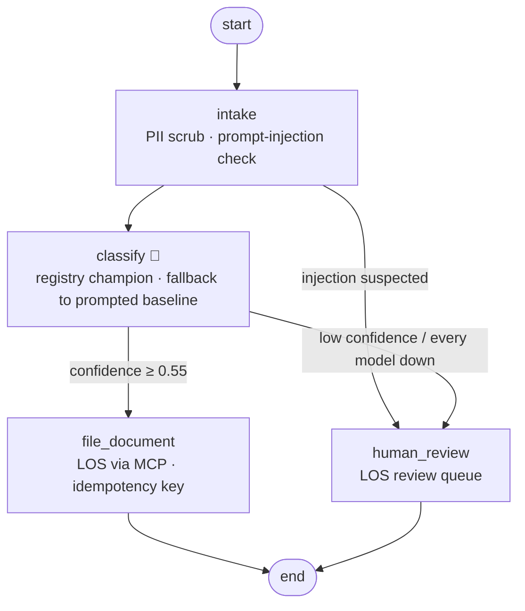

# 19 · Fine-tuning vs Prompting: mortgage document classification, measured and gated

> **Status:** ✅ Built. `pytest projects/19-finetune-vs-prompting` runs the offline tests, and `python run.py` runs the demo (dataset → train → compare → gate → serve → rollback).

## Business problem

A mortgage loan file holds dozens of scanned pages: bank statements, pay stubs, W-2s, tax
returns, appraisals, purchase agreements, insurance declarations, gift letters, verifications
of employment and title commitments. Processors spend a lot of time sorting them before any
underwriting starts. An LLM with a good prompt can classify pages, but every call carries a
long rubric plus few-shot examples, and accuracy is capped by how much of the document
family fits in the prompt.

This project answers "should we fine-tune?" with evidence instead of opinion:

- **Dataset builder.** It turns labelled pages into train/val/test JSONL in the chat
  fine-tuning format that Azure OpenAI accepts (`{"messages": [system, user, assistant]}`).
  PII is scrubbed before anything else, exact and near-exact duplicates are removed, splits
  are grouped by loan file, and a leakage check (same loan, same fingerprint, or 3-shingle
  Jaccard ≥ 0.8 across splits) must pass before a file is written.
- **Offline fine-tuning path.** A small linear head (TF-IDF over words, bigrams and
  character trigrams, then logistic regression) trains on CPU in about a second. It stands in
  for a hosted fine-tune so the whole comparison runs in CI. The artifact is JSON with a
  sha256, so it has no pickle and can be diffed and verified.
- **Comparison harness.** The prompted base model (the repo's deterministic mock LLM given
  a rubric and three examples) and the fine-tuned head both go through the shared eval
  harness on the same splits. It reports accuracy, macro-F1, latency and tokens per call
  (the cost proxy).
- **Promotion gate, registry and rollback.** The fine-tuned model is promoted only if it beats
  the champion on the validation split. Every version is registered with its dataset hash
  and metrics, and a rollback restores the previous champion.
- **Optional Azure OpenAI fine-tuning script.** It uploads the same files, creates a job,
  polls it and can deploy the result. It is a dry run unless `--execute` is given with the
  right environment variables, and it refuses to run in CI or under pytest.

## Results (from `python run.py compare --write`)

All data is synthetic and generated from a fixed seed (`finetune_lab/corpus.py`), including
OCR noise, alternative headings, phrases borrowed from other document types (a bank statement
that shows a purchase price, a pay stub with a policy number) and 3% label noise. Both variants run
offline. The "prompted base model" is the repo's mock LLM, which reads the rubric in the
prompt and scores cue phrases; it is a stand-in for a hosted model, not a measurement of one.
Latency is in-process wall-clock time, so treat it as a regression signal only; it says
nothing about hosted endpoint latency. Input/output tokens per call are the portable cost
proxy.

<!-- results:start -->
| Split | Variant | Accuracy | Macro-F1 | Latency p50 / p95 (ms) | Input tokens/call | Output tokens/call |
|---|---|---|---|---|---|---|
| val (n=87) | prompted base model | 0.644 | 0.739 | 0.242 / 2.050 | 567 | 11 |
| val (n=87) | fine-tuned head | 0.989 | 0.985 | 0.101 / 0.139 | 55 | 3 |
| test (n=92) | prompted base model | 0.641 | 0.757 | 0.220 / 0.350 | 570 | 10 |
| test (n=92) | fine-tuned head | 0.967 | 0.963 | 0.098 / 0.142 | 58 | 3 |

Promotion gate (validation split): **PASS, fine-tuned model promoted**. Champion: `ft-98565702`. Training: 437 examples, 2828 features, 0.96 s on CPU.
<!-- results:end -->

Reading the table: the fine-tuned head needs about a tenth of the input tokens per call,
because the rubric and the examples move from the prompt into the weights. It is also far
more accurate on this narrow, fixed label set. The baseline loses accuracy on pages whose
cue phrases overlap with another document type or are garbled by OCR. The comparison is regenerated and checked by
`test_committed_results_match_a_fresh_run`, so these numbers cannot silently drift from the code.

## When to fine-tune vs RAG vs prompting

| Situation | Start with | Why |
|---|---|---|
| The task changes often, or you have fewer than a few hundred labelled examples | **Prompting** (rubric + few-shot) | Cheapest to change; no training data or hosting to manage. Always build this first; it is your baseline. |
| The answer depends on facts that change or must be cited (policies, rates, product terms, customer data) | **RAG** | Fine-tuning does not reliably teach facts and cannot cite them. Retrieval keeps the answer current and auditable (see projects 01, 03, 13). |
| A narrow, stable task with a fixed output space (classification, routing, extraction to a schema, a house style) where you have labelled examples | **Fine-tuning** | The behaviour moves into the weights: shorter prompts, lower per-call tokens, more consistent outputs. |
| The prompt is huge because of examples, and volume is high | **Fine-tuning** (or a smaller fine-tuned model) | Token savings per call compound with volume, but only if they outweigh training and hosting costs. |
| Both facts and a narrow behaviour matter | **RAG + fine-tuned model** | Fine-tune the format or behaviour, retrieve the facts. |

Fine-tuning here is justified only because the gate says so on held-out data. If the prompted
baseline had been within 0.02 macro-F1, it would stay champion: it is simpler to operate.

## Cost caveats (no invented prices)

Hosted fine-tuning has three separate cost lines: **training** (billed on training tokens ×
epochs, or by time for some training types), **hosting** (a deployed fine-tuned model is
billed per hour while deployed, whether or not it is called) and **inference** (per token,
at rates that differ from the base model). Check the official
[Azure OpenAI pricing page](https://azure.microsoft.com/pricing/details/cognitive-services/openai-service/)
for current rates in your region and training type. The break-even question is whether
`(baseline tokens − fine-tuned tokens) × calls per month × token price` exceeds hosting and
retraining costs. This repo reports the token counts and deliberately does not quote dollar
figures. Also note that Azure deletes a fine-tuned deployment after 15 days without use, and
that a retrain means new training cost plus a new evaluation.

## Architecture (four planes)

```mermaid
flowchart LR
    subgraph EXP["Experience plane"]
        UP["loan file upload / scan"]
        PROC["processor review queue"]
    end
    subgraph AG["Agent plane (LangGraph)"]
        G["classify graph<br/>injection check · confidence floor · fallback"]
        REG["model registry<br/>champion · gate · rollback"]
    end
    subgraph ML["Training and evaluation (offline)"]
        DS["dataset builder<br/>scrub · dedup · group split · leakage check"]
        TR["trainer<br/>TF-IDF + logistic regression (JSON artifact)"]
        CMP["comparison harness<br/>shared eval harness · accuracy · F1 · tokens"]
        AZ["azure_finetune.py<br/>dry run unless --execute"]
    end
    subgraph DATA["Data plane (MCP)"]
        GW["mi-doc-classifier"] --> LOS[("loan origination system<br/>documents · review queue")]
    end
    UP --> G
    G --> REG
    G --> GW
    G --> PROC
    DS --> TR --> CMP --> REG
    DS -. "same JSONL" .-> AZ
```



## Graph



## Failure handling

| Failure | What happens |
|---|---|
| Fine-tuned deployment down (`model:finetuned`) | The prompted baseline classifies instead; the filing records which version was used. |
| Every model down (`model`) | The page goes to processor review as "classifier unavailable"; no type is guessed. |
| Low confidence (< 0.55) | Processor review with the top guess and its confidence, never an automatic filing. |
| Loan origination system down (`sor:los`) | The type is kept and the filing is parked in an outbox with idempotency key `classify:<doc_id>`, so a replay files it once. |
| Instructions injected into the page text (`jailbreak`) | Processor review; the requested type is never filed. |
| PII in the page | Scrubbed at intake, before the model; eval cases fail if any planted value reaches the LOS. |
| Tampered model artifact | The registry checks the sha256 on load and refuses it. |
| Bad or leaking training data | The dataset builder refuses to write; the gate refuses a candidate whose dataset checks failed. |
| A candidate is unavailable while being evaluated | Its calls score as errors (never skipped), so the gate refuses it and the champion stays; run the demo with `CHAOS_FAULTS=model:finetuned` to see it. |
| A new model underperforms | The gate refuses promotion and the champion stays. After promotion, `rollback()` restores the previous champion. |

## Code map

| File | Purpose |
|---|---|
| `finetune_lab/labels.py` | the 10 labels, their definitions, and both system prompts |
| `finetune_lab/corpus.py` | deterministic synthetic loan-file pages with fictional PII |
| `finetune_lab/pii.py` / `dataset.py` | PII scrubbing, dedup, grouped split, leakage check, chat JSONL |
| `finetune_lab/baseline.py` / `trainer.py` | prompted baseline and the offline fine-tuned head |
| `finetune_lab/registry.py` / `compare.py` | model registry, gate, rollback; comparison harness and report |
| `finetune_lab/graph.py` / `sor.py` | serving graph and the LOS MCP server |
| `finetune_lab/azure_finetune.py` | optional Azure OpenAI fine-tuning (dry run by default) |
| `finetune_lab/eval_suite.py` | golden runner, violation checks, chaos scenarios |

## Design decisions

- **Scrub first, then dedup, then split, then check leakage.** Scrubbing first means duplicates
  that differ only in PII are caught, and nothing sensitive reaches a training file. Splitting
  by loan file stops pages from the same borrower appearing in both train and test.
- **Same data for offline and hosted training.** The JSONL is the Azure chat format, so the
  offline head and a hosted fine-tune learn from the same files.
- **The system prompt is part of the model.** The fine-tuned model is trained with a one-line
  system prompt and must be called with that same prompt; the registry stores it with the
  version.
- **Promotion is a gate, not a judgement call.** Validation macro-F1 must beat the champion by
  0.02, accuracy must not fall, no label's F1 may drop by more than 0.10, and the dataset
  checks must have passed. The test split is reported but never used to decide.
- **Serving never trains.** The graph loads the committed champion from `registry/`, verified
  by hash, so the thing in production is exactly the thing that was evaluated.
- **Azure is optional and loud about it.** The script prints its plan by default; `--execute`
  needs endpoint and key variables, and deployment also needs ARM variables.

## Azure OpenAI fine-tuning (optional, never run here)

`finetune_lab/azure_finetune.py` uses the v1 API shape (`OpenAI(base_url=<endpoint>/openai/v1/)`):
`files.create(purpose="fine-tune")`, then `fine_tuning.jobs.create(model, training_file,
validation_file, suffix, seed, method={"type": "supervised", ...})` with `trainingType` in
`extra_body`, then polling `jobs.retrieve` / `list_events`, then an ARM `PUT` for the
deployment. As of September 2026 the
[Microsoft Learn fine-tuning guide](https://learn.microsoft.com/azure/ai-foundry/openai/how-to/fine-tuning)
lists supervised fine-tuning for `gpt-4o-mini-2024-07-18`, `gpt-4o-2024-08-06`,
`gpt-4.1-2025-04-14`, `gpt-4.1-mini-2025-04-14` and `gpt-4.1-nano-2025-04-14`. Reinforcement
fine-tuning is offered for reasoning models such as `o4-mini`, and some open models are
fine-tunable only on Foundry resources. Region and training-type availability change, so check
the page before running. This script was **not** run against Azure for this project.

```bash
python projects/19-finetune-vs-prompting/run.py azure                  # dry run: prints the plan
AZURE_OPENAI_ENDPOINT=... AZURE_OPENAI_API_KEY=... \
  python projects/19-finetune-vs-prompting/run.py azure --execute      # upload, create, poll
# add --deploy (plus AZURE_SUBSCRIPTION_ID, AZURE_RESOURCE_GROUP, AZURE_OPENAI_RESOURCE,
# AZURE_MANAGEMENT_TOKEN) to create a deployment; remember it is billed hourly
```

## How to run

```bash
python projects/19-finetune-vs-prompting/run.py                   # end to end demo
python projects/19-finetune-vs-prompting/run.py dataset           # rebuild data/
python projects/19-finetune-vs-prompting/run.py compare           # comparison + gate
python projects/19-finetune-vs-prompting/run.py compare --write   # also refresh registry/, comparison.json, README table
python projects/19-finetune-vs-prompting/run.py --mermaid graph.mmd
pytest projects/19-finetune-vs-prompting
python -m evals --project 19        # 14 golden cases through the serving graph
```

## Interview talking points

1. **Baseline first, gate always.** I never fine-tune without a prompted baseline measured on
   the same held-out split. The decision is a gate in code, and it can say no.
2. **Data hygiene is most of the work.** PII scrubbing before training, dedup (including
   rescans with different OCR noise), splits grouped by loan file, and a leakage check that
   blocks the build. Leakage makes fine-tunes look better than they are.
3. **Cost is tokens × volume vs hosting.** The fine-tuned model sends about a tenth of the
   input tokens, but a hosted fine-tune bills hourly while deployed. The answer depends on
   volume, so I report the proxy and link pricing instead of inventing numbers.
4. **Models are versioned artifacts.** Registry entries carry the dataset hash, metrics,
   system prompt and artifact sha256. Rollback is one call, and serving verifies the hash.
5. **Fine-tuning is not a knowledge store.** For facts that change, use RAG; fine-tune for
   narrow behaviour and format.

## Industry ROI story

Document sorting is a fixed cost on every loan file, and misfiled pages cause conditions,
rework and delays at closing. A classifier that files confident pages automatically and routes
the rest to a processor cuts touch time per file, while the gate and rollback keep a worse
model from reaching production. Measure it with processor minutes per file, the share of
pages auto-filed, re-label rate from processor corrections and cost per 1,000 pages (tokens ×
price + hosting), before and after.

## Project structure

| Path | What it is |
|---|---|
| [`finetune_lab/`](finetune_lab/README.md) | The importable package (dataset builder, trainer, baseline, registry, comparison harness, serving graph, Azure script, eval suite, demo CLI), with a file-by-file map. |
| [`tests/`](tests/README.md) | Pytest suite (35 tests), including chaos tests generated from `doctrine.yaml`. |
| [`evals/`](evals/README.md) | Golden set (14 cases), `comparison.json` and the latest `scores.json`. |
| [`data/`](data/README.md) | Generated train/val/test JSONL in chat fine-tuning format, plus `manifest.json`. |
| [`registry/`](registry/README.md) | Model registry (`registry.json`) and versioned JSON artifacts. |
| [`run.py`](run.py) | Demo entry point: `python projects/19-finetune-vs-prompting/run.py` (adds the package and repo root to `sys.path`). |
| [`doctrine.yaml`](doctrine.yaml) | Machine-checked doctrine card: planes, systems of record, stop conditions, five-exit table, chaos scenarios, eval thresholds, KPIs. |
| [`DOCTRINE.md`](DOCTRINE.md) | Generated from the card and `evals/scores.json` by `python -m shared.doctrine render`; do not edit by hand. |
| [`graph.mmd`](graph.mmd) | Mermaid diagram of the compiled graph (regenerate with `run.py --mermaid`). |

Shared platform code (context builder, tool gateway, MCP kit, resilience, evals, doctrine) lives in
[`shared/`](../../shared/README.md).

## Doctrine compliance

See [`DOCTRINE.md`](DOCTRINE.md), generated from [`doctrine.yaml`](doctrine.yaml): planes, the
loan origination system as system of record, the MCP contract and identity, stop conditions,
five-exit rows for all four nodes, chaos scenarios (every model, the fine-tuned deployment,
the LOS and a jailbreak) and eval scores.
