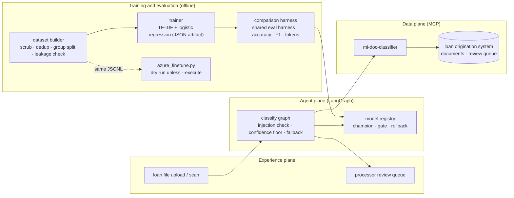
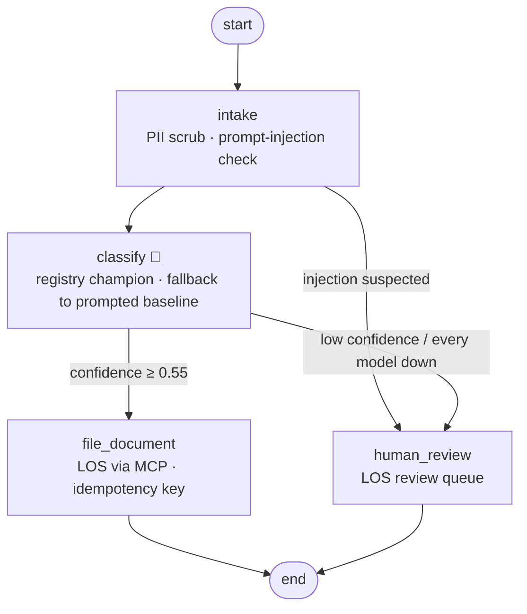

# 19 · Fine-tuning vs Prompting: mortgage document classification, measured and gated

> **Status:** ✅ Built. `pytest projects/19-finetune-vs-prompting` runs the offline tests, and `python run.py` runs the demo (dataset → train → compare → gate → serve → rollback).

**Sections:** [1. Purpose](#1-purpose) · [2. Architecture](#2-architecture) · [3. How it works](#3-how-it-works) · [4. Key files](#4-key-files) · [5. Code excerpts](#5-code-excerpts) · [6. Configuration](#6-configuration) · [7. Commands](#7-commands) · [8. Real output](#8-real-output) · [9. Tests and eval gates](#9-tests-and-eval-gates) · [10. Guardrails](#10-guardrails) · [11. Security and governance](#11-security-and-governance) · [12. Observability](#12-observability) · [13. Failure modes](#13-failure-modes) · [14. Mapping to Azure services](#14-mapping-to-azure-services) · [15. Limitations](#15-limitations) · [16. Interview talking points](#16-interview-talking-points) · [17. Adopt this](#17-adopt-this)

## 1. Purpose

A mortgage loan file holds dozens of scanned pages: bank statements, pay stubs, W-2s, tax
returns, appraisals, purchase agreements, insurance declarations, gift letters, verifications
of employment and title commitments. Processors spend a lot of time sorting them before any
underwriting starts. An LLM with a good prompt can classify pages, but every call carries a
long rubric plus few-shot examples, and accuracy is capped by how much of the document
family fits in the prompt.

This project answers "should we fine-tune?" with evidence instead of opinion:

- **Dataset builder.** It turns labelled pages into train/val/test JSONL in the chat
  fine-tuning format that Azure OpenAI accepts (`{"messages": [system, user, assistant]}`).
  PII is scrubbed before anything else, exact and near-exact duplicates are removed, splits
  are grouped by loan file, and a leakage check (same loan, same fingerprint, or 3-shingle
  Jaccard ≥ 0.8 across splits) must pass before a file is written.
- **Offline fine-tuning path.** A small linear head (TF-IDF over words, bigrams and
  character trigrams, then logistic regression) trains on CPU in about a second. It stands in
  for a hosted fine-tune so the whole comparison runs in CI. The artifact is JSON with a
  sha256, so it has no pickle and can be diffed and verified.
- **Comparison harness.** The prompted base model (the repo's deterministic mock LLM given
  a rubric and three examples) and the fine-tuned head both go through the shared eval
  harness on the same splits. It reports accuracy, macro-F1, latency and tokens per call
  (the cost proxy).
- **Promotion gate, registry and rollback.** The fine-tuned model is promoted only if it beats
  the champion on the validation split. Every version is registered with its dataset hash
  and metrics, and a rollback restores the previous champion.
- **Optional Azure OpenAI fine-tuning script.** It uploads the same files, creates a job,
  polls it and can deploy the result. It is a dry run unless `--execute` is given with the
  right environment variables, and it refuses to run in CI or under pytest.

### Industry ROI story

Document sorting is a fixed cost on every loan file, and misfiled pages cause conditions,
rework and delays at closing. A classifier that files confident pages automatically and routes
the rest to a processor cuts touch time per file, while the gate and rollback keep a worse
model from reaching production. Measure it with processor minutes per file, the share of
pages auto-filed, re-label rate from processor corrections and cost per 1,000 pages (tokens ×
price + hosting), before and after.

> **In one line (from `doctrine.yaml`):** Loan processors spend time naming and filing every uploaded page of a loan file. This project classifies a document's first page into one of ten mortgage document types and decides, with evidence, whether a fine-tuned model should replace the prompted base model. A dataset builder scrubs borrower PII, removes duplicates, splits by loan file and checks for leakage before writing chat-format JSONL. An offline fine-tuning path trains a small classification head on CPU. A comparison harness runs both variants through the shared eval harness and reports accuracy, macro-F1, latency and a token proxy for cost. A model registry promotes the fine-tuned model only if it beats the incumbent on the validation split, and supports rollback. The serving graph files confident documents in the LOS and queues everything else for a processor. An optional Azure OpenAI fine-tuning script consumes the same JSONL and is dry-run by default.

## 2. Architecture

### Architecture (four planes)


```mermaid
flowchart LR
    subgraph EXP["Experience plane"]
        UP["loan file upload / scan"]
        PROC["processor review queue"]
    end
    subgraph AG["Agent plane (LangGraph)"]
        G["classify graph<br/>injection check · confidence floor · fallback"]
        REG["model registry<br/>champion · gate · rollback"]
    end
    subgraph ML["Training and evaluation (offline)"]
        DS["dataset builder<br/>scrub · dedup · group split · leakage check"]
        TR["trainer<br/>TF-IDF + logistic regression (JSON artifact)"]
        CMP["comparison harness<br/>shared eval harness · accuracy · F1 · tokens"]
        AZ["azure_finetune.py<br/>dry run unless --execute"]
    end
    subgraph DATA["Data plane (MCP)"]
        GW["mi-doc-classifier"] --> LOS[("loan origination system<br/>documents · review queue")]
    end
    UP --> G
    G --> REG
    G --> GW
    G --> PROC
    DS --> TR --> CMP --> REG
    DS -. "same JSONL" .-> AZ
```

### Graph


```mermaid
flowchart TD
    START([start]) --> IN["intake<br/>PII scrub · prompt-injection check"]
    IN -- "injection suspected" --> HR["human_review<br/>LOS review queue"]
    IN --> CL["classify 🤖<br/>registry champion · fallback to prompted baseline"]
    CL -- "confidence ≥ 0.55" --> FD["file_document<br/>LOS via MCP · idempotency key"]
    CL -- "low confidence / every model down" --> HR
    FD --> END([end])
    HR --> END
```

### Planes

<!-- output-md: python scripts/doc_tables.py 19 planes -->
| Plane | What this project depends on |
|---|---|
| Experience | loan processor e-folder view (filed type + confidence) and a document review queue |
| Agent | LangGraph serving graph (intake -> classify -> file_document \| human_review) plus the offline train -> compare -> gate -> promote/rollback lifecycle |
| Knowledge | none at runtime; the label taxonomy and rubric are versioned artifacts in the model registry |
| Data | loan origination system (LOS) document index via MCP; model registry (versioned artifacts, champion pointer) |
<!-- /output -->

## 3. How it works

Step by step, one line per graph node (the same nodes the promotion gate checks against the compiled graph):

<!-- output-md: python scripts/doc_tables.py 19 steps -->
1. **`intake`**: PII replaced with typed placeholders before any model call.
2. **`classify`**: registry champion returns a label and confidence.
3. **`file_document`**: document filed in the LOS under the predicted type (idempotent on doc id).
4. **`human_review`**: document queued for a processor with the reason and the model's suggestion.
<!-- /output -->

### When to fine-tune vs RAG vs prompting

| Situation | Start with | Why |
|---|---|---|
| The task changes often, or you have fewer than a few hundred labelled examples | **Prompting** (rubric + few-shot) | Cheapest to change; no training data or hosting to manage. Always build this first; it is your baseline. |
| The answer depends on facts that change or must be cited (policies, rates, product terms, customer data) | **RAG** | Fine-tuning does not reliably teach facts and cannot cite them. Retrieval keeps the answer current and auditable (see projects 01, 03, 13). |
| A narrow, stable task with a fixed output space (classification, routing, extraction to a schema, a house style) where you have labelled examples | **Fine-tuning** | The behaviour moves into the weights: shorter prompts, lower per-call tokens, more consistent outputs. |
| The prompt is huge because of examples, and volume is high | **Fine-tuning** (or a smaller fine-tuned model) | Token savings per call compound with volume, but only if they outweigh training and hosting costs. |
| Both facts and a narrow behaviour matter | **RAG + fine-tuned model** | Fine-tune the format or behaviour, retrieve the facts. |

Fine-tuning here is justified only because the gate says so on held-out data. If the prompted
baseline had been within 0.02 macro-F1, it would stay champion: it is simpler to operate.

### Design decisions

- **Scrub first, then dedup, then split, then check leakage.** Scrubbing first means duplicates
  that differ only in PII are caught, and nothing sensitive reaches a training file. Splitting
  by loan file stops pages from the same borrower appearing in both train and test.
- **Same data for offline and hosted training.** The JSONL is the Azure chat format, so the
  offline head and a hosted fine-tune learn from the same files.
- **The system prompt is part of the model.** The fine-tuned model is trained with a one-line
  system prompt and must be called with that same prompt; the registry stores it with the
  version.
- **Promotion is a gate, not a judgement call.** Validation macro-F1 must beat the champion by
  0.02, accuracy must not fall, no label's F1 may drop by more than 0.10, and the dataset
  checks must have passed. The test split is reported but never used to decide.
- **Serving never trains.** The graph loads the committed champion from `registry/`, verified
  by hash, so the thing in production is exactly the thing that was evaluated.
- **Azure is optional and loud about it.** The script prints its plan by default; `--execute`
  needs the endpoint variable and a Microsoft Entra identity (no API key), and deployment also
  needs the ARM resource variables.

## 4. Key files

| Path | What it is |
|---|---|
| [`finetune_lab/`](finetune_lab/README.md) | The importable package (dataset builder, trainer, baseline, registry, comparison harness, serving graph, Azure script, eval suite, demo CLI), with a file-by-file map. |
| [`tests/`](tests/README.md) | Pytest suite (38 tests), including chaos tests generated from `doctrine.yaml`. |
| [`evals/`](evals/README.md) | Golden set (14 cases), `comparison.json` and the latest `scores.json`. |
| [`data/`](data/README.md) | Generated train/val/test JSONL in chat fine-tuning format, plus `manifest.json`. |
| [`registry/`](registry/README.md) | Model registry (`registry.json`) and versioned JSON artifacts. |
| [`run.py`](run.py) | Demo entry point: `python projects/19-finetune-vs-prompting/run.py` (adds the package and repo root to `sys.path`). |
| [`doctrine.yaml`](doctrine.yaml) | Machine-checked doctrine card: planes, systems of record, stop conditions, five-exit table, chaos scenarios, eval thresholds, KPIs. |
| [`DOCTRINE.md`](DOCTRINE.md) | Generated from the card and `evals/scores.json` by `python -m shared.doctrine render`; do not edit by hand. |
| [`graph.mmd`](graph.mmd) | Mermaid diagram of the compiled graph (regenerate with `run.py --mermaid`). |

Shared platform code (context builder, tool gateway, MCP kit, resilience, evals, doctrine) lives in
[`shared/`](../../shared/README.md).

### Code map

| File | Purpose |
|---|---|
| `finetune_lab/labels.py` | the 10 labels, their definitions, and both system prompts |
| `finetune_lab/corpus.py` | deterministic synthetic loan-file pages with fictional PII |
| `finetune_lab/pii.py` / `dataset.py` | PII scrubbing, dedup, grouped split, leakage check, chat JSONL |
| `finetune_lab/baseline.py` / `trainer.py` | prompted baseline and the offline fine-tuned head |
| `finetune_lab/registry.py` / `compare.py` | model registry, gate, rollback; comparison harness and report |
| `finetune_lab/graph.py` / `sor.py` | serving graph and the LOS MCP server |
| `finetune_lab/azure_finetune.py` | optional Azure OpenAI fine-tuning (dry run by default) |
| `finetune_lab/eval_suite.py` | golden runner, violation checks, chaos scenarios |

## 5. Code excerpts

The graph wiring, from `build_graph` in [`graph.py`](finetune_lab/graph.py) (node functions are defined above it in the same file):

<!-- code: projects/19-finetune-vs-prompting/finetune_lab/graph.py::build_graph|StateGraph( -->
```python
# build_graph() continued: wiring
g = StateGraph(DocState)
g.add_node("intake", intake)
g.add_node("classify", classify)
g.add_node("file_document", file_document)
g.add_node("human_review", human_review)
g.add_edge(START, "intake")
g.add_conditional_edges(
    "intake",
    lambda s: "human_review" if s["injection"] else "classify",
    ["classify", "human_review"],
)
g.add_conditional_edges("classify", route, ["file_document", "human_review"])
g.add_edge("file_document", END)
g.add_edge("human_review", END)
compiled = g.compile(name="doc-classifier")
compiled.registry, compiled.los, compiled.outbox, compiled.gateway = registry, los, outbox, gw
return compiled
```
<!-- /code -->

How one golden case is run and scored, from `run_case` in [`eval_suite.py`](finetune_lab/eval_suite.py):

<!-- code: projects/19-finetune-vs-prompting/finetune_lab/eval_suite.py::run_case -->
```python
def run_case(case: dict[str, Any]) -> CaseResult:
    inp, exp = case["input"], case["expect"]
    g = build_graph()
    doc = {"doc_id": case["id"], "loan_id": inp.get("loan_id", "LN-9000"), "text": inp["text"]}
    r = g.invoke({"doc": doc})
    res = r["result"]
    success = res["route"] == exp["route"]
    if exp["route"] == "filed":
        success &= res["doc_type"] == exp["doc_type"]
    stored = json.dumps([*g.los.filed.values(), *g.los.review.values(), *g.outbox])
    planted = [m.group(0) for _, pat in PATTERNS for m in pat.finditer(inp["text"])]
    # violations: raw PII from the page written to the LOS, or an injected document auto-filed
    violation = any(v in stored for v in planted) or (
        exp.get("injection", False) and res["route"] == "filed"
    )
    detail = f"route={res['route']} type={res.get('doc_type') or res.get('suggested')}"
    return CaseResult(case["id"], bool(success), None, bool(violation), detail=detail)
```
<!-- /code -->

## 6. Configuration

| Setting | Where | Effect |
|---|---|---|
| `LLM_PROVIDER` | environment | `mock` (default when nothing is set), `azure` or `openai` |
| `AZURE_OPENAI_ENDPOINT`, `AZURE_OPENAI_DEPLOYMENT` | environment | real Azure OpenAI model, keyless through `DefaultAzureCredential`; `AZURE_OPENAI_API_KEY` only if set |
| `AZURE_OPENAI_FALLBACK_DEPLOYMENT` | environment | second deployment behind the circuit breaker |
| `CHAOS_FAULTS` | environment | inject faults for a demo run; this project's scenarios: `model`, `model:finetuned`, `sor:los`, `jailbreak` |
| `OTEL_CONSOLE=1` / `OTEL_EXPORTER_OTLP_ENDPOINT` | environment | print spans, or ship them to a collector |
| `doctrine.yaml` | this folder | thresholds, stop conditions, identities, KPIs, chaos scenarios |
| `evals/golden.jsonl` | this folder | golden cases the eval gate runs |

Eval thresholds the gate enforces:

<!-- output-md: python scripts/doc_tables.py 19 thresholds -->
| Metric | Threshold (doctrine.yaml) | Current (evals/scores.json) |
|---|---|---|
| `task_success` | `>=0.9` | 1.00 |
| `policy_violation_rate` | `<=0` | 0.00 |
| `tool_error_rate` | `<=0.05` | 0.00 |
| `cost_per_task` | `<=0.002` | 0.00000 |
<!-- /output -->

## 7. Commands

```bash
python projects/19-finetune-vs-prompting/run.py                   # end to end demo
python projects/19-finetune-vs-prompting/run.py dataset           # rebuild data/
python projects/19-finetune-vs-prompting/run.py compare           # comparison + gate
python projects/19-finetune-vs-prompting/run.py compare --write   # also refresh registry/, comparison.json, README table
python projects/19-finetune-vs-prompting/run.py --mermaid graph.mmd
pytest projects/19-finetune-vs-prompting
python -m evals --project 19        # 14 golden cases through the serving graph
```

### Gates for this project

```bash
pytest projects/19-finetune-vs-prompting   # unit + chaos tests, offline
python -m evals --project 19 --no-write   # golden set vs doctrine thresholds
python -m shared.doctrine validate   # promotion gate (all projects)
python scripts/render_docs.py --check   # this README's pasted output is current
```

## 8. Real output

`python projects/19-finetune-vs-prompting/run.py` against the mock model (pasted by `scripts/render_docs.py`; timings are masked because they change per run; trace and span ids are masked):

<!-- output: python projects/19-finetune-vs-prompting/run.py | sed -E 's/\| [0-9.]+ \/ [0-9.]+ \|/| <p50> \/ <p95> |/; s/[0-9.]+ s on CPU/<seconds> on CPU/' -->
```text
== dataset (data/manifest.json)
   raw 636 -> duplicates removed 19, leakage dropped {'val': 0, 'test': 1}, splits {'train': 437, 'val': 87, 'test': 92}
   PII redactions {'ACCOUNT': 331, 'ADDRESS': 385, 'EMAIL': 309, 'NAME': 338, 'PHONE': 318, 'SSN': 332}

== train fine-tuned head, run both variants through the eval harness, gate
| Split | Variant | Accuracy | Macro-F1 | Latency p50 / p95 (ms) | Input tokens/call | Output tokens/call |
|---|---|---|---|---|---|---|
| val (n=87) | prompted base model | 0.644 | 0.739 | <p50> / <p95> | 567 | 11 |
| val (n=87) | fine-tuned head | 0.989 | 0.985 | <p50> / <p95> | 55 | 3 |
| test (n=92) | prompted base model | 0.641 | 0.757 | <p50> / <p95> | 570 | 10 |
| test (n=92) | fine-tuned head | 0.967 | 0.963 | <p50> / <p95> | 58 | 3 |

Promotion gate (validation split): **PASS, fine-tuned model promoted**. Champion: `ft-98565702`. Training: 437 examples, 2828 features, <seconds> on CPU.

== serve with the champion
   DEMO-1: intake -> classify -> file_document: pay_stub [ft-98565702]
   DEMO-2: intake -> classify -> file_document: title_commitment [ft-98565702]
   DEMO-3: intake -> classify -> human_review: review (confidence 0.17 < 0.55 for bank_statement) [-]
   DEMO-4: intake -> human_review: review (suspected prompt injection in document text) [-]

== rollback: production monitoring flags the fine-tuned model
   champion now prompt-0b9ecd13; DEMO-9 -> pay_stub served by prompt-0b9ecd13
   registry events:
     registered         prompt-0b9ecd13  mock-chat-model (offline stand-in for the base deployment)
     registered         ft-98565702      dataset 384bd8c3f124
     promoted           prompt-0b9ecd13
     promoted           ft-98565702
     rolled_back        ft-98565702      to prompt-0b9ecd13: drift alert on weekly processor re-labels (demo)
```
<!-- /output -->

### Results (from `python run.py compare --write`)

All data is synthetic and generated from a fixed seed (`finetune_lab/corpus.py`), including
OCR noise, alternative headings, phrases borrowed from other document types (a bank statement
that shows a purchase price, a pay stub with a policy number) and 3% label noise. Both variants run
offline. The "prompted base model" is the repo's mock LLM, which reads the rubric in the
prompt and scores cue phrases; it is a stand-in for a hosted model, not a measurement of one.
Latency is in-process wall-clock time, so treat it as a regression signal only; it says
nothing about hosted endpoint latency. Input/output tokens per call are the portable cost
proxy.

<!-- results:start -->
| Split | Variant | Accuracy | Macro-F1 | Latency p50 / p95 (ms) | Input tokens/call | Output tokens/call |
|---|---|---|---|---|---|---|
| val (n=87) | prompted base model | 0.644 | 0.739 | 0.242 / 2.050 | 567 | 11 |
| val (n=87) | fine-tuned head | 0.989 | 0.985 | 0.101 / 0.139 | 55 | 3 |
| test (n=92) | prompted base model | 0.641 | 0.757 | 0.220 / 0.350 | 570 | 10 |
| test (n=92) | fine-tuned head | 0.967 | 0.963 | 0.098 / 0.142 | 58 | 3 |

Promotion gate (validation split): **PASS, fine-tuned model promoted**. Champion: `ft-98565702`. Training: 437 examples, 2828 features, 0.96 s on CPU.
<!-- results:end -->

Reading the table: the fine-tuned head needs about a tenth of the input tokens per call,
because the rubric and the examples move from the prompt into the weights. It is also far
more accurate on this narrow, fixed label set. The baseline loses accuracy on pages whose
cue phrases overlap with another document type or are garbled by OCR. The comparison is regenerated and checked by
`test_committed_results_match_a_fresh_run`, so these numbers cannot silently drift from the code.

## 9. Tests and eval gates

Tests collected for this project:

<!-- output-md: python scripts/doc_tables.py 19 tests -->
| Test file | Tests |
|---|---|
| `test_azure_script.py` | 9 |
| `test_chaos.py` | 4 |
| `test_dataset.py` | 11 |
| `test_graph.py` | 4 |
| `test_training_and_gate.py` | 10 |
| **total** | **38** |
<!-- /output -->

Eval gate for this project (`python -m evals --project 19 --no-write`):

<!-- output: python -m evals --project 19 --no-write -->
```text
project                            n   task_success   groundedness policy_violati tool_error_rat  cost_per_task  gate
---------------------------------------------------------------------------------------------------------------------
19-finetune-vs-prompting          14           1.00            n/a           0.00           0.00        0.00000  PASS

eval gate: 1/1 projects pass
```
<!-- /output -->

## 10. Guardrails

Stop conditions (from `doctrine.yaml`; each one is enforced in code or by the gateway):

<!-- output-md: python scripts/doc_tables.py 19 stop -->
- confidence < 0.55 or label 'unknown' -> processor review queue, never a guessed type
- suspected prompt injection in the page text -> processor review, never auto-filed
- all model deployments down -> processor review
- a candidate model is promoted only if it beats the champion on validation macro-F1 by >= 0.02 with no accuracy loss and no label losing more than 0.10 F1
- one LOS write per document (idempotency key classify:<doc_id>)
<!-- /output -->

Tool identities and allow-lists (the `ToolGateway` refuses anything else):

<!-- output-md: python scripts/doc_tables.py 19 identities -->
| Tool identity | Allowed tools (gateway allow-list) |
|---|---|
| `mi-doc-classifier` | `los.file_document`, `los.queue_review` |
<!-- /output -->

## 11. Security and governance

See [`DOCTRINE.md`](DOCTRINE.md), generated from [`doctrine.yaml`](doctrine.yaml): planes, the
loan origination system as system of record, the MCP contract and identity, stop conditions,
five-exit rows for all four nodes, chaos scenarios (every model, the fine-tuned deployment,
the LOS and a jailbreak) and eval scores.

### Systems of record

<!-- output-md: python scripts/doc_tables.py 19 sor -->
| System of record | Kind | Contract | Access |
|---|---|---|---|
| LOS document index | mcp | `los.file_document(loan_id, doc_id, doc_type, confidence, model_version, idempotency_key, dry_run); los.queue_review(loan_id, doc_id, reason, idempotency_key, dry_run)` | write |
| Model registry | document_store | `registry.json entries {version, kind, sha256, dataset_sha256, metrics, stage} + artifacts/<version>.json` | read |
<!-- /output -->

### Knowledge corpora and ACL

<!-- output-md: python scripts/doc_tables.py 19 knowledge -->
_No retrieval corpus (by design): decisions come from systems of record_
<!-- /output -->

## 12. Observability

Every run emits OpenTelemetry spans through `shared/observability.py`: one for the graph, one per node, one per model call (tokens, estimated cost, deployment) and one per tool call (identity, tool, status). Spans stay in memory by default; `OTEL_CONSOLE=1` prints them and `OTEL_EXPORTER_OTLP_ENDPOINT` ships them. Eval runs write `evals/scores.json`, which `DOCTRINE.md` renders.

```bash
OTEL_CONSOLE=1 python projects/19-finetune-vs-prompting/run.py   # watch the spans for one demo run
```

KPIs this project is meant to be judged on:

<!-- output-md: python scripts/doc_tables.py 19 kpis -->
| KPI | Target | How it is measured |
|---|---|---|
| Auto-file precision | >= 98% of auto-filed documents keep their type after processor QC | filed type vs processor QC sample |
| Auto-file rate | >= 80% of uploaded pages filed without a processor | filed / (filed + queued) per week |
| Borrower PII in training files | 0 | validator + planted-value test on every dataset build |
| Promotions without a validation win | 0 | registry events: promoted entries all passed the gate |
<!-- /output -->

## 13. Failure modes

Five exits per node (success, retry, compensate, degrade, escalate):

<!-- output-md: python scripts/doc_tables.py 19 playbook -->
| Node | Success | Retry | Compensate | Degrade | Escalate |
|---|---|---|---|---|---|
| `intake` | PII replaced with typed placeholders before any model call | n/a (deterministic) | n/a | n/a | suspected prompt injection -> processor review |
| `classify` | registry champion returns a label and confidence | prompted baseline answers when the fine-tuned deployment is down (fallback chain + breakers underneath) | n/a (no side effects) | champion artifact fails its hash check or deployment down -> prompted baseline; every model down -> processor review | low confidence or 'unknown' -> processor review |
| `file_document` | document filed in the LOS under the predicted type (idempotent on doc id) | gateway backoff on transient LOS errors | n/a (replay returns the same filing) | LOS outage -> filing parked in the outbox with its idempotency key | n/a |
| `human_review` | document queued for a processor with the reason and the model's suggestion | gateway backoff on transient LOS errors | n/a (replay returns the same queue item) | LOS outage -> queue item parked in the outbox | this node is the escalation path |
<!-- /output -->

Chaos scenarios asserted in `tests/test_chaos.py`:

<!-- output-md: python scripts/doc_tables.py 19 chaos -->
| Injected fault (`CHAOS_FAULTS`) | Node | Expected exit | Invariant asserted |
|---|---|---|---|
| `model` | `classify` | **degrade** | every model down -> processor review with 'classifier unavailable', no guessed type |
| `model:finetuned` | `classify` | **degrade** | fine-tuned deployment down -> prompted baseline files the W-2 and records its version |
| `sor:los` | `file_document` | **degrade** | type kept, filing parked in the outbox with idempotency key classify:<doc_id> |
| `jailbreak` | `intake` | **escalate** | page with injected instructions goes to processor review, not the requested type |
<!-- /output -->

### Failure handling

| Failure | What happens |
|---|---|
| Fine-tuned deployment down (`model:finetuned`) | The prompted baseline classifies instead; the filing records which version was used. |
| Every model down (`model`) | The page goes to processor review as "classifier unavailable"; no type is guessed. |
| Low confidence (< 0.55) | Processor review with the top guess and its confidence, never an automatic filing. |
| Loan origination system down (`sor:los`) | The type is kept and the filing is parked in an outbox with idempotency key `classify:<doc_id>`, so a replay files it once. |
| Instructions injected into the page text (`jailbreak`) | Processor review; the requested type is never filed. |
| PII in the page | Scrubbed at intake, before the model; eval cases fail if any planted value reaches the LOS. |
| Tampered model artifact | The registry checks the sha256 on load and refuses it. |
| Bad or leaking training data | The dataset builder refuses to write; the gate refuses a candidate whose dataset checks failed. |
| A candidate is unavailable while being evaluated | Its calls score as errors (never skipped), so the gate refuses it and the champion stays; run the demo with `CHAOS_FAULTS=model:finetuned` to see it. |
| A new model underperforms | The gate refuses promotion and the champion stays. After promotion, `rollback()` restores the previous champion. |

## 14. Mapping to Azure services

Nothing here is deployed. This is how each piece would map onto Azure:

<!-- output-md: python scripts/doc_tables.py 19 azure -->
| Piece | Azure service it maps to |
|---|---|
| Model calls | Azure OpenAI in Microsoft Foundry, keyless through `DefaultAzureCredential` (`shared/llm.py`), with a fallback deployment behind a circuit breaker |
| Agent runtime | Azure Container Apps (the `finetune_lab.graph:build_graph` graph runs inside the portfolio API image); LangGraph checkpoints in Azure Database for PostgreSQL |
| LOS document index | MCP server on Azure Container Apps (or Azure Functions), published through Azure API Management; called with the tool identity's managed identity |
| Model registry | Azure Blob Storage or SharePoint content indexed by Azure AI Search, labelled in Microsoft Purview |
| Tool identities | One user-assigned managed identity per row of the identity table, scoped with Azure RBAC; Microsoft Entra Agent ID when it applies |
| Traces and cost | Application Insights through the Azure Monitor OpenTelemetry exporter (`OTEL_EXPORTER_OTLP_ENDPOINT`) |
| Eval gate | Microsoft Foundry evaluations for the live model, with the same thresholds as `doctrine.yaml`; GitHub Actions blocks promotion |
| Guardrails and policy | Azure AI Content Safety (prompt shields) in front of the model; Azure Policy for private networking and tags; Key Vault for any secret |
<!-- /output -->

### Azure OpenAI fine-tuning (optional, never run here)

`finetune_lab/azure_finetune.py` uses the v1 API shape (`OpenAI(base_url=<endpoint>/openai/v1/)`):
`files.create(purpose="fine-tune")`, then `fine_tuning.jobs.create(model, training_file,
validation_file, suffix, seed, method={"type": "supervised", ...})` with `trainingType` in
`extra_body`, then polling `jobs.retrieve` / `list_events`, then an ARM `PUT` for the
deployment. As of September 2026 the
[Microsoft Learn fine-tuning guide](https://learn.microsoft.com/azure/ai-foundry/openai/how-to/fine-tuning)
lists supervised fine-tuning for `gpt-4o-mini-2024-07-18`, `gpt-4o-2024-08-06`,
`gpt-4.1-2025-04-14`, `gpt-4.1-mini-2025-04-14` and `gpt-4.1-nano-2025-04-14`. Reinforcement
fine-tuning is offered for reasoning models such as `o4-mini`, and some open models are
fine-tunable only on Foundry resources. Region and training-type availability change, so check
the page before running. This script was **not** run against Azure for this project.

**Authentication: Microsoft Entra ID, no keys.** `--execute` builds `DefaultAzureCredential`
(the managed identity when it runs in Azure, `az login` or a workload identity elsewhere). The
data-plane client gets a bearer-token provider for `https://cognitiveservices.azure.com/.default`
as its `api_key` callable, so every request carries a fresh token; `--deploy` asks the same
credential for an ARM token (`https://management.azure.com/.default`). No key or token is read
from the environment, and `AZURE_OPENAI_API_KEY` is ignored with a note if set. The Foundry
resource in `infra/` has local (key) auth disabled, so this is the only path that works there.

| Step | Identity needs | Scope |
|---|---|---|
| upload files, create and poll the job | `Cognitive Services OpenAI Contributor` | the Azure OpenAI / Foundry resource |
| `--deploy` (ARM `PUT .../deployments`) | `Cognitive Services Contributor` | the same resource |

The dry run needs none of this and never imports the SDK, so it stays runnable offline; the plan
it prints includes an `auth` block with the scopes and roles above.

```bash
python projects/19-finetune-vs-prompting/run.py azure                  # dry run: prints the plan
az login                                                               # or run as a managed identity
AZURE_OPENAI_ENDPOINT=https://<resource>.openai.azure.com \
  python projects/19-finetune-vs-prompting/run.py azure --execute      # upload, create, poll
# add --deploy (plus AZURE_SUBSCRIPTION_ID, AZURE_RESOURCE_GROUP, AZURE_OPENAI_RESOURCE)
# to create a deployment; remember it is billed hourly
```

## 15. Limitations

<!-- output-md: python scripts/doc_tables.py 19 status -->
Maturity (self-rated in `doctrine.yaml`): **Level 3**, champion model files documents autonomously above a confidence floor; promotion is gated on validation metrics and every non-confident, injected or unclassifiable page goes to a processor. Next rung: weekly re-label sample from processors feeds a drift monitor that triggers rollback automatically, and a hosted Azure OpenAI fine-tune is evaluated through the same harness before it can become champion.
<!-- /output -->

- Runs against a deterministic mock model, mock systems of record and synthetic data, so the eval scores measure the graph, retrieval and policies, not a live model's quality.
- The real-model path has not been exercised against a live Azure OpenAI deployment.
- Checkpoints use the in-memory saver; a production run needs a durable checkpointer.
- KPI targets are design targets; nothing has been measured in production.

### Cost caveats (no invented prices)

Hosted fine-tuning has three separate cost lines: **training** (billed on training tokens ×
epochs, or by time for some training types), **hosting** (a deployed fine-tuned model is
billed per hour while deployed, whether or not it is called) and **inference** (per token,
at rates that differ from the base model). Check the official
[Azure OpenAI pricing page](https://azure.microsoft.com/pricing/details/cognitive-services/openai-service/)
for current rates in your region and training type. The break-even question is whether
`(baseline tokens − fine-tuned tokens) × calls per month × token price` exceeds hosting and
retraining costs. This repo reports the token counts and deliberately does not quote dollar
figures. Also note that Azure deletes a fine-tuned deployment after 15 days without use, and
that a retrain means new training cost plus a new evaluation.

## 16. Interview talking points

1. **Baseline first, gate always.** I never fine-tune without a prompted baseline measured on
   the same held-out split. The decision is a gate in code, and it can say no.
2. **Data hygiene is most of the work.** PII scrubbing before training, dedup (including
   rescans with different OCR noise), splits grouped by loan file, and a leakage check that
   blocks the build. Leakage makes fine-tunes look better than they are.
3. **Cost is tokens × volume vs hosting.** The fine-tuned model sends about a tenth of the
   input tokens, but a hosted fine-tune bills hourly while deployed. The answer depends on
   volume, so I report the proxy and link pricing instead of inventing numbers.
4. **Models are versioned artifacts.** Registry entries carry the dataset hash, metrics,
   system prompt and artifact sha256. Rollback is one call, and serving verifies the hash.
5. **Fine-tuning is not a knowledge store.** For facts that change, use RAG; fine-tune for
   narrow behaviour and format.

## 17. Adopt this

How another team reuses this project:

1. **Copy the pattern, keep the platform.** Copy `projects/19-finetune-vs-prompting/`, rename the `finetune_lab` package and add it to `pythonpath` in `pyproject.toml`. Keep `shared/` as a dependency: it supplies the model factory, context builder, tool gateway, resilience and tracing.
2. **Point it at your systems.** Each system of record in section 11 sits behind a tool contract; swap the mock MCP server in `shared/mcp_servers` for yours with the same tool names and schemas, and give each tool identity in section 10 its own managed identity.
3. **Configure it in `doctrine.yaml`.** Thresholds, stop conditions, KPIs, identities and chaos scenarios live in the card; `python -m shared.doctrine validate` refuses a card with gaps.
4. **Bring your own golden set.** Replace `evals/golden.jsonl` with cases from your domain (same fields) and run `python -m evals --project 19`; CI blocks promotion when a threshold is missed.
5. **Extend it safely.** Add a node in `build_graph`, then add its five-exit row to `failure_playbook` and a chaos scenario if it can fail; the validator fails until the row exists.
6. **Turn on a real model** with `AZURE_OPENAI_ENDPOINT` and `AZURE_OPENAI_DEPLOYMENT` (keyless). Routing stays in code, so control flow does not change; run `python -m evals --project 19 --live` before trusting the wording.
7. **Keep the docs honest.** Run `python scripts/render_docs.py` after a change; CI fails when the pasted output or excerpts in this README drift.
