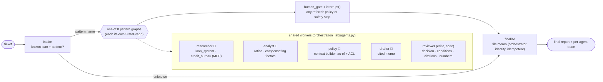

# 21 · Multi-Agent Orchestration Patterns: one loan exception, eight topologies, measured

> **Status:** ✅ Built. `pytest projects/21-multi-agent-orchestration-patterns` runs the offline tests, `python run.py` runs the demo and `python run.py --compare` regenerates the comparison below.

## Business problem

An underwriter raises an **exception ticket** on a mortgage application: "DTI is over the
limit, can we approve?" Resolving it takes four kinds of work that usually sit with different
people:

- **research**: pull the loan file, appraisal and credit summary from the loan origination
  system and credit bureau;
- **analysis**: compute DTI and LTV and find compensating factors (reserves, tenure, score);
- **policy check**: find the credit-policy edition in force on the *application date*;
- **drafting**: write a cited exception memo (approve, approve with conditions, decline, pend,
  or refer to credit committee) with every condition policy requires.

Everyone asks "should this be a supervisor, a swarm, a group chat...?" This project answers it
with numbers instead of opinions: **the same task, the same worker agents, the same tools, the
same golden set**, solved by eight orchestration patterns, each a LangGraph graph, all scored by
the same eval pipeline and pushed through the same injected faults.

## Patterns built

| Pattern | Module | How control flows | LangGraph mechanics |
|---|---|---|---|
| Sequential pipeline | [`patterns/sequential.py`](orchestration_lab/patterns/sequential.py) | researcher → analyst → policy → drafter → reviewer, once | static edges; a failure short-circuits to `finish` |
| Concurrent fan-out / fan-in | [`patterns/concurrent.py`](orchestration_lab/patterns/concurrent.py) | researcher ∥ policy ∥ analyst → join → drafter → reviewer | three edges from `START`, reducers on `ws`, `max` reducer on the clock |
| Supervisor (router) | [`patterns/supervisor.py`](orchestration_lab/patterns/supervisor.py) | an LLM supervisor picks the next worker after every turn; may fan out independent ones | `Send` fan-out, route validation, one retry, one revision |
| Hierarchical | [`patterns/hierarchical.py`](orchestration_lab/patterns/hierarchical.py) | top supervisor → evidence / policy / decision **team leads** → workers | each team is its own compiled subgraph; teams dispatched with `Send` |
| Handoff / swarm | [`patterns/swarm.py`](orchestration_lab/patterns/swarm.py) | peer-to-peer: each agent names the next peer in its own model call; no boss | `Command(goto=peer)` with declared `destinations` |
| Group chat / debate | [`patterns/group_chat.py`](orchestration_lab/patterns/group_chat.py) | moderator picks speakers over a shared transcript; advocate vs risk officer debate until consensus | transcript reducer; moderator ↔ speak loop with termination rules |
| Magentic-style | [`patterns/magentic.py`](orchestration_lab/patterns/magentic.py) | manager writes a **task ledger** (plan by capability), updates a **progress ledger** each round, detects stalls, **replans** | manager ↔ worker loop; ledgers in state; capability-based reassignment |
| Blackboard | [`patterns/blackboard.py`](orchestration_lab/patterns/blackboard.py) | no router model: a control component fires every agent whose preconditions are on the board | `Send` to all eligible sources each cycle |

All eight run inside one arena graph:



Compiled diagrams: [`graph.mmd`](graph.mmd) (arena) and [`graphs/<pattern>.mmd`](graphs/)
(each pattern, subgraphs expanded). Regenerate with `python run.py --mermaid graph.mmd`.

## The common harness

Every pattern gets the same controls from [`harness.py`](orchestration_lab/harness.py), so the
comparison measures topology, not who remembered to add a guard:

- **Budgets**: 30 agent turns, 40 LLM calls, 40k estimated tokens per run → `budget_exhausted:*`.
- **Loop control**: ping-pong detector (A-B-A-B-A-B), repeated-review-issues detector
  (no progress), magentic stall counter, revision caps.
- **Route validation**: every route, handoff or speaker a model proposes is checked against the
  agent registry and the target's prerequisites. A bad target is never executed.
- **Termination**: only a memo the reviewer passed is `completed`. Every other stop is a
  referral with an explicit `stop_reason`, never a guessed decision.
- **Tracing**: one OpenTelemetry span per agent turn (`agent <name>`, with pattern, run id, LLM
  calls, tokens, tool calls, simulated latency) under the LangGraph node spans from
  `shared/observability.py`; MCP tool spans nest under them.
- **HITL hook**: the arena's `human_gate` pauses any referral at `interrupt()` for a credit
  officer, whichever pattern produced it.
- **Fault plan** for the comparison: one worker down (1.5 s timeout), a reviewer that is never
  satisfied, and a bad handoff (the first model-chosen route names `funds_disbursement_agent`).

**LLM proposes, code disposes.** Ratios, limits and the decision rule live in
[`domain.py`](orchestration_lab/domain.py) and the rule registry keyed by policy id. Agents
retrieve, map evidence, phrase and route; the reviewer recomputes the decision from facts plus
the cited rules and rejects any memo whose decision, conditions, citations or numbers disagree.

## Results (generated by `python run.py --compare --write`)

The numbers below come from the runner, not from hand editing:
`tests/test_comparison.py` re-runs it and fails if this block or
[`evals/comparison.json`](evals/comparison.json) differ from a fresh run.

<!-- comparison:start -->
Business cases: 14 (every `business` case in `evals/golden.jsonl`), offline deterministic mock model. Tokens are estimates (characters / 4); latency is **simulated** from the harness latency model (critical path, parallel branches overlap), not a measurement.

| Pattern | Quality (task success) | Grounded | Policy viol. | LLM calls / case | Est. tokens / case | Tool calls / case | Agent turns / case | Sim. latency / case (s) | Failed cases |
|---|---|---|---|---|---|---|---|---|---|
| sequential | 0.79 | 0.79 | 0.00 | 4.0 | 1,030 | 3.0 | 5.0 | 5.3 | `l-2105`, `l-2111`, `l-2113` |
| concurrent | 0.79 | 0.79 | 0.00 | 4.0 | 1,030 | 6.0 | 5.0 | 3.5 | `l-2105`, `l-2111`, `l-2113` |
| supervisor | 1.00 | 1.00 | 0.00 | 9.6 | 1,915 | 3.0 | 10.9 | 7.7 | none |
| hierarchical | 1.00 | 1.00 | 0.00 | 15.6 | 2,695 | 3.0 | 16.9 | 8.5 | none |
| swarm | 1.00 | 1.00 | 0.00 | 4.2 | 1,289 | 3.0 | 5.4 | 5.8 | none |
| group_chat | 1.00 | 1.00 | 0.00 | 17.5 | 5,329 | 3.0 | 18.7 | 14.5 | none |
| magentic | 1.00 | 1.00 | 0.00 | 11.6 | 2,627 | 3.0 | 12.9 | 12.0 | none |
| blackboard | 1.00 | 1.00 | 0.00 | 4.2 | 1,103 | 3.0 | 5.4 | 4.7 | none |

Failure behaviour on `L-2101` (cell: outcome · agent turns · LLM calls before the run ended; *recovered* = correct decision completed, *safe stop* = referral with a reason and nothing filed, *UNSAFE* = wrong decision completed):

| Pattern | Analyst down | Looping reviewer | Bad handoff |
|---|---|---|---|
| sequential | safe stop: worker_failed:analyst · 2 turns · 1 calls | safe stop: review_failed · 5 turns · 4 calls | n/a (no model-chosen routes) |
| concurrent | safe stop: worker_failed:analyst · 3 turns · 2 calls | safe stop: review_failed · 5 turns · 4 calls | n/a (no model-chosen routes) |
| supervisor | safe stop: worker_failed:analyst · 7 turns · 5 calls | safe stop: review_failed_after_revision · 14 turns · 12 calls | recovered · 10 turns · 9 calls |
| hierarchical | safe stop: worker_failed:analyst · 8 turns · 7 calls | safe stop: review_failed_after_revision · 19 turns · 17 calls | recovered · 16 turns · 15 calls |
| swarm | safe stop: worker_failed:analyst · 2 turns · 1 calls | safe stop: ping_pong_detected · 8 turns · 6 calls | recovered · 6 turns · 5 calls |
| group_chat | safe stop: worker_failed:analyst · 4 turns · 3 calls | safe stop: no_progress · 22 turns · 20 calls | recovered · 19 turns · 18 calls |
| magentic | recovered · 16 turns · 14 calls | safe stop: stalled · 28 turns · 24 calls | recovered · 12 turns · 11 calls |
| blackboard | recovered · 6 turns · 4 calls | safe stop: no_progress · 7 turns · 5 calls | n/a (no model-chosen routes) |
<!-- comparison:end -->

**How to read this honestly.**
- Offline, the model is a deterministic mock ([`mock_llm.py`](orchestration_lab/mock_llm.py)).
  It has one scripted weakness: the drafter drops `employment_reverification` from a first
  draft with three or more conditions, and fixes it when a reviewer issue names it. That is what
  separates patterns with a feedback loop (1.00) from the one-pass ones: the pipeline and
  fan-out can only refer those three files. Against a real model the size of that gap is
  something to measure, not assume.
- Token counts are `len(text) / 4` estimates of the real prompts; latency is simulated
  (350 ms per call + 12 ms per output token, 150 ms per MCP call, 200 ms per retrieval, parallel
  branches overlap). Both are good for *relative* comparison between patterns only.
- The fault table uses one case (`L-2101`) so every cell is the same task under a different
  failure.

## Which pattern when

| If the task looks like... | Use | Why (from the numbers above) |
|---|---|---|
| A fixed procedure, and a wrong answer is safely caught downstream | **Sequential** | Fewest moving parts and model calls; but no loop back, so any critic finding becomes a referral |
| Independent lookups that dominate latency | **Concurrent** | Same calls as sequential, shortest simulated latency; pays in duplicate tool reads, still no loop |
| A known process with dependencies, a need to retry, audit and budget in one place | **Supervisor** | Full quality, one place for guards; roughly one routing call per worker call |
| Many agents in clear sub-domains, where one router's context would blow up | **Hierarchical** | Keeps each router's view small; costs an extra routing layer (most calls after group chat) |
| Work where each step knows who should go next (conversational handoffs) | **Swarm** | Near-sequential cost with loops, because routing rides inside the worker's own call; needs handoff validation and ping-pong detection |
| A judgement call that benefits from opposing views | **Group chat / debate** | Only pattern where a biased proposal is argued down; shared transcript makes it the most expensive by far |
| Open-ended tasks, unreliable workers, unknown plans | **Magentic** | Only model-routed pattern that recovered from a dead worker (replanned onto a capable agent); pays two manager calls per step |
| Data-driven workflows where "who can act" follows from "what's known" | **Blackboard** | Cheapest full-quality pattern here and recovers from the dead analyst; only works when preconditions are crisp enough to code |

## Anti-patterns (each one tested)

- **Router without validation.** A supervisor that executes whatever the model names will one
  day route to `funds_disbursement_agent`. Every pattern here rejects unregistered targets
  (`test_supervisor_rejects_an_invalid_route`, `test_swarm_reasks_after_a_bad_handoff`).
- **Swarm without a loop breaker.** Two agents that disagree hand off forever. The ping-pong
  detector ends it (`test_swarm_has_no_router_turns_and_detects_ping_pong`).
- **Group chat as the default.** Everyone reads everything, so cost grows with the transcript
  (`test_group_chat_debate_shares_the_transcript` asserts the second draft costs more).
- **"The manager will figure it out" without stall detection.** A never-satisfied critic
  burns the budget; the stall counter plus one replan ends it (`test_magentic_stall_detection_ends_a_loop`).
- **Guessing on failure.** A pattern that "completes" with a missing worker would file a memo
  without analysis. Here a dead worker is recovered (magentic, blackboard) or referred with a
  reason (`test_worker_down_is_a_safe_stop`), and `test_no_pattern_completes_a_wrong_decision_under_faults`
  checks no cell is unsafe.
- **Parallel writes to a plain dict.** Fan-out branches need reducers (`merge_ws`, `max`
  clock), or LangGraph raises `InvalidUpdateError`.
- **Summing parallel latency.** The clock keeps the max of branches, so concurrency shows up as
  a shorter critical path (`test_clock_reports_critical_path_not_sum`).

## Failure handling

| Failure | What happens |
|---|---|
| Model down (all deployments) | Every worker and router takes its deterministic path (zero LLM calls), the memo is still reviewed and filed once (chaos: `model`) |
| Loan system down | The researcher fails; the swarm has nobody else to route to and refers the file; nothing filed (chaos: `sor:loan_system`) |
| Policy retrieval down | The policy agent fails; magentic replans, finds no other agent with the `rules` capability and refers (chaos: `retrieval`) |
| Injected text in the borrower note | The MCP gateway neutralises it before any agent sees it; the decision is unchanged and no injected text reaches the memo or trace (chaos: `jailbreak`) |
| Worker down, looping reviewer, bad handoff | See the fault table: recovered or safe stop, never a wrong decision |
| Budget exhausted | `budget_exhausted:turns / llm_calls / tokens` referral |
| Referral of any kind | `human_gate` pauses at `interrupt()`; the credit officer's decision is recorded (`decided_by`) and filed |

## Tests

- every pattern resolves a clean case; structure per pattern (fixed order, parallel starts,
  team leads and parallel teams, no router turns in a swarm, debate rounds and consensus,
  task/progress ledgers and replanning, blackboard parallel firing and capability fallback)
- harness: turn / token / LLM-call budgets, ping-pong, route validation, the critical-path
  clock, one OTel span per agent turn, model-down deterministic paths
- arena: HITL pause and resume, safety stops also go to the human, filing once by the
  orchestrator identity only, unknown loan rejection, as-of policy editions, ACL on committee
  minutes, decision rule matches the golden expectations
- chaos tests generated from `doctrine.yaml`
- the comparison block and `comparison.json` match a fresh deterministic run

## How to run

From the repo root, after `uv sync --all-extras --group dev`:

```bash
python projects/21-multi-agent-orchestration-patterns/run.py                          # L-2105 through all 8 patterns + a trace
python projects/21-multi-agent-orchestration-patterns/run.py --pattern swarm --loan L-2111
python projects/21-multi-agent-orchestration-patterns/run.py --pattern magentic --loan L-2101 --fault analyst_down
python projects/21-multi-agent-orchestration-patterns/run.py --hitl                   # referral -> credit officer -> filed
python projects/21-multi-agent-orchestration-patterns/run.py --compare [--write|--check]
pytest projects/21-multi-agent-orchestration-patterns
python -m evals --project 21
```

With Azure OpenAI or OpenAI variables set, every role uses the real model through the same
prompts; the guards, critic, budgets and human gate stay the same, and `--compare` then measures
real-model behaviour (tokens from the estimator, latency still simulated).

## Interview talking points

1. **Topology is a cost/control trade, and I can show the curve.** Same task, same workers:
   the one-pass patterns are cheapest but can't fix a draft; the swarm and blackboard get full
   quality at near-pipeline cost; supervisor and hierarchical buy central control with a
   routing call per step; group chat pays for shared context; magentic pays for replanning.
2. **Controls belong in a harness, not in each pattern.** Budgets, loop detection, route
   validation, termination, tracing and HITL are shared, so a comparison measures topology.
3. **Failure behaviour is the real differentiator.** With one worker down only the patterns
   that plan by capability (magentic, blackboard) recover; the rest must refer, and none may
   guess. That is tested cell by cell.
4. **LLM proposes, code disposes.** Routes, handoffs, speakers, ledgers and policy mappings are
   validated; numbers and limits come from code keyed by cited policy ids.
5. **Numbers in docs are generated.** The README table is written by the runner and a test
   fails if it drifts.

## Project structure

| Path | What it is |
|---|---|
| [`orchestration_lab/`](orchestration_lab/README.md) | The importable package (domain, workers, harness, eight pattern graphs, arena graph, comparison runner, eval suite, demo), with a file-by-file map. |
| [`orchestration_lab/patterns/`](orchestration_lab/patterns/README.md) | One module per orchestration pattern. |
| [`tests/`](tests/README.md) | Pytest suite, including chaos tests generated from `doctrine.yaml` and the README-drift test. |
| [`evals/`](evals/README.md) | Golden set, `scores.json` and `comparison.json`. |
| [`run.py`](run.py) | Demo entry point (adds the package and repo root to `sys.path`). |
| [`doctrine.yaml`](doctrine.yaml) | Machine-checked doctrine card: planes, systems of record, corpus and ACL, stop conditions, five-exit table, chaos scenarios, eval thresholds, KPIs. |
| [`DOCTRINE.md`](DOCTRINE.md) | Generated from the card and `evals/scores.json` by `python -m shared.doctrine render`; do not edit by hand. |
| [`graph.mmd`](graph.mmd), [`graphs/`](graphs/) | Mermaid diagrams of the compiled arena and pattern graphs. |

Shared platform code (context builder, tool gateway, MCP kit, resilience, evals, doctrine) lives in
[`shared/`](../../shared/README.md).

## Doctrine compliance

The full card is in [`DOCTRINE.md`](DOCTRINE.md), generated from [`doctrine.yaml`](doctrine.yaml).

- **Systems of record behind MCP, one identity per role.** Researcher and analyst read through
  their own gateways; only the orchestrator identity (`mi-exception-filer`) can file a memo.
- **Knowledge plane.** Policy comes from the shared context builder, as-of the application date,
  with committee minutes ACL-trimmed before ranking.
- **Five exits per node** for all eleven arena nodes (each pattern is a node), with chaos
  scenarios on four different patterns.

```bash
python -m evals --project 21
pytest projects/21-multi-agent-orchestration-patterns/tests/test_chaos.py
```
